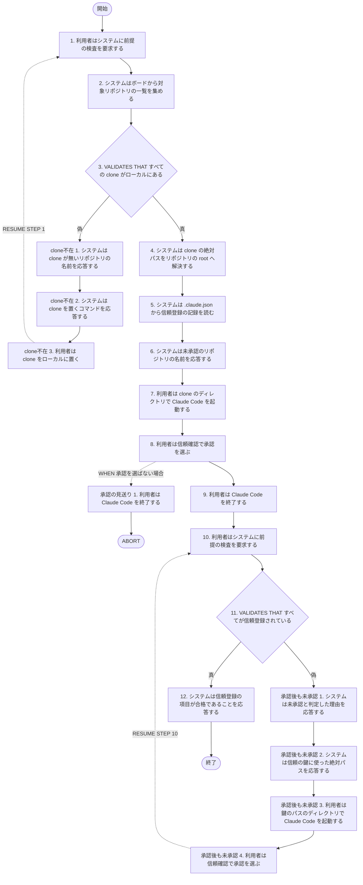
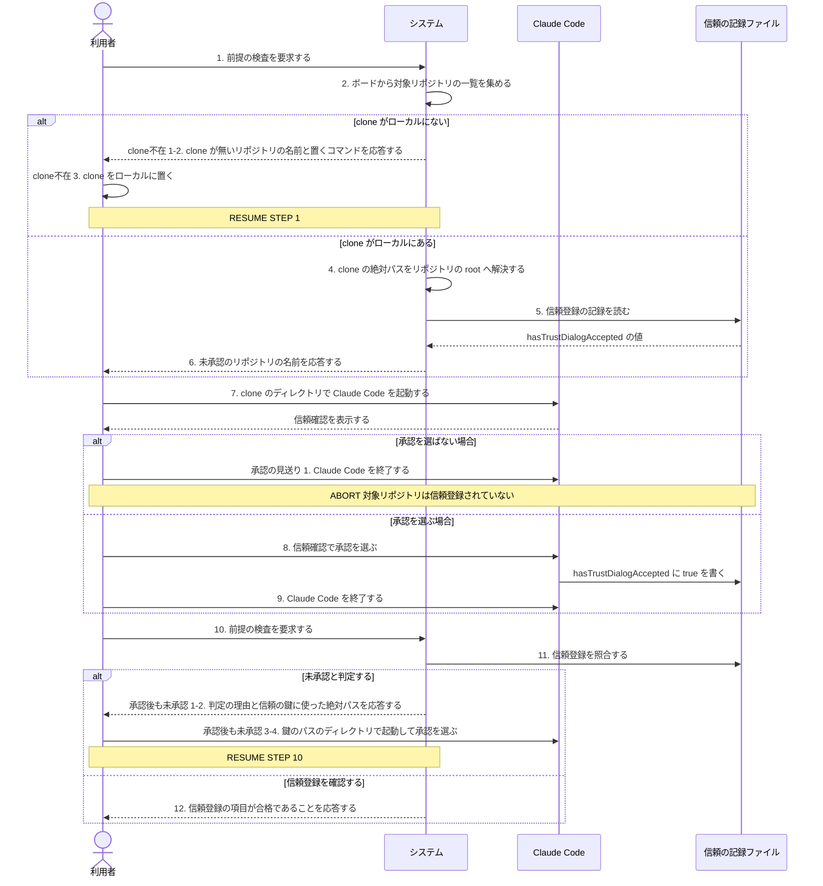

<!-- 目的: 対象リポジトリの Claude Code フォルダ信頼を人間が承認するまでの流れを RUCM で定義する -->

# ユースケース: 対象リポジトリを信頼登録する

## 根拠資料

- `docs/plans/continuo_design.md#1-6`（信頼確認プロンプトの扱い。信頼はリポジトリ単位で記録される実測）
- `docs/plans/continuo_design.md#3-6`（dispatch の直前の検査と、信頼を引く鍵の作り方の3段）
- `docs/plans/continuo_design.md#3-32`（`continuo doctor` の7項目。対象リポジトリはボードを読んで決める）
- `docs/plans/continuo_design.md#3-33`（信頼の登録を自動化しない）
- `docs/plans/continuo_design.md#4-3`（`~/.claude.json` を常駐ループから書き換えない。公式ドキュメントの原文）
- `docs/trying_it_out.md`（段3 フォルダの信頼を承認する / 段5 前提を検査する / 段6 issue を1件用意する）
- `internal/workspace/trust.go` の `CheckTrust` と `CheckTrustForClonePath`
- `internal/doctor/checks.go` の `checkTrust` と `checkClone`

## RUCM

```rucm
USE CASE NAME: 対象リポジトリを信頼登録する
BRIEF DESCRIPTION: 利用者は対象リポジトリの clone のディレクトリで Claude Code の信頼確認を承認する。システムは信頼登録の記録を読み取って検査の結果を利用者に応答する。
PRECONDITION: 利用者は continuo doctor を実行するディレクトリに WORKFLOW.md を置いている。ボードの active_states の Status に対象リポジトリの issue が1件以上ある。gh の認証は project の scope を含む。
PRIMARY ACTOR: 利用者
SECONDARY ACTORS: Claude Code
DEPENDENCY: なし
GENERALIZATION: なし

BASIC FLOW:
1. 利用者はシステムに前提の検査を要求する。
2. システムはボードから対象リポジトリの一覧を集める。
3. システムは VALIDATES THAT 対象リポジトリのすべての clone がローカルにある。
4. システムは clone の絶対パスをリポジトリの root へ解決する。
5. システムはホームディレクトリの .claude.json から信頼登録の記録を読む。
6. システムは利用者に信頼登録が未承認のリポジトリの名前を応答する。
7. 利用者は未承認のリポジトリの clone のディレクトリで Claude Code を起動する。
8. 利用者は Claude Code の信頼確認で承認を選ぶ。
9. 利用者は Claude Code を終了する。
10. 利用者はシステムに前提の検査を要求する。
11. システムは VALIDATES THAT 対象リポジトリのすべてが信頼登録されている。
12. システムは利用者に信頼登録の項目が ✓ であることを応答する。
POSTCONDITION: 対象リポジトリのすべてが Claude Code に信頼登録されている。continuo doctor の信頼登録の項目は ✓ である。システムは対象リポジトリの issue を dispatch する。

SPECIFIC ALTERNATIVE FLOW clone不在:
RFS BASIC FLOW 3
1. システムは利用者に clone が無いリポジトリの名前を応答する。
2. システムは利用者に clone を置くコマンドを応答する。
3. 利用者は対象リポジトリの clone をローカルに置く。
4. RESUME STEP 1
POSTCONDITION: 対象リポジトリの clone がローカルにある。clone が無かった検査では clone の項目が ✗ である。同じ検査では信頼登録の項目が ! である。

SPECIFIC ALTERNATIVE FLOW 承認後も未承認:
RFS BASIC FLOW 11
1. システムは利用者に未承認と判定した理由を応答する。
2. システムは利用者に信頼の鍵に使った絶対パスを応答する。
3. 利用者は信頼の鍵に使った絶対パスのディレクトリで Claude Code を起動する。
4. 利用者は Claude Code の信頼確認で承認を選ぶ。
5. RESUME STEP 10
POSTCONDITION: 信頼の鍵に使った絶対パスのディレクトリが Claude Code に信頼登録されている。未承認と判定した理由が表示されている。

GLOBAL ALTERNATIVE FLOW 承認の見送り:
BRANCH FROM BASIC FLOW 8
WHEN 利用者が Claude Code の信頼確認で承認を選ばない場合
1. 利用者は Claude Code を終了する。
2. ABORT
POSTCONDITION: 対象リポジトリは Claude Code に信頼登録されていない。continuo doctor の信頼登録の項目は ✗ のままである。システムは対象リポジトリの issue を dispatch しない。
```

## フローチャート



## シーケンス図


