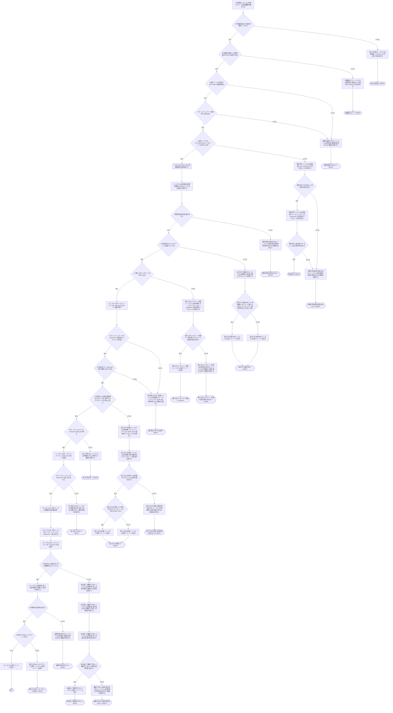
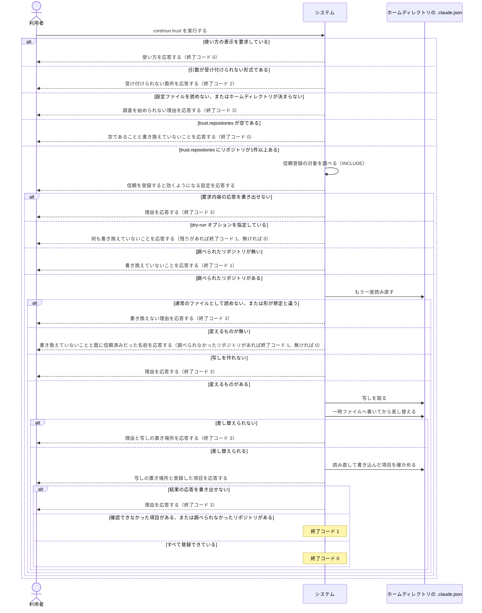

# ユースケース: 対象リポジトリを信頼登録する

## 根拠資料

- `docs/plans/continuo_design.md` の「3-33. 信頼の登録は、人間が列挙したものだけを対象にする」（対象は `trust.repositories` だけ。カンバンから集めない。写しを取ってから差し替える）
- `docs/plans/continuo_design.md` の「3-33b. 信頼を渡す前に見せるものと、確かめられなかったときの扱い」（要求内容を確かめられなかったリポジトリは登録しない）
- `docs/plans/continuo_design.md` の「3-6. 起動時の検査を厚くする」（信頼を引く鍵の作り方の3段）
- `docs/plans/continuo_design.md` の「3-22. worktree の置き場所は gwq の規則に合わせる」（clone が無ければ `ghq get` で取る。`--dry-run` では取らない）
- `docs/plans/continuo_design.md` の「4-3. `~/.claude.json` を常駐ループから書き換えない」（書き換えるのは `continuo trust` だけ）
- `docs/plans/continuo_design.md` の「3-59. ファイルの書き換えは一時ファイルへ書いてから差し替える」
- `docs/trying_it_out.md` の「段5. 対象リポジトリを信頼に登録する」（実際に叩いた出力）
- `internal/cli/cli.go` の `runTrust` / `parseErrorExitCode` / `trustInternalErrorExitCode`
- `internal/trust/trust.go` の `Apply` / `readClaudeConfig` / `projectsObject` / `markTrusted` / `writeBackup` / `replaceFile`、`Entry` の `Actionable`、`Report` の `Pending` / `Problems`
- `internal/trust/report.go` の `WriteRequirements` / `writeEntry` / `WriteApplyResult`
- `internal/workspace/trust.go` の `CheckTrustForClonePath`

1件ずつ調べる段（clone のパス・信頼の鍵・信頼の状態・要求内容）は、`信頼登録の対象を調べる.rucm.md` に書いてある。この記述は `INCLUDE USE CASE` で引く。

## 記述の中の語が指すもの

rucm ブロックは、リポジトリを次の3つに呼び分ける。実装の名前は `internal/trust/trust.go` のものである。

| 記述の語 | 実装 | 何を指すか |
| --- | --- | --- |
| 調べられたリポジトリ | `Entry` の `Actionable` が真 | 信頼の鍵まで求められ、要求内容も確かめられたリポジトリ。既に信頼済みのものも含む |
| 未信頼のリポジトリ | `Report` の `Pending` | 調べられたリポジトリのうち、まだ信頼登録されていないもの |
| 調べられなかったリポジトリ | `Report` の `Problems` | 調べられたリポジトリ以外の全部。要求内容を確かめられなかったものも含む |

「写し」は `~/.claude.json.continuo-backup-<時刻>` という名前のバックアップである。continuo は作るだけで、消さない。

## 応答に載るもの

| 応答 | 段 | 出力先 | 何が載るか |
| --- | --- | --- | --- |
| 信頼を登録すると効くようになる設定 | 基本フローの段8 | 標準出力 | リポジトリごとの記号（`✓` 既に信頼済み / `!` 未信頼 / `✗` 調べられなかった）、登録するパス、`permissions.allow`、`permissions.additionalDirectories`、hooks、MCP サーバー、集計の1行 |
| 書き込む前の注意 | 段8 の応答の直後 | 標準出力 | Claude Code のセッションが動いていると書き換えが失われうること。dry-run オプションの指定が無く、調べた時点で未信頼のリポジトリが1件以上あるときだけ出る |
| 結果 | 基本フローの段23 | 標準出力 | 写しの置き場所、登録した項目、既に信頼済みだったので触らなかった項目 |
| 打ち切りの理由 | 終了コード 2 と 3 の代替フロー | 標準エラー | 何ができなかったか |

書き込む前の注意を rucm ブロックの段にしていない。段にすると、その先の経路が全部2倍になるためである（判断ログの 14）。

## 終了コードの分け方

`internal/cli/cli.go` の `runTrust` が決める。

| 終了コード | どんなときに返るか |
| --- | --- |
| 0 | 登録した。または、登録するものが無かった（全部が既に信頼済み、`trust.repositories` が空、使い方の表示） |
| 1 | 人間の手が要るものが残っている。調べられなかったリポジトリがある、書き込んだのに確認できなかった項目がある、`--dry-run` で未信頼のリポジトリか調べられなかったリポジトリがある |
| 2 | 引数の指定が誤っている |
| 3 | `continuo trust` が動けなかった。設定ファイルを読めない、ホームディレクトリを引けない、`~/.claude.json` を読み書きできない、応答を書き出せない |

## 段4・段5 の検証が偽になる理由

どれも、1件も調べずに、標準エラーへ理由を出して終了コード 3 で終わる（代替フロー `調査を始められない`）。
`internal/cli/cli.go` の `runTrust` と `internal/trust/trust.go` の `Plan` が、この順に確かめる。

| 段 | 理由 |
| --- | --- |
| 4 | いまいるディレクトリを引けない（設定ファイルを探す場所が決まらない） |
| 4 | 設定ファイルのパスを決められない |
| 4 | 設定ファイルを読めない、または front matter が検証を通らない |
| 5 | ホームディレクトリを引けない |
| 5 | ホームディレクトリが絶対パスでない |

## 段にしていない打ち切り

`internal/trust/trust.go` の `Apply` は、変える項目が1件以上あると決まったあと（段15 の真）、写しを取る前に、書き戻す JSON を組み立てる。
組み立ての関数（`internal/trust/claudeconfig.go` の `marshalIndent`）は誤りを返す形になっていて、返れば標準エラーへ理由を出して終了コード 3 で終わる。
**この誤りへは到達しないので、段にも代替フローにもしていない。**誤りが返るのは、キーを JSON の文字列に直せないときと、値が JSON として正しくないときである。
キーは Go の文字列なので必ず直せる。値は、段14 で JSON として読めたものか、continuo 自身が作ったものしか入らない。

## RUCM

```rucm
USE CASE NAME: 対象リポジトリを信頼登録する
BRIEF DESCRIPTION: 利用者は continuo trust を実行する。システムは設定ファイルの trust.repositories に列挙されたリポジトリを調べる。システムは信頼を登録すると効くようになる設定を応答する。システムはホームディレクトリの .claude.json に信頼登録の記録を書き込む。
PRECONDITION: 利用者は continuo の実行ファイルを実行できる。
PRIMARY ACTOR: 利用者
SECONDARY ACTORS: なし
DEPENDENCY: INCLUDE USE CASE 信頼登録の対象を調べる
GENERALIZATION: なし

BASIC FLOW:
1. 利用者はシステムに対象リポジトリの信頼登録を要求する。
2. システムは VALIDATES THAT 利用者が使い方の表示を要求していない。
3. システムは VALIDATES THAT 利用者が指定した引数が受け付けられる形式である。
4. システムは VALIDATES THAT 設定ファイルを読めて front matter が検証を通る。
5. システムは VALIDATES THAT ホームディレクトリの絶対パスが決まる。
6. システムは VALIDATES THAT 設定ファイルの trust.repositories にリポジトリが1件以上ある。
7. INCLUDE USE CASE 信頼登録の対象を調べる
8. システムは利用者に信頼を登録すると効くようになる設定を応答する。
9. システムは VALIDATES THAT 要求内容の応答を書き出せた。
10. システムは VALIDATES THAT 利用者が dry-run オプションを指定していない。
11. システムは VALIDATES THAT 調べられたリポジトリが1件以上ある。
12. システムはホームディレクトリの .claude.json をもう一度読み直す。
13. システムは VALIDATES THAT ホームディレクトリの .claude.json を通常のファイルとして読める。
14. システムは VALIDATES THAT 読み直した .claude.json の形が想定どおりである。
15. システムは VALIDATES THAT 読み直した記録で信頼済みになっていない調べられたリポジトリが1件以上ある。
16. システムは VALIDATES THAT ホームディレクトリに .claude.json の写しを作れる。
17. システムはホームディレクトリに .claude.json の写しを取る。
18. システムは VALIDATES THAT ホームディレクトリの .claude.json を差し替えられる。
19. システムは一時ファイルに登録済みの記録を書く。
20. システムは一時ファイルをホームディレクトリの .claude.json へ差し替える。
21. システムはホームディレクトリの .claude.json を読み直す。
22. システムは VALIDATES THAT 書き込んだ項目のすべてが信頼済みになっている。
23. システムは利用者に写しの置き場所と登録した項目を応答する。
24. システムは VALIDATES THAT 結果の応答を書き出せた。
25. システムは VALIDATES THAT 調べられなかったリポジトリがない。
26. システムは終了コード 0 を返す。
POSTCONDITION: trust.repositories のすべてのリポジトリが Claude Code に信頼登録されている。ホームディレクトリに .claude.json の写しがある。trust.repositories にないリポジトリの記録は変わっていない。応答は標準出力に出ている。終了コード 0 が返っている。

SPECIFIC ALTERNATIVE FLOW 使い方の表示:
RFS BASIC FLOW 2
1. システムは利用者に continuo trust の使い方を応答する。
2. ABORT
POSTCONDITION: ホームディレクトリの .claude.json は1バイトも変わっていない。システムは設定ファイルを読んでいない。使い方は標準エラーに出ている。終了コード 0 が返っている。

SPECIFIC ALTERNATIVE FLOW 引数指定エラー:
RFS BASIC FLOW 3
1. システムは利用者に引数のどこが受け付けられないかを応答する。
2. ABORT
POSTCONDITION: ホームディレクトリの .claude.json は1バイトも変わっていない。システムは設定ファイルを読んでいない。理由は標準エラーに出ている。終了コード 2 が返っている。

BOUNDED ALTERNATIVE FLOW 調査を始められない:
RFS BASIC FLOW 4,5
1. システムは利用者に調査を始められない理由を応答する。
2. ABORT
POSTCONDITION: ホームディレクトリの .claude.json は1バイトも変わっていない。システムはリポジトリを1件も調べていない。理由は標準エラーに出ている。終了コード 3 が返っている。

SPECIFIC ALTERNATIVE FLOW 列挙が空:
RFS BASIC FLOW 6
1. システムは利用者に trust.repositories が空であることを応答する。
2. システムは VALIDATES THAT 空であることの応答を書き出せた。
3. システムは利用者にホームディレクトリの .claude.json を書き換えていないことを応答する。
4. システムは VALIDATES THAT 書き換えていないことの応答を書き出せた。
5. ABORT
POSTCONDITION: ホームディレクトリの .claude.json は1バイトも変わっていない。写しは作られていない。システムはリポジトリを1件も調べていない。応答は標準出力に出ている。終了コード 0 が返っている。

BOUNDED ALTERNATIVE FLOW 列挙が空の応答を書き出せない:
RFS 列挙が空 2,4
1. システムは利用者に応答を書き出せない理由を応答する。
2. ABORT
POSTCONDITION: ホームディレクトリの .claude.json は1バイトも変わっていない。写しは作られていない。理由は標準エラーに出ている。終了コード 3 が返っている。

SPECIFIC ALTERNATIVE FLOW 要求内容を書き出せない:
RFS BASIC FLOW 9
1. システムは利用者に要求内容を書き出せない理由を応答する。
2. ABORT
POSTCONDITION: ホームディレクトリの .claude.json は1バイトも変わっていない。写しは作られていない。理由は標準エラーに出ている。終了コード 3 が返っている。

SPECIFIC ALTERNATIVE FLOW 実行せずに確かめる:
RFS BASIC FLOW 10
1. システムは利用者に何も書き換えていないことを応答する。
2. IF 未信頼のリポジトリと調べられなかったリポジトリの合計が1件以上である THEN
3.   システムは終了コード 1 を返す。
4. ELSE
5.   システムは終了コード 0 を返す。
6. ENDIF
7. ABORT
POSTCONDITION: ホームディレクトリの .claude.json は1バイトも変わっていない。写しは作られていない。システムは clone を取りに行っていない。利用者は何を許すことになるかを読める。応答は標準出力に出ている。

SPECIFIC ALTERNATIVE FLOW 調べられたリポジトリが無い:
RFS BASIC FLOW 11
1. システムは利用者にホームディレクトリの .claude.json を書き換えていないことを応答する。
2. システムは VALIDATES THAT 書き換えていないことの応答を書き出せた。
3. システムは終了コード 1 を返す。
4. ABORT
POSTCONDITION: ホームディレクトリの .claude.json は1バイトも変わっていない。システムはホームディレクトリの .claude.json を読み直していない。写しは作られていない。応答は標準出力に出ている。終了コード 1 が返っている。

SPECIFIC ALTERNATIVE FLOW 調べられたリポジトリが無い応答を書き出せない:
RFS 調べられたリポジトリが無い 2
1. システムは利用者に応答を書き出せない理由を応答する。
2. ABORT
POSTCONDITION: ホームディレクトリの .claude.json は1バイトも変わっていない。写しは作られていない。理由は標準エラーに出ている。終了コード 3 が返っている。

BOUNDED ALTERNATIVE FLOW 書き換えられない記録:
RFS BASIC FLOW 13,14
1. システムは利用者にホームディレクトリの .claude.json を書き換えない理由を応答する。
2. ABORT
POSTCONDITION: ホームディレクトリの .claude.json は1バイトも変わっていない。システムはホームディレクトリの .claude.json を新しく作っていない。写しは作られていない。理由は標準エラーに出ている。終了コード 3 が返っている。

SPECIFIC ALTERNATIVE FLOW 変えるものが無い:
RFS BASIC FLOW 15
1. システムは利用者にホームディレクトリの .claude.json を書き換えていないことを応答する。
2. システムは利用者に既に信頼済みだったリポジトリの名前を応答する。
3. システムは VALIDATES THAT 書き換えていないことの応答を書き出せた。
4. IF 調べられなかったリポジトリが1件以上ある THEN
5.   システムは終了コード 1 を返す。
6. ELSE
7.   システムは終了コード 0 を返す。
8. ENDIF
9. ABORT
POSTCONDITION: ホームディレクトリの .claude.json は1バイトも変わっていない。写しは作られていない。応答は標準出力に出ている。

SPECIFIC ALTERNATIVE FLOW 変えるものが無い応答を書き出せない:
RFS 変えるものが無い 3
1. システムは利用者に応答を書き出せない理由を応答する。
2. ABORT
POSTCONDITION: ホームディレクトリの .claude.json は1バイトも変わっていない。写しは作られていない。理由は標準エラーに出ている。終了コード 3 が返っている。

SPECIFIC ALTERNATIVE FLOW 写しを作れない:
RFS BASIC FLOW 16
1. システムは利用者に写しを作れない理由を応答する。
2. ABORT
POSTCONDITION: ホームディレクトリの .claude.json は1バイトも変わっていない。理由は標準エラーに出ている。終了コード 3 が返っている。

SPECIFIC ALTERNATIVE FLOW 差し替えられない:
RFS BASIC FLOW 18
1. システムは利用者に差し替えられない理由と写しの置き場所を応答する。
2. ABORT
POSTCONDITION: ホームディレクトリの .claude.json は読み直した時点の内容のままである。ホームディレクトリに .claude.json の写しがある。一時ファイルは残っていない。理由は標準エラーに出ている。終了コード 3 が返っている。

SPECIFIC ALTERNATIVE FLOW 読み直しで確認できない:
RFS BASIC FLOW 22
1. システムは利用者に写しの置き場所と登録した項目を応答する。
2. システムは利用者に書き込んだのに確認できなかった項目を応答する。
3. システムは利用者に写しを書き戻す案内を応答する。
4. システムは VALIDATES THAT 確認できなかった項目の応答を書き出せた。
5. システムは終了コード 1 を返す。
6. ABORT
POSTCONDITION: ホームディレクトリの .claude.json は書き換わっている。ホームディレクトリに .claude.json の写しがある。確認できなかった項目は標準出力に出ている。終了コード 1 が返っている。

SPECIFIC ALTERNATIVE FLOW 確認できない応答を書き出せない:
RFS 読み直しで確認できない 4
1. システムは利用者に応答を書き出せない理由を応答する。
2. ABORT
POSTCONDITION: ホームディレクトリの .claude.json は書き換わっている。ホームディレクトリに .claude.json の写しがある。理由は標準エラーに出ている。終了コード 3 が返っている。

SPECIFIC ALTERNATIVE FLOW 結果を書き出せない:
RFS BASIC FLOW 24
1. システムは利用者に結果を書き出せない理由を応答する。
2. ABORT
POSTCONDITION: ホームディレクトリの .claude.json は書き換わっている。ホームディレクトリに .claude.json の写しがある。理由は標準エラーに出ている。終了コード 3 が返っている。

SPECIFIC ALTERNATIVE FLOW 調べられなかったリポジトリが残る:
RFS BASIC FLOW 25
1. システムは終了コード 1 を返す。
2. ABORT
POSTCONDITION: 調べられたリポジトリのすべてが Claude Code に信頼登録されている。調べられなかったリポジトリは登録されていない。ホームディレクトリに .claude.json の写しがある。調べられなかった理由は標準出力に出ている。終了コード 1 が返っている。
```

## フローチャート


```mermaid
flowchart TD
    BS1["1 利用者はシステムに対象リポジトリの信頼登録を要求する"]
    BS2{"2 利用者が使い方の表示を要求していない"}
    BS3{"3 利用者が指定した引数が受け付けられる形式である"}
    BS4{"4 設定ファイルを読めて front matter が検証を通る"}
    BS5{"5 ホームディレクトリの絶対パスが決まる"}
    BS6{"6 設定ファイルの trust.repositories にリポジトリが1件以上ある"}
    BS7[["7 INCLUDE USE CASE 信頼登録の対象を調べる"]]
    BS8["8 システムは利用者に信頼を登録すると効くようになる設定を応答する"]
    BS9{"9 要求内容の応答を書き出せた"}
    BS10{"10 利用者が dry-run オプションを指定していない"}
    BS11{"11 調べられたリポジトリが1件以上ある"}
    BS12["12 システムはホームディレクトリの .claude.json をもう一度読み直す"]
    BS13{"13 ホームディレクトリの .claude.json を通常のファイルとして読める"}
    BS14{"14 読み直した .claude.json の形が想定どおりである"}
    BS15{"15 読み直した記録で信頼済みになっていない調べられたリポジトリが1件以上ある"}
    BS16{"16 ホームディレクトリに .claude.json の写しを作れる"}
    BS17["17 システムはホームディレクトリに .claude.json の写しを取る"]
    BS18{"18 ホームディレクトリの .claude.json を差し替えられる"}
    BS19["19 システムは一時ファイルに登録済みの記録を書く"]
    BS20["20 システムは一時ファイルをホームディレクトリの .claude.json へ差し替える"]
    BS21["21 システムはホームディレクトリの .claude.json を読み直す"]
    BS22{"22 書き込んだ項目のすべてが信頼済みになっている"}
    BS23["23 システムは利用者に写しの置き場所と登録した項目を応答する"]
    BS24{"24 結果の応答を書き出せた"}
    BS25{"25 調べられなかったリポジトリがない"}
    BS26["26 システムは終了コード 0 を返す"]
    A1S1["使い方の表示 1 システムは利用者に continuo trust の使い方を応答する"]
    A1S2(["使い方の表示 2 ABORT"])
    A2S1["引数指定エラー 1 システムは利用者に引数のどこが受け付けられないかを応答する"]
    A2S2(["引数指定エラー 2 ABORT"])
    A3S1["調査を始められない 1 システムは利用者に調査を始められない理由を応答する"]
    A3S2(["調査を始められない 2 ABORT"])
    A4S1["列挙が空 1 システムは利用者に trust.repositories が空であることを応答する"]
    A4S2{"列挙が空 2 空であることの応答を書き出せた"}
    A4S3["列挙が空 3 システムは利用者にホームディレクトリの .claude.json を書き換えていないことを応答する"]
    A4S4{"列挙が空 4 書き換えていないことの応答を書き出せた"}
    A4S5(["列挙が空 5 ABORT"])
    A5S1["列挙が空の応答を書き出せない 1 システムは利用者に応答を書き出せない理由を応答する"]
    A5S2(["列挙が空の応答を書き出せない 2 ABORT"])
    A6S1["要求内容を書き出せない 1 システムは利用者に要求内容を書き出せない理由を応答する"]
    A6S2(["要求内容を書き出せない 2 ABORT"])
    A7S1["実行せずに確かめる 1 システムは利用者に何も書き換えていないことを応答する"]
    A7S2{"実行せずに確かめる 2 IF 未信頼のリポジトリと調べられなかったリポジトリの合計が1件以上である THEN"}
    A7S3["実行せずに確かめる 3 システムは終了コード 1 を返す"]
    A7S5["実行せずに確かめる 5 システムは終了コード 0 を返す"]
    A7S7(["実行せずに確かめる 7 ABORT"])
    A8S1["調べられたリポジトリが無い 1 システムは利用者にホームディレクトリの .claude.json を書き換えていないことを応答する"]
    A8S2{"調べられたリポジトリが無い 2 書き換えていないことの応答を書き出せた"}
    A8S3["調べられたリポジトリが無い 3 システムは終了コード 1 を返す"]
    A8S4(["調べられたリポジトリが無い 4 ABORT"])
    A9S1["調べられたリポジトリが無い応答を書き出せない 1 システムは利用者に応答を書き出せない理由を応答する"]
    A9S2(["調べられたリポジトリが無い応答を書き出せない 2 ABORT"])
    A10S1["書き換えられない記録 1 システムは利用者にホームディレクトリの .claude.json を書き換えない理由を応答する"]
    A10S2(["書き換えられない記録 2 ABORT"])
    A11S1["変えるものが無い 1 システムは利用者にホームディレクトリの .claude.json を書き換えていないことを応答する"]
    A11S2["変えるものが無い 2 システムは利用者に既に信頼済みだったリポジトリの名前を応答する"]
    A11S3{"変えるものが無い 3 書き換えていないことの応答を書き出せた"}
    A11S4{"変えるものが無い 4 IF 調べられなかったリポジトリが1件以上ある THEN"}
    A11S5["変えるものが無い 5 システムは終了コード 1 を返す"]
    A11S7["変えるものが無い 7 システムは終了コード 0 を返す"]
    A11S9(["変えるものが無い 9 ABORT"])
    A12S1["変えるものが無い応答を書き出せない 1 システムは利用者に応答を書き出せない理由を応答する"]
    A12S2(["変えるものが無い応答を書き出せない 2 ABORT"])
    A13S1["写しを作れない 1 システムは利用者に写しを作れない理由を応答する"]
    A13S2(["写しを作れない 2 ABORT"])
    A14S1["差し替えられない 1 システムは利用者に差し替えられない理由と写しの置き場所を応答する"]
    A14S2(["差し替えられない 2 ABORT"])
    A15S1["読み直しで確認できない 1 システムは利用者に写しの置き場所と登録した項目を応答する"]
    A15S2["読み直しで確認できない 2 システムは利用者に書き込んだのに確認できなかった項目を応答する"]
    A15S3["読み直しで確認できない 3 システムは利用者に写しを書き戻す案内を応答する"]
    A15S4{"読み直しで確認できない 4 確認できなかった項目の応答を書き出せた"}
    A15S5["読み直しで確認できない 5 システムは終了コード 1 を返す"]
    A15S6(["読み直しで確認できない 6 ABORT"])
    A16S1["確認できない応答を書き出せない 1 システムは利用者に応答を書き出せない理由を応答する"]
    A16S2(["確認できない応答を書き出せない 2 ABORT"])
    A17S1["結果を書き出せない 1 システムは利用者に結果を書き出せない理由を応答する"]
    A17S2(["結果を書き出せない 2 ABORT"])
    A18S1["調べられなかったリポジトリが残る 1 システムは終了コード 1 を返す"]
    A18S2(["調べられなかったリポジトリが残る 2 ABORT"])
    BS1 --> BS2
    BS2 -- はい --> BS3
    BS2 -- いいえ --> A1S1
    BS3 -- はい --> BS4
    BS3 -- いいえ --> A2S1
    BS4 -- はい --> BS5
    BS4 -- いいえ --> A3S1
    BS5 -- はい --> BS6
    BS5 -- いいえ --> A3S1
    BS6 -- はい --> BS7
    BS6 -- いいえ --> A4S1
    BS7 --> BS8
    BS8 --> BS9
    BS9 -- はい --> BS10
    BS9 -- いいえ --> A6S1
    BS10 -- はい --> BS11
    BS10 -- いいえ --> A7S1
    BS11 -- はい --> BS12
    BS11 -- いいえ --> A8S1
    BS12 --> BS13
    BS13 -- はい --> BS14
    BS13 -- いいえ --> A10S1
    BS14 -- はい --> BS15
    BS14 -- いいえ --> A10S1
    BS15 -- はい --> BS16
    BS15 -- いいえ --> A11S1
    BS16 -- はい --> BS17
    BS16 -- いいえ --> A13S1
    BS17 --> BS18
    BS18 -- はい --> BS19
    BS18 -- いいえ --> A14S1
    BS19 --> BS20
    BS20 --> BS21
    BS21 --> BS22
    BS22 -- はい --> BS23
    BS22 -- いいえ --> A15S1
    BS23 --> BS24
    BS24 -- はい --> BS25
    BS24 -- いいえ --> A17S1
    BS25 -- はい --> BS26
    BS25 -- いいえ --> A18S1
    A1S1 --> A1S2
    A2S1 --> A2S2
    A3S1 --> A3S2
    A4S1 --> A4S2
    A4S2 -- はい --> A4S3
    A4S2 -- いいえ --> A5S1
    A4S3 --> A4S4
    A4S4 -- はい --> A4S5
    A4S4 -- いいえ --> A5S1
    A5S1 --> A5S2
    A6S1 --> A6S2
    A7S1 --> A7S2
    A7S2 -- はい --> A7S3
    A7S2 -- いいえ --> A7S5
    A7S3 --> A7S7
    A7S5 --> A7S7
    A8S1 --> A8S2
    A8S2 -- はい --> A8S3
    A8S2 -- いいえ --> A9S1
    A8S3 --> A8S4
    A9S1 --> A9S2
    A10S1 --> A10S2
    A11S1 --> A11S2
    A11S2 --> A11S3
    A11S3 -- はい --> A11S4
    A11S3 -- いいえ --> A12S1
    A11S4 -- はい --> A11S5
    A11S4 -- いいえ --> A11S7
    A11S5 --> A11S9
    A11S7 --> A11S9
    A12S1 --> A12S2
    A13S1 --> A13S2
    A14S1 --> A14S2
    A15S1 --> A15S2
    A15S2 --> A15S3
    A15S3 --> A15S4
    A15S4 -- はい --> A15S5
    A15S4 -- いいえ --> A16S1
    A15S5 --> A15S6
    A16S1 --> A16S2
    A17S1 --> A17S2
    A18S1 --> A18S2
    BS26 --> END(["終了"])
```

## シーケンス図


```mermaid
sequenceDiagram
    actor 利用者
    participant システム
    participant 信頼の記録 as ホームディレクトリの .claude.json

    利用者->>システム: continuo trust を実行する
    alt 使い方の表示を要求している
        システム-->>利用者: 使い方を応答する（終了コード 0）
    else 引数が受け付けられない形式である
        システム-->>利用者: 受け付けられない箇所を応答する（終了コード 2）
    else 設定ファイルを読めない、またはホームディレクトリが決まらない
        システム-->>利用者: 調査を始められない理由を応答する（終了コード 3）
    else trust.repositories が空である
        システム-->>利用者: 空であることと書き換えていないことを応答する（終了コード 0）
    else trust.repositories にリポジトリが1件以上ある
        システム->>システム: 信頼登録の対象を調べる（INCLUDE）
        システム-->>利用者: 信頼を登録すると効くようになる設定を応答する
        alt 要求内容の応答を書き出せない
            システム-->>利用者: 理由を応答する（終了コード 3）
        else dry-run オプションを指定している
            システム-->>利用者: 何も書き換えていないことを応答する（残りがあれば終了コード 1、無ければ 0）
        else 調べられたリポジトリが無い
            システム-->>利用者: 書き換えていないことを応答する（終了コード 1）
        else 調べられたリポジトリがある
            システム->>信頼の記録: もう一度読み直す
            alt 通常のファイルとして読めない、または形が想定と違う
                システム-->>利用者: 書き換えない理由を応答する（終了コード 3）
            else 変えるものが無い
                システム-->>利用者: 書き換えていないことと既に信頼済みだった名前を応答する（調べられなかったリポジトリがあれば終了コード 1、無ければ 0）
            else 写しを作れない
                システム-->>利用者: 理由を応答する（終了コード 3）
            else 変えるものがある
                システム->>信頼の記録: 写しを取る
                システム->>信頼の記録: 一時ファイルへ書いてから差し替える
                alt 差し替えられない
                    システム-->>利用者: 理由と写しの置き場所を応答する（終了コード 3）
                else 差し替えられる
                    システム->>信頼の記録: 読み直して書き込んだ項目を確かめる
                    システム-->>利用者: 写しの置き場所と登録した項目を応答する
                    alt 結果の応答を書き出せない
                        システム-->>利用者: 理由を応答する（終了コード 3）
                    else 確認できなかった項目がある、または調べられなかったリポジトリがある
                        Note over システム: 終了コード 1
                    else すべて登録できている
                        Note over システム: 終了コード 0
                    end
                end
            end
        end
    end
```
