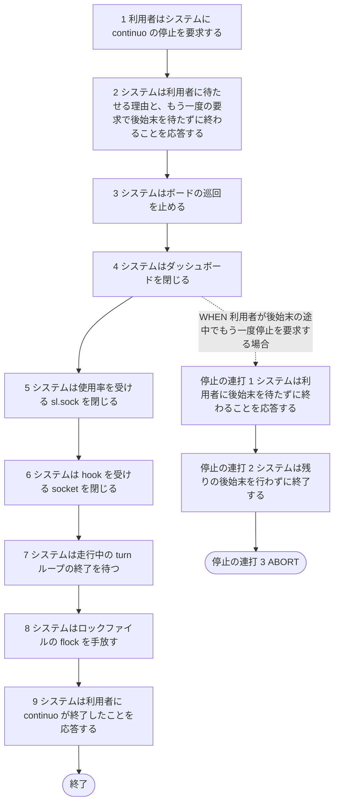
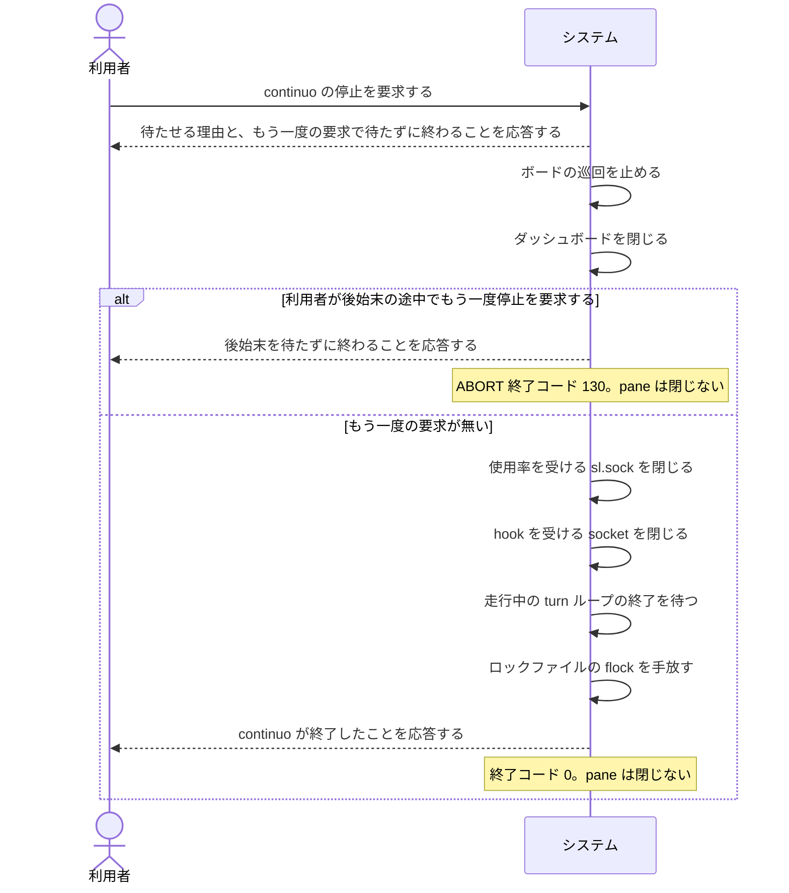

# ユースケース: 巡回が回っているあいだに常駐を止める

> **起動を終えて巡回が回っている continuo を、利用者が Ctrl+C（SIGINT）か SIGTERM で止める流れだけを書いた記述である。**
> `再起動して実行中の issue を引き継ぐ` の代替フロー `中断`・`中断の連打` から分けた。
> 実装が停止の要求を見て後始末へ移るのは、巡回のループの1か所だけである。起動の記述に書くと、
> 起動の結末の数だけ停止の経路が掛け算で増える。停止の動きは起動の結末によらず同じなので、分けて書く。
>
> **起動の途中で受けた停止の要求は、この記述の対象ではない。**依存の組み立てと起動時の検査の途中なら終了コード 1 で終わる。
> 復元から最初の巡回までの途中なら、後ろの段を全部通ってからこの記述の流れへ入る（`再起動して実行中の issue を引き継ぐ` の本文）。

## 根拠資料

- `docs/plans/continuo_design.md#3-52`（Ctrl+C には必ず即座に反応し、2回目で待たずに終わる）
- `docs/plans/continuo_design.md#3-4`（終了の作法。pane は閉じない。次の起動で引き継ぐ）
- `internal/cli/cli.go` の `runMain`（SIGINT と SIGTERM で切れる ctx を作る。終了コードを決める）
- `internal/daemon/daemon.go` の `Run`、`close`、`WatchInterrupt`、`announceShutdown`、`WaitWithTimeout`、`ShutdownBudget`
- `internal/orchestrator/orchestrator.go` の `Run`（巡回のループが ctx の終わりを見る）、`Close`
- `internal/server/server.go` の `Close`（ダッシュボードを閉じる期限）

## RUCM

```rucm
USE CASE NAME: 巡回が回っているあいだに常駐を止める
BRIEF DESCRIPTION: 利用者は巡回が回っている continuo に Ctrl+C か SIGTERM で停止を要求する。システムは待たせる理由と、もう一度の要求で待たずに終わることを応答する。システムは巡回を止め、ダッシュボードと使用率を受ける socket と hook を受ける socket を順に閉じ、走行中の turn ループの終了を待ってから終わる。システムは herdr の pane を閉じない。
PRECONDITION: continuo は起動を終えている。巡回のループが回っている。
PRIMARY ACTOR: 利用者
SECONDARY ACTORS: なし
DEPENDENCY: なし
GENERALIZATION: なし

BASIC FLOW:
1. 利用者はシステムに continuo の停止を要求する。
2. システムは利用者に待たせる理由と、もう一度の要求で後始末を待たずに終わることを応答する。
3. システムはボードの巡回を止める。
4. システムはダッシュボードを閉じる。
5. システムは使用率を受ける sl.sock を閉じる。
6. システムは hook を受ける socket を閉じる。
7. システムは走行中の turn ループの終了を待つ。
8. システムはロックファイルの flock を手放す。
9. システムは利用者に continuo が終了したことを応答する。
POSTCONDITION: continuo は常駐していない。印の集合は失われている。システムは herdr の pane を1つも閉じていない。worktree は残っている。システムは issue の Status を書いていない。応答は標準エラーに出ている。終了コード 0 が返っている。

GLOBAL ALTERNATIVE FLOW 停止の連打:
BRANCH FROM BASIC FLOW 4
WHEN 利用者が後始末の途中でもう一度停止を要求する場合
1. システムは利用者に後始末を待たずに終わることを応答する。
2. システムは残りの後始末を行わずに終了する。
3. ABORT
POSTCONDITION: continuo は常駐していない。印の集合は失われている。システムは herdr の pane を1つも閉じていない。worktree は残っている。システムは issue の Status を書いていない。応答は標準エラーに出ている。終了コード 130 が返っている。
```

## 停止の要求は2種類で、動きは同じである

| 要求 | どこから来るか |
| --- | --- |
| SIGINT | continuo を動かしている端末での Ctrl+C |
| SIGTERM | `kill` や、プロセスを見張る仕組み |

**どちらも同じ ctx を切り、同じ数え方をする。**1回目で応答して後始末に入り、2回目で後始末を待たずに終わる。
2回目は SIGINT でも SIGTERM でもよい（`WatchInterrupt` は2つを同じ受け口で数える）。

**ステップ2 の応答は3行である。**受け取ったことと後始末に掛かりうる最大の時間、もう一度送れば待たずに終わること、
それでも終わらないときに全 goroutine のスタックを出すコマンド（`kill -QUIT <pid>`）。

## 後始末の順番は仕様である

| ステップ | 何を待つか | 期限 | 期限を過ぎたら |
| --- | --- | --- | --- |
| 3. 巡回を止める | 回っている最中の巡回が返るのを待つ | 無し | — |
| 4. ダッシュボードを閉じる | 処理中の応答 | 1秒 | 接続ごと切る |
| 5. `sl.sock` を閉じる | 待たない。配送中の行は捨てる | — | — |
| 6. hook を受ける socket を閉じる | 受け取り済みの hook を印へ書き終えること | 5秒 | WARN を出して待つのをやめる |
| 7. turn ループの終了を待つ | 送り終えた指示が中途半端に切れないこと | 30秒 | WARN を出して待つのをやめる |

**ダッシュボードを先に閉じる。**読み取り専用なので、途中で切れて困る書き込みが無い。
**`sl.sock` は hook を受ける socket より先に閉じる。**段のログは「後始末 1/3・2/3・3/3」の3つで、`sl.sock` は 2/3 の中で閉じる。
**期限を過ぎても、後ろの段へそのまま進む。**終了コードも 0 のままである。だから経路には出していない。

**設定で開いていないものは、閉じる段が何もしない。**`server.port` が未設定ならダッシュボードは無い。
`rate_limit.source` が `none` のときと、`sl.sock` を開けずに statusline を使わないで動いているときは、`sl.sock` は無い。後ろの段は変わらない。

**pane は閉じない。**巡回を止めるだけでは run を諦めたことにならない。次の起動が、生きている pane を引き継ぐ（`再起動して実行中の issue を引き継ぐ`）。
印の集合はメモリに在るので、プロセスが終われば失われる。

## 2回目の要求は、自前で数えて終わらせる

**言いたいこと。**2回目を「既定の動作へ戻す」で実現しない。`signal.Stop` が戻すのは continuo が起動する前の動作であり、
親が SIGINT を無視に設定して起動していると、戻る先が「無視」になって2回目が何も起こさない。
実装は signal を自前で数え、2回目で終了コード 130（128 + SIGINT の 2）でプロセスを終わらせる。

**`停止の連打` の分岐元をステップ4 にしたのは、後始末で最初に待ちに入る段だからである。**後始末のどの段でも起こりうる。
プロセスをその場で終わらせるので、残りの段（socket を閉じる・turn ループを待つ・flock を手放す）は行わない。
flock はプロセスが終われば外れる。socket のファイルが残るかどうかは、確かめていない。

## フローチャート



## シーケンス図


