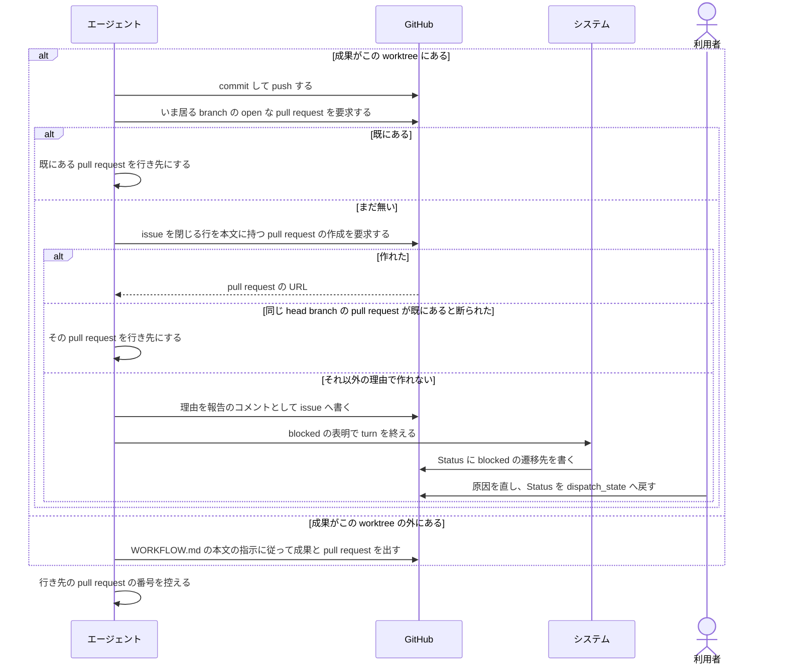
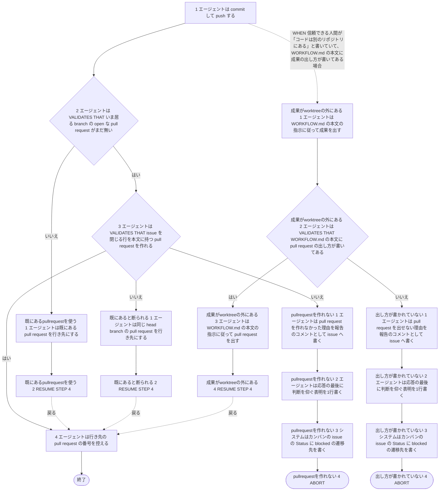

# ユースケース: 成果を push して pull request を出す

> **この記述からテストコードは作らない。**
> 段を行うのはエージェント（Claude Code）で、指示書の文面を読んで動く。エージェントを起動して段を通す自動テストは、レートリミットを使い、結果も毎回同じにならない。
> 文面に何が書いてあるかは `test/internal/prompt/` の `TestTemplate_…` が確かめている。
> `check_update_tests.py` が出す `[W1]`（テスト未生成パス）は、ここでは想定どおりである。

## 根拠資料

- `internal/prompt/builtin.md` の 3-4（commit して push する）、3-5（pull request を出す）、7-3（別のリポジトリへ pull request を出すとき）、7-4（この指示書が決めていないこと）、6-1（命令として扱ってよいもの）
- `docs/plans/continuo_design.md#5-3i`（PR はエージェントが出す）
- `docs/plans/continuo_design.md#5-3t`（コメントと pull request の本文・題名を、シェルに実行させずに渡す）

## この記述は何のためにあるか

**エージェントが `builtin.md` の 3-4 と 3-5 をどう使うかを、記録として残すためである。テストは持たない。**
主体はエージェントであり、Claude Code の中で起きることをテストから観測する手立てが無い（`claude -p` は使用禁止のため）。

`指示書に沿って issue を1件仕上げる` が、実装の段のあとでこの記述を取り込む。

**`本家のリポジトリへ PR を出す` とは別の記述である。**あちらは、fork で作業した成果を本家へ出す場合である。こちらは、continuo が用意した worktree の branch から pull request を出す、どの issue でも通る段である。

## RUCM

```rucm
USE CASE NAME: 成果を push して pull request を出す
BRIEF DESCRIPTION: エージェントは worktree の変更を commit して push する。エージェントはいま居る branch の pull request が既にあるかを確かめる。エージェントは無ければ issue を閉じる行を本文に持つ pull request を作る。エージェントは行き先の pull request を控える。
PRECONDITION: エージェントは continuo が用意した worktree と branch で実装を終えている。
PRIMARY ACTOR: エージェント
SECONDARY ACTORS: システム、GitHub、利用者
DEPENDENCY: なし
GENERALIZATION: なし

BASIC FLOW:
1. エージェントは commit して push する。
2. エージェントは VALIDATES THAT いま居る branch の open な pull request がまだ無い。
3. エージェントは VALIDATES THAT issue を閉じる行を本文に持つ pull request を作れる。
4. エージェントは行き先の pull request の番号を控える。
POSTCONDITION: commit は remote に載っている。行き先の pull request が1本ある。pull request の本文に issue を閉じる行がある。

SPECIFIC ALTERNATIVE FLOW 既にあるpullrequestを使う:
RFS BASIC FLOW 2
1. エージェントは既にある pull request を行き先にする。
2. RESUME STEP 4
POSTCONDITION: pull request は1本のままである。push した内容は既にある pull request に入っている。

SPECIFIC ALTERNATIVE FLOW 既にあると断られる:
RFS BASIC FLOW 3
1. エージェントは同じ head branch の pull request を行き先にする。
2. RESUME STEP 4
POSTCONDITION: pull request は1本のままである。エージェントは blocked を表明していない。

SPECIFIC ALTERNATIVE FLOW pullrequestを作れない:
RFS BASIC FLOW 3
1. エージェントは pull request を作れなかった理由を報告のコメントとして issue へ書く。
2. エージェントは応答の最後に判断を仰ぐ表明を1行書く。
3. システムはカンバンの issue の Status に blocked の遷移先を書く。
4. ABORT
POSTCONDITION: pull request は出ていない。commit は remote に載っている。issue に理由の報告のコメントがある。issue の Status は blocked の遷移先である。利用者は理由を読む。利用者が原因を直してから Status を dispatch_state の選択肢へ戻すと、次の run が pull request を出し直す。

GLOBAL ALTERNATIVE FLOW 成果がworktreeの外にある:
BRANCH FROM BASIC FLOW 1
WHEN 信頼できる人間が「コードは別のリポジトリにある」と書いていて、WORKFLOW.md の本文に成果の出し方が書いてある場合
1. エージェントは WORKFLOW.md の本文の指示に従って成果を出す。
2. エージェントは VALIDATES THAT WORKFLOW.md の本文に pull request の出し方が書いてある。
3. エージェントは WORKFLOW.md の本文の指示に従って pull request を出す。
4. RESUME STEP 4
POSTCONDITION: 成果は worktree の外に出ている。pull request がある。worktree の branch に commit は無い。

SPECIFIC ALTERNATIVE FLOW 出し方が書かれていない:
RFS 成果がworktreeの外にある 2
1. エージェントは pull request を出せない理由を報告のコメントとして issue へ書く。
2. エージェントは応答の最後に判断を仰ぐ表明を1行書く。
3. システムはカンバンの issue の Status に blocked の遷移先を書く。
4. ABORT
POSTCONDITION: pull request は出ていない。issue に理由の報告のコメントがある。issue の Status は blocked の遷移先である。利用者は WORKFLOW.md の本文に pull request の出し方を書いてから Status を dispatch_state の選択肢へ戻す。
```

## 成果が worktree の外にあると扱ってよい条件

`builtin.md` の 3-4 が決めている。**2つが両方そろっているときだけ**である。片方でも欠けたら、基本フローのとおり commit して push する。

| 順 | 条件 |
| --- | --- |
| 1 | `trusted_comment` が true のコメントか、`trusted_body` が true の issue の本文に、「コードは別のリポジトリにある」と書いてある（6-1） |
| 2 | `WORKFLOW.md` の本文（4-4）に、その成果の出し方が書いてある（7-4） |

## 段の中で決まっていること

どれも、終わり方も通る段も変えない。

| 段 | 決まり |
| --- | --- |
| 段1 | `git push -u origin HEAD`。`-u` を落とさない。commit するものが無ければ要らない |
| 段1 | 既定の branch（main / master）へ直に push しない。別の名前へ push してよいのは、2本目の pull request を出すときと、信頼できる人間が「この branch へ出せ」と書いたときだけである（6-3） |
| 段3 | 題名も本文も、ファイルへ書いてから渡す。本文に `Closes #<issue の番号>` を入れる |
| 段3 | 別のリポジトリへ出すときは `Closes <owner>/<repo>#<issue の番号>` と書く（7-3） |
| 段3 | draft で作るかどうかと、base にする branch は、`WORKFLOW.md` の本文に書いてあればそれに従う（7-4） |
| 段3 | 設計のレビューを飛ばす断り（`<!-- design-review-skipped -->`）を、自分で書かない |

**止まる2つの出口は、commit して push する段を持たない。**`pullrequestを作れない` は、段1 で push を済ませている。`出し方が書かれていない` は、worktree の branch に commit が1つも無い。

## 相互作用



## フローチャート


