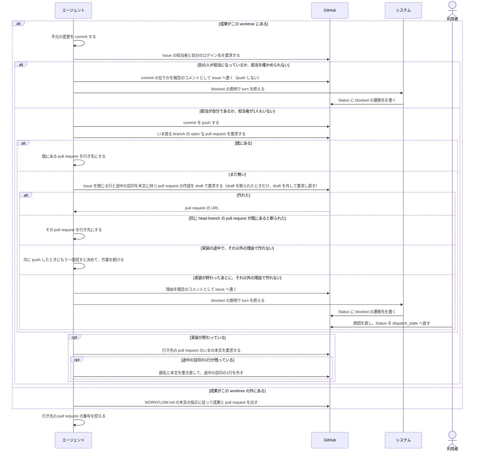
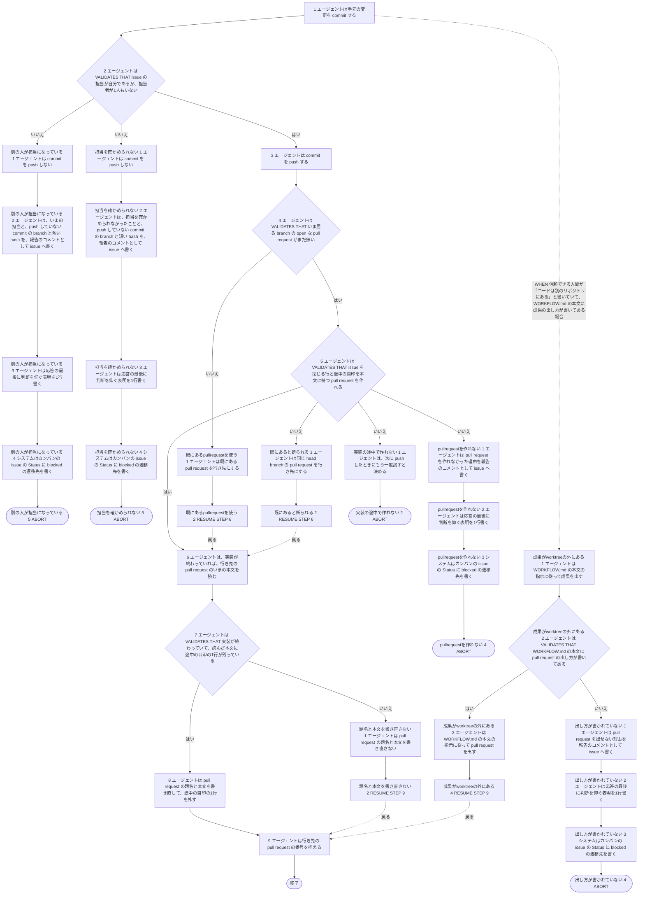

# ユースケース: 成果をpushしてpullrequestを出す

> **この記述からテストコードは作らない。**
> 段を行うのはエージェント（Claude Code）で、指示書の文面を読んで動く。エージェントを起動して段を通す自動テストは、レートリミットを使い、結果も毎回同じにならない。
> 文面に何が書いてあるかは `test/internal/prompt/` の `TestTemplate_…` が確かめている。
> `check_update_tests.py` が出す `[W1]`（テスト未生成パス）は、ここでは想定どおりである。

## 根拠資料

- `internal/prompt/builtin.md` の 3-4（commit して push する）、3-5（pull request を出す）、3-1（担当の確かめ方と、止まり方）、7-3（別のリポジトリへ pull request を出すとき）、7-4（この指示書が決めていないこと）、6-1（命令として扱ってよいもの）
- `docs/plans/continuo_design.md#5-3i`（PR はエージェントが出す）
- `docs/plans/continuo_design.md#5-3t`（コメントと pull request の本文・題名を、シェルに実行させずに渡す）
- `docs/plans/continuo_design.md#5-3w`（エージェント自身に担当を確かめさせ、最初の push で draft の pull request を作らせる）

## この記述は何のためにあるか

**エージェントが `builtin.md` の 3-4 と 3-5 をどう使うかを、記録として残すためである。テストは持たない。**
主体はエージェントであり、Claude Code の中で起きることをテストから観測する手立てが無い（`claude -p` は使用禁止のため）。

`指示書に沿ってissueを1件仕上げる` が、実装の段のあとでこの記述を取り込む。`進捗報告を書く` は、この記述を取り込まずに、同じ手順を自分の段に持つ。

**pull request を作るのは、最初に commit を push した直後である**（`builtin.md` の 3-5。「3-4 の push でも、5-3 の途中の push でも同じです」）。**だからこの記述は、実装の途中の最初の push と、実装を終えたあとの push の、両方で通る。**

| いつ通るか | 通る段 |
| --- | --- |
| 実装の途中の push（`進捗報告を書く` の段7 と段8 が、この記述の段3〜5 に当たる） | 段5 までで pull request を作る。段7 は偽の側（`題名と本文を書き直さない`）を通り、途中の目印は残る |
| 実装を終えたあとの push（`指示書に沿ってissueを1件仕上げる` が、実装の段のあとで取り込む） | 途中で作ってあれば `既にあるpullrequestを使う` を通り、まだ無ければ段5 で作る。どちらも段6 で合流して、途中の目印が残っていれば題名と本文を書き直す |

**`本家のリポジトリへPRを出す` とは別の記述である。**あちらは、fork で作業した成果を本家へ出す場合である。こちらは、continuo が用意した worktree の branch から pull request を出す、どの issue でも通る段である。

## RUCM

```rucm
USE CASE NAME: 成果をpushしてpullrequestを出す
BRIEF DESCRIPTION: エージェントは worktree の変更を commit する。エージェントは issue の担当を確かめる。エージェントは commit を push する。エージェントはいま居る branch の pull request が既にあるかを確かめる。エージェントは無ければ issue を閉じる行と途中の目印を本文に持つ pull request を draft で作る。エージェントは実装が終わっていれば、途中の目印が残っている pull request の題名と本文を書き直す。エージェントは行き先の pull request を控える。
PRECONDITION: エージェントは continuo が用意した worktree と branch で作業している。エージェントは、実装の途中の最初の push か、実装を終えたあとの push をするところである。
PRIMARY ACTOR: エージェント
SECONDARY ACTORS: システム、GitHub、利用者
DEPENDENCY: なし
GENERALIZATION: なし

BASIC FLOW:
1. エージェントは手元の変更を commit する。
2. エージェントは VALIDATES THAT issue の担当が自分であるか、担当者が1人もいない。
3. エージェントは commit を push する。
4. エージェントは VALIDATES THAT いま居る branch の open な pull request がまだ無い。
5. エージェントは VALIDATES THAT issue を閉じる行と途中の目印を本文に持つ pull request を作れる。
6. エージェントは、実装が終わっていれば、行き先の pull request のいまの本文を読む。
7. エージェントは VALIDATES THAT 実装が終わっていて、読んだ本文に途中の目印の1行が残っている。
8. エージェントは pull request の題名と本文を書き直して、途中の目印の1行を外す。
9. エージェントは行き先の pull request の番号を控える。
POSTCONDITION: commit は remote に載っている。行き先の pull request が1本ある。pull request の本文に issue を閉じる行がある。エージェントは実装を終えている。pull request の本文に途中の目印は残っていない。

SPECIFIC ALTERNATIVE FLOW 別の人が担当になっている:
RFS BASIC FLOW 2
1. エージェントは commit を push しない。
2. エージェントは、いまの担当と、push していない commit の branch と短い hash を、報告のコメントとして issue へ書く。
3. エージェントは応答の最後に判断を仰ぐ表明を1行書く。
4. システムはカンバンの issue の Status に blocked の遷移先を書く。
5. ABORT
POSTCONDITION: エージェントは push していない。push していない commit は worktree の branch に在る。エージェントは pull request を作っていない。issue に、いまの担当と commit の在りかの報告のコメントがある。issue の Status は blocked の遷移先である。利用者は報告のコメントで、いまの担当と commit の在りかを読む。

SPECIFIC ALTERNATIVE FLOW 担当を確かめられない:
RFS BASIC FLOW 2
1. エージェントは commit を push しない。
2. エージェントは、担当を確かめられなかったことと、push していない commit の branch と短い hash を、報告のコメントとして issue へ書く。
3. エージェントは応答の最後に判断を仰ぐ表明を1行書く。
4. システムはカンバンの issue の Status に blocked の遷移先を書く。
5. ABORT
POSTCONDITION: エージェントは push していない。push していない commit は worktree の branch に在る。エージェントは pull request を作っていない。issue に、担当を確かめられなかったことと commit の在りかの報告のコメントがある。報告のコメントは「担当が移った」と書いていない。issue の Status は blocked の遷移先である。

SPECIFIC ALTERNATIVE FLOW 既にあるpullrequestを使う:
RFS BASIC FLOW 4
1. エージェントは既にある pull request を行き先にする。
2. RESUME STEP 6
POSTCONDITION: pull request は1本のままである。push した内容は既にある pull request に入っている。

SPECIFIC ALTERNATIVE FLOW 既にあると断られる:
RFS BASIC FLOW 5
1. エージェントは同じ head branch の pull request を行き先にする。
2. RESUME STEP 6
POSTCONDITION: pull request は1本のままである。エージェントは blocked を表明していない。

SPECIFIC ALTERNATIVE FLOW pullrequestを作れない:
RFS BASIC FLOW 5
1. エージェントは pull request を作れなかった理由を報告のコメントとして issue へ書く。
2. エージェントは応答の最後に判断を仰ぐ表明を1行書く。
3. システムはカンバンの issue の Status に blocked の遷移先を書く。
4. ABORT
POSTCONDITION: エージェントは実装を終えている。pull request は出ていない。commit は remote に載っている。issue に理由の報告のコメントがある。issue の Status は blocked の遷移先である。利用者は理由を読む。利用者が原因を直してから Status を dispatch_state の選択肢へ戻すと、次の run が pull request を出し直す。

SPECIFIC ALTERNATIVE FLOW 実装の途中で作れない:
RFS BASIC FLOW 5
1. エージェントは、次に push したときにもう一度試すと決める。
2. ABORT
POSTCONDITION: エージェントは実装の途中である。pull request は出ていない。commit は remote に載っている。エージェントは blocked を表明していない。エージェントは作業を続けている。

SPECIFIC ALTERNATIVE FLOW 題名と本文を書き直さない:
RFS BASIC FLOW 7
1. エージェントは pull request の題名と本文を書き直さない。
2. RESUME STEP 9
POSTCONDITION: pull request の題名と本文は、作ったときか、エージェントが読んだときのままである。実装の途中の場合は、pull request の本文に途中の目印が残っている。実装が終わっている場合は、誰かが本文を書き直していて、pull request の本文に途中の目印は無い。

GLOBAL ALTERNATIVE FLOW 成果がworktreeの外にある:
BRANCH FROM BASIC FLOW 1
WHEN 信頼できる人間が「コードは別のリポジトリにある」と書いていて、WORKFLOW.md の本文に成果の出し方が書いてある場合
1. エージェントは WORKFLOW.md の本文の指示に従って成果を出す。
2. エージェントは VALIDATES THAT WORKFLOW.md の本文に pull request の出し方が書いてある。
3. エージェントは WORKFLOW.md の本文の指示に従って pull request を出す。
4. RESUME STEP 9
POSTCONDITION: 成果は worktree の外に出ている。pull request がある。worktree の branch に commit は無い。

SPECIFIC ALTERNATIVE FLOW 出し方が書かれていない:
RFS 成果がworktreeの外にある 2
1. エージェントは pull request を出せない理由を報告のコメントとして issue へ書く。
2. エージェントは応答の最後に判断を仰ぐ表明を1行書く。
3. システムはカンバンの issue の Status に blocked の遷移先を書く。
4. ABORT
POSTCONDITION: pull request は出ていない。issue に理由の報告のコメントがある。issue の Status は blocked の遷移先である。利用者は WORKFLOW.md の本文に pull request の出し方を書いてから Status を dispatch_state の選択肢へ戻す。
```

## 成果が worktree の外にあると扱ってよい条件

`builtin.md` の 3-4 が決めている。**2つが両方そろっているときだけ**である。片方でも欠けたら、基本フローのとおり commit して push する。

| 順 | 条件 |
| --- | --- |
| 1 | `trusted_comment` が true のコメントか、`trusted_body` が true の issue の本文に、「コードは別のリポジトリにある」と書いてある（6-1） |
| 2 | `WORKFLOW.md` の本文（4-4）に、その成果の出し方が書いてある（7-4） |

## 段の中で決まっていること

どれも、終わり方も通る段も変えない。

| 段 | 決まり |
| --- | --- |
| 段1 | commit するものが無ければ要らない |
| 段2 | `builtin.md` の 3-1 の見本で確かめる。この指示書のどこで push するときも同じである（3-4） |
| 段2 | 「確かめられませんでした」と出たら、もう1回だけ叩く。それでも同じ場合が `担当を確かめられない` である |
| 段2 | 担当者が1人もいない場合は、push する。誰の作業ともぶつからない |
| 段3 | `git push -u origin HEAD`。`-u` を落とさない |
| 段3 | 既定の branch（main / master）へ直に push しない。別の名前へ push してよいのは、2本目の pull request を出すときと、信頼できる人間が「この branch へ出せ」と書いたときだけである（6-3） |
| 段5 | 題名も本文も、ファイルへ書いてから渡す。題名は issue の題名である。本文の1行目に途中の目印 `<!-- continuo:pull-request-in-progress -->` を置き、「作業の途中です」と計画のコメントの URL を書き、`Closes #<issue の番号>` を入れる |
| 段5 | draft で作る。`WORKFLOW.md` の本文に「draft で作らない」と書いてあっても、draft で作る（3-5） |
| 段5 | 別のリポジトリへ出すときは `Closes <owner>/<repo>#<issue の番号>` と書く（7-3） |
| 段5 | base にする branch は、`WORKFLOW.md` の本文に書いてあればそれに従う（7-4） |
| 段5 | 設計のレビューを飛ばす断り（`<!-- design-review-skipped -->`）を、自分で書かない |
| 段7 | 前の試行や、別の機械が作った pull request でも、途中の目印が残っていれば書き直す |
| 段8 | 題名は何を直したか、本文は何をしたかの説明にする。`Closes` で始まる行は、全部そのまま残す。まとめて直した issue の分も入っている（7-2） |
| 段6・段8 | 別のリポジトリへ出したとき（7-3）は、本文を読むコマンドと書き直すコマンドの `--repo` を、出した先のリポジトリに置き換える（3-5） |

**draft のまま人間へ渡すかどうかは、この記述の段ではない。**`WORKFLOW.md` の本文（7-4）が決め、実装のレビューが収まったあとに、取り込む側（`指示書に沿ってissueを1件仕上げる`）の段が draft を外す（3-6）。

**止まる4つの出口は、commit して push する段を持たない。**`別の人が担当になっている` と `担当を確かめられない` は、段1 で commit を済ませていて、push しない（3-4）。`pullrequestを作れない` は、段3 で push を済ませている。`出し方が書かれていない` は、worktree の branch に commit が1つも無い。

## pull request を作れなかったとき

段5 の検証は、次の表で分かれる。`builtin.md` の 3-5 と 7-4 が決めている。

| 場合 | 段5 はどう通るか |
| --- | --- |
| draft を作れないリポジトリだと断られた | 真の側。`--draft` を外して作り、段6 へ進む。`--draft` を外すのは、この場合だけである |
| 「その head branch の pull request は既にある」と断られた | 偽の側。`既にあると断られる`。`blocked` を出さない |
| 実装の途中で、差分が無いなど、上の2つ以外の理由で作れなかった | 偽の側。`実装の途中で作れない`。止まらずに作業を続け、次に push したときにもう一度試す |
| 実装が終わったあとに、上の2つ以外の理由で作れなかった | 偽の側。`pullrequestを作れない`。理由を書いて `blocked` を出す（7-4） |

**draft を断られた場合は、代替フローにしていない。**`--draft` を外して作れば pull request が出来て、終わり方も、そのあと通る段も変わらない。代替フローにすると、段6 より後ろの経路がもう1組増える。

**`実装の途中で作れない` の `ABORT` は、この記述がここで終わることを表す。**run は終わらず、エージェントは `blocked` を表明しない。実装を終えたあとの push では通らないので、取り込む側（`指示書に沿ってissueを1件仕上げる`）の検証の段には掛からない。

## 相互作用



## フローチャート


