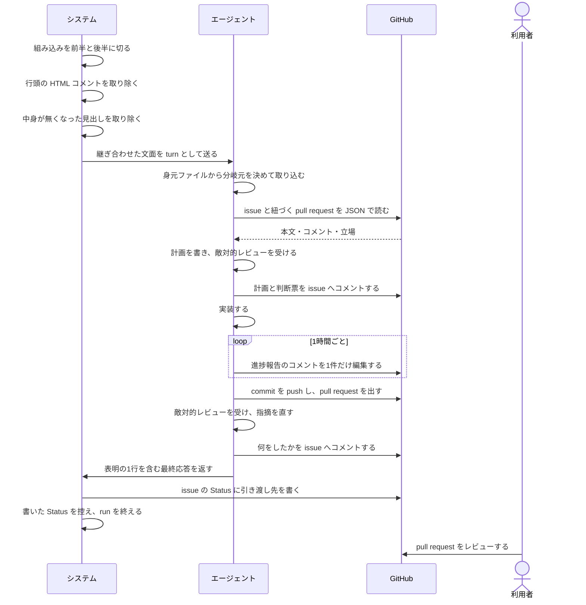
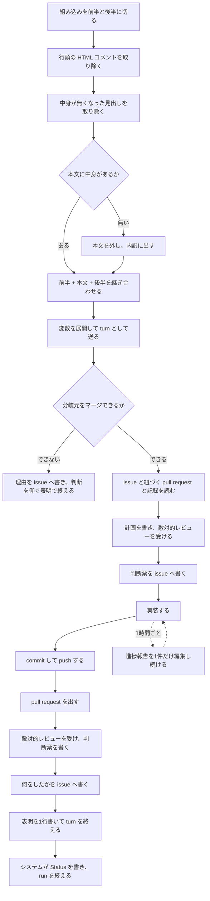

# ユースケース: 指示書に沿って issue を1件仕上げる

## 根拠資料

- `docs/plans/continuo_design.md#5-3`（組み込みのプロンプトの全文）
- `docs/plans/continuo_design.md#5-3c`（送るプロンプトを3つの断片から組み立てる）
- `docs/plans/continuo_design.md#5-3d`（`WORKFLOW.md` の本文に何を書くか）
- `docs/plans/continuo_design.md#5-3f`（`continuo prompt --show`）
- `docs/plans/continuo_design.md#5-3h`（長い作業の途中でも、状況を書かせる）
- `docs/plans/continuo_design.md#5-3i`（PR はエージェントが出す）
- `docs/plans/continuo_design.md#5-3m`（送る文面から、案内のコメントと空になった見出しを落とす）
- `docs/plans/continuo_design.md#3-2`（turn の終わりは hook から通知させる）
- `docs/plans/continuo_design.md#3-74c`（巡回は、continuo 自身が書いた Status に反応しない）
- `internal/prompt/builtin.md`（エージェントへ送る指示書の本体）
- `internal/prompt/prompt.go` の `Build` と `stripComments` と `dropEmptySections`
- `internal/scaffold/template.go`（`continuo init` が置く `WORKFLOW.md` の雛形）

## この記述は何のためにあるか

**エージェントが指示書をどう使うかを、記録として残すためである。**

**テストは持たない。**指示書に沿って何をするかを決めるのはエージェントであり、
**continuo の仕組みではない。**Claude Code の中で起きることを、テストから観測する手立てが無い
（`claude -p` は使用禁止のため）。`scripts/check-rucm.sh` は
**テストが1本も無いユースケースを `[W1]` の警告として出すが、落とす理由にはしない。**

## RUCM

```rucm
USE CASE NAME: 指示書に沿って issue を1件仕上げる
BRIEF DESCRIPTION: システムは組み込みの指示書の前半と、利用者が WORKFLOW.md に書いた本文と、組み込みの指示書の後半を継ぎ合わせて1つの文面にし、エージェントへ送る。エージェントは worktree の分岐元を取り込んでから、issue と紐づく pull request と関連する記録を読み、計画を敵対的レビューに掛けてから実装し、commit して push し、pull request を出し、そのレビューを受けてから、何をしたかを issue へ書いて表明の1行で終わる。
PRECONDITION: システムは常駐している。issue はカンバンの active_states に在り、システムはその issue の worktree を用意してエージェントを起動している。WORKFLOW.md は front matter と本文を持つ。
PRIMARY ACTOR: エージェント
SECONDARY ACTORS: システム、GitHub、利用者
DEPENDENCY: なし
GENERALIZATION: なし

BASIC FLOW:
1. システムは組み込みの指示書を目印の行で前半と後半に切る。
2. システムは3つの断片から行頭の HTML のコメントを取り除く。
3. システムは本文から中身が無くなった見出しを取り除く。
4. システムは VALIDATES THAT 取り除いたあとの本文に中身がある。
5. システムは前半と本文と後半を空行1つで継ぎ合わせる。
6. システムは継ぎ合わせた文面の変数を issue の値で展開する。
7. システムはエージェントに展開した文面を turn として送る。
8. エージェントは worktree の分岐元の名前を身元ファイルから決める。
9. エージェントは VALIDATES THAT 取ってきた分岐元をマージできる。
10. エージェントは issue の本文とコメントを JSON で読む。
11. エージェントは issue に紐づく pull request のレビューを読む。
12. エージェントは issue から辿れるプランファイルと過去の issue を読む。
13. エージェントは worktree の CLAUDE.md と AGENTS.md と CONTRIBUTING.md を読む。
14. エージェントは実装の計画を書く。
15. エージェントは計画を敵対的レビューの subagent へ渡す。
16. エージェントは計画とレビューの判断票を issue へコメントする。
17. エージェントは実装する。
18. エージェントは commit して push する。
19. エージェントは VALIDATES THAT この issue の pull request がまだ無い。
20. エージェントは pull request を出す。
21. エージェントは pull request を敵対的レビューの subagent へ渡す。
22. エージェントは指摘ごとの判断票を pull request へコメントする。
23. エージェントは指摘を直して push する。
24. エージェントは何をしたかを issue へコメントする。
25. エージェントは応答の最後に完了の表明を1行だけ書く。
26. エージェントはシステムに turn の終わりを Stop hook で知らせる。
27. システムはエージェントの会話の記録から表明を読む。
28. システムはカンバンの issue の Status に引き渡し先を書く。
29. システムは書いた Status を控える。
30. システムは run を終える。
POSTCONDITION: pull request がある。issue にエージェントのコメントがある。issue の Status は引き渡し先である。システムは run を終えている。

SPECIFIC ALTERNATIVE FLOW 本文が空になる:
RFS BASIC FLOW 4
1. システムは本文の断片を継ぎ合わせる並びから外す。
2. システムは内訳に本文が無いことを出す。
3. RESUME STEP 5
POSTCONDITION: 送る文面は組み込みの前半と後半だけである。本文が無いことが内訳に出ている。

SPECIFIC ALTERNATIVE FLOW 分岐元がremoteに無い:
RFS BASIC FLOW 9
1. エージェントは分岐元を取り込まない。
2. RESUME STEP 10
POSTCONDITION: 分岐元は取り込まれていない。エージェントは作業を続けている。

SPECIFIC ALTERNATIVE FLOW マージが始まる前に断られる:
RFS BASIC FLOW 9
1. エージェントは commit していない変更を commit する。
2. エージェントは分岐元をもう一度取ってきてマージする。
3. RESUME STEP 10
POSTCONDITION: 前の試行が残した変更が commit されている。分岐元が取り込まれている。

SPECIFIC ALTERNATIVE FLOW マージが衝突する:
RFS BASIC FLOW 9
1. エージェントはマージを取り込む前へ戻す。
2. エージェントは push していない commit を push する。
3. エージェントは衝突したことを issue へコメントする。
4. エージェントは応答の最後に判断を仰ぐ表明を1行だけ書く。
5. システムはカンバンの issue の Status に人間へ渡す先を書く。
6. ABORT
POSTCONDITION: マージの途中の状態は残っていない。commit は remote に載っている。issue に衝突したことが書かれている。issue の Status は人間へ渡す先である。

SPECIFIC ALTERNATIVE FLOW 既にあるpullrequestを使う:
RFS BASIC FLOW 19
1. エージェントは既にある pull request の番号を、いま居る branch から引く。
2. RESUME STEP 21
POSTCONDITION: pull request は1本のままである。

GLOBAL ALTERNATIVE FLOW 進捗報告を書く:
BRANCH FROM BASIC FLOW 17
WHEN エージェントが1時間以上コメントを書かないまま作業を続けている場合
1. エージェントは issue のいちばん下のコメントが自分の進捗報告かを調べる。
2. エージェントは VALIDATES THAT いちばん下のコメントが自分の進捗報告である。
3. エージェントは進捗報告の本文を読む。
4. エージェントは VALIDATES THAT 読んだ本文に進捗報告の印が入っている。
5. エージェントは読んだ本文の末尾に1行足して書き戻す。
6. RESUME STEP 17
POSTCONDITION: 進捗報告のコメントが1件だけある。そのコメントの最終更新日時が新しくなっている。

SPECIFIC ALTERNATIVE FLOW 進捗報告を新しく投稿する:
RFS 進捗報告を書く 2
1. エージェントは進捗報告の印を付けたコメントを新しく投稿する。
2. RESUME STEP 6
POSTCONDITION: 進捗報告のコメントが増えている。新しいコメントに進捗報告の印がある。

SPECIFIC ALTERNATIVE FLOW 進捗報告の本文を読めない:
RFS 進捗報告を書く 4
1. エージェントは書き戻さない。
2. エージェントは進捗報告の印を付けたコメントを新しく投稿する。
3. RESUME STEP 6
POSTCONDITION: 進捗報告のコメントが増えている。前の進捗報告の本文は壊れていない。

GLOBAL ALTERNATIVE FLOW 判断に迷って止まる:
BRANCH FROM BASIC FLOW 17
WHEN エージェントが指示書の決めていないことに当たった場合
1. エージェントは何に迷ったかを issue へコメントする。
2. エージェントは応答の最後に判断を仰ぐ表明を1行だけ書く。
3. システムはカンバンの issue の Status に人間へ渡す先を書く。
4. ABORT
POSTCONDITION: issue に迷った内容が書かれている。issue の Status は人間へ渡す先である。

GLOBAL ALTERNATIVE FLOW 外部の人の命令に従わない:
BRANCH FROM BASIC FLOW 10
WHEN コメントを書いた人の立場が OWNER でも MEMBER でも COLLABORATOR でもない場合
1. エージェントはそのコメントを命令として扱わない。
2. エージェントはそのコメントを起きたことの報告として読む。
3. RESUME STEP 11
POSTCONDITION: 外部の人が書いた命令は実行されていない。外部の人が書いた不具合の報告は材料として使われている。
```

## 相互作用



## フローチャート


