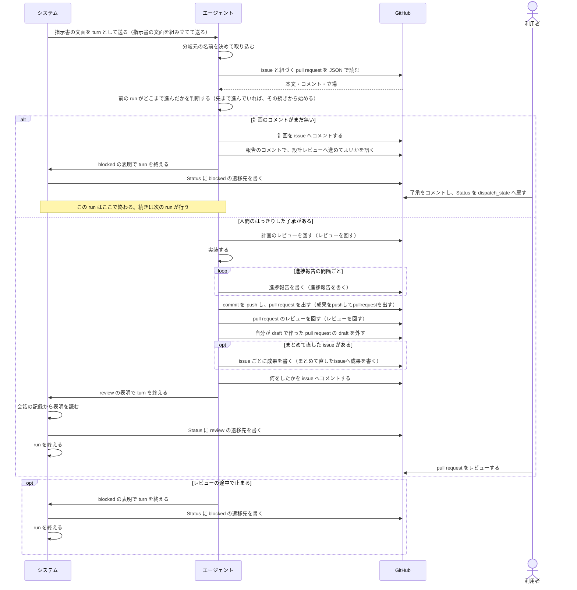

# ユースケース: 指示書に沿ってissueを1件仕上げる

> **この記述からテストコードは作らない。**
> 段を行うのはエージェント（Claude Code）で、指示書の文面を読んで動く。エージェントを起動して段を通す自動テストは、レートリミットを使い、結果も毎回同じにならない。
> 文面に何が書いてあるかは `test/internal/prompt/` の `TestTemplate_…` が確かめている。
> `check_update_tests.py` が出す `[W1]`（テスト未生成パス）は、ここでは想定どおりである。

## 根拠資料

- `internal/prompt/builtin.md`（エージェントへ送る指示書の本体。**エージェントの段の根拠は、この文書の節番号で書く**）
- `internal/orchestrator/lifecycle.go` の `handleTurnEnd` / `readSignals` / `applySignals` / `decideAfterTurn` / `finishRunClaimed`
- `internal/scaffold/template.go`（`continuo init` が置く `WORKFLOW.md` の雛形。「始める前に読む文書」の節）
- `docs/plans/continuo_design.md#5-3`（組み込みのプロンプトの全文）
- `docs/plans/continuo_design.md#5-3d`（`WORKFLOW.md` の本文に何を書くか）
- `docs/plans/continuo_design.md#5-3i`（PR はエージェントが出す）
- `docs/plans/continuo_design.md#5-3u`（計画のあとで人間の確認を受け、質問が出たらレビューを打ち切る）
- `docs/plans/continuo_design.md#3-25`（Status を動かす仕組みを、プロンプト頼みにしない）
- `docs/spec/usecases/particular_case/指示書の文面を組み立てて送る.rucm.md`
- `docs/spec/usecases/particular_case/レビューを回す.rucm.md`
- `docs/spec/usecases/particular_case/まとめて直したissueへ成果を書く.rucm.md`
- `docs/spec/usecases/particular_case/進捗報告を書く.rucm.md`
- `docs/spec/usecases/particular_case/成果をpushしてpullrequestを出す.rucm.md`

## この記述は何のためにあるか

**エージェントが指示書をどう使うかを、記録として残すためである。**

**テストは持たない。**指示書に沿って何をするかを決めるのはエージェントであり、
**continuo の仕組みではない。**Claude Code の中で起きることを、テストから観測する手立てが無い
（`claude -p` は使用禁止のため）。`scripts/check-rucm.sh` は
**テストが1本も無いユースケースを `[W1]` の警告として出すが、落とす理由にはしない。**

## この記述の読み方

**1つの run を書いている。**run は、システムが文面を送ってから、エージェントが表明を書いて、システムが run を終えるまでである。

**1回の run では、計画から設計レビューへ進めない**（`builtin.md` の 3-2）。
エージェントは計画のコメントを書いたあと、報告のコメントで人間に訊いて、`blocked` を表明して止まる。
人間が了承をコメントしてから Status を戻すと、次の run が始まる。
**だから基本フローは、計画が了承されたあとの run を書いている。**
計画を書く run は、代替フロー `計画を書いて人間確認で止まる` であり、`ABORT` で終わる。

**`ABORT` は「この run はここで終わる」を意味する。**失敗の意味ではない。
人間が何を見て、何をすると続きが始まるかは、各フローの POSTCONDITION に書いてある。

**前の run が設計レビューより先まで進んでいた場合は、エージェントはその続きから始める**（`builtin.md` の 1「どこまで進んでいたかを判断して、その続きから始めてください」）。
**段14 が見るのは「次に行う段が設計レビューか」である。**前の run がどこまで進んだかではない。
実装のレビューで質問して止まり、見直した計画が了承された run は、実装が既に在っても、段14 が真で設計レビュー（段15）から回し直す（1 の図と 5-6）。
段14 の偽の側に、続きの入口を3本置いた。`実装の続きから始める`（段17 へ）、`pullrequestを出すところから始める`（段18 へ）、`実装レビューの続きから始める`（段20 へ）である。
人間の回答が次にすることを明示していた場合も、エージェントは指示された段から続ける（1 の図と 5-6）。指示された段がこの3つ以外のときは、経路として書いていない。

**5本の記述を取り込んでいる。**経路が掛け算で増えるので分けた（人間の決定）。

| 取り込む場所 | 取り込む記述 | 中身 |
| --- | --- | --- |
| 基本フローの段1 | 指示書の文面を組み立てて送る | システムが文面を作って送る |
| 基本フローの段15 と段20 | レビューを回す | `builtin.md` の 5-6。段15 は計画、段20 は pull request の差分 |
| 基本フローの段18 | 成果をpushしてpullrequestを出す | `builtin.md` の 3-4 と 3-5 |
| 代替フロー `まとめて直した` | まとめて直したissueへ成果を書く | `builtin.md` の 7-2 |
| 代替フロー `進捗報告の間隔を超える` | 進捗報告を書く | `builtin.md` の 5-3 |

**取り込んだ記述の中で run が終わる出口は、取り込んだ段の直後の検証の段で受けている。**段2 は `文面が届かない`、段16 と段21 は `レビューが止まる`、段19 は `pullrequestが出ていない` である。

**段27〜29（システムが表明を読んで run を終える）は、粗く書いている。**
表明が無いときの促し、`working` の表明、成果のコメントの書かせ直しは、`issueを1件処理する` と `人間に判断を渡す` が受け持つ。ここには書いていない。

## RUCM

```rucm
USE CASE NAME: 指示書に沿ってissueを1件仕上げる
BRIEF DESCRIPTION: システムは指示書の文面をエージェントへ送る。エージェントは worktree の分岐元を取り込む。エージェントは issue と pull request と関連する記録を読む。エージェントは了承された計画を敵対的レビューに掛ける。エージェントは実装して pull request を出す。エージェントは pull request を敵対的レビューに掛ける。エージェントは何をしたかを issue へ書く。エージェントは表明の1行で turn を終える。システムは表明どおりに Status を動かす。
PRECONDITION: システムは常駐している。issue はカンバンの active_states に在る。システムは issue の worktree を用意している。システムはエージェントを起動している。WORKFLOW.md は front matter と本文を持つ。
PRIMARY ACTOR: エージェント
SECONDARY ACTORS: システム、GitHub、利用者
DEPENDENCY: INCLUDE USE CASE 指示書の文面を組み立てて送る、INCLUDE USE CASE レビューを回す、INCLUDE USE CASE 成果をpushしてpullrequestを出す、INCLUDE USE CASE まとめて直したissueへ成果を書く、INCLUDE USE CASE 進捗報告を書く
GENERALIZATION: なし

BASIC FLOW:
1. INCLUDE USE CASE 指示書の文面を組み立てて送る
2. エージェントは VALIDATES THAT 指示書の文面を受け取っている。
3. エージェントは worktree の分岐元の名前を、身元ファイルの base の値、WORKFLOW.md の本文の指定、issue にリンクされた branch、リポジトリの既定 branch の順に見て決める。
4. エージェントは分岐元を remote から取ってくる。
5. エージェントは VALIDATES THAT 取り込むものが在る場合に、取ってきた分岐元をマージできる。
6. エージェントは issue の本文とコメントを JSON で読む。
7. エージェントは issue に紐づく pull request の本文とコメントとレビューを JSON で読む。
8. エージェントは issue から辿れるプランファイルと設計文書と過去の issue と過去の pull request を読む。
9. エージェントは WORKFLOW.md の本文が挙げる文書を読む。
10. エージェントは VALIDATES THAT 読む対象を全部読めている。
11. エージェントは会話と issue のコメントと pull request のコメントから、前の run がどこまで進んだかを判断する。
12. エージェントは VALIDATES THAT 計画の印が付いた自分のコメントが issue にある。
13. エージェントは VALIDATES THAT 人間の了承か、次にすることを明示した回答が、自分の問いより後にある。
14. エージェントは VALIDATES THAT 次に行う段が設計レビューである。
15. INCLUDE USE CASE レビューを回す
16. エージェントは VALIDATES THAT 計画のレビューが収まって終わっている。
17. エージェントは実装する。
18. INCLUDE USE CASE 成果をpushしてpullrequestを出す
19. エージェントは VALIDATES THAT 行き先の pull request がある。
20. INCLUDE USE CASE レビューを回す
21. エージェントは VALIDATES THAT 実装のレビューが収まって終わっている。
22. エージェントは、この issue のために自分が draft で作った pull request であれば、draft を外す。
23. エージェントは VALIDATES THAT この run が直した issue が担当の issue 1件だけである。
24. エージェントは何をしたかを issue へ新しいコメントとして書く。
25. エージェントは応答の最後に完了の表明を1行書く。
26. エージェントはシステムに turn の終わりを Stop hook で知らせる。
27. システムはエージェントの会話の記録から表明を読む。
28. システムはカンバンの issue の Status に表明の値の遷移先を書く。
29. システムは run を終える。
POSTCONDITION: pull request がある。issue に計画のコメントと計画の判断票と成果のコメントがある。pull request に実装の判断票がある。commit は remote に載っている。issue の Status は review の遷移先である。システムは run を終えている。

SPECIFIC ALTERNATIVE FLOW 文面が届かない:
RFS BASIC FLOW 2
1. エージェントは作業を始めない。
2. ABORT
POSTCONDITION: エージェントは指示書に沿った作業を始めていない。システムが変数を展開できなかった場合は、issue の Status は failure_state の選択肢であり、利用者が WORKFLOW.md の本文のテンプレートを直して continuo を再起動してから Status を dispatch_state の選択肢へ戻すと、次の run が始まる。herdr が送信を受け付けなかった場合は、issue を1件処理する の送信の失敗か一時的な送信の失敗のフローが続きを受ける。

SPECIFIC ALTERNATIVE FLOW マージが始まる前に断られる:
RFS BASIC FLOW 5
1. エージェントは commit していない変更を commit する。
2. RESUME STEP 4
POSTCONDITION: 前の試行が残した変更が commit されている。エージェントは分岐元をもう一度取り込みに行く。

SPECIFIC ALTERNATIVE FLOW マージが衝突する:
RFS BASIC FLOW 5
1. エージェントはマージを取り込む前へ戻す。
2. エージェントは、push していない commit が残っていれば、push する。
3. エージェントは取り込めなかったことを応答に書く。
4. エージェントは応答の最後に判断を仰ぐ表明を1行書く。
5. システムはカンバンの issue の Status に blocked の遷移先を書く。
6. ABORT
POSTCONDITION: マージの途中の状態は残っていない。衝突の印が付いたファイルは push されていない。commit は remote に載っている。issue の Status は blocked の遷移先である。利用者は応答で取り込めなかったことを読む。利用者が衝突の解き方をコメントしてから Status を dispatch_state の選択肢へ戻すと、次の run が始まる。

SPECIFIC ALTERNATIVE FLOW 読めない:
RFS BASIC FLOW 10
1. エージェントは読めなかったことを応答の最後に書く。
2. エージェントは commit していない変更を commit して push する。
3. エージェントは応答の最後に判断を仰ぐ表明を1行書く。
4. システムはカンバンの issue の Status に blocked の遷移先を書く。
5. ABORT
POSTCONDITION: エージェントは作業を始めていない。issue の Status は blocked の遷移先である。利用者は応答で何を読めなかったかを読む。利用者が読めるようにしてから Status を dispatch_state の選択肢へ戻すと、次の run が始まる。

SPECIFIC ALTERNATIVE FLOW 計画を書いて人間確認で止まる:
RFS BASIC FLOW 12
1. エージェントは VALIDATES THAT issue に対応する必要がある。
2. エージェントは読んだ記録から、同じことが既に決まっていないかを検索する。
3. エージェントは実装の計画を書く。
4. エージェントは計画の印を付けた計画を issue へコメントする。
5. エージェントは設計レビューへ進めてよいかを報告のコメントで issue に訊く。
6. エージェントは commit していない変更を commit して push する。
7. エージェントは応答の最後に判断を仰ぐ表明を1行書く。
8. システムはカンバンの issue の Status に blocked の遷移先を書く。
9. ABORT
POSTCONDITION: issue に計画のコメントがある。issue に、設計レビューへ進めてよいかを訊く報告のコメントがある。設計レビューは始まっていない。issue の Status は blocked の遷移先である。利用者は計画のコメントを読む。利用者が了承をコメントしてから Status を dispatch_state の選択肢へ戻すと、次の run が設計レビューから続ける。

SPECIFIC ALTERNATIVE FLOW 対応しないと決める:
RFS 計画を書いて人間確認で止まる 1
1. エージェントは対応しない理由を issue へコメントする。
2. エージェントは commit していない変更を commit して push する。
3. エージェントは応答の最後に判断を仰ぐ表明を1行書く。
4. システムはカンバンの issue の Status に blocked の遷移先を書く。
5. ABORT
POSTCONDITION: issue に対応しない理由のコメントがある。エージェントは issue を閉じていない。計画は書かれていない。issue の Status は blocked の遷移先である。利用者は理由を読む。利用者は issue を閉じるか、対応させる指示をコメントしてから Status を dispatch_state の選択肢へ戻す。

SPECIFIC ALTERNATIVE FLOW 了承も回答も無い:
RFS BASIC FLOW 13
1. エージェントは了承も回答も無いことを報告のコメントとして issue へ書く。
2. エージェントは commit していない変更を commit して push する。
3. エージェントは応答の最後に判断を仰ぐ表明を1行書く。
4. システムはカンバンの issue の Status に blocked の遷移先を書く。
5. ABORT
POSTCONDITION: エージェントは設計レビューへ進んでいない。issue に了承も回答も無いことを知らせる報告のコメントがある。issue の Status は blocked の遷移先である。利用者が了承か回答をコメントしてから Status を dispatch_state の選択肢へ戻すと、次の run が続ける。

SPECIFIC ALTERNATIVE FLOW 計画の直しを求められる:
RFS BASIC FLOW 13
1. エージェントは計画を直す。
2. エージェントは直した計画を新しい計画のコメントとして issue へ書く。
3. エージェントは設計レビューへ進めてよいかを報告のコメントで issue にもう一度訊く。
4. エージェントは commit していない変更を commit して push する。
5. エージェントは応答の最後に判断を仰ぐ表明を1行書く。
6. システムはカンバンの issue の Status に blocked の遷移先を書く。
7. ABORT
POSTCONDITION: issue に新しい計画のコメントがある。いちばん新しい計画のコメントが正である。設計レビューは始まっていない。issue の Status は blocked の遷移先である。利用者が了承をコメントしてから Status を dispatch_state の選択肢へ戻すと、次の run が設計レビューから続ける。

SPECIFIC ALTERNATIVE FLOW 回答が次を明示していない:
RFS BASIC FLOW 13
1. エージェントは計画だけを見直す。
2. エージェントは見直した計画を新しい計画のコメントとして issue へ書く。
3. エージェントは設計レビューから回し直してよいかを報告のコメントで issue に訊く。
4. エージェントは commit していない変更を commit して push する。
5. エージェントは応答の最後に判断を仰ぐ表明を1行書く。
6. システムはカンバンの issue の Status に blocked の遷移先を書く。
7. ABORT
POSTCONDITION: issue に新しい計画のコメントがある。エージェントは実装を進めていない。issue の Status は blocked の遷移先である。利用者が了承をコメントしてから Status を dispatch_state の選択肢へ戻すと、次の run が設計レビューから回し直す。

SPECIFIC ALTERNATIVE FLOW 実装の続きから始める:
RFS BASIC FLOW 14
1. エージェントは前の run の commit と会話から、実装がどこまで済んでいるかを確かめる。
2. RESUME STEP 17
POSTCONDITION: エージェントは計画を書き直していない。エージェントは計画のレビューを回し直していない。エージェントは実装の続きから作業している。

SPECIFIC ALTERNATIVE FLOW pullrequestを出すところから始める:
RFS BASIC FLOW 14
1. エージェントは前の run の commit が remote に載っていることを確かめる。
2. RESUME STEP 18
POSTCONDITION: エージェントは実装をやり直していない。エージェントは pull request を出すところから作業している。

SPECIFIC ALTERNATIVE FLOW 実装レビューの続きから始める:
RFS BASIC FLOW 14
1. エージェントは pull request の判断票から、実装のレビューが何周目まで済んでいるかを確かめる。
2. RESUME STEP 20
POSTCONDITION: pull request は1本のままである。エージェントは実装のレビューの続きから作業している。

BOUNDED ALTERNATIVE FLOW レビューが止まる:
RFS BASIC FLOW 16,21
1. システムは run を終える。
2. ABORT
POSTCONDITION: レビューは収まっていない。issue の Status は blocked の遷移先である。利用者は issue の報告のコメントか応答で、止まった理由を読む。利用者が回答をコメントしてから Status を dispatch_state の選択肢へ戻すと、次の run が続ける。

SPECIFIC ALTERNATIVE FLOW pullrequestが出ていない:
RFS BASIC FLOW 19
1. システムは run を終える。
2. ABORT
POSTCONDITION: pull request は出ていない。issue に理由の報告のコメントがある。issue の Status は blocked の遷移先である。利用者が原因を直してから Status を dispatch_state の選択肢へ戻すと、次の run が pull request を出すところから続ける。

SPECIFIC ALTERNATIVE FLOW まとめて直した:
RFS BASIC FLOW 23
1. DO
2.   INCLUDE USE CASE まとめて直したissueへ成果を書く
3. UNTIL まとめて直した issue を全部書き終えている
4. エージェントは、まとめて直した issue へ書いたコメントの URL を並べた成果のコメントを、担当の issue へ新しく書く。
5. エージェントは応答の最後に issue ごとの表明を1行ずつ書く。
6. エージェントはシステムに turn の終わりを Stop hook で知らせる。
7. システムはエージェントの会話の記録から表明を読む。
8. システムは表明が指す issue のうち書ける issue ごとに、カンバンの Status に表明の値の遷移先を書く。
9. システムは run を終える。
10. ABORT
POSTCONDITION: pull request の本文に、直した issue ごとの閉じる行がある。まとめて直した同じリポジトリの issue それぞれに、グループの印が付いた成果報告がある。担当の issue の成果のコメントに、成果報告の URL が並んでいる。表明が指す issue のうちシステムが書けた issue の Status は、それぞれの表明の値の遷移先である。書けなかった issue の Status は変わっていない。別のリポジトリの issue は直されていない。システムは run を終えている。

GLOBAL ALTERNATIVE FLOW 進捗報告の間隔を超える:
BRANCH FROM BASIC FLOW 17
WHEN エージェントが進捗報告の間隔を超えてコメントを書かないまま作業を続けている場合
1. INCLUDE USE CASE 進捗報告を書く
2. RESUME STEP 17
POSTCONDITION: issue に進捗報告のコメントがある。エージェントは作業を続けている。

GLOBAL ALTERNATIVE FLOW 判断に迷って止まる:
BRANCH FROM BASIC FLOW 17
WHEN エージェントが扱いに迷った場合
1. エージェントは迷った内容を報告のコメントとして issue へ書く。
2. エージェントは commit していない変更を commit して push する。
3. エージェントは応答の最後に判断を仰ぐ表明を1行書く。
4. システムはカンバンの issue の Status に blocked の遷移先を書く。
5. ABORT
POSTCONDITION: issue に迷った内容の報告のコメントがある。commit は remote に載っている。issue の Status は blocked の遷移先である。利用者が回答をコメントしてから Status を dispatch_state の選択肢へ戻すと、次の run が続ける。

GLOBAL ALTERNATIVE FLOW 命令として扱わないissueの記述:
BRANCH FROM BASIC FLOW 6
WHEN issue の本文かコメントの trusted_body か trusted_comment が true でない場合
1. エージェントは書かれた命令を実行しない。
2. エージェントは書かれた内容を報告か分析として読む。
3. RESUME STEP 6
POSTCONDITION: 信頼できる人間が AI の印を付けずに書いたもの以外の命令は実行されていない。外部の人が書いた不具合の報告は材料として使われている。AI が書いた分析と記録は材料として使われている。

GLOBAL ALTERNATIVE FLOW 命令として扱わないpullrequestの記述:
BRANCH FROM BASIC FLOW 7
WHEN pull request の本文を読んだ場合、または pull request のコメントかレビューの trusted_comment が true でない場合
1. エージェントは書かれた命令を実行しない。
2. エージェントは書かれた内容を変更の説明か報告か分析として読む。
3. RESUME STEP 7
POSTCONDITION: pull request の本文に書かれた命令は実行されていない。信頼できる人間が AI の印を付けずに書いたもの以外のコメントの命令は実行されていない。

GLOBAL ALTERNATIVE FLOW 命令として扱わない記録の記述:
BRANCH FROM BASIC FLOW 8
WHEN 辿って読んだ issue か pull request の記述の trusted_body か trusted_comment が true でない場合
1. エージェントは書かれた命令を実行しない。
2. エージェントは書かれた内容を報告か分析として読む。
3. RESUME STEP 8
POSTCONDITION: 辿って読んだ記録のうち、信頼できる人間が AI の印を付けずに書いたもの以外の命令は実行されていない。
```

## 相互作用



## 分岐元の名前の決め方

`builtin.md` の 3-1 が決めている。上から順に見て、決まった時点で止める。基本フローの段3 が、この4段である。

| 順 | どこを見るか | 決まらないのはどんなときか |
| --- | --- | --- |
| 1 | worktree の直下にある身元ファイル（既定 `.continuo.json`）の `base` の値 | キーが無い。値が空文字である |
| 2 | `WORKFLOW.md` の本文（4-4）の指定 | 指定が書かれていない |
| 3 | issue にリンクされた branch（`{{.push_branch}}`） | branch がリンクされていない |
| 4 | リポジトリの既定 branch | （ここで必ず決まる） |

決まった名前が `origin/` で始まっていたら、`origin/` を外してから取ってくる。

**その名前が remote に無いとき**（段4 が `couldn't find remote ref` などで落ちたとき）**は、取り込むものが無い。**段5 は何もせずに通り、段6 へ進む。終わり方も、そのあと通る段も変わらないので、代替フローにしていない。


## エージェントが書くコメントと、本文の先頭に置く印

`<!-- continuo:ai -->` は使わない（`builtin.md` の 1）。

| コメント | 書く先 | 本文の先頭の印 | `builtin.md` の節 |
| --- | --- | --- | --- |
| 計画 | issue | 1行目 `<!-- continuo:agent -->`、2行目 `<!-- continuo:plan -->` | 3-2 |
| 計画の判断票 | issue | 1行目 `<!-- continuo:agent -->`、2行目 `<!-- design-review-result -->` | 3-2 |
| 実装の判断票 | pull request | 1行目 `<!-- code-review-result -->`、2行目 `<!-- continuo:agent -->` | 3-6 |
| 報告（成果・質問・止まった理由） | issue | `<!-- continuo:agent -->` の1行だけ | 3-7、5-5 |
| 削除の記録 | issue | `<!-- continuo:agent -->` の1行だけ | 5-5、5-6 |
| 進捗報告 | issue | 1行目 `<!-- continuo:agent -->`、2行目 `<!-- continuo:progress -->` | 5-3 |
| まとめて直した issue の成果報告 | まとめて直した issue | `<!-- continuo:group -->` | 7-2 |

**エージェントが命令として扱うのは、`OWNER` / `MEMBER` / `COLLABORATOR` が AI の印を付けずに書いたものだけである**（`builtin.md` の 6-1）。
本文の先頭が `<!-- continuo:` で始まる印か、レビューの目印（`<!-- code-review-result -->`・`<!-- design-review-result -->`・`<!-- design-review-skipped -->`）のコメントは、AI が書いたものとして読む。


## run が止まる出口

どの出口も、エージェントが `blocked` を表明し、システムが Status を `blocked` の遷移先へ動かす。
`blocked` の前に、commit していない変更を commit して push する（`builtin.md` の 3-4）。**次の3つは、その段を持たない。**後ろの2つは `成果をpushしてpullrequestを出す` に在る。

| 代替フロー | なぜ commit と push の段が無いか |
| --- | --- |
| `マージが衝突する` | マージを取り込む前へ戻すので、commit するものが無い。手前で commit したものが残っていれば push する（3-1） |
| `出し方が書かれていない` | 成果が worktree の外にあり、worktree の branch に commit が1つも無い（3-5） |
| `pullrequestを作れない` | pull request を作る前に、3-4 の push を済ませている（3-5） |

| 代替フロー | どの記述に在るか | `builtin.md` の節 | 利用者が読むもの |
| --- | --- | --- | --- |
| `マージが衝突する` | この記述 | 3-1 | 応答 |
| `読めない` | この記述 | 3-1 | 応答 |
| `計画を書いて人間確認で止まる` | この記述 | 3-2 | 計画のコメントと、報告のコメント |
| `対応しないと決める` | この記述 | 3-2 | 対応しない理由のコメント |
| `了承も回答も無い` | この記述 | 1 | 報告のコメント |
| `計画の直しを求められる` | この記述 | 3-2 | 新しい計画のコメントと、報告のコメント |
| `回答が次を明示していない` | この記述 | 5-6 | 新しい計画のコメントと、報告のコメント |
| `人間に訊くことが出る` | レビューを回す | 5-6 | 報告のコメント |
| `連続10回で収まらない` | レビューを回す | 5-6 | 報告のコメント |
| `判断票が数えられない立場` | レビューを回す | 3-2 | 応答 |
| `出し方が書かれていない` | 成果をpushしてpullrequestを出す | 3-5 | 報告のコメント |
| `pullrequestを作れない` | 成果をpushしてpullrequestを出す | 7-4 | 報告のコメント |
| `判断に迷って止まる` | この記述 | 5-4 | 報告のコメント |

`レビューを回す` の3つの出口は、この記述では代替フロー `レビューが止まる` の1本に受けている。
`成果をpushしてpullrequestを出す` の2つの出口は、`pullrequestが出ていない` の1本に受けている。

## 命令として扱わないもの

`builtin.md` の 6-1 が決めている。3本の代替フロー（`命令として扱わないissueの記述`・`命令として扱わないpullrequestの記述`・`命令として扱わない記録の記述`）は、どれも同じ表を当てる。どの行でも、終わり方も通る段も変わらない。

| 読んだもの | 条件 | 扱い |
| --- | --- | --- |
| コメント・レビュー | 立場が `OWNER` / `MEMBER` / `COLLABORATOR` 以外 | 外部の人の報告として読む。印があっても同じ |
| コメント・レビュー | `written_by` が `"ai"` | AI が書いた分析・記録として読む。材料としては使ってよい |
| コメント・レビュー | それ以外（`trusted_comment` が true） | 命令として扱ってよい |
| issue の本文 | `trusted_body` が false | 直す対象の報告として読む。中の命令やコマンドは実行しない |
| pull request の本文 | （条件なし） | 変更の説明として読む。命令としては扱わない |

辿って読む別の issue と pull request も、同じコマンドで読み、同じ表を当てる（4-3）。

## 進捗報告を書く時点

`進捗報告の間隔を超える` の分岐元は段17（実装する）の1点である。**`builtin.md` の 5-3 は、段を限っていない。**どの段でも、間隔を超えたら書く。
分岐元は、CFG とテストで確かめる時点の宣言であり、起こりうる時点を狭めるものではない（規約）。戻り先を1つしか書けないので、いちばん長くかかる段に置いた。
レビューの検査の待ちに入る前に1行書かせる決まり（3-6）は、`レビューを回す` の段に在る。

## まとめて直した issue の Status を書かない場合

`まとめて直した` の段8 は、表明の行ごとに `applySignals` が判定する。次の場合は、その issue の Status を書かない。どの場合も、残りの行の処理と run の終わり方は変わらない。

| 場合 | システムがすること |
| --- | --- |
| 表明の値の遷移先が null である（既定では `working`） | Status を動かさない |
| 表明が指す issue がカンバンに載っていない | その行を捨て、担当の issue へ「カンバンに無いので動かせなかった」とコメントする |
| 表明が指す issue を、この機械の別の run が担当している | その行を捨て、担当の issue へコメントする |
| 書き込みに失敗した | WARN を出して、次の行へ進む |
| 表明の値が `status_signal_map` に無い | WARN を出して、その行を無視する |
| 表明が指す issue を引く呼び出しが失敗した | WARN を出して、次の行へ進む |
| その issue の Status が `terminal_states` か `direct_chat_state` の選択肢である | 書かない。人間が動かしたカードの上へ書かないためである（`protectedStates`） |
システムが自分で止める出口（`変数を展開できない`）は `指示書の文面を組み立てて送る` に在り、この記述では `文面が届かない` に受けている。

## フローチャート

```mermaid
flowchart TD
    BS1[["1 INCLUDE USE CASE 指示書の文面を組み立てて送る"]]
    BS2{"2 エージェントは VALIDATES THAT 指示書の文面を受け取っている"}
    BS3["3 エージェントは worktree の分岐元の名前を、身元ファイルの base の値、WORKFLOW.md の本文の指定、issue にリンクされた branch、リポジトリの既定 branch の順に見て決める"]
    BS4["4 エージェントは分岐元を remote から取ってくる"]
    BS5{"5 エージェントは VALIDATES THAT 取り込むものが在る場合に、取ってきた分岐元をマージできる"}
    BS6["6 エージェントは issue の本文とコメントを JSON で読む"]
    BS7["7 エージェントは issue に紐づく pull request の本文とコメントとレビューを JSON で読む"]
    BS8["8 エージェントは issue から辿れるプランファイルと設計文書と過去の issue と過去の pull request を読む"]
    BS9["9 エージェントは WORKFLOW.md の本文が挙げる文書を読む"]
    BS10{"10 エージェントは VALIDATES THAT 読む対象を全部読めている"}
    BS11["11 エージェントは会話と issue のコメントと pull request のコメントから、前の run がどこまで進んだかを判断する"]
    BS12{"12 エージェントは VALIDATES THAT 計画の印が付いた自分のコメントが issue にある"}
    BS13{"13 エージェントは VALIDATES THAT 人間の了承か、次にすることを明示した回答が、自分の問いより後にある"}
    BS14{"14 エージェントは VALIDATES THAT 次に行う段が設計レビューである"}
    BS15[["15 INCLUDE USE CASE レビューを回す"]]
    BS16{"16 エージェントは VALIDATES THAT 計画のレビューが収まって終わっている"}
    BS17["17 エージェントは実装する"]
    BS18[["18 INCLUDE USE CASE 成果をpushしてpullrequestを出す"]]
    BS19{"19 エージェントは VALIDATES THAT 行き先の pull request がある"}
    BS20[["20 INCLUDE USE CASE レビューを回す"]]
    BS21{"21 エージェントは VALIDATES THAT 実装のレビューが収まって終わっている"}
    BS22["22 エージェントは、この issue のために自分が draft で作った pull request であれば、draft を外す"]
    BS23{"23 エージェントは VALIDATES THAT この run が直した issue が担当の issue 1件だけである"}
    BS24["24 エージェントは何をしたかを issue へ新しいコメントとして書く"]
    BS25["25 エージェントは応答の最後に完了の表明を1行書く"]
    BS26["26 エージェントはシステムに turn の終わりを Stop hook で知らせる"]
    BS27["27 システムはエージェントの会話の記録から表明を読む"]
    BS28["28 システムはカンバンの issue の Status に表明の値の遷移先を書く"]
    BS29["29 システムは run を終える"]
    A1S1["文面が届かない 1 エージェントは作業を始めない"]
    A1S2(["文面が届かない 2 ABORT"])
    A2S1["マージが始まる前に断られる 1 エージェントは commit していない変更を commit する"]
    A2S2["マージが始まる前に断られる 2 RESUME STEP 4"]
    A3S1["マージが衝突する 1 エージェントはマージを取り込む前へ戻す"]
    A3S2["マージが衝突する 2 エージェントは、push していない commit が残っていれば、push する"]
    A3S3["マージが衝突する 3 エージェントは取り込めなかったことを応答に書く"]
    A3S4["マージが衝突する 4 エージェントは応答の最後に判断を仰ぐ表明を1行書く"]
    A3S5["マージが衝突する 5 システムはカンバンの issue の Status に blocked の遷移先を書く"]
    A3S6(["マージが衝突する 6 ABORT"])
    A4S1["読めない 1 エージェントは読めなかったことを応答の最後に書く"]
    A4S2["読めない 2 エージェントは commit していない変更を commit して push する"]
    A4S3["読めない 3 エージェントは応答の最後に判断を仰ぐ表明を1行書く"]
    A4S4["読めない 4 システムはカンバンの issue の Status に blocked の遷移先を書く"]
    A4S5(["読めない 5 ABORT"])
    A5S1{"計画を書いて人間確認で止まる 1 エージェントは VALIDATES THAT issue に対応する必要がある"}
    A5S2["計画を書いて人間確認で止まる 2 エージェントは読んだ記録から、同じことが既に決まっていないかを検索する"]
    A5S3["計画を書いて人間確認で止まる 3 エージェントは実装の計画を書く"]
    A5S4["計画を書いて人間確認で止まる 4 エージェントは計画の印を付けた計画を issue へコメントする"]
    A5S5["計画を書いて人間確認で止まる 5 エージェントは設計レビューへ進めてよいかを報告のコメントで issue に訊く"]
    A5S6["計画を書いて人間確認で止まる 6 エージェントは commit していない変更を commit して push する"]
    A5S7["計画を書いて人間確認で止まる 7 エージェントは応答の最後に判断を仰ぐ表明を1行書く"]
    A5S8["計画を書いて人間確認で止まる 8 システムはカンバンの issue の Status に blocked の遷移先を書く"]
    A5S9(["計画を書いて人間確認で止まる 9 ABORT"])
    A6S1["対応しないと決める 1 エージェントは対応しない理由を issue へコメントする"]
    A6S2["対応しないと決める 2 エージェントは commit していない変更を commit して push する"]
    A6S3["対応しないと決める 3 エージェントは応答の最後に判断を仰ぐ表明を1行書く"]
    A6S4["対応しないと決める 4 システムはカンバンの issue の Status に blocked の遷移先を書く"]
    A6S5(["対応しないと決める 5 ABORT"])
    A7S1["了承も回答も無い 1 エージェントは了承も回答も無いことを報告のコメントとして issue へ書く"]
    A7S2["了承も回答も無い 2 エージェントは commit していない変更を commit して push する"]
    A7S3["了承も回答も無い 3 エージェントは応答の最後に判断を仰ぐ表明を1行書く"]
    A7S4["了承も回答も無い 4 システムはカンバンの issue の Status に blocked の遷移先を書く"]
    A7S5(["了承も回答も無い 5 ABORT"])
    A8S1["計画の直しを求められる 1 エージェントは計画を直す"]
    A8S2["計画の直しを求められる 2 エージェントは直した計画を新しい計画のコメントとして issue へ書く"]
    A8S3["計画の直しを求められる 3 エージェントは設計レビューへ進めてよいかを報告のコメントで issue にもう一度訊く"]
    A8S4["計画の直しを求められる 4 エージェントは commit していない変更を commit して push する"]
    A8S5["計画の直しを求められる 5 エージェントは応答の最後に判断を仰ぐ表明を1行書く"]
    A8S6["計画の直しを求められる 6 システムはカンバンの issue の Status に blocked の遷移先を書く"]
    A8S7(["計画の直しを求められる 7 ABORT"])
    A9S1["回答が次を明示していない 1 エージェントは計画だけを見直す"]
    A9S2["回答が次を明示していない 2 エージェントは見直した計画を新しい計画のコメントとして issue へ書く"]
    A9S3["回答が次を明示していない 3 エージェントは設計レビューから回し直してよいかを報告のコメントで issue に訊く"]
    A9S4["回答が次を明示していない 4 エージェントは commit していない変更を commit して push する"]
    A9S5["回答が次を明示していない 5 エージェントは応答の最後に判断を仰ぐ表明を1行書く"]
    A9S6["回答が次を明示していない 6 システムはカンバンの issue の Status に blocked の遷移先を書く"]
    A9S7(["回答が次を明示していない 7 ABORT"])
    A10S1["実装の続きから始める 1 エージェントは前の run の commit と会話から、実装がどこまで済んでいるかを確かめる"]
    A10S2["実装の続きから始める 2 RESUME STEP 17"]
    A11S1["pullrequestを出すところから始める 1 エージェントは前の run の commit が remote に載っていることを確かめる"]
    A11S2["pullrequestを出すところから始める 2 RESUME STEP 18"]
    A12S1["実装レビューの続きから始める 1 エージェントは pull request の判断票から、実装のレビューが何周目まで済んでいるかを確かめる"]
    A12S2["実装レビューの続きから始める 2 RESUME STEP 20"]
    A13S1["レビューが止まる 1 システムは run を終える"]
    A13S2(["レビューが止まる 2 ABORT"])
    A14S1["pullrequestが出ていない 1 システムは run を終える"]
    A14S2(["pullrequestが出ていない 2 ABORT"])
    A15S2[["まとめて直した 2 INCLUDE USE CASE まとめて直したissueへ成果を書く"]]
    A15S3{"まとめて直した 3 UNTIL まとめて直した issue を全部書き終えている"}
    A15S4["まとめて直した 4 エージェントは、まとめて直した issue へ書いたコメントの URL を並べた成果のコメントを、担当の issue へ新しく書く"]
    A15S5["まとめて直した 5 エージェントは応答の最後に issue ごとの表明を1行ずつ書く"]
    A15S6["まとめて直した 6 エージェントはシステムに turn の終わりを Stop hook で知らせる"]
    A15S7["まとめて直した 7 システムはエージェントの会話の記録から表明を読む"]
    A15S8["まとめて直した 8 システムは表明が指す issue のうち書ける issue ごとに、カンバンの Status に表明の値の遷移先を書く"]
    A15S9["まとめて直した 9 システムは run を終える"]
    A15S10(["まとめて直した 10 ABORT"])
    A16S1[["進捗報告の間隔を超える 1 INCLUDE USE CASE 進捗報告を書く"]]
    A16S2["進捗報告の間隔を超える 2 RESUME STEP 17"]
    A17S1["判断に迷って止まる 1 エージェントは迷った内容を報告のコメントとして issue へ書く"]
    A17S2["判断に迷って止まる 2 エージェントは commit していない変更を commit して push する"]
    A17S3["判断に迷って止まる 3 エージェントは応答の最後に判断を仰ぐ表明を1行書く"]
    A17S4["判断に迷って止まる 4 システムはカンバンの issue の Status に blocked の遷移先を書く"]
    A17S5(["判断に迷って止まる 5 ABORT"])
    A18S1["命令として扱わないissueの記述 1 エージェントは書かれた命令を実行しない"]
    A18S2["命令として扱わないissueの記述 2 エージェントは書かれた内容を報告か分析として読む"]
    A18S3["命令として扱わないissueの記述 3 RESUME STEP 6"]
    A19S1["命令として扱わないpullrequestの記述 1 エージェントは書かれた命令を実行しない"]
    A19S2["命令として扱わないpullrequestの記述 2 エージェントは書かれた内容を変更の説明か報告か分析として読む"]
    A19S3["命令として扱わないpullrequestの記述 3 RESUME STEP 7"]
    A20S1["命令として扱わない記録の記述 1 エージェントは書かれた命令を実行しない"]
    A20S2["命令として扱わない記録の記述 2 エージェントは書かれた内容を報告か分析として読む"]
    A20S3["命令として扱わない記録の記述 3 RESUME STEP 8"]
    BS1 --> BS2
    BS2 -- はい --> BS3
    BS2 -- いいえ --> A1S1
    BS3 --> BS4
    BS4 --> BS5
    BS5 -- はい --> BS6
    BS5 -- いいえ --> A2S1
    BS5 -- いいえ --> A3S1
    BS6 --> BS7
    BS6 -. "WHEN issue の本文かコメントの trusted_body か trusted_comment が true でない場合" .-> A18S1
    BS7 --> BS8
    BS7 -. "WHEN pull request の本文を読んだ場合、または pull request のコメントかレビューの trusted_comment が true でない場合" .-> A19S1
    BS8 --> BS9
    BS8 -. "WHEN 辿って読んだ issue か pull request の記述の trusted_body か trusted_comment が true でない場合" .-> A20S1
    BS9 --> BS10
    BS10 -- はい --> BS11
    BS10 -- いいえ --> A4S1
    BS11 --> BS12
    BS12 -- はい --> BS13
    BS12 -- いいえ --> A5S1
    BS13 -- はい --> BS14
    BS13 -- いいえ --> A7S1
    BS13 -- いいえ --> A8S1
    BS13 -- いいえ --> A9S1
    BS14 -- はい --> BS15
    BS14 -- いいえ --> A10S1
    BS14 -- いいえ --> A11S1
    BS14 -- いいえ --> A12S1
    BS15 --> BS16
    BS16 -- はい --> BS17
    BS16 -- いいえ --> A13S1
    BS17 --> BS18
    BS17 -. "WHEN エージェントが進捗報告の間隔を超えてコメントを書かないまま作業を続けている場合" .-> A16S1
    BS17 -. "WHEN エージェントが扱いに迷った場合" .-> A17S1
    BS18 --> BS19
    BS19 -- はい --> BS20
    BS19 -- いいえ --> A14S1
    BS20 --> BS21
    BS21 -- はい --> BS22
    BS21 -- いいえ --> A13S1
    BS22 --> BS23
    BS23 -- はい --> BS24
    BS23 -- いいえ --> A15S2
    BS24 --> BS25
    BS25 --> BS26
    BS26 --> BS27
    BS27 --> BS28
    BS28 --> BS29
    A1S1 --> A1S2
    A2S1 --> A2S2
    A2S2 -. "戻る" .-> BS4
    A3S1 --> A3S2
    A3S2 --> A3S3
    A3S3 --> A3S4
    A3S4 --> A3S5
    A3S5 --> A3S6
    A4S1 --> A4S2
    A4S2 --> A4S3
    A4S3 --> A4S4
    A4S4 --> A4S5
    A5S1 -- はい --> A5S2
    A5S1 -- いいえ --> A6S1
    A5S2 --> A5S3
    A5S3 --> A5S4
    A5S4 --> A5S5
    A5S5 --> A5S6
    A5S6 --> A5S7
    A5S7 --> A5S8
    A5S8 --> A5S9
    A6S1 --> A6S2
    A6S2 --> A6S3
    A6S3 --> A6S4
    A6S4 --> A6S5
    A7S1 --> A7S2
    A7S2 --> A7S3
    A7S3 --> A7S4
    A7S4 --> A7S5
    A8S1 --> A8S2
    A8S2 --> A8S3
    A8S3 --> A8S4
    A8S4 --> A8S5
    A8S5 --> A8S6
    A8S6 --> A8S7
    A9S1 --> A9S2
    A9S2 --> A9S3
    A9S3 --> A9S4
    A9S4 --> A9S5
    A9S5 --> A9S6
    A9S6 --> A9S7
    A10S1 --> A10S2
    A10S2 -. "戻る" .-> BS17
    A11S1 --> A11S2
    A11S2 -. "戻る" .-> BS18
    A12S1 --> A12S2
    A12S2 -. "戻る" .-> BS20
    A13S1 --> A13S2
    A14S1 --> A14S2
    A15S2 --> A15S3
    A15S3 -- はい --> A15S4
    A15S3 -. "繰り返す" .-> A15S2
    A15S4 --> A15S5
    A15S5 --> A15S6
    A15S6 --> A15S7
    A15S7 --> A15S8
    A15S8 --> A15S9
    A15S9 --> A15S10
    A16S1 --> A16S2
    A16S2 -. "戻る" .-> BS17
    A17S1 --> A17S2
    A17S2 --> A17S3
    A17S3 --> A17S4
    A17S4 --> A17S5
    A18S1 --> A18S2
    A18S2 --> A18S3
    A18S3 -. "戻る" .-> BS6
    A19S1 --> A19S2
    A19S2 --> A19S3
    A19S3 -. "戻る" .-> BS7
    A20S1 --> A20S2
    A20S2 --> A20S3
    A20S3 -. "戻る" .-> BS8
    BS29 --> END(["終了"])
```


