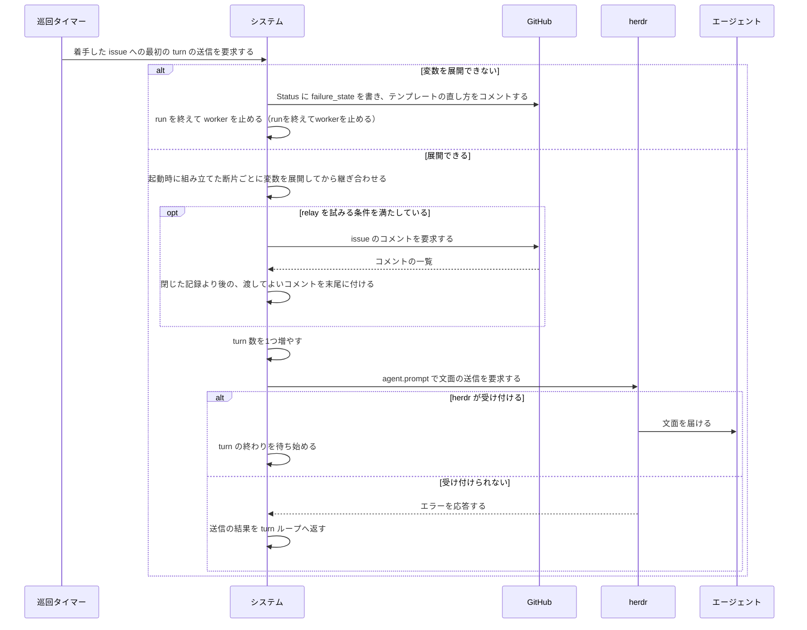
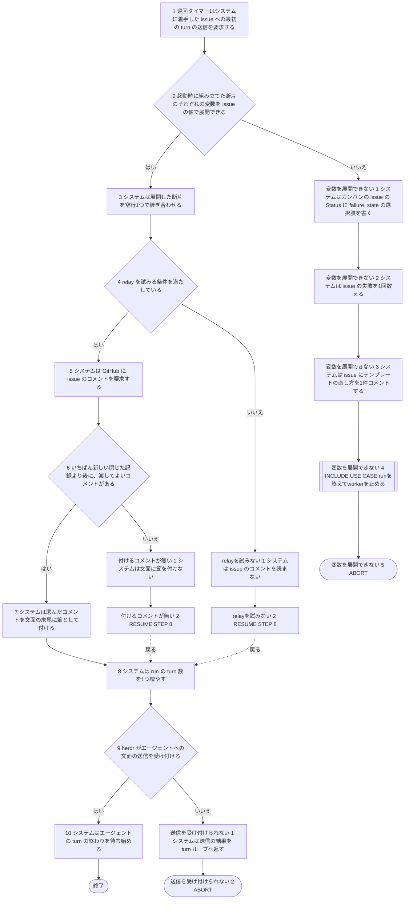

# ユースケース: 指示書の文面を組み立てて送る

## 根拠資料

- `internal/prompt/prompt.go` の `splitBuiltin` / `stripComments` / `dropEmptySections` / `Build` / `Fragments.add` / `Fragments.RenderItems` / `Fragments.RenderAll` / `join` / `RenderData`
- `internal/daemon/daemon.go` の `buildPrompt`（起動時に断片を組み立てる）
- `internal/orchestrator/prompt.go` の `renderFirstPrompt`
- `internal/orchestrator/turn.go` の `turnLoop` / `buildTurnText` / `sendTurn`
- `internal/orchestrator/relay.go` の `relayEnabled` / `relaySectionFor` / `selectRelayComments` / `buildRelaySection`
- `internal/orchestrator/lifecycle.go` の `failRun`
- `internal/orchestrator/comment.go` の `ensureAgentComment`
- `docs/spec/usecases/particular_case/runを終えてworkerを止める.rucm.md`
- `internal/orchestrator/reload.go` の `promptBodyChanged`（本文は読み直しでは効かない）
- `docs/plans/continuo_design.md#5-3c`（送るプロンプトを3つの断片から組み立てる）
- `docs/plans/continuo_design.md#5-3m`（本文から取り除くもの）
- `docs/plans/continuo_design.md#3-85`（人間が issue のコメントで出した許可を、最初のメッセージに付けて渡す）

## この記述の範囲

**1回目の本文を送る場面だけを書いている。**着手と、再着手の最初の turn である（`buildTurnText` の `SendFirstPrompt` が真のとき）。
2回目以降の turn は継続の指示だけを送る（`BuildContinuationPrompt`）。そちらはこの記述に入っていない。

**段は、送信のたびに行うことだけである。**断片を組み立てるのは起動時の1回で、送信のときには走らない。だから PRECONDITION に置いた。

`指示書に沿ってissueを1件仕上げる` が、この記述を最初の段で取り込む。

**turn 数が上限に達している run は、この記述に入らない。**`turnLoop` は文面を組み立てるより前に、turn 数が `agent.max_dispatch_turns` に達しているかを見て、達していれば Status を `failure_state` へ落として run を終える。バックオフ明けの再着手は turn 数を引き継ぐので、1回目の本文を送る run でも起こりうる。その扱いは `issueを1件処理する` の `上限での打ち切り` が持つ。

**`変数を展開できない` の後始末は、`runを終えてworkerを止める` を取り込んで受けている。**`failRun` は、この run が書いたコメントが無ければ、pane を閉じてセッションを復元し、書かせにいく（`ensureAgentComment`）。バックオフ明けの再着手は、前の試行で turn を送っているので起こりうる。その枝は取り込んだ先に在る。`issueを1件処理する` の `本文の組み立ての失敗` と同じ形である。

## 起動時に組み立ててある断片

送信のときに使う断片は、continuo の起動時に `buildPrompt` が `Build` で組み立てたものである。

| 順 | 何をするか | いつ | どの関数か |
| --- | --- | --- | --- |
| 1 | 組み込みの指示書を、目印の行で前半と後半に切る | パッケージの初期化で1回 | `splitBuiltin` |
| 2 | 3つの断片から、行頭の HTML のコメントを取り除く | 起動時 | `stripComments` |
| 3 | 本文から、中身が無くなった見出しを取り除く | 起動時 | `dropEmptySections` |
| 4 | 取り除いたあとの本文が空白だけなら、本文の断片を並びに入れない | 起動時 | `Fragments.add` |
| 5 | 作り物の issue で変数を展開できるかを確かめる。できなければ起動を止める | 起動時 | `Fragments.Validate` |

**本文が空でも、終わり方も、送信のときに通る段も変わらない。**送る文面が、組み込みの前半と後半だけになる。
**`WORKFLOW.md` の本文を直しても、動いている continuo には効かない。**設定の読み直しは「本文が変わりました」と、効かない項目として知らせるだけである。効かせるには再起動が要る。

## RUCM

```rucm
USE CASE NAME: 指示書の文面を組み立てて送る
BRIEF DESCRIPTION: システムは起動時に組み立てた3つの断片の変数を issue の値で展開する。システムは展開した断片を継ぎ合わせる。システムは relay を試みる条件を満たしていれば信頼できる人間のコメントを文面の末尾に付ける。システムは文面をエージェントへ turn として送る。
PRECONDITION: システムは常駐している。システムは起動時に、組み込みの指示書の前半と WORKFLOW.md の本文と組み込みの指示書の後半から断片を組み立てている。システムは issue の worktree を用意している。システムはエージェントを起動している。run は1回目の本文を送る印を持っている。run の turn 数は agent.max_dispatch_turns に達していない。
PRIMARY ACTOR: 巡回タイマー
SECONDARY ACTORS: エージェント、GitHub、herdr
DEPENDENCY: INCLUDE USE CASE runを終えてworkerを止める
GENERALIZATION: なし

BASIC FLOW:
1. 巡回タイマーはシステムに着手した issue への最初の turn の送信を要求する。
2. システムは VALIDATES THAT 起動時に組み立てた断片のそれぞれの変数を issue の値で展開できる。
3. システムは展開した断片を空行1つで継ぎ合わせる。
4. システムは VALIDATES THAT relay を試みる条件を満たしている。
5. システムは GitHub に issue のコメントを要求する。
6. システムは VALIDATES THAT いちばん新しい閉じた記録より後に、渡してよいコメントがある。
7. システムは選んだコメントを文面の末尾に節として付ける。
8. システムは run の turn 数を1つ増やす。
9. システムは VALIDATES THAT herdr がエージェントへの文面の送信を受け付ける。
10. システムはエージェントの turn の終わりを待ち始める。
POSTCONDITION: herdr は文面の送信を受け付けている。システムは turn の終わりを待っている。文面は起動時に組み立てた断片の順である。文面の末尾に信頼できる人間のコメントの節がある。run の turn 数は1つ増えている。

SPECIFIC ALTERNATIVE FLOW 変数を展開できない:
RFS BASIC FLOW 2
1. システムはカンバンの issue の Status に failure_state の選択肢を書く。
2. システムは issue の失敗を1回数える。
3. システムは issue にテンプレートの直し方を1件コメントする。
4. INCLUDE USE CASE runを終えてworkerを止める
5. ABORT
POSTCONDITION: 文面はエージェントに届いていない。run の turn 数は増えていない。issue の Status は failure_state の選択肢である。issue に WORKFLOW.md の本文のテンプレートを直す案内のコメントがある。印は外れている。worktree は残っている。pane とコメントの後始末は、runを終えてworkerを止める の終わり方のとおりである。利用者はテンプレートを直す。本文の変更は continuo の再起動のあとで効く。利用者が continuo を再起動してから Status を dispatch_state の選択肢へ戻すと、次の run が始まる。

SPECIFIC ALTERNATIVE FLOW relayを試みない:
RFS BASIC FLOW 4
1. システムは issue のコメントを読まない。
2. RESUME STEP 8
POSTCONDITION: 文面の末尾に人間のコメントの節は無い。システムは GitHub に issue のコメントを要求していない。

SPECIFIC ALTERNATIVE FLOW 付けるコメントが無い:
RFS BASIC FLOW 6
1. システムは文面に節を付けない。
2. RESUME STEP 8
POSTCONDITION: 文面の末尾に人間のコメントの節は無い。システムは run を失敗にしていない。

SPECIFIC ALTERNATIVE FLOW 送信を受け付けられない:
RFS BASIC FLOW 9
1. システムは送信の結果を turn ループへ返す。
2. ABORT
POSTCONDITION: run の turn 数は1つ増えている。この記述はここで終わる。続きは issueを1件処理する の代替フローが受ける。herdr が送信を断った場合は、送信の失敗のフローが受ける。herdr の呼び出しが一時的な理由で失敗した場合は、一時的な送信の失敗のフローが受ける。
```

## relay を試みる条件

段4 の条件は、次の4つが全部そろっていることである。1つでも欠けたら `relayを試みない` へ進む。

| 条件 | どこで見るか |
| --- | --- |
| `claude.permission_mode` が `auto` である | `relayEnabled` |
| `agent.relay_trusted_comments` が真である | `relayEnabled` |
| `tracker.comments.self_marker` が空でない | `relayEnabled` |
| issue が draft issue ではない（ノード ID がある） | `relaySectionFor` |

## 渡してよいコメント

段6 の「渡してよいコメント」は、`selectRelayComments` が決める。

| 何 | 中身 |
| --- | --- |
| 境目 | **信頼できる立場が書いた**閉じた記録（1行目が `<!-- continuo:closed -->`）のうち、作成時刻がいちばん新しいもの |
| 渡すもの | 境目より後に作られ、信頼できる立場が書き、AI の印が無く、隠されていないコメント |
| 信頼できる立場 | `OWNER` / `MEMBER` / `COLLABORATOR` |
| 節の長さ | 節の全体を `relayMaxRunes`（30000 rune）で切る。新しいものから入れ、入らなかった件数を1行で書く |

## relay が節を付けない場合

`付けるコメントが無い` は、次のどれでも同じ結末になる（`relaySectionFor`）。どれもエラーにしない。エラーで返すと `turnLoop` が `failRun` へ落とすためである。

| 場合 | ログ |
| --- | --- |
| issue のコメントを読めない | WARN |
| 待ちが切れて読めなかった（停止・worker を止めた・direct chat へ入った） | 出さない |
| 閉じた記録がまだ無い | DEBUG |
| コメントが多すぎて、境目より後を読み切れたか分からない | WARN |
| 閉じた記録より後にエージェントの報告があり、前の回が閉じられたことを確かめられない | WARN |
| 選んだあとに待ちが切れていた | 出さない |
| 条件に合うコメントが0件 | 出さない |

**relay を試みたあと、システムは送る前の確認をもう一度通す**（`turnLoop`）。そこで送らずに抜ける場合は、`issueを1件処理する` の側の関心事であり、この記述には書いていない。
**この節は `continuo prompt --show` には出ない。**送る直前に issue のコメントから組み立てるためである。

## 送ったあとの結果を受けるフロー

段9 は `sendTurn` の送信までである。`sendTurn` は送る前に turn 数を増やすので、送れなくても turn 数は増えている。

| `sendTurn` が返すもの | 何が起きたか | 受けるのは |
| --- | --- | --- |
| `turnSendFailed` | herdr が送信を断った | `issueを1件処理する` の `送信の失敗` |
| `turnTransient` | herdr の呼び出しが一時的な理由で失敗した | `issueを1件処理する` の `一時的な送信の失敗` |
| `turnAborted` | continuo が止められた、または自分で worker を止めた | 何もしない。次の起動か、止めた経路が引き継ぐ |
| `turnBlocked` | 送信は受け付けられ、待ち受けが `blocked` を返した | `issueを1件処理する` の `権限の確認`。送ったあとのことなので、この記述の範囲の外である |

## 相互作用



## フローチャート


