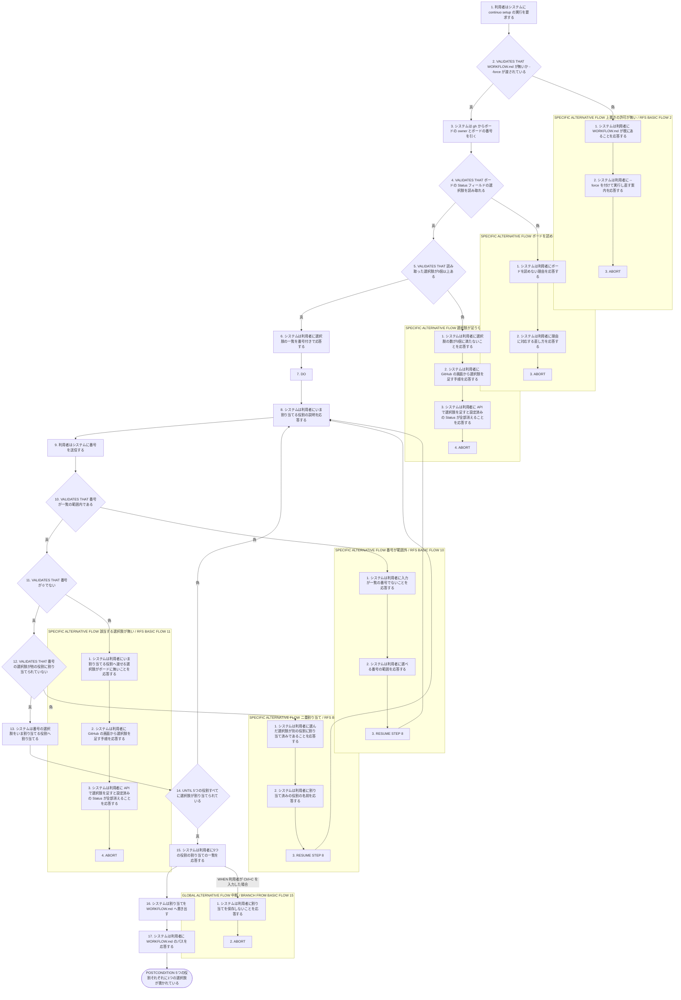
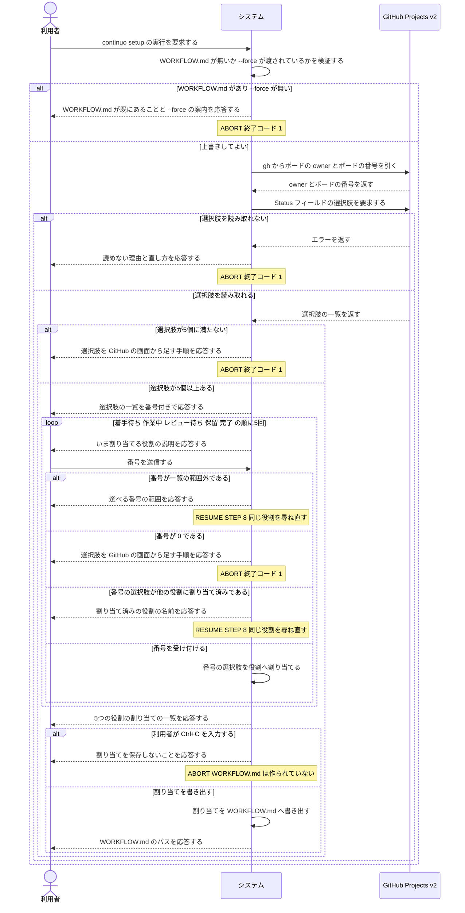

# ユースケース: 既存のボードの Status を割り当てる

## 根拠資料

- docs/plans/continuo_design.md#3-32
- docs/plans/continuo_design.md#3-34
- docs/plans/continuo_design.md#3-4
- docs/plans/continuo_design.md#3-6
- docs/plans/continuo_design.md#3-9
- docs/plans/continuo_design.md#3-31
- docs/plans/continuo_design.md#4-1
- docs/plans/continuo_design.md#5-1
- docs/plans/continuo_design.md#5-2
- docs/trying_it_out.md
- internal/scaffold/scaffold.go
- internal/scaffold/detect.go
- internal/scaffold/template.go
- internal/doctor/checks.go
- CLAUDE.md

## RUCM

```rucm
USE CASE NAME: 既存のボードの Status を割り当てる
BRIEF DESCRIPTION: 利用者が continuo setup を実行する。システムはボードの Status フィールドの選択肢を番号付きで並べる。システムは continuo の5つの役割を1つずつ説明して選択肢を選ばせる。システムは決まった割り当てを WORKFLOW.md へ書く。
PRECONDITION: 利用者は gh auth login -s project を実行済みである。利用者は GitHub Projects v2 のボードを1枚持っている。ボードは single-select の Status フィールドを持つ。
PRIMARY ACTOR: 利用者
SECONDARY ACTORS: GitHub Projects v2
DEPENDENCY: なし
GENERALIZATION: なし

BASIC FLOW:
1. 利用者はシステムに continuo setup の実行を要求する。
2. システムは VALIDATES THAT WORKFLOW.md が無いか --force が渡されている。
3. システムは gh からボードの owner とボードの番号を引く。
4. システムは VALIDATES THAT ボードの Status フィールドの選択肢を読み取れる。
5. システムは VALIDATES THAT 読み取った選択肢が5個以上ある。
6. システムは利用者に選択肢の一覧を番号付きで応答する。
7. DO
8.   システムは利用者にいま割り当てる役割の説明を応答する。
9.   利用者はシステムに番号を送信する。
10.   システムは VALIDATES THAT 番号が一覧の範囲内である。
11.   システムは VALIDATES THAT 番号が 0 でない。
12.   システムは VALIDATES THAT 番号の選択肢が他の役割に割り当てられていない。
13.   システムは番号の選択肢をいま割り当てる役割へ割り当てる。
14. UNTIL 5つの役割すべてに選択肢が割り当てられている
15. システムは利用者に5つの役割の割り当ての一覧を応答する。
16. システムは割り当てを WORKFLOW.md へ書き出す。
17. システムは利用者に WORKFLOW.md のパスを応答する。
POSTCONDITION: WORKFLOW.md がある。5つの役割それぞれに1つの選択肢が書かれている。同じ選択肢が2つの役割に書かれていない。ボードの選択肢は変わっていない。ボードの item の Status は変わっていない。

SPECIFIC ALTERNATIVE FLOW 上書きの許可が無い:
RFS BASIC FLOW 2
1. システムは利用者に WORKFLOW.md が既にあることを応答する。
2. システムは利用者に --force を付けて実行し直す案内を応答する。
3. ABORT
POSTCONDITION: WORKFLOW.md の中身は変わっていない。システムは役割の割り当てを1つも尋ねていない。終了コードは 1 である。

SPECIFIC ALTERNATIVE FLOW ボードを読めない:
RFS BASIC FLOW 4
1. システムは利用者にボードを読めない理由を応答する。
2. システムは利用者に理由に対応する直し方を応答する。
3. ABORT
POSTCONDITION: WORKFLOW.md は作られていない。システムは役割の割り当てを1つも尋ねていない。終了コードは 1 である。

SPECIFIC ALTERNATIVE FLOW 選択肢が足りない:
RFS BASIC FLOW 5
1. システムは利用者に選択肢の数が5個に満たないことを応答する。
2. システムは利用者に GitHub の画面から選択肢を足す手順を応答する。
3. システムは利用者に API で選択肢を足すと設定済みの Status が全部消えることを応答する。
4. ABORT
POSTCONDITION: WORKFLOW.md は作られていない。ボードの選択肢は変わっていない。システムは役割の割り当てを1つも尋ねていない。終了コードは 1 である。

SPECIFIC ALTERNATIVE FLOW 番号が範囲外:
RFS BASIC FLOW 10
1. システムは利用者に入力が一覧の番号でないことを応答する。
2. システムは利用者に選べる番号の範囲を応答する。
3. RESUME STEP 8
POSTCONDITION: 役割への割り当ては増えていない。システムは同じ役割の番号をもう一度待っている。

SPECIFIC ALTERNATIVE FLOW 該当する選択肢が無い:
RFS BASIC FLOW 11
1. システムは利用者にいま割り当てる役割へ渡せる選択肢がボードに無いことを応答する。
2. システムは利用者に GitHub の画面から選択肢を足す手順を応答する。
3. システムは利用者に API で選択肢を足すと設定済みの Status が全部消えることを応答する。
4. ABORT
POSTCONDITION: WORKFLOW.md は作られていない。ボードの選択肢は変わっていない。それまでに選んだ番号は保存されていない。終了コードは 1 である。

SPECIFIC ALTERNATIVE FLOW 二重割り当て:
RFS BASIC FLOW 12
1. システムは利用者に選んだ選択肢が別の役割に割り当て済みであることを応答する。
2. システムは利用者に割り当て済みの役割の名前を応答する。
3. RESUME STEP 8
POSTCONDITION: 役割への割り当ては増えていない。1つの選択肢は1つの役割だけに割り当てられている。システムは同じ役割の番号をもう一度待っている。

GLOBAL ALTERNATIVE FLOW 中断:
BRANCH FROM BASIC FLOW 15
WHEN 利用者が Ctrl+C を入力した場合
1. システムは利用者に割り当てを保存しないことを応答する。
2. ABORT
POSTCONDITION: WORKFLOW.md は作られていない。5つの役割の割り当ては保存されていない。ボードの選択肢は変わっていない。ボードの item の Status は変わっていない。
```

## 割り当てる5つの役割

**尋ねる順序はこの表の上から下である。**システムは役割の名前を先に出さず、**continuo がその Status で何をするかの説明を先に出してから番号を待つ。**

| 役割 | 画面に出す説明 | WORKFLOW.md に書くキー |
| --- | --- | --- |
| 着手待ち | continuo はここから issue を取ります | `dispatch_state`、`active_states` の1つめ |
| 作業中 | continuo は issue を取ったときにここへ動かします | `running_state`、`active_states` の2つめ |
| レビュー待ち | エージェントが終わったと表明したらここへ動かします。人間が見ます | `status_signal_map.review` |
| 保留 | エージェントが判断を仰ぐとき、打ち切ったときにここへ動かします | `failure_state`、`status_signal_map.blocked` |
| 完了 | 人間がここへ動かすと continuo が worktree と branch を片付けます | `terminal_states` の1つめ |

**番号 `0` は「この役割に使える選択肢がボードに無い」を表す。**5つの役割は continuo の動作に全部必要なので、
`0` が入ったら割り当てを打ち切る（`該当する選択肢が無い` のフロー）。

## ボードを読めないときの案内

| 読めない理由 | システムが出す直し方 |
| --- | --- |
| ボードの候補が複数あって番号が決まらない | `--project <番号>` を付けて実行し直す |
| owner を引けない | `--owner <名前>` を付けて実行し直す |
| gh の scope に project が無い | `gh auth login -s project` を実行する |
| Status フィールドが見つからない | `--status-field <名前>` でフィールドの名前を渡す |
| レートリミットに当たった | 時間をおいて実行し直す |

## フローチャート



## シーケンス図


