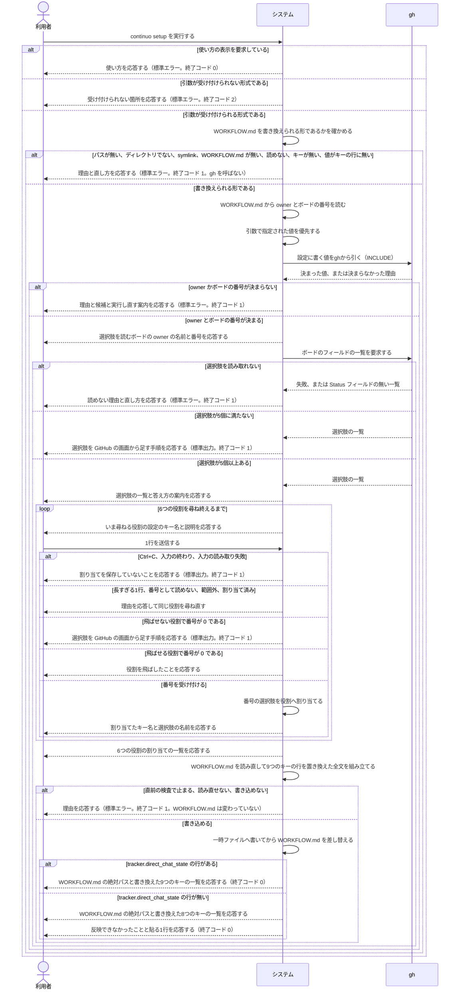

# ユースケース: 既存のボードのStatusを割り当てる

> **`continuo setup` の記述である。**実装が先に在り、実装から起こしている。
> 値を決める段（owner とボードの番号）は `設定に書く値をghから引く.rucm.md` に書いてある。この記述は `INCLUDE USE CASE` で引く。
>
> **実装と設計は「カンバン」と呼ぶ。この記述は「ボード」と呼ぶ。**同じものである（GitHub Projects v2 の1枚）。
> 記述の名前と、引いている記述が「ボード」を使っているので、この記述の中では「ボード」に統一する。

## 根拠資料

- `docs/plans/continuo_design.md` の「3-32. 使い始めるまでの手順」（対話するのは `continuo setup` だけ）
- `docs/plans/continuo_design.md` の「3-34. カンバンは既存のものに合わせる」（運用中のカンバンに足りない選択肢は GitHub の画面から足す。API で足さない）
- `docs/plans/continuo_design.md` の「3-83」（`direct_chat_state`。飛ばせる6つ目の役割）
- `docs/trying_it_out.md` の「段4. Status の割り当てを合わせる」
- `internal/cli/cli.go` の `runSetup` / `checkDetectionForSetup` / `printScaffoldError` / `parseErrorExitCode` / `reorderArgs`
- `internal/setup/setup.go` の `Role` / `RoleCount` / `RequiredRoleCount` / `IsOptional` / `roleOrder` / `roleConfigKeys`
- `internal/setup/assign.go` の `Assign` / `writeOptionList` / `writeSummary` / `writeAddOptionRemedy` / `parseNumber` / `readLimitedLine` / `lineReader` の `read`
- `internal/setup/board.go` の `FetchStatusField` / `classifyGHError` / `parseFieldList`
- `internal/scaffold/update.go` の `CheckUpdatable` / `UpdateStatuses` / `statTarget` / `readProviderValues`
- `internal/scaffold/fill.go` の `statusKeys` / `StatusKeyNames` / `StatusKeyLine` / `Statuses` の `Complete` / `applyStatuses` / `requiredStatusKeyNames`
- `internal/scaffold/scaffold.go` の `resolveTarget` / `resolveDir`
- `internal/i18n/messages/ja.json` の `cli.setup.*` と `setup.*`（画面に出す文言）

## RUCM

```rucm
USE CASE NAME: 既存のボードのStatusを割り当てる
BRIEF DESCRIPTION: 利用者は continuo setup を実行する。システムは既にある WORKFLOW.md を書き換えられる形であるかを確かめる。システムは Status の選択肢を読むボードを決める。システムはボードの Status フィールドの選択肢を番号付きで並べる。システムは continuo の6つの役割を1つずつ説明して選択肢を選ばせる。システムは WORKFLOW.md の Status に関する9つのキーの行だけを書き換える。
PRECONDITION: 利用者は continuo の実行ファイルを実行できる。
PRIMARY ACTOR: 利用者
SECONDARY ACTORS: gh
DEPENDENCY: INCLUDE USE CASE 設定に書く値をghから引く
GENERALIZATION: なし

BASIC FLOW:
1. 利用者はシステムに continuo setup の実行を要求する。
2. システムは VALIDATES THAT 利用者が使い方の表示を要求していない。
3. システムは VALIDATES THAT 利用者が指定した引数が受け付けられる形式である。
4. システムは VALIDATES THAT 指定されたパスがある。
5. システムは VALIDATES THAT 指定されたパスがディレクトリである。
6. システムは VALIDATES THAT 指定されたディレクトリの WORKFLOW.md が symlink ではない。
7. システムは VALIDATES THAT 指定されたディレクトリに通常のファイルの WORKFLOW.md がある。
8. システムは VALIDATES THAT WORKFLOW.md を読める。
9. システムは VALIDATES THAT WORKFLOW.md の front matter に必ず書き換える8つのキーがある。
10. システムは VALIDATES THAT 書き換える対象のキーの値がどれもキーの行に書かれている。
11. システムは WORKFLOW.md から tracker.provider.owner の値とボードの番号を読む。
12. システムは画面に出す文言の言語を決める。
13. システムは引数で指定された owner の名前とボードの番号を WORKFLOW.md から読んだ値より優先する。
14. INCLUDE USE CASE 設定に書く値をghから引く
15. システムは VALIDATES THAT tracker.provider.owner の値が決まっている。
16. システムは VALIDATES THAT ボードの番号が決まっている。
17. システムは利用者に選択肢を読むボードの owner の名前と番号を応答する。
18. システムは gh にボードのフィールドの一覧を要求する。
19. システムは VALIDATES THAT ボードの Status フィールドの選択肢を読み取れる。
20. システムは VALIDATES THAT 読み取った選択肢が5個以上ある。
21. システムは利用者に選択肢の一覧を番号付きで応答する。
22. システムは利用者に番号での答え方の案内を応答する。
23. DO
24.   システムは利用者にいま尋ねる役割の設定のキー名と説明を応答する。
25.   利用者はシステムに1行を送信する。
26.   システムは VALIDATES THAT 1行の長さが改行を含めて4096バイト以内である。
27.   システムは VALIDATES THAT 1行を10進の整数として読める。
28.   システムは VALIDATES THAT 番号が 0 以上、かつ選択肢の数以下である。
29.   システムは VALIDATES THAT 番号が 0 でない。
30.   システムは VALIDATES THAT 番号の選択肢が他の役割に割り当てられていない。
31.   システムは番号の選択肢をいま尋ねる役割へ割り当てる。
32.   システムは利用者に割り当てた設定のキー名と選択肢の名前を応答する。
33. UNTIL 6つの役割すべてを尋ね終えている
34. システムは利用者に6つの役割の割り当ての一覧を応答する。
35. システムは VALIDATES THAT 書き換える直前の WORKFLOW.md が対話の前と同じ検査を通る。
36. システムは9つのキーの行の値を置き換えた全文を組み立てる。
37. システムは VALIDATES THAT 元の WORKFLOW.md の front matter が読めないか、組み立てた全文の front matter を読み直せる。
38. システムは VALIDATES THAT 組み立てた全文を WORKFLOW.md へ書き込める。
39. システムは WORKFLOW.md を組み立てた全文で差し替える。
40. システムは VALIDATES THAT WORKFLOW.md に tracker.direct_chat_state の行がある。
41. システムは利用者に書き換えた WORKFLOW.md の絶対パスを応答する。
42. システムは利用者に書き換えた9つのキーの一覧を応答する。
POSTCONDITION: 必ず要る5つの役割それぞれに1つの選択肢が書かれている。同じ選択肢が2つの役割に書かれていない。飛ばした tracker.direct_chat_state の行には空文字が書かれている。WORKFLOW.md の9つのキー以外の行は変わっていない。tracker.provider.owner と tracker.provider.project_number の行は変わっていない。ボードの選択肢は変わっていない。ボードの item の Status は変わっていない。応答は標準出力に出ている。終了コード 0 が返っている。

SPECIFIC ALTERNATIVE FLOW 使い方の表示:
RFS BASIC FLOW 2
1. システムは利用者に continuo setup の使い方を応答する。
2. ABORT
POSTCONDITION: WORKFLOW.md は変わっていない。システムは gh に何も要求していない。システムは役割の割り当てを1つも尋ねていない。使い方は標準エラーに出ている。終了コード 0 が返っている。

SPECIFIC ALTERNATIVE FLOW 引数指定エラー:
RFS BASIC FLOW 3
1. システムは利用者に引数のどこが受け付けられないかを応答する。
2. ABORT
POSTCONDITION: WORKFLOW.md は変わっていない。システムは gh に何も要求していない。システムは役割の割り当てを1つも尋ねていない。理由は標準エラーに出ている。終了コード 2 が返っている。

SPECIFIC ALTERNATIVE FLOW 指定されたパス不在:
RFS BASIC FLOW 4
1. システムは利用者に指定されたディレクトリがないことを応答する。
2. システムは利用者にパスを確かめる案内を応答する。
3. ABORT
POSTCONDITION: システムはディレクトリを作っていない。WORKFLOW.md は作られていない。システムは gh に何も要求していない。システムは役割の割り当てを1つも尋ねていない。理由は標準エラーに出ている。終了コード 1 が返っている。

SPECIFIC ALTERNATIVE FLOW 指定されたパスがディレクトリではない:
RFS BASIC FLOW 5
1. システムは利用者に指定されたパスがディレクトリではないことを応答する。
2. システムは利用者に continuo setup が受け取るのは WORKFLOW.md があるディレクトリであることを応答する。
3. ABORT
POSTCONDITION: WORKFLOW.md は作られていない。システムは gh に何も要求していない。システムは役割の割り当てを1つも尋ねていない。理由は標準エラーに出ている。終了コード 1 が返っている。

SPECIFIC ALTERNATIVE FLOW 書き換える先がsymlink:
RFS BASIC FLOW 6
1. システムは利用者に WORKFLOW.md が symlink であることを応答する。
2. システムは利用者に symlink を消すか別のディレクトリを指定する案内を応答する。
3. ABORT
POSTCONDITION: symlink のリンク先の内容は変わっていない。システムは symlink を辿っていない。システムは gh に何も要求していない。システムは役割の割り当てを1つも尋ねていない。理由は標準エラーに出ている。終了コード 1 が返っている。

SPECIFIC ALTERNATIVE FLOW WORKFLOWmdが無い:
RFS BASIC FLOW 7
1. システムは利用者に WORKFLOW.md が無いことを応答する。
2. システムは利用者に continuo init を先に実行する案内を応答する。
3. ABORT
POSTCONDITION: WORKFLOW.md は作られていない。システムは gh に何も要求していない。システムは役割の割り当てを1つも尋ねていない。理由は標準エラーに出ている。終了コード 1 が返っている。

SPECIFIC ALTERNATIVE FLOW WORKFLOWmdを読めない:
RFS BASIC FLOW 8
1. システムは利用者に WORKFLOW.md を書き換えられないことと理由を応答する。
2. ABORT
POSTCONDITION: WORKFLOW.md は変わっていない。システムは gh に何も要求していない。システムは役割の割り当てを1つも尋ねていない。理由は標準エラーに出ている。終了コード 1 が返っている。

SPECIFIC ALTERNATIVE FLOW 書き換える対象のキーが無い:
RFS BASIC FLOW 9
1. システムは利用者に WORKFLOW.md の front matter に無いキーの名前を応答する。
2. システムは利用者にキーを書き戻すか continuo init で作り直す案内を応答する。
3. ABORT
POSTCONDITION: WORKFLOW.md は変わっていない。システムは gh に何も要求していない。システムは役割の割り当てを1つも尋ねていない。システムは tracker.direct_chat_state を無いキーに数えていない。理由は標準エラーに出ている。終了コード 1 が返っている。

SPECIFIC ALTERNATIVE FLOW 値がキーの行に無い:
RFS BASIC FLOW 10
1. システムは利用者に値がキーの行に無いキーの名前を応答する。
2. システムは利用者にキーの値を1行で書いてから実行し直す案内を応答する。
3. ABORT
POSTCONDITION: WORKFLOW.md は変わっていない。システムは gh に何も要求していない。システムは役割の割り当てを1つも尋ねていない。理由は標準エラーに出ている。終了コード 1 が返っている。

SPECIFIC ALTERNATIVE FLOW ownerが決まらない:
RFS BASIC FLOW 15
1. システムは利用者に tracker.provider.owner を決められなかった理由を応答する。
2. システムは利用者に owner の名前を指定して実行し直す案内を応答する。
3. ABORT
POSTCONDITION: WORKFLOW.md は変わっていない。システムは gh にボードのフィールドの一覧を要求していない。システムは役割の割り当てを1つも尋ねていない。理由は標準エラーに出ている。終了コード 1 が返っている。

SPECIFIC ALTERNATIVE FLOW ボードの番号が決まらない:
RFS BASIC FLOW 16
1. システムは利用者にボードの番号を決められなかった理由を応答する。
2. システムは利用者にボードの候補の owner と番号と名前と URL の一覧を応答する。
3. システムは利用者にボードの番号を指定して実行し直す案内を応答する。
4. ABORT
POSTCONDITION: WORKFLOW.md は変わっていない。システムは利用者にボードを選ばせる問い合わせを出していない。システムは gh にボードのフィールドの一覧を要求していない。システムは役割の割り当てを1つも尋ねていない。理由は標準エラーに出ている。終了コード 1 が返っている。

SPECIFIC ALTERNATIVE FLOW ボードを読めない:
RFS BASIC FLOW 19
1. システムは利用者にボードの Status フィールドを読めない理由を応答する。
2. システムは利用者に理由に対応する直し方を応答する。
3. ABORT
POSTCONDITION: WORKFLOW.md は変わっていない。システムは役割の割り当てを1つも尋ねていない。選択肢を読むボードの owner の名前と番号は標準出力に出ている。理由と直し方は標準エラーに出ている。終了コード 1 が返っている。

SPECIFIC ALTERNATIVE FLOW 選択肢が足りない:
RFS BASIC FLOW 20
1. システムは利用者に選択肢の数が5個に満たないことを応答する。
2. システムは利用者に GitHub の画面から選択肢を足す手順を応答する。
3. システムは利用者に API で選択肢を足すと設定済みの Status が全部消えることを応答する。
4. ABORT
POSTCONDITION: WORKFLOW.md は変わっていない。ボードの選択肢は変わっていない。システムは役割の割り当てを1つも尋ねていない。理由は標準出力に出ている。終了コード 1 が返っている。

SPECIFIC ALTERNATIVE FLOW 長すぎる1行:
RFS BASIC FLOW 26
1. システムは長すぎる1行を改行まで読み捨てる。
2. システムは利用者に1行を読み捨てたことを応答する。
3. システムは利用者に選べる番号の範囲を応答する。
4. RESUME STEP 24
POSTCONDITION: 役割への割り当ては増えていない。それまでの割り当ては残っている。システムは同じ役割の番号をもう一度待っている。

SPECIFIC ALTERNATIVE FLOW 番号として読めない入力:
RFS BASIC FLOW 27
1. システムは利用者に入力が番号ではないことを応答する。
2. システムは利用者に選べる番号の範囲を応答する。
3. RESUME STEP 24
POSTCONDITION: 役割への割り当ては増えていない。それまでの割り当ては残っている。システムは同じ役割の番号をもう一度待っている。

SPECIFIC ALTERNATIVE FLOW 番号が範囲外:
RFS BASIC FLOW 28
1. システムは利用者に選べる番号の範囲を応答する。
2. RESUME STEP 24
POSTCONDITION: 役割への割り当ては増えていない。それまでの割り当ては残っている。システムは同じ役割の番号をもう一度待っている。

SPECIFIC ALTERNATIVE FLOW 飛ばせる役割を飛ばす:
RFS BASIC FLOW 29
1. システムは VALIDATES THAT いま尋ねる役割が飛ばせる役割である。
2. システムは利用者にいま尋ねる役割を飛ばしたことを応答する。
3. システムは利用者に WORKFLOW.md の項目を空のままにすることを応答する。
4. RESUME STEP 34
POSTCONDITION: いま尋ねる役割に選択肢は割り当てられていない。それまでの割り当ては残っている。システムは6つの役割すべてを尋ね終えている。

SPECIFIC ALTERNATIVE FLOW 該当する選択肢が無い:
RFS 飛ばせる役割を飛ばす 1
1. システムは利用者にいま尋ねる役割へ渡せる選択肢がボードに無いことを応答する。
2. システムは利用者に GitHub の画面から選択肢を足す手順を応答する。
3. システムは利用者に API で選択肢を足すと設定済みの Status が全部消えることを応答する。
4. ABORT
POSTCONDITION: WORKFLOW.md は変わっていない。ボードの選択肢は変わっていない。それまでに選んだ番号は保存されていない。理由は標準出力に出ている。終了コード 1 が返っている。

SPECIFIC ALTERNATIVE FLOW 二重割り当て:
RFS BASIC FLOW 30
1. システムは利用者に選んだ選択肢が別の役割に割り当て済みであることを応答する。
2. システムは利用者に割り当て済みの設定のキー名を応答する。
3. RESUME STEP 24
POSTCONDITION: 役割への割り当ては増えていない。1つの選択肢は1つの役割だけに割り当てられている。システムは同じ役割の番号をもう一度待っている。

SPECIFIC ALTERNATIVE FLOW 書き換える直前の検査で止まる:
RFS BASIC FLOW 35
1. システムは利用者に WORKFLOW.md を書き換えられない理由を応答する。
2. ABORT
POSTCONDITION: システムは WORKFLOW.md へ1文字も書いていない。6つの役割の割り当ては保存されていない。割り当ての一覧は標準出力に出ている。理由は標準エラーに出ている。終了コード 1 が返っている。

SPECIFIC ALTERNATIVE FLOW 書き換えると読めなくなる:
RFS BASIC FLOW 37
1. システムは利用者に組み立てた全文の front matter を読み直せない理由を応答する。
2. システムは利用者に WORKFLOW.md へ1文字も書いていないことを応答する。
3. ABORT
POSTCONDITION: WORKFLOW.md は変わっていない。6つの役割の割り当ては保存されていない。割り当ての一覧は標準出力に出ている。理由は標準エラーに出ている。終了コード 1 が返っている。

SPECIFIC ALTERNATIVE FLOW 書き込みの失敗:
RFS BASIC FLOW 38
1. システムは利用者に WORKFLOW.md を書き換えられないことと理由を応答する。
2. ABORT
POSTCONDITION: WORKFLOW.md は変わっていない。6つの役割の割り当ては保存されていない。割り当ての一覧は標準出力に出ている。理由は標準エラーに出ている。終了コード 1 が返っている。

SPECIFIC ALTERNATIVE FLOW direct_chat_stateの行が無い:
RFS BASIC FLOW 40
1. システムは利用者に書き換えた WORKFLOW.md の絶対パスを応答する。
2. システムは利用者に書き換えた8つのキーの一覧を応答する。
3. システムは利用者に tracker.direct_chat_state を反映できなかったことを応答する。
4. システムは利用者に tracker の下へ貼る1行を応答する。
5. ABORT
POSTCONDITION: 必ず要る5つの役割それぞれに1つの選択肢が書かれている。システムは WORKFLOW.md に tracker.direct_chat_state の行を足していない。書き換えたキーの一覧に tracker.direct_chat_state は入っていない。貼る1行の値は、利用者が6つ目の役割に答えた値である。WORKFLOW.md の8つのキー以外の行は変わっていない。応答は標準出力に出ている。終了コード 0 が返っている。

GLOBAL ALTERNATIVE FLOW 中断:
BRANCH FROM BASIC FLOW 25
WHEN 利用者が番号を待つシステムに Ctrl+C を入力した場合
1. システムは利用者に中断したことを応答する。
2. システムは利用者に割り当てを保存していないことを応答する。
3. システムは利用者に WORKFLOW.md を書き換えていないことを応答する。
4. ABORT
POSTCONDITION: WORKFLOW.md は変わっていない。それまでに選んだ番号は保存されていない。ボードの選択肢は変わっていない。ボードの item の Status は変わっていない。応答は標準出力に出ている。終了コード 1 が返っている。

GLOBAL ALTERNATIVE FLOW 入力の終わり:
BRANCH FROM BASIC FLOW 25
WHEN システムが番号を待つあいだに標準入力が終わった場合
1. システムは利用者に入力が終わったので中断したことを応答する。
2. システムは利用者に割り当てを保存していないことを応答する。
3. システムは利用者に WORKFLOW.md を書き換えていないことを応答する。
4. ABORT
POSTCONDITION: WORKFLOW.md は変わっていない。それまでに選んだ番号は保存されていない。応答は標準出力に出ている。終了コード 1 が返っている。

GLOBAL ALTERNATIVE FLOW 入力の読み取り失敗:
BRANCH FROM BASIC FLOW 25
WHEN システムが番号を待つあいだに標準入力の読み取りが失敗した場合
1. システムは利用者に入力を読めなかった理由を応答する。
2. システムは利用者に割り当てを保存していないことを応答する。
3. システムは利用者に WORKFLOW.md を書き換えていないことを応答する。
4. ABORT
POSTCONDITION: WORKFLOW.md は変わっていない。それまでに選んだ番号は保存されていない。応答は標準出力に出ている。終了コード 1 が返っている。
```

## 割り当てる6つの役割

尋ねる順序はこの表の上から下である（`internal/setup/setup.go` の `roleOrder`）。システムは設定のキー名を先に出し、
何をするかの説明を続けて番号を待つ。役割の呼び名（着手待ちなど）は画面に出さない。行の頭には `[1/6]` の形で何問目かが付く。

| 順 | 画面に出す文言 | WORKFLOW.md に書くキー | 飛ばせるか |
| --- | --- | --- | --- |
| 1 | `dispatch_state: continuo が自動的に処理を開始する Status は何番ですか?` | `tracker.dispatch_state`、`tracker.active_states` の1つめ | 飛ばせない |
| 2 | `running_state: continuo が処理を開始したときに移動する Status は何番ですか?` | `tracker.running_state`、`tracker.active_states` の2つめ | 飛ばせない |
| 3 | `status_signal_map.review: エージェントが作業を完了したときに移動する Status は何番ですか?` | `tracker.status_signal_map.review` | 飛ばせない |
| 4 | `status_signal_map.blocked / failure_state: エージェントが判断を仰ぐとき・打ち切ったときに移動する Status は何番ですか?` | `tracker.failure_state`、`tracker.status_signal_map.blocked` | 飛ばせない |
| 5 | `terminal_states: 人間がここへissueを移動したら作業完了とみなしgit worktreeを削除する Status は何番ですか?` | `tracker.terminal_states`、`cleanup.on_states` | 飛ばせない |
| 6 | `direct_chat_state: 人間が pane に入って直接エージェントと話すあいだだけ置く Status は何番ですか?…` | `tracker.direct_chat_state` | 番号 `0` で飛ばせる |

書き換えるキーは9つである（`internal/scaffold/fill.go` の `statusKeys`）。そのうち8つは必ず要る。
`tracker.direct_chat_state` の行だけは WORKFLOW.md に無くても止めない（`direct_chat_stateの行が無い`）。

番号 `0` は「この役割に使える選択肢がボードに無い」を表す。飛ばせない5つの役割で `0` が入ったら、割り当てを打ち切る（`該当する選択肢が無い`）。
6つ目の役割では `0` は「飛ばす」になり、`tracker.direct_chat_state` の行には空文字を書く（`飛ばせる役割を飛ばす`）。
飛ばせる役割は最後に尋ねる6つ目だけなので、飛ばしたあとに次の役割を尋ねる経路は無い。`飛ばせる役割を飛ばす` は割り当ての一覧を応答する段（基本フロー 34）へ戻る。

## ボードを読めないときの案内

基本フロー 19 で止まるときに、システムが標準エラーへ出す直し方である（`internal/cli/cli.go` の `runSetup`、`internal/setup/board.go` の `classifyGHError`）。

| 読めない理由 | システムが出す直し方 |
| --- | --- |
| gh の scope に project が無い | `gh auth login --hostname <接続先ホスト> -s project` を実行する |
| 指定された名前のフィールドが無い。フィールドが single-select でない | `--status-field <名前>` でフィールドの名前を渡す |
| レートリミットに当たった | 時間をおいて実行し直す |
| 上のどれでもない（gh の実行の失敗、gh の応答を読めない、など） | 上のメッセージの内容を直してから実行し直す |

owner を決められない場合と、ボードの番号を決められない場合は、基本フロー 19 より前の別のフロー（`ownerが決まらない`・`ボードの番号が決まらない`）で止まる。

## rucm ブロックに段として書いていないこと

- **設定を読めないときの警告。**基本フロー 12 で、システムは WORKFLOW.md を設定として読み込む。読めなければ、理由を標準エラーへ出して、環境変数から決めた言語のまま先へ進む（止まらない）。
  言語の決め方は `画面に出す文言の言語を決める.rucm.md` に書いてある。この記述では分岐にしない。
- **Ctrl+C を見るのは、番号を待つあいだ（基本フロー 25）だけである。**システムが Ctrl+C を受け取る用意をするのは、選択肢を読み取ったあと（基本フロー 19 のあと）である。
  それより前（基本フロー 1〜19）の Ctrl+C は、システムは何も応答せずに終了する。
  選択肢の一覧を出しているあいだ（基本フロー 20〜22）の Ctrl+C は、システムが受け取って控え、最初に番号を待つところ（基本フロー 25）で `中断` へ入る（中断の文言を応答して終了コード 1）。
  **1行の長さの上限は、改行を含めて4096バイトである**（改行を除くと4095バイトまで。`internal/setup/assign.go` の `readLimitedLine` は、4096バイトのバッファに改行が入りきらない1行を読み捨てる）。
  6つの役割を尋ね終えたあと（基本フロー 34 以降）の Ctrl+C は、システムは見ない。書き換えは最後まで進む。SIGTERM も Ctrl+C と同じ扱いである。
- **引数指定エラーに入るもの。**知らないフラグ、user / organization 名として受け付けられない `--owner`、0以下の `--project`、空の `--status-field`、2個以上の位置引数。
- **`WORKFLOWmdが無い` に入るもの。**WORKFLOW.md という名前のものが無い場合と、在るが通常のファイルでない場合（ディレクトリなど）。画面に出る文言は同じである。
- **どのホストのカンバンを読むか。**WORKFLOW.md の原文から `tracker.provider.host` を拾い、gh へ環境変数 `GH_HOST` で渡す（設計 3-86b。`internal/scaffold/update.go` の `readProviderHost`）。**フラグは無い。**front matter の中だけを、キーの入れ子で辿って探す（字下げの幅は問わない。本文は見ない）。行が無いか、値が無ければ `github.com` である。引用符は外して読む。
- **`WORKFLOWmdを読めない` に入るもの。**`tracker.provider.host` に値が在るのにホスト名として受け付けられない形の場合（gh を1回も叩かずに止まる。黙って `github.com` のカンバンを読みに行かない）。WORKFLOW.md を読み込めない場合のほか、いまいるディレクトリを引けない場合と、ディレクトリや WORKFLOW.md の状態を調べられない場合。
- **`書き換える対象のキーが無い` に入るもの。**front matter を切り出せない WORKFLOW.md では、必ず書き換える8つのキーが全部「無い」として名指しされる。
- **`書き換える直前の検査で止まる`。**システムは書き換える直前に WORKFLOW.md を読み直し、基本フロー 4〜10 と同じ検査をもう一度行う。対話のあいだに WORKFLOW.md が変わった場合だけ、ここで止まる。
- **書き込みは不可分である。**システムは同じディレクトリの一時ファイルへ全文を書いてから差し替える。途中で落ちても、半分書かれた WORKFLOW.md は残らない。

## フローチャート

```mermaid
flowchart TD
    BS1["1 利用者はシステムに continuo setup の実行を要求する"]
    BS2{"2 利用者が使い方の表示を要求していない"}
    BS3{"3 利用者が指定した引数が受け付けられる形式である"}
    BS4{"4 指定されたパスがある"}
    BS5{"5 指定されたパスがディレクトリである"}
    BS6{"6 指定されたディレクトリの WORKFLOW.md が symlink ではない"}
    BS7{"7 指定されたディレクトリに通常のファイルの WORKFLOW.md がある"}
    BS8{"8 WORKFLOW.md を読める"}
    BS9{"9 WORKFLOW.md の front matter に必ず書き換える8つのキーがある"}
    BS10{"10 書き換える対象のキーの値がどれもキーの行に書かれている"}
    BS11["11 システムは WORKFLOW.md から tracker.provider.owner の値とボードの番号を読む"]
    BS12["12 システムは画面に出す文言の言語を決める"]
    BS13["13 システムは引数で指定された owner の名前とボードの番号を WORKFLOW.md から読んだ値より優先する"]
    BS14[["14 INCLUDE USE CASE 設定に書く値をghから引く"]]
    BS15{"15 tracker.provider.owner の値が決まっている"}
    BS16{"16 ボードの番号が決まっている"}
    BS17["17 システムは利用者に選択肢を読むボードの owner の名前と番号を応答する"]
    BS18["18 システムは gh にボードのフィールドの一覧を要求する"]
    BS19{"19 ボードの Status フィールドの選択肢を読み取れる"}
    BS20{"20 読み取った選択肢が5個以上ある"}
    BS21["21 システムは利用者に選択肢の一覧を番号付きで応答する"]
    BS22["22 システムは利用者に番号での答え方の案内を応答する"]
    BS24["24 システムは利用者にいま尋ねる役割の設定のキー名と説明を応答する"]
    BS25["25 利用者はシステムに1行を送信する"]
    BS26{"26 1行の長さが改行を含めて4096バイト以内である"}
    BS27{"27 1行を10進の整数として読める"}
    BS28{"28 番号が 0 以上、かつ選択肢の数以下である"}
    BS29{"29 番号が 0 でない"}
    BS30{"30 番号の選択肢が他の役割に割り当てられていない"}
    BS31["31 システムは番号の選択肢をいま尋ねる役割へ割り当てる"]
    BS32["32 システムは利用者に割り当てた設定のキー名と選択肢の名前を応答する"]
    BS33{"33 UNTIL 6つの役割すべてを尋ね終えている"}
    BS34["34 システムは利用者に6つの役割の割り当ての一覧を応答する"]
    BS35{"35 書き換える直前の WORKFLOW.md が対話の前と同じ検査を通る"}
    BS36["36 システムは9つのキーの行の値を置き換えた全文を組み立てる"]
    BS37{"37 元の WORKFLOW.md の front matter が読めないか、組み立てた全文の front matter を読み直せる"}
    BS38{"38 組み立てた全文を WORKFLOW.md へ書き込める"}
    BS39["39 システムは WORKFLOW.md を組み立てた全文で差し替える"]
    BS40{"40 WORKFLOW.md に tracker.direct_chat_state の行がある"}
    BS41["41 システムは利用者に書き換えた WORKFLOW.md の絶対パスを応答する"]
    BS42["42 システムは利用者に書き換えた9つのキーの一覧を応答する"]
    A1S1["使い方の表示 1 システムは利用者に continuo setup の使い方を応答する"]
    A1S2(["使い方の表示 2 ABORT"])
    A2S1["引数指定エラー 1 システムは利用者に引数のどこが受け付けられないかを応答する"]
    A2S2(["引数指定エラー 2 ABORT"])
    A3S1["指定されたパス不在 1 システムは利用者に指定されたディレクトリがないことを応答する"]
    A3S2["指定されたパス不在 2 システムは利用者にパスを確かめる案内を応答する"]
    A3S3(["指定されたパス不在 3 ABORT"])
    A4S1["指定されたパスがディレクトリではない 1 システムは利用者に指定されたパスがディレクトリではないことを応答する"]
    A4S2["指定されたパスがディレクトリではない 2 システムは利用者に continuo setup が受け取るのは WORKFLOW.md があるディレクトリであることを応答する"]
    A4S3(["指定されたパスがディレクトリではない 3 ABORT"])
    A5S1["書き換える先がsymlink 1 システムは利用者に WORKFLOW.md が symlink であることを応答する"]
    A5S2["書き換える先がsymlink 2 システムは利用者に symlink を消すか別のディレクトリを指定する案内を応答する"]
    A5S3(["書き換える先がsymlink 3 ABORT"])
    A6S1["WORKFLOWmdが無い 1 システムは利用者に WORKFLOW.md が無いことを応答する"]
    A6S2["WORKFLOWmdが無い 2 システムは利用者に continuo init を先に実行する案内を応答する"]
    A6S3(["WORKFLOWmdが無い 3 ABORT"])
    A7S1["WORKFLOWmdを読めない 1 システムは利用者に WORKFLOW.md を書き換えられないことと理由を応答する"]
    A7S2(["WORKFLOWmdを読めない 2 ABORT"])
    A8S1["書き換える対象のキーが無い 1 システムは利用者に WORKFLOW.md の front matter に無いキーの名前を応答する"]
    A8S2["書き換える対象のキーが無い 2 システムは利用者にキーを書き戻すか continuo init で作り直す案内を応答する"]
    A8S3(["書き換える対象のキーが無い 3 ABORT"])
    A9S1["値がキーの行に無い 1 システムは利用者に値がキーの行に無いキーの名前を応答する"]
    A9S2["値がキーの行に無い 2 システムは利用者にキーの値を1行で書いてから実行し直す案内を応答する"]
    A9S3(["値がキーの行に無い 3 ABORT"])
    A10S1["ownerが決まらない 1 システムは利用者に tracker.provider.owner を決められなかった理由を応答する"]
    A10S2["ownerが決まらない 2 システムは利用者に owner の名前を指定して実行し直す案内を応答する"]
    A10S3(["ownerが決まらない 3 ABORT"])
    A11S1["ボードの番号が決まらない 1 システムは利用者にボードの番号を決められなかった理由を応答する"]
    A11S2["ボードの番号が決まらない 2 システムは利用者にボードの候補の owner と番号と名前と URL の一覧を応答する"]
    A11S3["ボードの番号が決まらない 3 システムは利用者にボードの番号を指定して実行し直す案内を応答する"]
    A11S4(["ボードの番号が決まらない 4 ABORT"])
    A12S1["ボードを読めない 1 システムは利用者にボードの Status フィールドを読めない理由を応答する"]
    A12S2["ボードを読めない 2 システムは利用者に理由に対応する直し方を応答する"]
    A12S3(["ボードを読めない 3 ABORT"])
    A13S1["選択肢が足りない 1 システムは利用者に選択肢の数が5個に満たないことを応答する"]
    A13S2["選択肢が足りない 2 システムは利用者に GitHub の画面から選択肢を足す手順を応答する"]
    A13S3["選択肢が足りない 3 システムは利用者に API で選択肢を足すと設定済みの Status が全部消えることを応答する"]
    A13S4(["選択肢が足りない 4 ABORT"])
    A14S1["長すぎる1行 1 システムは長すぎる1行を改行まで読み捨てる"]
    A14S2["長すぎる1行 2 システムは利用者に1行を読み捨てたことを応答する"]
    A14S3["長すぎる1行 3 システムは利用者に選べる番号の範囲を応答する"]
    A14S4["長すぎる1行 4 RESUME STEP 24"]
    A15S1["番号として読めない入力 1 システムは利用者に入力が番号ではないことを応答する"]
    A15S2["番号として読めない入力 2 システムは利用者に選べる番号の範囲を応答する"]
    A15S3["番号として読めない入力 3 RESUME STEP 24"]
    A16S1["番号が範囲外 1 システムは利用者に選べる番号の範囲を応答する"]
    A16S2["番号が範囲外 2 RESUME STEP 24"]
    A17S1{"飛ばせる役割を飛ばす 1 いま尋ねる役割が飛ばせる役割である"}
    A17S2["飛ばせる役割を飛ばす 2 システムは利用者にいま尋ねる役割を飛ばしたことを応答する"]
    A17S3["飛ばせる役割を飛ばす 3 システムは利用者に WORKFLOW.md の項目を空のままにすることを応答する"]
    A17S4["飛ばせる役割を飛ばす 4 RESUME STEP 34"]
    A18S1["該当する選択肢が無い 1 システムは利用者にいま尋ねる役割へ渡せる選択肢がボードに無いことを応答する"]
    A18S2["該当する選択肢が無い 2 システムは利用者に GitHub の画面から選択肢を足す手順を応答する"]
    A18S3["該当する選択肢が無い 3 システムは利用者に API で選択肢を足すと設定済みの Status が全部消えることを応答する"]
    A18S4(["該当する選択肢が無い 4 ABORT"])
    A19S1["二重割り当て 1 システムは利用者に選んだ選択肢が別の役割に割り当て済みであることを応答する"]
    A19S2["二重割り当て 2 システムは利用者に割り当て済みの設定のキー名を応答する"]
    A19S3["二重割り当て 3 RESUME STEP 24"]
    A20S1["書き換える直前の検査で止まる 1 システムは利用者に WORKFLOW.md を書き換えられない理由を応答する"]
    A20S2(["書き換える直前の検査で止まる 2 ABORT"])
    A21S1["書き換えると読めなくなる 1 システムは利用者に組み立てた全文の front matter を読み直せない理由を応答する"]
    A21S2["書き換えると読めなくなる 2 システムは利用者に WORKFLOW.md へ1文字も書いていないことを応答する"]
    A21S3(["書き換えると読めなくなる 3 ABORT"])
    A22S1["書き込みの失敗 1 システムは利用者に WORKFLOW.md を書き換えられないことと理由を応答する"]
    A22S2(["書き込みの失敗 2 ABORT"])
    A23S1["direct_chat_stateの行が無い 1 システムは利用者に書き換えた WORKFLOW.md の絶対パスを応答する"]
    A23S2["direct_chat_stateの行が無い 2 システムは利用者に書き換えた8つのキーの一覧を応答する"]
    A23S3["direct_chat_stateの行が無い 3 システムは利用者に tracker.direct_chat_state を反映できなかったことを応答する"]
    A23S4["direct_chat_stateの行が無い 4 システムは利用者に tracker の下へ貼る1行を応答する"]
    A23S5(["direct_chat_stateの行が無い 5 ABORT"])
    A24S1["中断 1 システムは利用者に中断したことを応答する"]
    A24S2["中断 2 システムは利用者に割り当てを保存していないことを応答する"]
    A24S3["中断 3 システムは利用者に WORKFLOW.md を書き換えていないことを応答する"]
    A24S4(["中断 4 ABORT"])
    A25S1["入力の終わり 1 システムは利用者に入力が終わったので中断したことを応答する"]
    A25S2["入力の終わり 2 システムは利用者に割り当てを保存していないことを応答する"]
    A25S3["入力の終わり 3 システムは利用者に WORKFLOW.md を書き換えていないことを応答する"]
    A25S4(["入力の終わり 4 ABORT"])
    A26S1["入力の読み取り失敗 1 システムは利用者に入力を読めなかった理由を応答する"]
    A26S2["入力の読み取り失敗 2 システムは利用者に割り当てを保存していないことを応答する"]
    A26S3["入力の読み取り失敗 3 システムは利用者に WORKFLOW.md を書き換えていないことを応答する"]
    A26S4(["入力の読み取り失敗 4 ABORT"])
    BS1 --> BS2
    BS2 -- はい --> BS3
    BS2 -- いいえ --> A1S1
    BS3 -- はい --> BS4
    BS3 -- いいえ --> A2S1
    BS4 -- はい --> BS5
    BS4 -- いいえ --> A3S1
    BS5 -- はい --> BS6
    BS5 -- いいえ --> A4S1
    BS6 -- はい --> BS7
    BS6 -- いいえ --> A5S1
    BS7 -- はい --> BS8
    BS7 -- いいえ --> A6S1
    BS8 -- はい --> BS9
    BS8 -- いいえ --> A7S1
    BS9 -- はい --> BS10
    BS9 -- いいえ --> A8S1
    BS10 -- はい --> BS11
    BS10 -- いいえ --> A9S1
    BS11 --> BS12
    BS12 --> BS13
    BS13 --> BS14
    BS14 --> BS15
    BS15 -- はい --> BS16
    BS15 -- いいえ --> A10S1
    BS16 -- はい --> BS17
    BS16 -- いいえ --> A11S1
    BS17 --> BS18
    BS18 --> BS19
    BS19 -- はい --> BS20
    BS19 -- いいえ --> A12S1
    BS20 -- はい --> BS21
    BS20 -- いいえ --> A13S1
    BS21 --> BS22
    BS22 --> BS24
    BS24 --> BS25
    BS25 --> BS26
    BS25 -. "WHEN 利用者が番号を待つシステムに Ctrl+C を入力した場合" .-> A24S1
    BS25 -. "WHEN システムが番号を待つあいだに標準入力が終わった場合" .-> A25S1
    BS25 -. "WHEN システムが番号を待つあいだに標準入力の読み取りが失敗した場合" .-> A26S1
    BS26 -- はい --> BS27
    BS26 -- いいえ --> A14S1
    BS27 -- はい --> BS28
    BS27 -- いいえ --> A15S1
    BS28 -- はい --> BS29
    BS28 -- いいえ --> A16S1
    BS29 -- はい --> BS30
    BS29 -- いいえ --> A17S1
    BS30 -- はい --> BS31
    BS30 -- いいえ --> A19S1
    BS31 --> BS32
    BS32 --> BS33
    BS33 -- はい --> BS34
    BS33 -. "繰り返す" .-> BS24
    BS34 --> BS35
    BS35 -- はい --> BS36
    BS35 -- いいえ --> A20S1
    BS36 --> BS37
    BS37 -- はい --> BS38
    BS37 -- いいえ --> A21S1
    BS38 -- はい --> BS39
    BS38 -- いいえ --> A22S1
    BS39 --> BS40
    BS40 -- はい --> BS41
    BS40 -- いいえ --> A23S1
    BS41 --> BS42
    A1S1 --> A1S2
    A2S1 --> A2S2
    A3S1 --> A3S2
    A3S2 --> A3S3
    A4S1 --> A4S2
    A4S2 --> A4S3
    A5S1 --> A5S2
    A5S2 --> A5S3
    A6S1 --> A6S2
    A6S2 --> A6S3
    A7S1 --> A7S2
    A8S1 --> A8S2
    A8S2 --> A8S3
    A9S1 --> A9S2
    A9S2 --> A9S3
    A10S1 --> A10S2
    A10S2 --> A10S3
    A11S1 --> A11S2
    A11S2 --> A11S3
    A11S3 --> A11S4
    A12S1 --> A12S2
    A12S2 --> A12S3
    A13S1 --> A13S2
    A13S2 --> A13S3
    A13S3 --> A13S4
    A14S1 --> A14S2
    A14S2 --> A14S3
    A14S3 --> A14S4
    A14S4 -. "戻る" .-> BS24
    A15S1 --> A15S2
    A15S2 --> A15S3
    A15S3 -. "戻る" .-> BS24
    A16S1 --> A16S2
    A16S2 -. "戻る" .-> BS24
    A17S1 -- はい --> A17S2
    A17S1 -- いいえ --> A18S1
    A17S2 --> A17S3
    A17S3 --> A17S4
    A17S4 -. "戻る" .-> BS34
    A18S1 --> A18S2
    A18S2 --> A18S3
    A18S3 --> A18S4
    A19S1 --> A19S2
    A19S2 --> A19S3
    A19S3 -. "戻る" .-> BS24
    A20S1 --> A20S2
    A21S1 --> A21S2
    A21S2 --> A21S3
    A22S1 --> A22S2
    A23S1 --> A23S2
    A23S2 --> A23S3
    A23S3 --> A23S4
    A23S4 --> A23S5
    A24S1 --> A24S2
    A24S2 --> A24S3
    A24S3 --> A24S4
    A25S1 --> A25S2
    A25S2 --> A25S3
    A25S3 --> A25S4
    A26S1 --> A26S2
    A26S2 --> A26S3
    A26S3 --> A26S4
    BS42 --> END(["終了"])
```



## シーケンス図


