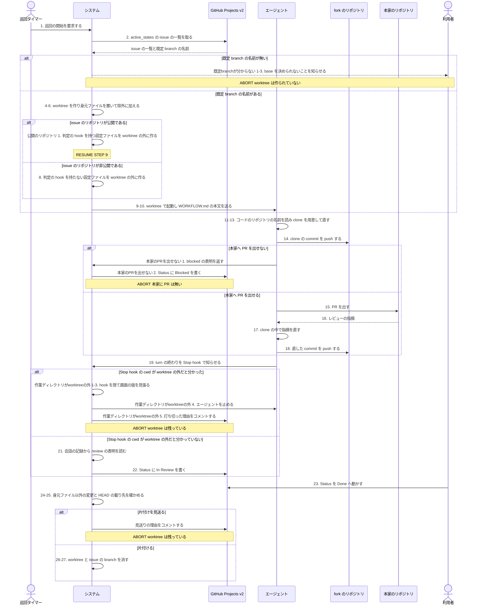

# ユースケース: 本家のリポジトリへ PR を出す

## 根拠資料

- `docs/plans/continuo_design.md#3-2`（turn の終わりは hook から通知させる。`Stop` が判定の起点）
- `docs/plans/continuo_design.md#3-9`（片付けの手順。段1 のリモート追跡 ref、段3 の base との差分）
- `docs/plans/continuo_design.md#3-12`（issue ごとの設定ファイルを worktree の外に作る）
- `docs/plans/continuo_design.md#3-16`（着手の手順の順番）
- `docs/plans/continuo_design.md#3-18`（worktree の身元ファイルと除外の一覧への登録）
- `docs/plans/continuo_design.md#3-21`（打ち切りは「画面の版」で測る）
- `docs/plans/continuo_design.md#3-22`（base の決め方。`herdr.worktree.base` が null なら既定 branch）
- `docs/plans/continuo_design.md#3-23`（hook の中身は外部入力であり、そのまま信じない）
- `docs/plans/continuo_design.md#3-64`（危ない道具の呼び出しの判定。`public_only` の既定）
- `docs/plans/continuo_design.md#3-78b`（雛形の WORKFLOW.md へ足す本文。hook の cwd の実測）
- `docs/plans/continuo_design.md#4-1`（誰がどの遷移を起こすか）
- `internal/workspace/prepare.go` の `resolveBase` と `NativeRefDefaultBranch`
- `internal/workspace/cleanup.go` の `leftoverReasons` と `identityStatusExcludes`
- `internal/workspace/git.go` の `gitRemoteRefContainsHead` と `gitNoDiffFromBase`
- `internal/orchestrator/settings.go` の `toolGateApplies` と `toolGateHookMatchers`
- `internal/orchestrator/hookinput.go` の `acceptHookCwd` と `sanitizeHookEvent`
- `internal/orchestrator/reconcile.go` の `checkStalls`
- `internal/scaffold/template.go`（`tracker.status_signal_map` と `cleanup.on_states` の既定）

## RUCM

```rucm
USE CASE NAME: 本家のリポジトリへ PR を出す
BRIEF DESCRIPTION: issue は非公開のリポジトリにあり、コードは public の fork にある。システムは issue のリポジトリの既定 branch を base にした worktree を1つ作り、エージェントをそこで起動する。エージェントは issue からコードのリポジトリの名前を読み、worktree の外の clone でコードを直し、fork の origin へ push し、本家のリポジトリへ PR を出す。システムは worktree の中身を見ずに Status を動かし、成果が worktree の外にあるままでも片付けを通す。
PRECONDITION: システムは常駐している。issue のリポジトリは非公開であり、コードを持たない。コードのリポジトリは public の fork であり、本家のリポジトリを upstream に持つ。claude.tool_gate.mode は既定の public_only である。claude.permission_mode は既定の dontAsk であり、システムはエージェントに --add-dir を渡さない。cleanup.on_states は Done だけを持つ。WORKFLOW.md の本文は worktree の外の clone で直してよいと書いている。
PRIMARY ACTOR: 巡回タイマー
SECONDARY ACTORS: エージェント、GitHub Projects v2、利用者
DEPENDENCY: なし
GENERALIZATION: なし

BASIC FLOW:
1. 巡回タイマーはシステムに巡回の開始を要求する。
2. システムはカンバンから active_states の issue の一覧を取る。
3. システムは VALIDATES THAT 先頭の issue が issue のリポジトリの既定 branch の名前を持っている。
4. システムは issue のリポジトリの clone に既定 branch を base にした worktree を作る。
5. システムは worktree の中に身元ファイルを置く。
6. システムは身元ファイルの名前を worktree の除外の一覧に加える。
7. システムは VALIDATES THAT issue のリポジトリが非公開である。
8. システムは判定の hook を持たない設定ファイルを worktree の外に作る。
9. システムはエージェントを worktree で起動する。
10. システムはエージェントに WORKFLOW.md の本文を turn として送る。
11. エージェントは issue の本文とコメントからコードのリポジトリの名前を読む。
12. エージェントは worktree の外にコードのリポジトリの clone を用意する。
13. エージェントは clone の中でコードを直す。
14. エージェントは clone の commit を fork の origin へ push する。
15. エージェントは本家のリポジトリへ PR を出す。
16. エージェントは本家の PR のレビューを読む。
17. エージェントは clone の中でレビューの指摘を直す。
18. エージェントは直した commit を fork の origin へ push する。
19. エージェントはシステムに turn の終わりを Stop hook で知らせる。
20. システムは VALIDATES THAT Stop hook の cwd が worktree の外だと分かっていない。
21. システムはエージェントの会話の記録から review の表明を読む。
22. システムはカンバンの issue の Status に In Review を書く。
23. 利用者はカンバンの issue の Status を Done へ動かす。
24. システムは VALIDATES THAT worktree に身元ファイル以外の変更が残っていない。
25. システムは VALIDATES THAT worktree の HEAD がリモート追跡 ref のどれかに載っている。
26. システムは worktree を消す。
27. システムは issue の branch を消す。
POSTCONDITION: 本家のリポジトリに PR がある。fork の origin に push した branch がある。issue の Status は Done である。worktree は消えている。issue の branch は消えている。コードのリポジトリの clone は worktree の外に残っている。

SPECIFIC ALTERNATIVE FLOW 既定branchが分からない:
RFS BASIC FLOW 3
1. システムは worktree を作らない。
2. システムは先頭の issue を飛ばす。
3. システムは利用者に base を決められないことを知らせる。
4. ABORT
POSTCONDITION: worktree は作られていない。issue の Status は着手待ちのままである。base を決められないことが利用者に届いている。

SPECIFIC ALTERNATIVE FLOW 公開のリポジトリ:
RFS BASIC FLOW 7
1. システムは判定の hook を持つ設定ファイルを worktree の外に作る。
2. RESUME STEP 9
POSTCONDITION: 設定ファイルに判定の hook がある。エージェントの道具の呼び出しは判定を通る。

SPECIFIC ALTERNATIVE FLOW 作業ディレクトリがworktreeの外:
RFS BASIC FLOW 20
1. システムは Stop hook を捨てる。
2. システムは turn の終わりを検知しない。
3. システムは画面の版が turn_timeout_ms のあいだ増えないことを見つける。
4. システムはエージェントを止める。
5. システムは issue に打ち切った理由をコメントする。
6. ABORT
POSTCONDITION: 本家のリポジトリの PR は残っている。fork の origin の branch は残っている。worktree は残っている。issue は打ち切られている。

SPECIFIC ALTERNATIVE FLOW 身元ファイル以外の変更が残っている:
RFS BASIC FLOW 24
1. システムは worktree を消さない。
2. システムは issue の branch を消さない。
3. システムは issue に片付けを見送った理由をコメントする。
4. ABORT
POSTCONDITION: worktree は残っている。issue の branch は残っている。片付けを見送った理由が issue に書かれている。

SPECIFIC ALTERNATIVE FLOW リモート追跡refに載っていない:
RFS BASIC FLOW 25
1. システムは VALIDATES THAT worktree の branch が base と差分を持たない。
2. RESUME STEP 26
POSTCONDITION: worktree の branch は base と差分を持たない。worktree は残っている。

SPECIFIC ALTERNATIVE FLOW baseと差分がある:
RFS リモート追跡refに載っていない 1
1. システムは worktree を消さない。
2. システムは issue の branch を消さない。
3. システムは issue に push していない成果があることをコメントする。
4. ABORT
POSTCONDITION: worktree は残っている。issue の branch は残っている。push していない成果は worktree に残っている。

GLOBAL ALTERNATIVE FLOW 本家のPRを出せない:
BRANCH FROM BASIC FLOW 15
WHEN エージェントが本家のリポジトリへ PR を出せない場合
1. エージェントはシステムに blocked の表明を返す。
2. システムはカンバンの issue の Status に Blocked を書く。
3. ABORT
POSTCONDITION: 本家のリポジトリに PR は無い。fork の origin に push した branch がある。issue の Status は Blocked である。worktree は残っている。
```

## フローチャート

```mermaid
flowchart TD
    START([開始]) --> B1["1. 巡回タイマーは巡回の開始を要求する"]
    B1 --> B2["2. カンバンから active_states の issue の一覧を取る"]
    B2 --> B3{"3. VALIDATES THAT 先頭の issue が既定 branch の名前を持っている"}
    B3 -- 偽 --> D1["既定branchが分からない 1. worktree を作らない"]
    D1 --> D2["既定branchが分からない 2. 先頭の issue を飛ばす"]
    D2 --> D3["既定branchが分からない 3. base を決められないことを知らせる"]
    D3 --> DEND([ABORT])
    B3 -- 真 --> B4["4. 既定 branch を base にした worktree を作る"]
    B4 --> B5["5. worktree の中に身元ファイルを置く"]
    B5 --> B6["6. 身元ファイルの名前を除外の一覧に加える"]
    B6 --> B7{"7. VALIDATES THAT issue のリポジトリが非公開である"}
    B7 -- 偽 --> P1["公開のリポジトリ 1. 判定の hook を持つ設定ファイルを worktree の外に作る"]
    P1 -. "RESUME STEP 9" .-> B9
    B7 -- 真 --> B8["8. 判定の hook を持たない設定ファイルを worktree の外に作る"]
    B8 --> B9["9. エージェントを worktree で起動する"]
    B9 --> B10["10. WORKFLOW.md の本文を turn として送る"]
    B10 --> B11["11. issue からコードのリポジトリの名前を読む"]
    B11 --> B12["12. worktree の外にコードのリポジトリの clone を用意する"]
    B12 --> B13["13. clone の中でコードを直す"]
    B13 --> B14["14. clone の commit を fork の origin へ push する"]
    B14 --> B15["15. 本家のリポジトリへ PR を出す"]
    B15 -. "WHEN 本家へ PR を出せない場合" .-> G1["本家のPRを出せない 1. blocked の表明を返す"]
    G1 --> G2["本家のPRを出せない 2. Status に Blocked を書く"]
    G2 --> GEND([ABORT])
    B15 --> B16["16. 本家の PR のレビューを読む"]
    B16 --> B17["17. clone の中でレビューの指摘を直す"]
    B17 --> B18["18. 直した commit を fork の origin へ push する"]
    B18 --> B19["19. turn の終わりを Stop hook で知らせる"]
    B19 --> B20{"20. VALIDATES THAT Stop hook の cwd が worktree の外だと分かっていない"}
    B20 -- 偽 --> O1["作業ディレクトリがworktreeの外 1. Stop hook を捨てる"]
    O1 --> O2["作業ディレクトリがworktreeの外 2. turn の終わりを検知しない"]
    O2 --> O3["作業ディレクトリがworktreeの外 3. 画面の版が増えないことを見つける"]
    O3 --> O4["作業ディレクトリがworktreeの外 4. エージェントを止める"]
    O4 --> O5["作業ディレクトリがworktreeの外 5. 打ち切った理由をコメントする"]
    O5 --> OEND([ABORT])
    B20 -- 真 --> B21["21. 会話の記録から review の表明を読む"]
    B21 --> B22["22. Status に In Review を書く"]
    B22 --> B23["23. 利用者は Status を Done へ動かす"]
    B23 --> B24{"24. VALIDATES THAT 身元ファイル以外の変更が残っていない"}
    B24 -- 偽 --> C1["身元ファイル以外の変更が残っている 1. worktree を消さない"]
    C1 --> C2["身元ファイル以外の変更が残っている 2. branch を消さない"]
    C2 --> C3["身元ファイル以外の変更が残っている 3. 見送った理由をコメントする"]
    C3 --> CEND([ABORT])
    B24 -- 真 --> B25{"25. VALIDATES THAT HEAD がリモート追跡 ref のどれかに載っている"}
    B25 -- 偽 --> R1{"リモート追跡refに載っていない 1. VALIDATES THAT branch が base と差分を持たない"}
    R1 -- 偽 --> F1["baseと差分がある 1. worktree を消さない"]
    F1 --> F2["baseと差分がある 2. branch を消さない"]
    F2 --> F3["baseと差分がある 3. push していない成果があることをコメントする"]
    F3 --> FEND([ABORT])
    R1 -. "RESUME STEP 26" .-> B26
    B25 -- 真 --> B26["26. worktree を消す"]
    B26 --> B27["27. issue の branch を消す"]
    B27 --> END([終了])
```



## シーケンス図


