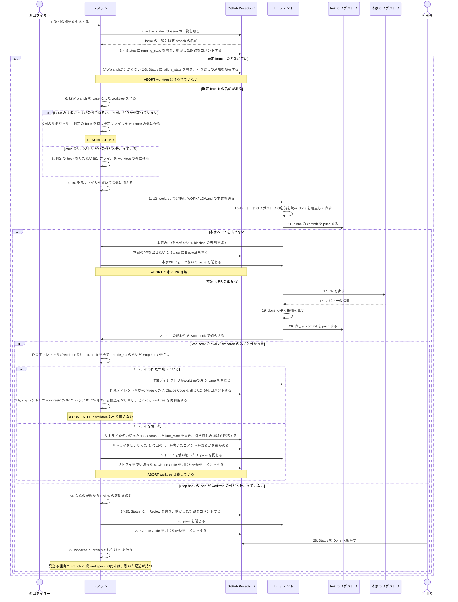

# ユースケース: 本家のリポジトリへ PR を出す

## 根拠資料

- `docs/plans/continuo_design.md#3-2`（turn の終わりは hook から通知させる。`Stop` が判定の起点）
- `docs/plans/continuo_design.md#3-9`（片付けの手順。段1 のリモート追跡 ref、段3 の base との差分）
- `docs/plans/continuo_design.md#3-12`（issue ごとの設定ファイルを worktree の外に作る）
- `docs/plans/continuo_design.md#3-16`（着手の手順の順番）
- `docs/plans/continuo_design.md#3-18`（worktree の身元ファイルと除外の一覧への登録）
- `docs/plans/continuo_design.md#3-21`（打ち切りは `agent_status` で測る）
- `docs/plans/continuo_design.md#3-22`（base の決め方。`herdr.worktree.base` が null なら既定 branch）
- `docs/plans/continuo_design.md#3-23`（hook の中身は外部入力であり、そのまま信じない）
- `docs/plans/continuo_design.md#3-64`（危ない道具の呼び出しの判定。`public_only` のときの掛かり方）
- `docs/plans/continuo_design.md#3-78b`（雛形の WORKFLOW.md へ足す本文。hook の cwd の実測）
- `docs/plans/continuo_design.md#4-1`（誰がどの遷移を起こすか）
- `internal/orchestrator/dispatch.go` の `runStartOrFail`、`startRun`、`startRunFromWorktree`（着手の段の順番）、`redispatch`（やり直しの着手）、`postStatusMove`
- `internal/workspace/prepare.go` の `Prepare`（置き場所に登録済みの worktree がある枝は作らずに再利用する）、`resolveBase`、`NativeRefDefaultBranch`、`ErrBaseUnknown`
- `internal/workspace/identity.go` の `WriteIdentity`（身元ファイルを書いてから除外の一覧へ登録する）
- `internal/workspace/cleanup.go` の `Cleanup`、`identityStatusExcludes`（片付けの段は `docs/spec/usecases/particular_case/worktree と branch を片付ける.rucm.md` が持つ）
- `internal/orchestrator/settings.go` の `writeSettingsFile`、`toolGateApplies`、`toolGateHookMatchers`
- `internal/orchestrator/hookinput.go` の `acceptHookCwd` と `sanitizeHookEvent`
- `internal/orchestrator/turn.go` の `confirmTurnEnd`（`Stop` が来ないまま `settle_ms` を過ぎた turn の扱い）
- `internal/orchestrator/lifecycle.go` の `handleTurnEnd`、`applySignals`、`decideAfterTurn`、`finishRunClaimed`、`failRun`、`abandonRunClaimed`、`stopWorker`
- `internal/orchestrator/comment.go` の `ensureAgentComment`
- `internal/orchestrator/relay.go` の `settleClosedRecord`（Claude Code を閉じた記録を書く条件）
- `internal/orchestrator/reconcile.go` の `reconcileWorktrees`（巡回の片付け。見送っても issue へコメントしない）
- `internal/scaffold/template.go`（`tracker.status_signal_map` と `cleanup.on_states` の既定）

## RUCM

```rucm
USE CASE NAME: 本家のリポジトリへ PR を出す
BRIEF DESCRIPTION: issue は非公開のリポジトリにあり、コードは public の fork にある。システムは issue のリポジトリの既定 branch を base にした worktree を1つ作り、エージェントをそこで起動する。エージェントは issue からコードのリポジトリの名前を読み、worktree の外の clone でコードを直し、fork の origin へ push し、本家のリポジトリへ PR を出す。システムは worktree の中身を見ずに Status を動かす。システムは、利用者が Status を Done へ動かしたあとの巡回で、worktree と branch の片付けを行う。
PRECONDITION: システムは常駐している。先頭の issue の担当はこの機械に決まっている。先頭の issue の worktree はまだ無い。issue のリポジトリは非公開であり、コードを持たない。コードのリポジトリは public の fork であり、本家のリポジトリを upstream に持つ。herdr.worktree.base は null である。先頭の issue にリンクされた branch は無い。workspace_hooks は1つも設定されていない。claude.tool_gate.mode は public_only である。claude.permission_mode は dontAsk であり、システムはエージェントに --add-dir を渡さない。cleanup.on_states は Done だけを持つ。cleanup.enabled と cleanup.require_clean_worktree と cleanup.require_pushed と cleanup.delete_branch は真である。herdr.worktree.create_via_herdr は真である。WORKFLOW.md の本文は worktree の外の clone で直してよいと書いている。issue の本文にコードのリポジトリの名前を書いたのは OWNER である。
PRIMARY ACTOR: 巡回タイマー
SECONDARY ACTORS: エージェント、GitHub Projects v2、利用者
DEPENDENCY: INCLUDE USE CASE worktree と branch を片付ける
GENERALIZATION: なし

BASIC FLOW:
1. 巡回タイマーはシステムに巡回の開始を要求する。
2. システムはカンバンから active_states の issue の一覧を取る。
3. システムはカンバンの issue の Status に running_state を書く。
4. システムは Status を動かした記録を issue に1件コメントする。
5. システムは VALIDATES THAT 先頭の issue が issue のリポジトリの既定 branch の名前を持っている。
6. システムは issue のリポジトリの clone に既定 branch を base にした worktree を作る。
7. システムは VALIDATES THAT システムが issue のリポジトリを非公開だと分かっている。
8. システムは判定の hook を持たない設定ファイルを worktree の外に作る。
9. システムは worktree の中に身元ファイルを置く。
10. システムは身元ファイルの名前を worktree の除外の一覧に加える。
11. システムはエージェントを worktree で起動する。
12. システムはエージェントに組み込みの指示書と WORKFLOW.md の本文を継ぎ合わせた文面を turn として送る。
13. エージェントは issue の本文とコメントからコードのリポジトリの名前を読む。
14. エージェントは worktree の外にコードのリポジトリの clone を用意する。
15. エージェントは clone の中でコードを直す。
16. エージェントは clone の commit を fork の origin へ push する。
17. エージェントは本家のリポジトリへ PR を出す。
18. エージェントは本家の PR のレビューを読む。
19. エージェントは clone の中でレビューの指摘を直す。
20. エージェントは直した commit を fork の origin へ push する。
21. エージェントはシステムに turn の終わりを Stop hook で知らせる。
22. システムは VALIDATES THAT Stop hook の cwd が worktree の外だと分かっていない。
23. システムはエージェントの会話の記録から review の表明を読む。
24. システムはカンバンの issue の Status に In Review を書く。
25. システムは Status を動かした記録を issue に1件コメントする。
26. システムはエージェントの pane を閉じる。
27. システムは Claude Code を閉じた記録を issue に1件コメントする。
28. 利用者はカンバンの issue の Status を Done へ動かす。
29. INCLUDE USE CASE worktree と branch を片付ける
POSTCONDITION: 本家のリポジトリに PR がある。fork の origin に push した branch がある。issue の Status は Done である。issue に Status を動かした記録のコメントが2件と Claude Code を閉じた記録のコメントが1件増えている。worktree と issue の branch と worktree の外の設定ファイルの扱いは、worktree と branch を片付ける の事後条件のとおりである。コードのリポジトリの clone は worktree の外に残っている。

SPECIFIC ALTERNATIVE FLOW 既定branchが分からない:
RFS BASIC FLOW 5
1. システムは worktree を作らない。
2. システムはカンバンの issue の Status に failure_state を書く。
3. システムは issue に base を決められないことを書いた引き渡しの通知を1件投稿する。
4. システムは先頭の issue を実行中の一覧から外す。
5. ABORT
POSTCONDITION: worktree は作られていない。エージェントは起動していない。issue の Status は failure_state である。base を決められないことを書いた引き渡しの通知が issue に1件ある。先頭の issue の担当者は変わっていない。

SPECIFIC ALTERNATIVE FLOW 公開のリポジトリ:
RFS BASIC FLOW 7
1. システムは判定の hook を持つ設定ファイルを worktree の外に作る。
2. RESUME STEP 9
POSTCONDITION: 設定ファイルに判定の hook がある。エージェントの道具の呼び出しは判定を通る。

SPECIFIC ALTERNATIVE FLOW 作業ディレクトリがworktreeの外:
RFS BASIC FLOW 22
1. システムは Stop hook を捨てる。
2. システムは Stop hook を捨てたことを WARN で記録に残す。
3. システムは herdr からエージェントが待機になった知らせを受ける。
4. システムは settle_ms のあいだ Stop hook を待つ。
5. システムは VALIDATES THAT リトライの回数が agent.max_retries より小さい。
6. システムはエージェントの pane を閉じる。
7. システムは Claude Code を閉じた記録を issue に1件コメントする。
8. システムはリトライの回数を1つ増やす。
9. システムはバックオフが明けるまで待つ。
10. システムは着手の直前の検査をやり直す。
11. システムはカンバンの issue の Status が running_state のままであることを、issue を取り直して確かめる。
12. システムは既にある worktree を、作り直さずに再利用する。
13. RESUME STEP 7
POSTCONDITION: 本家のリポジトリの PR は残っている。fork の origin の branch は残っている。worktree は作り直されずに残っている。issue の Status は running_state のままである。issue に Claude Code を閉じた記録のコメントが1件増えている。やり直しの着手は Status を動かした記録のコメントを増やしていない。リトライの回数が1つ増えている。システムは同じ worktree で、設定ファイルを作る段から着手をやり直す。

SPECIFIC ALTERNATIVE FLOW リトライを使い切った:
RFS 作業ディレクトリがworktreeの外 5
1. システムはカンバンの issue の Status に failure_state を書く。
2. システムは issue に turn の終わりを検知できなかったことを書いた引き渡しの通知を1件投稿する。
3. システムは issue に今回の run が書いたコメントがあるかを確かめる。
4. システムはエージェントの pane を閉じる。
5. システムは Claude Code を閉じた記録を issue に1件コメントする。
6. システムは先頭の issue を実行中の一覧から外す。
7. ABORT
POSTCONDITION: 本家のリポジトリの PR は残っている。fork の origin の branch は残っている。worktree は残っている。issue の Status は failure_state である。turn の終わりを検知できなかったことを書いた引き渡しの通知が issue に1件ある。issue に Claude Code を閉じた記録のコメントが1件増えている。

GLOBAL ALTERNATIVE FLOW 本家のPRを出せない:
BRANCH FROM BASIC FLOW 17
WHEN エージェントが本家のリポジトリへ PR を出せない場合
1. エージェントはシステムに blocked の表明を返す。
2. システムはカンバンの issue の Status に Blocked を書く。
3. システムはエージェントの pane を閉じる。
4. ABORT
POSTCONDITION: 本家のリポジトリに PR は無い。fork の origin に push した branch がある。issue の Status は Blocked である。worktree は残っている。
```

## 着手に失敗したときと、やり直すときに、issue へ何が残るか

| どの終わり方か | Status | issue へのコメント | 次に何が起きるか |
| --- | --- | --- | --- |
| `既定branchが分からない` | `failure_state` | Status を動かした記録が1件と、引き渡しの通知が1件 | 人間が Status を着手待ちへ戻すまで拾わない |
| `作業ディレクトリがworktreeの外`（リトライが残っている） | `running_state` のまま | Claude Code を閉じた記録が1件 | バックオフが明けたら、同じ worktree で着手をやり直す（基本フローのステップ7 へ戻る） |
| `リトライを使い切った` | `failure_state` | 引き渡しの通知が1件と、Claude Code を閉じた記録が1件 | 人間が Status を着手待ちへ戻すまで拾わない |

**Status を `running_state` へ書くのは、worktree を作るより前である**（`internal/orchestrator/dispatch.go` の `startRun`）。
だから base を決められなかった issue は、着手待ちのまま残らず、`failure_state` へ落ちる。
**Status を動かしたら、動かした記録を issue に1件コメントする**（`postStatusMove`。表明で動かしたときは `internal/orchestrator/lifecycle.go` の `applySignals`）。
**pane を閉じたら、Claude Code を閉じた記録を issue に1件コメントする**（`internal/orchestrator/lifecycle.go` の `stopWorker`）。

**`Stop` hook の cwd が worktree の外だと、その hook は捨てられる。**エージェントが応答を終えると herdr は待機を知らせるので、
システムは `settle_ms` のあいだ `Stop` を待ち、来なければ turn の終わりを検知できなかったものとして打ち切る
（`internal/orchestrator/turn.go` の `confirmTurnEnd`、`internal/orchestrator/lifecycle.go` の `abandonRunClaimed`）。

## やり直しの着手は、worktree を作り直さない

**言いたいこと。**バックオフが明けたあとの着手は、最初の着手と同じ段を通らない（`internal/orchestrator/dispatch.go` の `redispatch`）。

| 段 | 最初の着手 | やり直しの着手 |
| --- | --- | --- |
| 着手の直前の検査 | 行う | やり直す。落ちたら拾い直さずに戻り、次の巡回でまた見る |
| Status に `running_state` を書く | 書く。動かした記録を issue に1件コメントする | 取り直した Status が `running_state` のままなので、書き込みもコメントも起きない |
| 既定 branch の名前の検証と worktree の作成 | 行う | **行わない。**既にある worktree を再利用する（`internal/workspace/prepare.go` の `Prepare` の、置き場所に登録済みの worktree がある枝）。base を決められなくても WARN を出すだけで止まらない |
| 設定ファイルと身元ファイル | 作る | 作り直す |
| エージェントの起動 | 新しいセッションで起動する | 身元ファイルのセッションへ復帰して起動する |

**だから `作業ディレクトリがworktreeの外` の戻り先は、基本フローのステップ7（設定ファイルを作る前の検証）である。**ステップ3〜6 へは戻らない。

**リトライを使い切ったときは、引き渡しの通知のあと、issue に今回の run が書いたコメントがあるかを確かめてから pane を閉じる**（`abandonRunClaimed` の `ensureAgentComment`）。
コメントが無いときにセッションを復元して書かせる扱いは、`issue を1件処理する` が持つ。
この記述の前提では `workspace_hooks` が1つも設定されていないので、pane を閉じる前の `after_run` は何も実行しない。

## 片付けは `worktree と branch を片付ける` が持つ

**言いたいこと。**利用者が `Done` へ動かしたあとの片付けは、巡回の片付けである（`internal/orchestrator/reconcile.go` の `reconcileWorktrees`）。
システムは In Review を書いたときに pane を閉じて issue を実行中の一覧から外すので、片付けは、印を持たない worktree を巡回が拾う経路になる。
**その段の並びと、見送る理由と、branch と親 workspace の始末は、`worktree と branch を片付ける` に書いてある。**この記述は基本フローのステップ29 で引くだけにした。

| 何を | どこに書いてあるか |
| --- | --- |
| コミットされていない変更と push されていない成果の検査（git が答えられない場合を含む） | `worktree と branch を片付ける` の `失うものが残っている` |
| worktree を消したあとに、リポジトリの親 workspace を閉じること | `リポジトリの親 workspace を閉じる` |
| branch を消すか残すか（消せなかったときに残ること） | `branch を始末する` |
| 見送っても issue へコメントせず、身元ファイルへ見送りの時刻も書かないこと | `worktree と branch を片付ける` の `失うものが残っている` の POSTCONDITION |

**この筋で片付けが通るのは、エージェントが worktree の中に何も書かないからである。**
身元ファイルは変更の検査から除かれる（`internal/workspace/cleanup.go` の `identityStatusExcludes`）。
worktree の branch は base から1つも進んでいないので、push されていない成果は無い。成果は worktree の外の clone と、fork の origin にある。

## フローチャート


```mermaid
flowchart TD
    BS1["1 巡回タイマーはシステムに巡回の開始を要求する"]
    BS2["2 システムはカンバンから active_states の issue の一覧を取る"]
    BS3["3 システムはカンバンの issue の Status に running_state を書く"]
    BS4["4 システムは Status を動かした記録を issue に1件コメントする"]
    BS5{"5 先頭の issue が issue のリポジトリの既定 branch の名前を持っている"}
    BS6["6 システムは issue のリポジトリの clone に既定 branch を base にした worktree を作る"]
    BS7{"7 システムが issue のリポジトリを非公開だと分かっている"}
    BS8["8 システムは判定の hook を持たない設定ファイルを worktree の外に作る"]
    BS9["9 システムは worktree の中に身元ファイルを置く"]
    BS10["10 システムは身元ファイルの名前を worktree の除外の一覧に加える"]
    BS11["11 システムはエージェントを worktree で起動する"]
    BS12["12 システムはエージェントに組み込みの指示書と WORKFLOW.md の本文を継ぎ合わせた文面を turn として送る"]
    BS13["13 エージェントは issue の本文とコメントからコードのリポジトリの名前を読む"]
    BS14["14 エージェントは worktree の外にコードのリポジトリの clone を用意する"]
    BS15["15 エージェントは clone の中でコードを直す"]
    BS16["16 エージェントは clone の commit を fork の origin へ push する"]
    BS17["17 エージェントは本家のリポジトリへ PR を出す"]
    BS18["18 エージェントは本家の PR のレビューを読む"]
    BS19["19 エージェントは clone の中でレビューの指摘を直す"]
    BS20["20 エージェントは直した commit を fork の origin へ push する"]
    BS21["21 エージェントはシステムに turn の終わりを Stop hook で知らせる"]
    BS22{"22 Stop hook の cwd が worktree の外だと分かっていない"}
    BS23["23 システムはエージェントの会話の記録から review の表明を読む"]
    BS24["24 システムはカンバンの issue の Status に In Review を書く"]
    BS25["25 システムは Status を動かした記録を issue に1件コメントする"]
    BS26["26 システムはエージェントの pane を閉じる"]
    BS27["27 システムは Claude Code を閉じた記録を issue に1件コメントする"]
    BS28["28 利用者はカンバンの issue の Status を Done へ動かす"]
    BS29[["29 INCLUDE USE CASE worktree と branch を片付ける"]]
    A1S1["既定branchが分からない 1 システムは worktree を作らない"]
    A1S2["既定branchが分からない 2 システムはカンバンの issue の Status に failure_state を書く"]
    A1S3["既定branchが分からない 3 システムは issue に base を決められないことを書いた引き渡しの通知を1件投稿する"]
    A1S4["既定branchが分からない 4 システムは先頭の issue を実行中の一覧から外す"]
    A1S5(["既定branchが分からない 5 ABORT"])
    A2S1["公開のリポジトリ 1 システムは判定の hook を持つ設定ファイルを worktree の外に作る"]
    A2S2["公開のリポジトリ 2 RESUME STEP 9"]
    A3S1["作業ディレクトリがworktreeの外 1 システムは Stop hook を捨てる"]
    A3S2["作業ディレクトリがworktreeの外 2 システムは Stop hook を捨てたことを WARN で記録に残す"]
    A3S3["作業ディレクトリがworktreeの外 3 システムは herdr からエージェントが待機になった知らせを受ける"]
    A3S4["作業ディレクトリがworktreeの外 4 システムは settle_ms のあいだ Stop hook を待つ"]
    A3S5{"作業ディレクトリがworktreeの外 5 リトライの回数が agent.max_retries より小さい"}
    A3S6["作業ディレクトリがworktreeの外 6 システムはエージェントの pane を閉じる"]
    A3S7["作業ディレクトリがworktreeの外 7 システムは Claude Code を閉じた記録を issue に1件コメントする"]
    A3S8["作業ディレクトリがworktreeの外 8 システムはリトライの回数を1つ増やす"]
    A3S9["作業ディレクトリがworktreeの外 9 システムはバックオフが明けるまで待つ"]
    A3S10["作業ディレクトリがworktreeの外 10 システムは着手の直前の検査をやり直す"]
    A3S11["作業ディレクトリがworktreeの外 11 システムはカンバンの issue の Status が running_state のままであることを、issue を取り直して確かめる"]
    A3S12["作業ディレクトリがworktreeの外 12 システムは既にある worktree を、作り直さずに再利用する"]
    A3S13["作業ディレクトリがworktreeの外 13 RESUME STEP 7"]
    A4S1["リトライを使い切った 1 システムはカンバンの issue の Status に failure_state を書く"]
    A4S2["リトライを使い切った 2 システムは issue に turn の終わりを検知できなかったことを書いた引き渡しの通知を1件投稿する"]
    A4S3["リトライを使い切った 3 システムは issue に今回の run が書いたコメントがあるかを確かめる"]
    A4S4["リトライを使い切った 4 システムはエージェントの pane を閉じる"]
    A4S5["リトライを使い切った 5 システムは Claude Code を閉じた記録を issue に1件コメントする"]
    A4S6["リトライを使い切った 6 システムは先頭の issue を実行中の一覧から外す"]
    A4S7(["リトライを使い切った 7 ABORT"])
    A5S1["本家のPRを出せない 1 エージェントはシステムに blocked の表明を返す"]
    A5S2["本家のPRを出せない 2 システムはカンバンの issue の Status に Blocked を書く"]
    A5S3["本家のPRを出せない 3 システムはエージェントの pane を閉じる"]
    A5S4(["本家のPRを出せない 4 ABORT"])
    BS1 --> BS2
    BS2 --> BS3
    BS3 --> BS4
    BS4 --> BS5
    BS5 -- はい --> BS6
    BS5 -- いいえ --> A1S1
    BS6 --> BS7
    BS7 -- はい --> BS8
    BS7 -- いいえ --> A2S1
    BS8 --> BS9
    BS9 --> BS10
    BS10 --> BS11
    BS11 --> BS12
    BS12 --> BS13
    BS13 --> BS14
    BS14 --> BS15
    BS15 --> BS16
    BS16 --> BS17
    BS17 --> BS18
    BS17 -. "WHEN エージェントが本家のリポジトリへ PR を出せない場合" .-> A5S1
    BS18 --> BS19
    BS19 --> BS20
    BS20 --> BS21
    BS21 --> BS22
    BS22 -- はい --> BS23
    BS22 -- いいえ --> A3S1
    BS23 --> BS24
    BS24 --> BS25
    BS25 --> BS26
    BS26 --> BS27
    BS27 --> BS28
    BS28 --> BS29
    A1S1 --> A1S2
    A1S2 --> A1S3
    A1S3 --> A1S4
    A1S4 --> A1S5
    A2S1 --> A2S2
    A2S2 -. "戻る" .-> BS9
    A3S1 --> A3S2
    A3S2 --> A3S3
    A3S3 --> A3S4
    A3S4 --> A3S5
    A3S5 -- はい --> A3S6
    A3S5 -- いいえ --> A4S1
    A3S6 --> A3S7
    A3S7 --> A3S8
    A3S8 --> A3S9
    A3S9 --> A3S10
    A3S10 --> A3S11
    A3S11 --> A3S12
    A3S12 --> A3S13
    A3S13 -. "戻る" .-> BS7
    A4S1 --> A4S2
    A4S2 --> A4S3
    A4S3 --> A4S4
    A4S4 --> A4S5
    A4S5 --> A4S6
    A4S6 --> A4S7
    A5S1 --> A5S2
    A5S2 --> A5S3
    A5S3 --> A5S4
    BS29 --> END(["終了"])
```

## シーケンス図


```mermaid
sequenceDiagram
    actor TIMER as 巡回タイマー
    participant SYS as システム
    participant BOARD as GitHub Projects v2
    participant CC as エージェント
    participant FORK as fork のリポジトリ
    participant UP as 本家のリポジトリ
    actor USER as 利用者

    TIMER->>SYS: 1. 巡回の開始を要求する
    SYS->>BOARD: 2. active_states の issue の一覧を取る
    BOARD-->>SYS: issue の一覧と既定 branch の名前
    SYS->>BOARD: 3-4. Status に running_state を書き、動かした記録をコメントする
    alt 既定 branch の名前が無い
        SYS->>BOARD: 既定branchが分からない 2-3. Status に failure_state を書き、引き渡しの通知を投稿する
        Note over SYS,BOARD: ABORT worktree は作られていない
    else 既定 branch の名前がある
        SYS->>SYS: 6. 既定 branch を base にした worktree を作る
        alt issue のリポジトリが公開であるか、公開かどうかを取れていない
            SYS->>SYS: 公開のリポジトリ 1. 判定の hook を持つ設定ファイルを worktree の外に作る
            Note over SYS: RESUME STEP 9
        else issue のリポジトリが非公開だと分かっている
            SYS->>SYS: 8. 判定の hook を持たない設定ファイルを worktree の外に作る
        end
        SYS->>SYS: 9-10. 身元ファイルを置いて除外に加える
        SYS->>CC: 11-12. worktree で起動し WORKFLOW.md の本文を送る
        CC->>CC: 13-15. コードのリポジトリの名前を読み clone を用意して直す
        CC->>FORK: 16. clone の commit を push する
        alt 本家へ PR を出せない
            CC->>SYS: 本家のPRを出せない 1. blocked の表明を返す
            SYS->>BOARD: 本家のPRを出せない 2. Status に Blocked を書く
            SYS->>CC: 本家のPRを出せない 3. pane を閉じる
            Note over SYS,BOARD: ABORT 本家に PR は無い
        else 本家へ PR を出せる
            CC->>UP: 17. PR を出す
            UP-->>CC: 18. レビューの指摘
            CC->>CC: 19. clone の中で指摘を直す
            CC->>FORK: 20. 直した commit を push する
            CC->>SYS: 21. turn の終わりを Stop hook で知らせる
            alt Stop hook の cwd が worktree の外だと分かった
                SYS->>SYS: 作業ディレクトリがworktreeの外 1-4. hook を捨て、settle_ms のあいだ Stop hook を待つ
                alt リトライの回数が残っている
                    SYS->>CC: 作業ディレクトリがworktreeの外 6. pane を閉じる
                    SYS->>BOARD: 作業ディレクトリがworktreeの外 7. Claude Code を閉じた記録をコメントする
                    SYS->>SYS: 作業ディレクトリがworktreeの外 9-12. バックオフが明けたら検査をやり直し、既にある worktree を再利用する
                    Note over SYS: RESUME STEP 7 worktree は作り直さない
                else リトライを使い切った
                    SYS->>BOARD: リトライを使い切った 1-2. Status に failure_state を書き、引き渡しの通知を投稿する
                    SYS->>BOARD: リトライを使い切った 3. 今回の run が書いたコメントがあるかを確かめる
                    SYS->>CC: リトライを使い切った 4. pane を閉じる
                    SYS->>BOARD: リトライを使い切った 5. Claude Code を閉じた記録をコメントする
                    Note over SYS,BOARD: ABORT worktree は残っている
                end
            else Stop hook の cwd が worktree の外だと分かっていない
                SYS->>SYS: 23. 会話の記録から review の表明を読む
                SYS->>BOARD: 24-25. Status に In Review を書き、動かした記録をコメントする
                SYS->>CC: 26. pane を閉じる
                SYS->>BOARD: 27. Claude Code を閉じた記録をコメントする
                USER->>BOARD: 28. Status を Done へ動かす
                SYS->>SYS: 29. worktree と branch を片付ける を行う
                Note over SYS: 見送る理由と branch と親 workspace の始末は、引いた記述が持つ
            end
        end
    end
```
