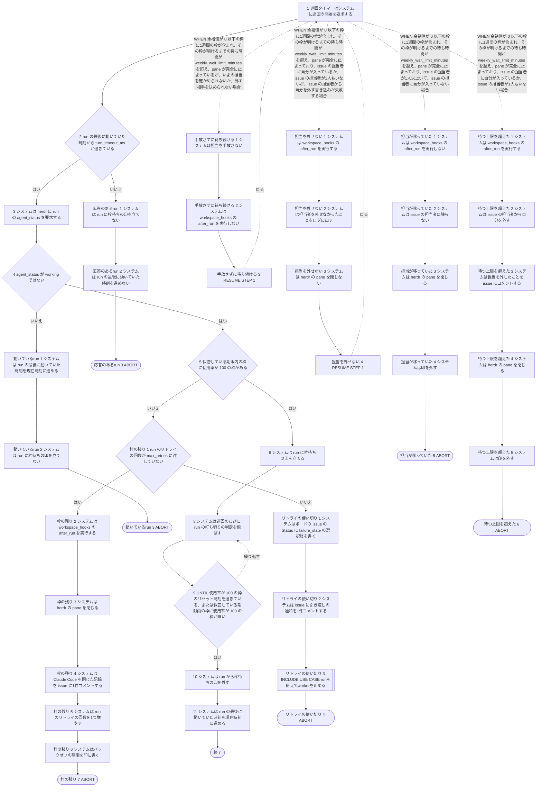
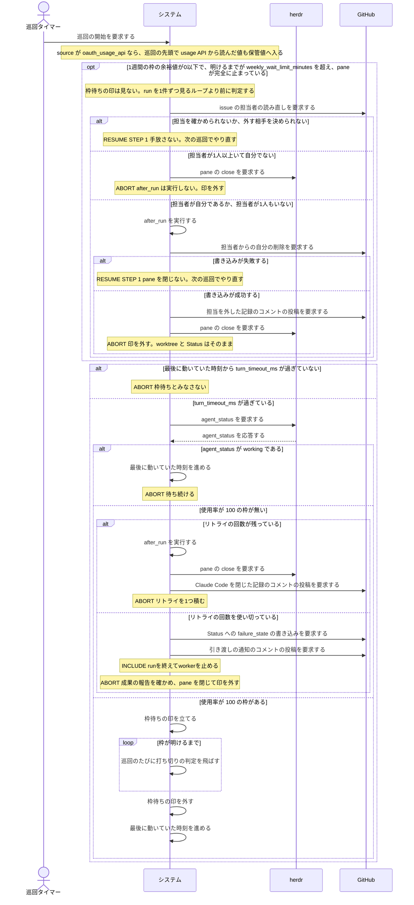

# ユースケース: 枠待ちのrunの打ち切りを止める

> **レートリミットの扱いのうち、巡回（`checkStalls`）が行う側だけを書いた記述である。**
> 枠が明けるのを待って継続の指示を送る側（turn の待ち）は `レートリミットで待って再開する` に在る。
> 2つは別の goroutine が独立に行うので、1本に並べると経路が掛け算で増える。分けて書く（人間の決定。2026-10-02）。
>
> **巡回は継続の指示を送らない。**印を立て、打ち切りを飛ばし、枠が明けたら印を外して時計を進めるところまでである。
> **pane を閉じてリトライを積む処理（`abandonRun`）は `issueを1件処理する` と同じ実装を通る。**
> この記述には、枠待ちの判定から出る入口と、終わったときの状態だけを書く。

## 根拠資料

- `docs/plans/continuo_design.md#3-4f`（巡回は、statusline取得の値が届いた知らせでも回る）
- `docs/plans/continuo_design.md#3-15`（使用率とリセット時刻の読み取り）
- `docs/plans/continuo_design.md#3-21`（打ち切りは `agent_status` で測る）
- `docs/plans/continuo_design.md#3-27`（レートリミットで止まっても自分で再開する。2条件と評価順・保管値の規則・1週間の枠を待つ上限）
- `docs/plans/continuo_design.md#3-77c`（担当を外された機械は push してはならない）
- `docs/plans/continuo_design.md#3-77i`（回復待ちの判定は、新しさを問わずに保管値を使い続ける。**待つ上限で担当を手放す判定と入札は、直前の読み取りに成功した値だけを使う**）
- `docs/plans/continuo_design.md#3-85c`（Claude Code を起動した pane を閉じたら、閉じた記録を書く）
- `docs/plans/continuo_design.md#5-2`（`rate_limit` の設定キー）
- `internal/orchestrator/reconcile.go` の `checkStalls`（巡回の評価順）、`clearQuotaWaitWhenBack`（巡回が印を外す2つの契機）、`releaseQuotaWaitExceeded`、`paneStopped`（手放しの唯一の入口）、`stalledReason`
- `internal/orchestrator/turn.go` の `isQuotaWaitingWith`、`runIdleForTurnTimeout`、`quotaResetAtOf`
- `internal/orchestrator/runstate.go` の `setWaitingQuota`、`clearWaitingQuota`（印を外すと同時に時計を進める）、`noteWorking`、`noteQuotaProbe`、`addRetry`
- `internal/orchestrator/lifecycle.go` の `abandonRunAsync`、`abandonRunClaimed`（リトライが残る枝と使い切った枝）、`runAfterRunOK`、`stopWorker`
- `internal/orchestrator/relay.go` の `settleClosedRecord`（閉じ損ねたら記録を書かない）
- `internal/orchestrator/handoff.go` の `weeklyWaitExceededWith`、`releaseBecauseQuotaWaitAsync`、`releaseBecauseQuotaWaitClaimed`（手放しの段0a から段4）、`mayReleaseOwnWork`、`releaseTargetFor`、`removeOwnAssignee`、`stopHandoffLostClaimed`
- `internal/orchestrator/orchestrator.go` の `Run`、`Tick`、`pollAPI`
- `internal/orchestrator/quota.go` の `OnAPISnapshot`、`windowsOfAPI`、`OnStatusline`、`shapeWindow`、`quotaSnapshot`、`quotaForPoll`
- `internal/orchestrator/statuslinefetch.go` の `maybeStartStatuslineFetch`
- `internal/handoff/handoff.go` の `Full`、`Short`、`ShortWeekly`（余裕が無い枠を選ぶ、唯一の線）

## RUCM

```rucm
USE CASE NAME: 枠待ちのrunの打ち切りを止める
BRIEF DESCRIPTION: 巡回タイマーが巡回を起こす。巡回は statusline取得の値が届いた知らせでも起きる。システムは進んだ形跡が turn_timeout_ms のあいだ無い run の agent_status を herdr から読む。システムは Claude の usage API か Claude Code のステータスラインから受けて保管している枠の使用率を読む。システムは使用率が 100 の枠があれば run に枠待ちの印を立てる。システムは枠待ちの印がある run の打ち切りの判定を飛ばす。システムは枠が明けたら枠待ちの印を外す。
PRECONDITION: システムは常駐している。走行中の run が1件以上ある。run は herdr の agent 名を持っている。run は direct chat に入っていない。run はバックオフの期限の内側にない。設定の claude.turn_timeout_ms は 0 より大きい。設定の rate_limit.source は none ではない。issue の Status は running_state の選択肢である。
PRIMARY ACTOR: 巡回タイマー
SECONDARY ACTORS: herdr
DEPENDENCY: INCLUDE USE CASE runを終えてworkerを止める
GENERALIZATION: なし

BASIC FLOW:
1. 巡回タイマーはシステムに巡回の開始を要求する。
2. システムは VALIDATES THAT run の最後に動いていた時刻から turn_timeout_ms が過ぎている。
3. システムは herdr に run の agent_status を要求する。
4. システムは VALIDATES THAT agent_status が working ではない。
5. システムは VALIDATES THAT 保管している期限内の枠に使用率が 100 の枠がある。
6. システムは run に枠待ちの印を立てる。
7. DO
8.   システムは巡回のたびに run の打ち切りの判定を飛ばす。
9. UNTIL 使用率が 100 の枠のリセット時刻を過ぎている、または保管している期限内の枠に使用率が 100 の枠が無い
10. システムは run から枠待ちの印を外す。
11. システムは run の最後に動いていた時刻を現在時刻に進める。
POSTCONDITION: run の枠待ちの印は外れている。run の最後に動いていた時刻は進んでいる。run の打ち切りの判定は再び効いている。run のリトライの回数は増えていない。issue の Status は running_state の選択肢のままである。herdr の pane は閉じていない。worktree は残っている。

SPECIFIC ALTERNATIVE FLOW 応答のあるrun:
RFS BASIC FLOW 2
1. システムは run に枠待ちの印を立てない。
2. システムは run の最後に動いていた時刻を進めない。
3. ABORT
POSTCONDITION: run の枠待ちの印は立っていない。run の打ち切りの判定は効いている。run の最後に動いていた時刻は進んでいない。herdr の pane は閉じていない。

SPECIFIC ALTERNATIVE FLOW 動いているrun:
RFS BASIC FLOW 4
1. システムは run の最後に動いていた時刻を現在時刻に進める。
2. システムは run に枠待ちの印を立てない。
3. ABORT
POSTCONDITION: run の枠待ちの印は立っていない。run の最後に動いていた時刻は進んでいる。run の打ち切りの判定は効いている。herdr の pane は閉じていない。

SPECIFIC ALTERNATIVE FLOW 枠の残り:
RFS BASIC FLOW 5
1. システムは VALIDATES THAT run のリトライの回数が max_retries に達していない。
2. システムは workspace_hooks の after_run を実行する。
3. システムは herdr の pane を閉じる。
4. システムは Claude Code を閉じた記録を issue に1件コメントする。
5. システムは run のリトライの回数を1つ増やす。
6. システムはバックオフの期限を印に書く。
7. ABORT
POSTCONDITION: run の枠待ちの印は立っていない。herdr の pane は閉じている。run のリトライの回数は1つ増えている。印は残っている。issue の Status は running_state の選択肢のままである。worktree は残っている。

SPECIFIC ALTERNATIVE FLOW リトライの使い切り:
RFS 枠の残り 1
1. システムはボードの issue の Status に failure_state の選択肢を書く。
2. システムは issue に引き渡しの通知を1件コメントする。
3. INCLUDE USE CASE runを終えてworkerを止める
4. ABORT
POSTCONDITION: issue の Status は failure_state の選択肢である。issue に引き渡しの通知のコメントが1件ある。印は外れている。worktree は残っている。

GLOBAL ALTERNATIVE FLOW 手放さずに待ち続ける:
BRANCH FROM BASIC FLOW 1
WHEN 余裕値が 0 以下の枠に1週間の枠が含まれ、その枠が明けるまでの待ち時間が weekly_wait_limit_minutes を超え、pane が完全に止まっているが、いまの担当を確かめられないか、外す相手を決められない場合
1. システムは担当を手放さない。
2. システムは workspace_hooks の after_run を実行しない。
3. RESUME STEP 1
POSTCONDITION: herdr の pane は閉じていない。issue の担当者は変わっていない。workspace_hooks の after_run は実行していない。worktree は残っている。issue の Status は running_state の選択肢のままである。

GLOBAL ALTERNATIVE FLOW 担当を外せない:
BRANCH FROM BASIC FLOW 1
WHEN 余裕値が 0 以下の枠に1週間の枠が含まれ、その枠が明けるまでの待ち時間が weekly_wait_limit_minutes を超え、pane が完全に止まっており、issue の担当者に自分が入っているか、issue の担当者が1人もいないが、issue の担当者から自分を外す書き込みが失敗する場合
1. システムは workspace_hooks の after_run を実行する。
2. システムは担当者を外せなかったことをログに出す。
3. システムは herdr の pane を閉じない。
4. RESUME STEP 1
POSTCONDITION: herdr の pane は閉じていない。issue の担当者は変わっていない。印は残っている。worktree は残っている。issue の Status は running_state の選択肢のままである。

GLOBAL ALTERNATIVE FLOW 担当が移っていた:
BRANCH FROM BASIC FLOW 1
WHEN 余裕値が 0 以下の枠に1週間の枠が含まれ、その枠が明けるまでの待ち時間が weekly_wait_limit_minutes を超え、pane が完全に止まっており、issue の担当者が1人以上いて、issue の担当者に自分が入っていない場合
1. システムは workspace_hooks の after_run を実行しない。
2. システムは issue の担当者に触らない。
3. システムは herdr の pane を閉じる。
4. システムは印を外す。
5. ABORT
POSTCONDITION: issue の担当者は別の機械のままである。issue に Claude Code を閉じた記録のコメントは増えていない。印は外れている。worktree は残っている。issue の Status は running_state の選択肢のままである。

GLOBAL ALTERNATIVE FLOW 待つ上限を超えた:
BRANCH FROM BASIC FLOW 1
WHEN 余裕値が 0 以下の枠に1週間の枠が含まれ、その枠が明けるまでの待ち時間が weekly_wait_limit_minutes を超え、pane が完全に止まっており、issue の担当者に自分が入っているか、issue の担当者が1人もいない場合
1. システムは workspace_hooks の after_run を実行する。
2. システムは issue の担当者から自分を外す。
3. システムは担当を外したことを issue にコメントする。
4. システムは herdr の pane を閉じる。
5. システムは印を外す。
6. ABORT
POSTCONDITION: issue の担当者から自分は外れている。issue に Claude Code を閉じた記録のコメントは増えていない。印は外れている。worktree は残っている。issue の Status は running_state の選択肢のままである。
```

## この記述で使う言葉

| 語 | 何を指すか |
| --- | --- |
| **枠待ちの印** | run が持つ `WaitingQuota`。立っているあいだ、巡回はその run の打ち切りの判定を飛ばす |
| **印** | 走行中の run の登録（`o.runs`）。外れるとスロットが空く。**枠待ちの印とは別物である** |
| **最後に動いていた時刻** | run が持つ `LastSeenAt`。打ち切りの時計である。hook を受けたとき・turn を送ったとき・`working` を見たとき・枠待ちの印を外したときに進む |
| **枠が明ける** | 「使用率が 100 の枠のリセット時刻を過ぎた」か「保管している期限内の枠に使用率が 100 の枠が無くなった」のどちらかが成り立つこと |

## 段にしていない分岐

**終わり方も、そのあと通る段も変わらない分岐は、段にせずここへ置く。**

| どこで | 何が起きるか | どうなるか |
| --- | --- | --- |
| 段3 | herdr が `agent.get` に誤りを返す | WARN を1行出し、**`working` ではないもの**として段5 へ進む（段4 の真の側） |
| 段2 より前 | 1週間の枠の余裕値が0以下で、明けるまでが上限を超えている | 手放しの判定が、段2 を通らない run（無音が閾値に達していない run）にも `agent.get` を投げることがある（この turn でまだ hook を受けていない run は、無音の長さを見ずに門を通る）。だから `応答のあるrun` は「agent_status を要求していない」とは言えない |
| 段6 | turn の待ちが先に同じ印を立てている（`レートリミットで待って再開する` の段3） | 巡回は印のある run を段2 より前で飛ばすので、段8 から通る。結果は同じである |
| 段10 | turn の待ちが先に印を外している | 巡回は外す run を見つけない。結果は同じである |
| `枠の残り`・手放しの2本の「pane を閉じる」 | herdr が pane を閉じ損ねる | **閉じた記録を書かない。**保留も捨てる（`settleClosedRecord`）。あとの段はそのまま続く。「その pane はもう無い」という誤りは、閉じたものとして扱う |
| `枠の残り` の「閉じた記録」 | relay が無効である、またはその pane で `agent.start` が済んでいない | 記録を書かない。あとの段はそのまま続く |
| `枠の残り` の入口 | 書き戻しが飛んでいて、終わらせる印を取れない | この巡回では打ち切らない。次の巡回でやり直す |
| `待つ上限を超えた` の段3 | 担当を外した記録（`released`）の投稿が失敗する | WARN を1行出して先へ進む。**担当は既に外れている**ので pane を閉じ、印を外す。記録のコメントは残らない |
| `待つ上限を超えた` の段1 | after_run が設定されていない・失敗した・既に走っていた | 走らせなかった理由をログへ出し、`released` の本文を「push を確かめられなかった」ほうにする。あとの段は同じである |
| `担当を外せない` の段2 | 毎巡回くり返す | **`removeOwnAssignee` の WARN は毎巡回出る。**1回だけなのは、そのあとの「枠の上限で担当を手放せませんでした」の行である（`noteQuotaReleaseFailed`）。after_run は1回目に走ったきりで、この attempt ではもう走らない |
| 手放しの4本の入口 | 手放しの判定の途中で、人間がカードを `tracker.direct_chat_state` へ動かす | after_run を走らせる直前でもう1度見て、見送る。pane も担当者もそのまま残す |

## 2つの判定を分ける

**線は2本である。問いが2つあるからである**（2026-09-06 の6段の段4 で確定。設計 3-27）。
**枠待ちの印は「使用率100」、新しい仕事を取るかと1週間の枠を待つ上限は「余裕値が0以下」。**
**`rate_limit.pause_above_percent` は、仕事を取るかを決める門から消えた**
（人間の決定。2026-09-06。issue #173）。**余裕値と同じことを2つの閾値で言っていて、
既定（マージン10）では、担当者のいない issue には余裕値が先に効くので、95%のこちらが効いていたのは、担当が自分の issue の着手だけだった（96%以上で、その巡回の着手を全部やめていた）。キーを消したので、96%以上でも担当が自分の issue は着手する。**
**キーごと消えた。**statusline取得を開くかの判定も同じ余裕値の線を使う
（`internal/orchestrator/statuslinefetch.go` の `statuslineFetchPointless`）。

| 判定 | 条件 | 何が起きるか |
| --- | --- | --- |
| 新規の着手を止める | **余裕値が 0 以下の枠がある**（`余裕値が0以下`）か、**使用率を1件も読めていない**（`枠を読めない`） | 入札の要る issue を取らない。**担当が既に自分にある issue は取る。**走行中の turn は止めない。時計も止めない。**どちらの理由で止めたかを、既定のログの水準で1行出す**（issue #173） |
| この run は枠待ちである | 使い切っている枠（使用率100）がある。かつ、その run から turn_timeout_ms のあいだ hook が届かない。**巡回では、その手前で `agent_status` が `working` でないことを見る** | 打ち切りの判定を飛ばす |
| 担当を手放す | 余裕値（`100 − 使用率 − マージン`。1週間のマージンは `tracker.provider.handoff.weekly_margin_percent`）が 0 以下の枠に1週間の枠が含まれ、待ち時間が weekly_wait_limit_minutes を超える。**かつ pane が完全に止まっている**（agent の状態の連番が変わらず、agent_status が idle か done）。かつ担当者に自分が入っているか、担当者が1人もいない。**枠待ちの印は見ない。****門の一覧は設計 3-27 の「段0 へ入る前に外すもの」が持つ**（ここには写さない） | after_run を走らせ、担当者から自分を外し、`released` を書き、pane を閉じて印を外す。**閉じた記録は書かない。**worktree と Status はそのまま |
| 人間が引き取っているので手放さない | 上の条件に当たるが、カードの Status が `tracker.direct_chat_state` の値である（設計 3-83） | 何もしない。**打ち切りの判定へも回さない。**pane も worktree も担当者もそのまま残す。**手放すと、人間の書きかけの木で after_run（利用者が書いた git push）が走り、担当者が外れ、released が出て、別の機械の入札を呼ぶ** |
| 画面を持っていないので手放さない | 上の条件に当たるが、この機械が agent 名を持っていない | 何もしない。`agent.get` が届かないので、止まったかどうかを確かめられない |
| 確かめられないので手放さない | 上の条件に当たるが、`gh` の持ち主か issue の担当者を読めない。または draft issue である | 何もしない。枠待ちの印はそのまま。次の巡回でやり直す（`手放さずに待ち続ける`） |
| 外せなかったので手放さない | 上の条件に当たり、after_run も走らせたが、担当者から自分を外す書き込みが失敗した | pane を閉じない。印も外さない。次の巡回でやり直す（`担当を外せない`）。**after_run はこの attempt ではもう走らない** |
| まだ止まっていないので手放さない | 上の条件に当たるが、pane が動いている（agent_status が working / blocked / unknown、または agent の状態の連番が2回続けて同じでない） | 手放さない。**`working` なら待つ。`blocked` と `unknown` と、`agent.get` を読めなかった run は、同じ巡回の打ち切りの判定へ回る**（基本フローの段2 以降。**使用率が100の枠があるあいだは閉じず、枠待ちとして残す**）。**打ち切りの判定から外れるのは、連番を初めて控えた巡回の1回だけである**（`paneStopped` が返す2つ目の値）。2回目以降の観測で連番が変わっていた run は、同じ巡回の打ち切りの判定へ落ちる。`weekly_wait_limit_minutes` を超過しうる |
| 担当が移っているので手放さない | 上の条件に当たるが、issue の担当者が1人以上いて、自分が入っていない | after_run を走らせずに pane を閉じ、印を外す。担当者にもコメントにも触らない（`担当が移っていた`） |

## 巡回の中で、どれが先に効くか

**巡回は、run を1件ずつ見るループ（基本フローの段2 から段6）へ入る前に、手放しの判定を走り切る。**
**使用率92%・pane が止まっている・担当者は自分、という状態では、`待つ上限を超えた` と `枠の残り` の
条件が同時に成り立つ。****手放しが先に効く。**だから手放しの4本は、段1（巡回の開始）から分かれる。

| 順 | 何を見るか | この記述のどこか |
| --- | --- | --- |
| 1 | **1週間の枠の余裕値が0以下で、明けるまでが上限を超えているか**（`releaseQuotaWaitExceeded`） | 段1 から分かれる手放しの4本 |
| 2 | **枠待ちの印が立っている run の枠が明けたか**（`clearQuotaWaitWhenBack`） | 段9 から段11 |
| 3 | **無音が turn_timeout_ms に達したか** | 段2 |
| 4 | **agent_status が working か**（`working` なら時計を進めて待つ） | 段3 と段4 |
| 5 | **使用率が 100 に達している枠があるか**（あれば枠待ちの印、無ければ打ち切り） | 段5 と段6、`枠の残り` |

**順4 を順5 より前に置く**（設計 3-27。issue #197）。枠待ちの条件は「長い1つのツール呼び出し」と区別できない。
後ろに置くと、正常に走っている run が枠待ちと名乗り、打ち切りの時計が止まったまま戻らない。

**順1 を後ろへ回すと、元の症状が戻る。**使用率90〜99 の帯では `枠の残り` が先に発火して pane を閉じ、
リトライを積む。**枠が足りないだけの issue が `failure_state` へ落ちる。**
巡回は、手放しの判定が**1回目の観測**をした run だけを「打ち切りの対象から外す集合」へ入れてからループへ入る
（手放しを撃った run は、終わらせる最中の印で外れる。2回目以降の観測で連番が変わっていた run は集合に入らず、打ち切りの判定へ落ちる）。

## 使用率は保管値から読む

**段5 は保管値を読むだけで、その場で問い合わせない**（設計 3-27）。保管値へ値を入れる口は2つある。

- **usage API。**`rate_limit.source: oauth_usage_api`（既定）なら、巡回の先頭で `rate_limit.poll_interval_ms`（既定5分）ごとに読む（`internal/orchestrator/orchestrator.go` の `pollAPI`、`internal/orchestrator/quota.go` の `OnAPISnapshot`）。**誤りのあいだは statusline へ切り替える**
- **ステータスライン。**continuo が起動する Claude Code のステータスラインが運ぶ `rate_limits` を `continuo statusline` が `sl.sock` へ送る（`OnStatusline`）。issue の pane の値は、`oauth_usage_api` でも usage API の次の読み取りを待たずに入る

システムは期間（5時間・7日・モデル別の週次枠 `weekly_scoped`）ごとに値を1つだけ保管する。**`weekly_scoped` は usage API しか運ばない。**

| 何を | どうするか |
| --- | --- |
| 段5 で読むもの | 保管値のうち、リセット時刻を過ぎていない期間（`quotaSnapshot`）。**新しさは問わない**（設計 3-77i。同じ期間の中で値は下がらない）。**担当を手放す判定だけは、直前の読み取りに成功した値を使う**（設計 3-27） |
| 保管値が無いとき | **専用の分岐は無い。**期限内の保管値が1つも無ければ、段5 は「使用率が 100 の枠は無い」と答え、`枠の残り` へ進む。枠待ちと無音を区別できない |
| 値が古いとき | `source: statusline` か、usage API が誤りで切り替えているなら、巡回の最後に開く条件を見て statusline取得を開く（`maybeStartStatuslineFetch`）。**巡回の中で値を待たない** |
| statusline取得の値が届いたとき | 巡回のループへ知らせ、巡回を1回すぐ回す（設計 3-4f） |
| 使用率が 100 の期間（`weekly_scoped` を除く）が期限内にあるとき | statusline取得を開かない。上限の最中は断られるだけで値は変わらない。**`weekly_scoped` に余裕が無いときも開かない**（ステータスラインに無いので、開いても判定が変わらない） |
| `weekly_scoped` | **1週間の使用率に含める**（1週間全体の枠とのうち、いちばん大きい使用率を採る。段5 の判定と、手放しの4本のフローの `WHEN` の両方が、その値を読む）。**`resets_at` が `null` で使用率が 100 以上なら保管値へ入らない**ので、そのあいだは段5 にも手放しにも効かない。閾値のキー（`rate_limit.pause_above_percent`）は消えた。`quota.json` から読み戻すのは `oauth_usage_api` のときだけ |
| 印を外す時刻（段9 の1つ目の条件） | 使用率が 100 の枠のうち、リセット時刻がいちばん遅いもの（`quotaResetAtOf`）。**保管値の中の使用率 100 の枠は、必ずリセット時刻を持つ。**usage API が `resets_at` を `null` で返した使用率 100 以上の期間は保管値へ入れず（`windowsOfAPI`）、ステータスラインの期間は `resets_at` が今より後のものだけを入れる（`shapeWindow`） |
| `resets_at` が `null` の枠だけを使い切っている機械 | **枠待ちにならない。**写しに使用率 100 の枠が無いので段5 が偽になり、`枠の残り` へ進む（pane を閉じてリトライを積む） |
| 段9 の2つ目の条件が効くとき | 印を立てたあとに届いた新しい値で、使用率 100 の枠が写しから無くなったとき（リセット時刻より前に値が下がった場合） |

## フローチャート



## シーケンス図


