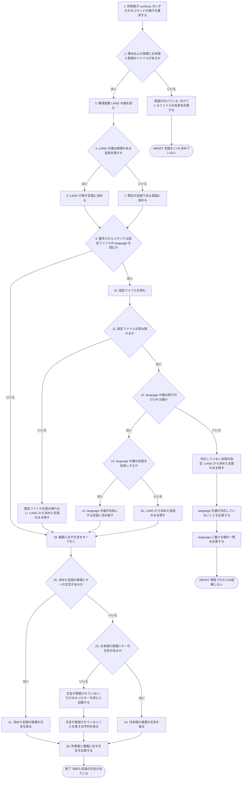
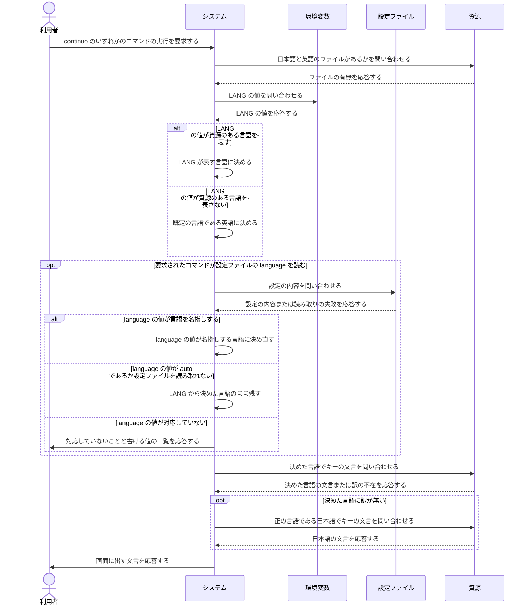

# ユースケース: 画面に出す文言の言語を決める

## 根拠資料

- `docs/plans/continuo_design.md` の「3-35. 画面に出す文言は資源から引く」（言語の決め方・設定を主とし環境変数を従とすること・どれでも決まらないときを英語にする理由・読む環境変数を増やさない理由・資源の無い言語を書いたら起動を止めること）
- `docs/plans/continuo_design.md` の「3-35b. 資源の正は日本語である」（訳の無いキーを日本語へ落とすこと・`ja.json` が空なら起動しないこと・`en.json` が空でも起動すること）
- `docs/plans/continuo_design.md` の「3-35c. symlink にも hardlink にもできない」（`en.json` を `ja.json` の複製として持つ理由）
- `internal/i18n/i18n.go` の `init` / `FromEnv` / `ParseLocale` / `Resolve` / `Use` / `Current` / `currentCatalog`
- `internal/i18n/i18n.go` の `Catalog.Lookup` / `Catalog.pattern` / `Catalog.T` / `Catalog.Errorf` / `recordMissing` / `Missing`
- `internal/i18n/i18n.go` の `SourceLang` / `DefaultLang` / `EnvLangName` / `LangConfigAuto` / `MetaKeyPrefix`
- `internal/cli/cli.go` の `RunWith` / `useLanguageFromConfig` / `useLanguage`
- `internal/cli/cli.go` の `runTrust` / `runDoctor` / `runAbandon` / `runMain`
- `internal/config/validate.go` の `validateLanguage`
- `internal/config/types.go` の `Config` の `Language`
- `internal/config/default.go` の `language` の既定値

## いつ走るか

**利用者がどのサブコマンドを打っても、起動の直後に必ず1回走る。**
`internal/cli/cli.go` の `RunWith` が、引数を振り分けるより前に環境変数から言語を決める。
**引数の誤りを報告する文言も、この決定のあとに出る。**

**設定ファイルを読むコマンドは、そのあとでもう一度決め直す。**
**設定が主で、環境変数が従である。**

## どのコマンドが設定ファイルの language を読むか

| コマンド | 設定ファイルの language を読むか | 読む場所 |
| --- | --- | --- |
| `continuo`（常駐プロセス） | 読む | `internal/cli/cli.go` の `runMain` |
| `continuo doctor` | 読む | `internal/cli/cli.go` の `runDoctor` |
| `continuo abandon` | 読む | `internal/cli/cli.go` の `runAbandon` |
| `continuo trust` | 読む | `internal/cli/cli.go` の `runTrust` |
| `continuo init` / `continuo setup` / `continuo hook` / `continuo version` / `continuo allow-keychain-access` | 読まない | 環境変数から決めた言語のまま出す |

**`continuo trust` だけは決め直す場所が違う。**設定を読めなければ `continuo trust` はそこで終わるので、
自分で設定を読んでから決め直す。**残りの3つは `useLanguageFromConfig` に読ませ、読めなければ黙って戻る**
（読めないこと自体は、それぞれのコマンドが自分の文言で報告する）。

## 環境変数から言語を決める規則

**読むのは `LANG` だけである。**`LC_ALL` と `LC_MESSAGES` は読まない。
設定ファイルの `language` で直接指定できるので、読む変数を増やすと、どれが効いたのかを説明できなくなる。

| `LANG` の値 | 決まる言語 |
| --- | --- |
| `ja_JP.UTF-8` / `ja-JP` / `ja` | 日本語 |
| `en_US.UTF-8` / `en` | 英語 |
| `C` / `POSIX` / 空 / 未設定 | 英語（既定の言語） |
| `fr_FR.UTF-8` のような資源の無い言語 | 英語（既定の言語） |

**文字集合（`.UTF-8`）と修飾子（`@euro`）と地域（`_JP`）は落としてから見る**
（`internal/i18n/i18n.go` の `ParseLocale`）。

## 正の言語と既定の言語は別である

| 何 | どの言語か | 何のためのものか |
| --- | --- | --- |
| 正の言語（`SourceLang`） | 日本語 | 文言を書くときの原文。**訳の無いキーの落とし先** |
| 既定の言語（`DefaultLang`） | 英語 | **設定でも環境変数でも決まらなかったときに出す言語** |

**この2つが食い違っていてよい**（設計 3-35b）。continuo は公開して配るので、
`LANG` を持たない環境で日本語が出ると、読めない人が最初の画面で詰まる。

## RUCM

```rucm
USE CASE NAME: 画面に出す文言の言語を決める
BRIEF DESCRIPTION: 利用者は continuo のいずれかのコマンドを実行する。システムは起動の直後に環境変数 LANG から画面に出す文言の言語を決める。システムは設定ファイルの language を読むコマンドでは、設定ファイルの値で言語を決め直す。システムはどちらでも決まらない場合に既定の言語である英語を使う。システムは決めた言語の資源に訳の無いキーを、正の言語である日本語へ落とす。
PRECONDITION: 利用者は continuo の実行ファイルを実行できる。実行ファイルには言語ごとの資源が埋め込まれている。
PRIMARY ACTOR: 利用者
SECONDARY ACTORS: なし
DEPENDENCY: なし
GENERALIZATION: なし

BASIC FLOW:
1. 利用者はシステムに continuo のいずれかのコマンドの実行を要求する。
2. システムは VALIDATES THAT 埋め込んだ資源に正の言語である日本語のファイルと既定の言語である英語のファイルがある。
3. システムは環境変数 LANG の値を読む。
4. IF 環境変数 LANG の値が資源のある言語を表す THEN
5.   システムは環境変数 LANG が表す言語を画面に出す文言の言語に決める。
6. ELSE
7.   システムは既定の言語である英語を画面に出す文言の言語に決める。
8. ENDIF
9. IF 利用者が要求したコマンドが設定ファイルの language を読む THEN
10.   システムは設定ファイルを読む。
11.   システムは VALIDATES THAT 設定ファイルを読み取れる。
12.   システムは VALIDATES THAT 設定ファイルの language の値が受け付けられる値である。
13.   IF 設定ファイルの language の値が言語を名指しする THEN
14.     システムは language の値が名指しする言語を画面に出す文言の言語に決め直す。
15.   ELSE
16.     システムは環境変数 LANG から決めた言語を画面に出す文言の言語のまま残す。
17.   ENDIF
18. ENDIF
19. システムは画面に出す文言をキーで引く。
20. IF 画面に出す文言の言語の資源にキーの文言がある THEN
21.   システムは画面に出す文言の言語の資源の文言を画面に出す文言に採る。
22. ELSE
23.   システムは VALIDATES THAT 正の言語である日本語の資源にキーの文言がある。
24.   システムは日本語の資源の文言を画面に出す文言に採る。
25. ENDIF
26. システムは利用者に画面に出す文言を応答する。
POSTCONDITION: 画面に出す文言の言語が1つ決まっている。設定ファイルの language が言語を名指しする実行では、決まった言語は language の値が名指しする言語である。設定ファイルの language を読まない実行では、決まった言語は環境変数 LANG から決めた言語である。利用者への応答は決まった言語の資源の文言である。

SPECIFIC ALTERNATIVE FLOW 資源が欠けている:
RFS BASIC FLOW 2
1. システムは利用者に欠けている資源のファイルの名前を応答する。
2. ABORT
POSTCONDITION: システムは画面に出す文言の言語を1つも決めていない。システムは利用者が要求したコマンドの処理を1つも行わない。欠けている資源のファイルの名前が出力されている。

SPECIFIC ALTERNATIVE FLOW 設定ファイルを読み取れない:
RFS BASIC FLOW 11
1. システムは環境変数 LANG から決めた言語を画面に出す文言の言語のまま残す。
2. RESUME STEP 19
POSTCONDITION: 画面に出す文言の言語は環境変数 LANG から決めた言語である。システムは設定ファイルの language の値を画面に出す文言の言語に採っていない。利用者が要求したコマンドは、設定ファイルを読めないことを自分の文言で報告する。

SPECIFIC ALTERNATIVE FLOW 対応していない言語の指定:
RFS BASIC FLOW 12
1. システムは環境変数 LANG から決めた言語を画面に出す文言の言語のまま残す。
2. システムは利用者に設定ファイルの language の値が対応していないことを応答する。
3. システムは利用者に language に書ける値の一覧を応答する。
4. ABORT
POSTCONDITION: 画面に出す文言の言語は環境変数 LANG から決めた言語である。システムは対応していない値を画面に出す文言の言語に採っていない。常駐プロセスは起動しない。language に書ける値の一覧が出力されている。

SPECIFIC ALTERNATIVE FLOW 文言が登録されていない:
RFS BASIC FLOW 23
1. システムは引けなかったキーを控えに記録する。
2. システムは文言が登録されていないことを表す文字列を画面に出す文言に採る。
3. RESUME STEP 26
POSTCONDITION: 画面に出す文言は引けなかったキーだけの文字列ではない。引けなかったキーが控えに残っている。控えが空でない状態はシステムの実装の誤りである。
```

## フローチャート



## シーケンス図


