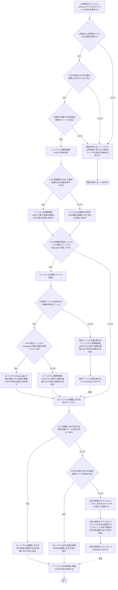
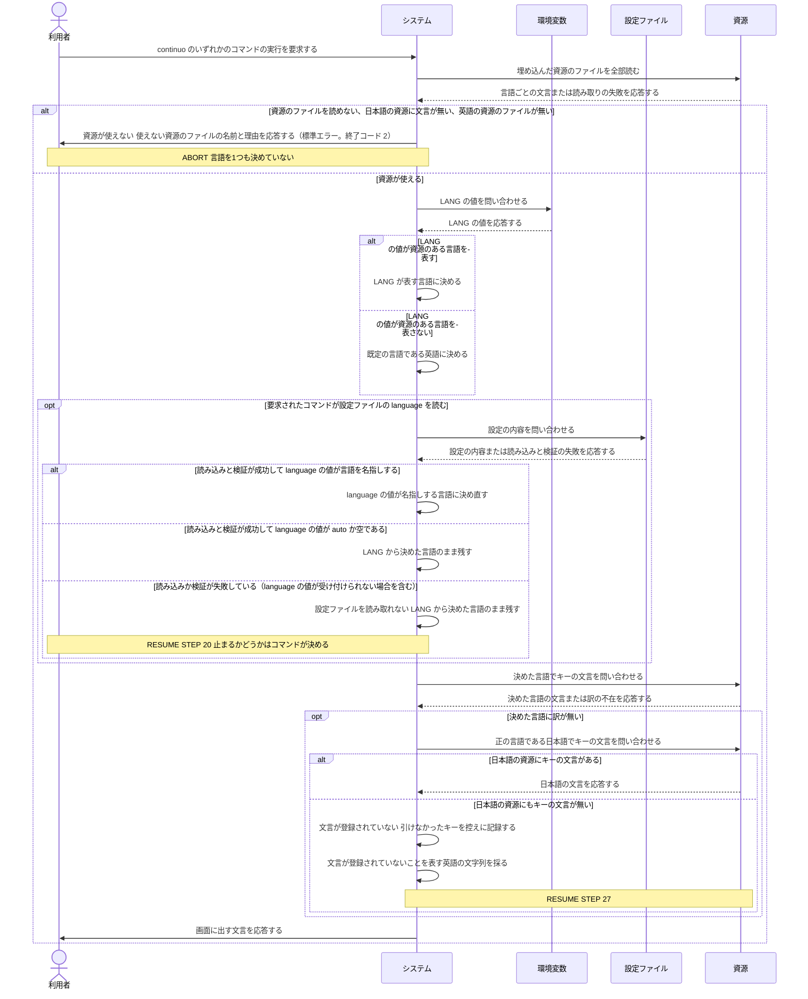

# ユースケース: 画面に出す文言の言語を決める

## 根拠資料

- `docs/plans/continuo_design.md` の「3-35. 画面に出す文言は資源から引く」（言語の決め方・設定を主とし環境変数を従とすること・どれでも決まらないときを英語にする理由・読む環境変数を増やさない理由）
- `docs/plans/continuo_design.md` の「3-35b. 資源の正は日本語である」（訳の無いキーを日本語へ落とすこと・`ja.json` が空なら起動しないこと・`en.json` が空でも起動すること・`en.json` に全キーの訳が入っていること）
- `docs/plans/continuo_design.md` の「3-35g. 資源の複製は symlink にも hardlink にもできない」（`en.json` が symlink だと、既定の言語の資源が無いとして起動時に落ちること）
- `internal/i18n/i18n.go` の `init` / `readMessages` / `FromEnv` / `ParseLocale` / `Supported` / `Resolve` / `Use` / `Current` / `currentCatalog`
- `internal/i18n/i18n.go` の `Catalog.Lookup` / `Catalog.pattern` / `Catalog.T` / `Catalog.Errorf` / `recordMissing` / `Missing`
- `internal/i18n/i18n.go` の `SourceLang` / `DefaultLang` / `EnvLangName` / `LangConfigAuto` / `MetaKeyPrefix`
- `internal/cli/cli.go` の `RunWith` / `useLanguageFromConfig` / `useLanguage`
- `internal/cli/cli.go` の `runDoctorMissingKeysPatch`（`continuo doctor --missing-keys-patch`）
- `internal/cli/cli.go` の `runTrust` / `runDoctor` / `runAbandon` / `runMain` / `runPrompt` / `runSetup`
- `internal/config/config.go` の `Load`
- `internal/config/validate.go` の `validate` / `validateLanguage`
- `internal/config/types.go` の `Config` の `Language`
- `internal/config/default.go` の `language` の既定値
- `internal/daemon/daemon.go` の `Run`、`internal/abandon/abandon.go` の `Run`、`internal/doctor/checks.go` の `checkConfig`（設定を読めないときに、それぞれのコマンドが何を返すか）

## いつ走るか

**利用者がどのサブコマンドを打っても、起動の直後に必ず1回走る。**
`internal/cli/cli.go` の `RunWith` が、引数を振り分けるより前に環境変数から言語を決める。
**引数の誤りを報告する文言も、この決定のあとに出る。**

**設定ファイルを読むコマンドは、そのあとでもう一度決め直す。**
**設定が主で、環境変数が従である。**

**ネットワークインストーラー（`install.sh`）は、この決め方の外である。**言語を決める処理を持たず、文言は日本語に固定である（英語は、release がまだ1つも無いときの画面の1行だけ）。

**資源の検査は、それより前に走る。**`internal/i18n/i18n.go` の `init` は package の初期化なので、
`RunWith` が動くより前に終わっている。

## どのコマンドが設定ファイルの language を読むか

| コマンド | 設定ファイルの language を読むか | 読む場所 |
| --- | --- | --- |
| `continuo`（常駐プロセス） | 読む | `internal/cli/cli.go` の `runMain` |
| `continuo doctor` | 読む | `internal/cli/cli.go` の `runDoctor` |
| `continuo abandon` | 読む | `internal/cli/cli.go` の `runAbandon` |
| `continuo trust` | 読む | `internal/cli/cli.go` の `runTrust` |
| `continuo prompt` | 読む（`--builtin` を除く） | `internal/cli/cli.go` の `runPrompt` |
| `continuo setup` | 読む | `internal/cli/cli.go` の `runSetup` |
| `continuo init` / `continuo hook` / `continuo statusline` / `continuo version` / `continuo allow-keychain-access` | 読まない | 環境変数から決めた言語のまま出す |

**`continuo prompt --builtin` だけは読まない。**組み込みの指示書は実行ファイルの中にあるので、
設定が壊れている利用者でも読める。**そのために設定を1バイトも読まずに返す。**

**読むコマンドでも、設定を読む段より前に終わる実行は読まない。**
引数の誤り・`--help` の使い方・作業ディレクトリを引けない・設定ファイルの場所を決められない、が当たる
（`continuo doctor` だけは、場所を決められなくても警告を出して先へ進む）。
その実行の文言は、環境変数から決めた言語のまま出る。

**`continuo trust` と `continuo setup` は決め直す場所が違う。**この2つは自分で `config.Load` を呼んでから `useLanguage` で決め直す。
**残りは `useLanguageFromConfig` に読ませ、読めなければ黙って戻る**
（読めないこと自体は、それぞれのコマンドが自分の文言で報告する）。

**`continuo setup` が読むのは、書き換える `WORKFLOW.md` があると確かめたあとである。**
それより前に出る文言は、環境変数から決めた言語のまま出る。
引数の誤り・`--help` の使い方と、`scaffold.CheckUpdatable` が返す失敗の全部
（ディレクトリが無い・ディレクトリでない・`WORKFLOW.md` が無い・symlink である・Status のキーが無い・キーの値を書き換えられない）が当たる。

## 設定を読めないとき、止まるかどうかはコマンドで決まる

**`language` に書けない値を書いたときも、ここに入る。**
`language` の検査（`internal/config/validate.go` の `validateLanguage`）は `config.Load` の中で走るので、
**「設定ファイルを読めない」と「`language` の値が対応していない」は、実装では同じ1つの失敗である。**
言語を決める処理は、どちらでも同じことをする。**環境変数から決めた言語のまま残す。**止まるかどうかを決めない。

**止まるかどうかを決めるのは、それぞれのコマンドである。**

| コマンド | 止まるか | 何がどこへ出るか | 終了コード | 根拠 |
| --- | --- | --- | --- | --- |
| `continuo`（常駐プロセス） | 止まる | 起動の案内を標準出力へ出したあと、起動できない理由を標準エラーのログへ出す | 1 | `runMain`、`internal/daemon/daemon.go` の `Run` |
| `continuo trust` | 止まる | 読めない理由を標準エラーへ出す | 3 | `runTrust` |
| `continuo prompt`（`--builtin` を除く） | 止まる | 読めない理由を標準エラーへ出す。プロンプトの文面は1文字も出さない | 1 | `runPrompt` |
| `continuo abandon` | 止まる | 読めない理由を標準エラーへ出す | 1 | `internal/abandon/abandon.go` の `Run` |
| `continuo doctor`（下の2つを除く） | **続ける** | 見出し語 `設定ファイル` の行を `✗` で標準出力へ出す。残りの検査も行う | 1 | `runDoctor`、`internal/doctor/checks.go` の `checkConfig` |
| `continuo doctor --missing-keys-patch` | 検査を1つも行わない | ファイルを読めないか front matter を切り出せなければ、理由を標準エラーへ1行出す。`language` の値が受け付けられないだけでファイルを読めるなら、差分を標準出力へ出す（足す項目が無ければ何も出さない） | 読めなければ 1、読めれば 0 | `runDoctor`、`runDoctorMissingKeysPatch` |
| `continuo doctor`（接続先を差し替える環境変数の値が不正） | 止まる | 理由を標準エラーへ出す。検査結果は出さない | 3 | `runDoctor` |
| `continuo setup` | **続ける** | 読めない理由を標準エラーへ1行出す。対話へ進む | 対話の結果で決まる | `runSetup` |

**`language` に書けない値を書いたときは、理由の中に書ける値の一覧が入る**
（`validateLanguage` が返すエラーが `"auto"` と資源のある言語の一覧を持つ）。
**この一覧の文は資源から引いていないので、決めた言語によらず日本語で出る**（設計 3-35 の「移し残し」の表）。

**`continuo setup` が止まらない理由。**`continuo setup` は、`continuo init` が `gh` から値を引けずプレースホルダの残った `WORKFLOW.md` に対しても走るコマンドであり、
止めると、その利用者が Status の割り当てを1回も終えられなくなる。

## 環境変数から言語を決める規則

**読むのは `LANG` だけである。**`LC_ALL` と `LC_MESSAGES` は読まない。
設定ファイルの `language` で直接指定できるので、読む変数を増やすと、どれが効いたのかを説明できなくなる。

| `LANG` の値 | 決まる言語 |
| --- | --- |
| `ja_JP.UTF-8` / `ja-JP` / `ja` | 日本語 |
| `en_US.UTF-8` / `en` | 英語 |
| `C` / `POSIX` / 空 / 未設定 | 英語（既定の言語） |
| `fr_FR.UTF-8` のような資源の無い言語 | 英語（既定の言語） |

**文字集合（`.UTF-8`）と修飾子（`@euro`）と地域（`_JP`）は落としてから見る**
（`internal/i18n/i18n.go` の `ParseLocale`）。

## 正の言語と既定の言語は別である

| 何 | どの言語か | 何のためのものか |
| --- | --- | --- |
| 正の言語（`SourceLang`） | 日本語 | 文言を書くときの原文。**訳の無いキーの落とし先** |
| 既定の言語（`DefaultLang`） | 英語 | **設定でも環境変数でも決まらなかったときに出す言語** |

**この2つが食い違っていてよい**（設計 3-35b）。continuo は公開して配るので、
`LANG` を持たない環境で日本語が出ると、読めない人が最初の画面で詰まる。

## 資源が使えないとき

**`internal/i18n/i18n.go` の `init` が panic する。**条件は3つある。どれも、コマンドの処理が1つも走る前に終わる。

| 条件 | panic の文に入るもの |
| --- | --- |
| 埋め込んだ資源のディレクトリか、資源のファイルのどれかを読めない（JSON として読めない場合と、値が文字列でない場合を含む） | 読めなかったファイルの名前と理由 |
| 正の言語である日本語の資源に文言が1つも無い（ファイルが無い場合と、文言ではない項目しか無い場合を含む） | `messages/ja.json` |
| 既定の言語である英語の資源のファイルが無い（中身が空でも、ファイルが在れば通る） | `messages/en.json` |

**終了コードは 2 で、文は標準エラーへ出る。標準出力には何も出ない**
（2026-10-02 に、`init` で panic するだけの Go のプログラムをビルドして実測した。continuo の実行ファイルそのものでは測っていない）。

## RUCM

```rucm
USE CASE NAME: 画面に出す文言の言語を決める
BRIEF DESCRIPTION: 利用者は continuo のいずれかのコマンドを実行する。システムは起動の直後に環境変数 LANG から画面に出す文言の言語を決める。システムは設定ファイルの language を読むコマンドでは、設定ファイルの値で言語を決め直す。システムは設定ファイルを読めない場合に環境変数 LANG から決めた言語のまま残す。システムはどちらでも決まらない場合に既定の言語である英語を使う。システムは決めた言語の資源に訳の無いキーを、正の言語である日本語へ落とす。
PRECONDITION: 利用者は continuo の実行ファイルを実行できる。
PRIMARY ACTOR: 利用者
SECONDARY ACTORS: なし
DEPENDENCY: なし
GENERALIZATION: なし

BASIC FLOW:
1. 利用者はシステムに continuo のいずれかのコマンドの実行を要求する。
2. システムは VALIDATES THAT 埋め込んだ資源のファイルを全部読み取れる。
3. システムは VALIDATES THAT 正の言語である日本語の資源に文言が1つ以上ある。
4. システムは VALIDATES THAT 既定の言語である英語の資源のファイルがある。
5. システムは環境変数 LANG の値を読む。
6. IF 環境変数 LANG の値が資源のある言語を表す THEN
7.   システムは環境変数 LANG が表す言語を画面に出す文言の言語に決める。
8. ELSE
9.   システムは既定の言語である英語を画面に出す文言の言語に決める。
10. ENDIF
11. IF 利用者が要求したコマンドが設定ファイルの language を読む THEN
12.   システムは設定ファイルを読む。
13.   システムは VALIDATES THAT 設定ファイルの読み込みと検証が成功している。
14.   IF 設定ファイルの language の値が言語を名指しする THEN
15.     システムは language の値が名指しする言語を画面に出す文言の言語に決め直す。
16.   ELSE
17.     システムは環境変数 LANG から決めた言語を画面に出す文言の言語のまま残す。
18.   ENDIF
19. ENDIF
20. システムは画面に出す文言をキーで引く。
21. IF 画面に出す文言の言語の資源にキーの文言がある THEN
22.   システムは画面に出す文言の言語の資源の文言を画面に出す文言に採る。
23. ELSE
24.   システムは VALIDATES THAT 正の言語である日本語の資源にキーの文言がある。
25.   システムは日本語の資源の文言を画面に出す文言に採る。
26. ENDIF
27. システムは利用者に画面に出す文言を応答する。
POSTCONDITION: 画面に出す文言の言語が1つ決まっている。設定ファイルの読み込みと検証が成功して language が言語を名指しする実行では、決まった言語は language の値が名指しする言語である。残りの実行では、決まった言語は環境変数 LANG から決めた言語である。決まった言語の資源にキーの文言がある実行では、利用者への応答は決まった言語の資源の文言である。決まった言語の資源にキーの文言がなくて日本語の資源にキーの文言がある実行では、利用者への応答は日本語の資源の文言である。日本語の資源にもキーの文言がない実行では、利用者への応答は文言が登録されていないことを表す文字列である。

BOUNDED ALTERNATIVE FLOW 資源が使えない:
RFS BASIC FLOW 2,3,4
1. システムは利用者に使えない資源のファイルの名前と理由を応答する。
2. ABORT
POSTCONDITION: システムは画面に出す文言の言語を1つも決めていない。システムは利用者が要求したコマンドの処理を1つも行っていない。使えない資源のファイルの名前と理由は標準エラーに出ている。標準出力には何も出ていない。終了コード 2 が返っている。

SPECIFIC ALTERNATIVE FLOW 設定ファイルを読み取れない:
RFS BASIC FLOW 13
1. システムは環境変数 LANG から決めた言語を画面に出す文言の言語のまま残す。
2. RESUME STEP 20
POSTCONDITION: 画面に出す文言の言語は環境変数 LANG から決めた言語である。システムは設定ファイルの language の値を画面に出す文言の言語に採っていない。設定ファイルの language の値が受け付けられない値である実行も、設定ファイルを読み取れない実行と同じ扱いである。言語を決める処理は、利用者が要求したコマンドを止めていない。利用者が要求したコマンドは、設定ファイルを読めない理由を環境変数 LANG から決めた言語の文言で報告する。検査を行う実行の continuo doctor と continuo setup は、報告したあとも処理を続ける。検査を行わない実行の continuo doctor は、処理を続けない。常駐プロセスと continuo trust と continuo prompt と continuo abandon は、報告して終わる。

SPECIFIC ALTERNATIVE FLOW 文言が登録されていない:
RFS BASIC FLOW 24
1. システムは引けなかったキーを控えに記録する。
2. システムは文言が登録されていないことを表す英語の文字列を画面に出す文言に採る。
3. RESUME STEP 27
POSTCONDITION: 画面に出す文言は引けなかったキーだけの文字列ではない。画面に出す文言は引けなかったキーを含む英語の文字列である。引けなかったキーが控えに残っている。控えが空でない状態はシステムの実装の誤りである。
```

## フローチャート


```mermaid
flowchart TD
    BS1["1 利用者はシステムに continuo のいずれかのコマンドの実行を要求する"]
    BS2{"2 埋め込んだ資源のファイルを全部読み取れる"}
    BS3{"3 正の言語である日本語の資源に文言が1つ以上ある"}
    BS4{"4 既定の言語である英語の資源のファイルがある"}
    BS5["5 システムは環境変数 LANG の値を読む"]
    BS6{"6 IF 環境変数 LANG の値が資源のある言語を表す THEN"}
    BS7["7 システムは環境変数 LANG が表す言語を画面に出す文言の言語に決める"]
    BS9["9 システムは既定の言語である英語を画面に出す文言の言語に決める"]
    BS11{"11 IF 利用者が要求したコマンドが設定ファイルの language を読む THEN"}
    BS12["12 システムは設定ファイルを読む"]
    BS13{"13 設定ファイルの読み込みと検証が成功している"}
    BS14{"14 IF 設定ファイルの language の値が言語を名指しする THEN"}
    BS15["15 システムは language の値が名指しする言語を画面に出す文言の言語に決め直す"]
    BS17["17 システムは環境変数 LANG から決めた言語を画面に出す文言の言語のまま残す"]
    BS20["20 システムは画面に出す文言をキーで引く"]
    BS21{"21 IF 画面に出す文言の言語の資源にキーの文言がある THEN"}
    BS22["22 システムは画面に出す文言の言語の資源の文言を画面に出す文言に採る"]
    BS24{"24 正の言語である日本語の資源にキーの文言がある"}
    BS25["25 システムは日本語の資源の文言を画面に出す文言に採る"]
    BS27["27 システムは利用者に画面に出す文言を応答する"]
    A1S1["資源が使えない 1 システムは利用者に使えない資源のファイルの名前と理由を応答する"]
    A1S2(["資源が使えない 2 ABORT"])
    A2S1["設定ファイルを読み取れない 1 システムは環境変数 LANG から決めた言語を画面に出す文言の言語のまま残す"]
    A2S2["設定ファイルを読み取れない 2 RESUME STEP 20"]
    A3S1["文言が登録されていない 1 システムは引けなかったキーを控えに記録する"]
    A3S2["文言が登録されていない 2 システムは文言が登録されていないことを表す英語の文字列を画面に出す文言に採る"]
    A3S3["文言が登録されていない 3 RESUME STEP 27"]
    BS1 --> BS2
    BS2 -- はい --> BS3
    BS2 -- いいえ --> A1S1
    BS3 -- はい --> BS4
    BS3 -- いいえ --> A1S1
    BS4 -- はい --> BS5
    BS4 -- いいえ --> A1S1
    BS5 --> BS6
    BS6 -- はい --> BS7
    BS6 -- いいえ --> BS9
    BS7 --> BS11
    BS9 --> BS11
    BS11 -- はい --> BS12
    BS11 -- いいえ --> BS20
    BS12 --> BS13
    BS13 -- はい --> BS14
    BS13 -- いいえ --> A2S1
    BS14 -- はい --> BS15
    BS14 -- いいえ --> BS17
    BS15 --> BS20
    BS17 --> BS20
    BS20 --> BS21
    BS21 -- はい --> BS22
    BS21 -- いいえ --> BS24
    BS22 --> BS27
    BS24 -- はい --> BS25
    BS24 -- いいえ --> A3S1
    BS25 --> BS27
    A1S1 --> A1S2
    A2S1 --> A2S2
    A2S2 -. "戻る" .-> BS20
    A3S1 --> A3S2
    A3S2 --> A3S3
    A3S3 -. "戻る" .-> BS27
    BS27 --> END(["終了"])
```

## シーケンス図


```mermaid
sequenceDiagram
    actor 利用者
    participant システム
    participant 環境変数
    participant 設定ファイル
    participant 資源

    利用者->>システム: continuo のいずれかのコマンドの実行を要求する
    システム->>資源: 埋め込んだ資源のファイルを全部読む
    資源-->>システム: 言語ごとの文言または読み取りの失敗を応答する
    alt 資源のファイルを読めない、日本語の資源に文言が無い、英語の資源のファイルが無い
        システム->>利用者: 資源が使えない 使えない資源のファイルの名前と理由を応答する（標準エラー。終了コード 2）
        Note over 利用者,システム: ABORT 言語を1つも決めていない
    else 資源が使える
        システム->>環境変数: LANG の値を問い合わせる
        環境変数-->>システム: LANG の値を応答する

        alt LANG の値が資源のある言語を表す
            システム->>システム: LANG が表す言語に決める
        else LANG の値が資源のある言語を表さない
            システム->>システム: 既定の言語である英語に決める
        end

        opt 要求されたコマンドが設定ファイルの language を読む
            システム->>設定ファイル: 設定の内容を問い合わせる
            設定ファイル-->>システム: 設定の内容または読み込みと検証の失敗を応答する
            alt 読み込みと検証が成功して language の値が言語を名指しする
                システム->>システム: language の値が名指しする言語に決め直す
            else 読み込みと検証が成功して language の値が auto か空である
                システム->>システム: LANG から決めた言語のまま残す
            else 読み込みか検証が失敗している（language の値が受け付けられない場合を含む）
                システム->>システム: 設定ファイルを読み取れない LANG から決めた言語のまま残す
                Note over 利用者,システム: RESUME STEP 20 止まるかどうかはコマンドが決める
            end
        end

        システム->>資源: 決めた言語でキーの文言を問い合わせる
        資源-->>システム: 決めた言語の文言または訳の不在を応答する

        opt 決めた言語に訳が無い
            システム->>資源: 正の言語である日本語でキーの文言を問い合わせる
            alt 日本語の資源にキーの文言がある
                資源-->>システム: 日本語の文言を応答する
            else 日本語の資源にもキーの文言が無い
                システム->>システム: 文言が登録されていない 引けなかったキーを控えに記録する
                システム->>システム: 文言が登録されていないことを表す英語の文字列を採る
                Note over システム,資源: RESUME STEP 27
            end
        end

        システム->>利用者: 画面に出す文言を応答する
    end
```
