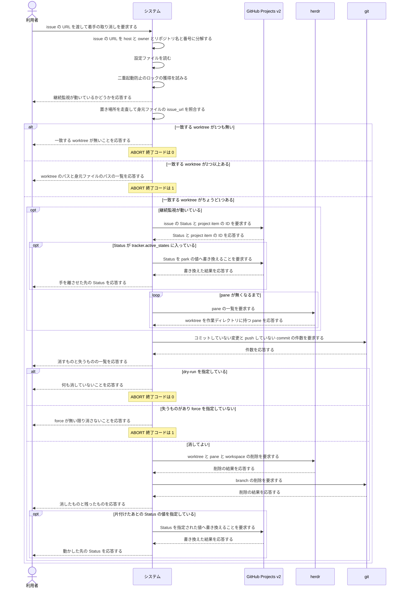

<!-- 目的: 間違えて着手した issue を `continuo abandon` で着手する前へ戻すまでを RUCM で定義する -->

# ユースケース: 着手を取り消す

## 根拠資料

- `docs/plans/continuo_design.md#3-37`（間違えて着手した issue は `continuo abandon` で戻す。段1〜段5 と、Status を既定で動かさない理由）
- `docs/plans/continuo_design.md#3-9`（後始末。worktree・pane・herdr の workspace・branch をまとめて消す）
- `docs/plans/continuo_design.md#3-17`（二重起動防止のロック）
- `docs/plans/continuo_design.md#3-18`（身元ファイル。`issue_url` と `branch` と `herdr_workspace_id`）
- `docs/plans/continuo_design.md#3-20`（worktree が置き場所の内側にあることを検査する）
- `internal/abandon/abandon.go` の `Run`、`run`、`isRunning`、`find`、`park`、`waitPaneGone`、`printPlan`、`remove`、`moveStatus`、`currentState`
- `internal/abandon/issueurl.go` の `ParseIssueURL`、`SameIssue`、`Identifier`
- `internal/abandon/deps.go` の `resolve`、`newTracker`
- `internal/workspace/inspect.go` の `Inspect`、`Leftover.HasLoss`
- `internal/cli/cli.go` の `runAbandon`

## RUCM

```rucm
USE CASE NAME: 着手を取り消す
BRIEF DESCRIPTION: 利用者が間違えて着手した issue の URL を渡す。システムは継続監視が動いているかを調べ、動いていれば Status を park の値へ動かして pane が消えるまで待つ。システムは身元ファイルの issue_url で worktree を1つに絞り、失うものを見せてから worktree と pane と herdr の workspace と branch を消す。システムは片付けたあとの Status を、利用者が指定したときだけ動かす。
PRECONDITION: 利用者は間違えて着手した issue の URL を知っている。WORKFLOW.md がある。worktree の置き場所に身元ファイルを持つ worktree が1つ以上ある。
PRIMARY ACTOR: 利用者
SECONDARY ACTORS: GitHub Projects v2、herdr、git
DEPENDENCY: なし
GENERALIZATION: なし

BASIC FLOW:
1. 利用者はシステムに issue の URL を渡して着手の取り消しを要求する。
2. システムは VALIDATES THAT issue の URL を host と owner とリポジトリ名と issue の番号に分解できる。
3. システムは VALIDATES THAT 設定ファイルを読める。
4. システムは VALIDATES THAT 二重起動防止のロックファイルを開ける。
5. システムはロックの獲得の可否から継続監視が動いているかを判定する。
6. システムは利用者に継続監視が動いているかどうかを応答する。
7. システムは VALIDATES THAT worktree の置き場所を走査できる。
8. システムは worktree の中の身元ファイルを読む。
9. システムは VALIDATES THAT 身元ファイルの issue_url が渡された issue と一致する worktree がちょうど1つある。
10. IF 継続監視が動いている THEN
11.   システムは VALIDATES THAT ボードから issue の Status と project item の ID を引ける。
12.   IF Status が tracker.active_states に入っている THEN
13.     システムは VALIDATES THAT ボードの Status を park の値へ書き換えられる。
14.     システムは利用者に手を離させた先の Status を応答する。
15.   ENDIF
16.   システムは VALIDATES THAT worktree を作業ディレクトリに持つ pane が期限内に無くなる。
17. ENDIF
18. システムは VALIDATES THAT worktree の中の失うものを調べられる。
19. システムは利用者に消すものと失うものの一覧を応答する。
20. システムは VALIDATES THAT 利用者が dry-run を指定していない。
21. システムは VALIDATES THAT 失うものが無いか利用者が force を指定している。
22. システムは herdr に worktree と pane と herdr の workspace の削除を要求する。
23. システムは VALIDATES THAT worktree が置き場所から消えている。
24. IF branch が消えている THEN
25.   システムは利用者に worktree と branch を消したことを応答する。
26. ELSE
27.   システムは利用者に branch を残したことを応答する。
28. ENDIF
29. IF 利用者が片付けたあとの Status の値を指定している THEN
30.   システムは VALIDATES THAT ボードから issue の project item の ID を引ける。
31.   システムは VALIDATES THAT ボードの Status を指定された値へ書き換えられる。
32.   システムは利用者に動かした先の Status を応答する。
33. ELSE
34.   システムは利用者に Status を動かしていないことを応答する。
35. ENDIF
POSTCONDITION: worktree は置き場所に無い。herdr の workspace は閉じている。worktree を作業ディレクトリに持つ pane は無い。issue の Status は利用者が指定したときだけ指定された値へ動いている。終了コードは 0 である。

SPECIFIC ALTERNATIVE FLOW issueURLの解釈不能:
RFS BASIC FLOW 2
1. システムは利用者に issue の URL を解釈できないことを応答する。
2. ABORT
POSTCONDITION: worktree は残っている。branch は残っている。issue の Status は変わっていない。終了コードは 1 である。

BOUNDED ALTERNATIVE FLOW 前提を読めない:
RFS BASIC FLOW 3,4,7,18
1. システムは利用者に読めなかった対象と理由を応答する。
2. ABORT
POSTCONDITION: worktree は残っている。branch は残っている。herdr の workspace は残っている。終了コードは 1 である。

SPECIFIC ALTERNATIVE FLOW worktreeが無い:
RFS BASIC FLOW 9
1. システムは利用者に一致する worktree が無いことを応答する。
2. ABORT
POSTCONDITION: worktree は1つも消えていない。issue の Status は変わっていない。ボードへの問い合わせは1回も起きていない。終了コードは 0 である。

SPECIFIC ALTERNATIVE FLOW worktreeが2つ以上:
RFS BASIC FLOW 9
1. システムは利用者に一致した worktree のパスと身元ファイルのパスの一覧を応答する。
2. ABORT
POSTCONDITION: 一致した worktree はすべて残っている。branch はすべて残っている。issue の Status は変わっていない。終了コードは 1 である。

SPECIFIC ALTERNATIVE FLOW 手離し先のStatusを読めない:
RFS BASIC FLOW 11
1. システムは利用者にボードから Status を引けないことと理由を応答する。
2. ABORT
POSTCONDITION: worktree は残っている。branch は残っている。issue の Status は変わっていない。継続監視は issue を掴んだままである。終了コードは 1 である。

SPECIFIC ALTERNATIVE FLOW 手離しの書き込み失敗:
RFS BASIC FLOW 13
1. システムは利用者に park の値へ動かせないことと理由を応答する。
2. ABORT
POSTCONDITION: worktree は残っている。branch は残っている。issue の Status は tracker.active_states の値のままである。終了コードは 1 である。

SPECIFIC ALTERNATIVE FLOW paneが期限内に消えない:
RFS BASIC FLOW 16
1. システムは利用者に残っている pane の ID と待った上限を応答する。
2. システムは park の値へ動かした Status を元へ戻さない。
3. ABORT
POSTCONDITION: worktree は残っている。branch は残っている。issue の Status は park の値のままである。終了コードは 1 である。

SPECIFIC ALTERNATIVE FLOW 見せるだけで終わる:
RFS BASIC FLOW 20
1. システムは利用者に何も消していないことを応答する。
2. ABORT
POSTCONDITION: worktree は残っている。branch は残っている。消すものと失うものの一覧は表示されている。終了コードは 0 である。

SPECIFIC ALTERNATIVE FLOW 失うものがある:
RFS BASIC FLOW 21
1. システムは利用者に force が無い限り消さないことを応答する。
2. ABORT
POSTCONDITION: worktree は残っている。コミットしていない変更は残っている。push していない commit は残っている。終了コードは 1 である。

SPECIFIC ALTERNATIVE FLOW 片付けの失敗:
RFS BASIC FLOW 23
1. システムは利用者に片付けを見送った理由の一覧を応答する。
2. ABORT
POSTCONDITION: worktree は残っている。branch は残っている。issue の Status は片付けの前の値のままである。終了コードは 1 である。

SPECIFIC ALTERNATIVE FLOW 片付け後のStatusを読めない:
RFS BASIC FLOW 30
1. システムは利用者にボードから project item の ID を引けないことと理由を応答する。
2. ABORT
POSTCONDITION: worktree は置き場所に無い。herdr の workspace は閉じている。issue の Status は利用者が指定した値ではない。終了コードは 1 である。

SPECIFIC ALTERNATIVE FLOW 片付け後の書き込み失敗:
RFS BASIC FLOW 31
1. システムは利用者に指定された値へ動かせないことと理由を応答する。
2. ABORT
POSTCONDITION: worktree は置き場所に無い。herdr の workspace は閉じている。issue の Status は利用者が指定した値ではない。終了コードは 1 である。

GLOBAL ALTERNATIVE FLOW 実行の中断:
BRANCH FROM BASIC FLOW 16
WHEN 利用者が SIGINT または SIGTERM で実行を中断した場合
1. システムは pane が消えるのを待つのをやめる。
2. システムは利用者に残っている pane の ID と待った上限を応答する。
3. ABORT
POSTCONDITION: worktree は残っている。branch は残っている。issue の Status は park の値のままである。終了コードは 1 である。
```

## 段の順番と、その順番でなければならない理由

**実行の順は段2 が段1 の後半より先である**（`internal/abandon/abandon.go` の `run`）。

| 段 | 何をするか | なぜその位置か |
| --- | --- | --- |
| 1 の前半 | 継続監視が動いているかを調べる（ステップ4〜6） | ロックを取れたら動いていない。取れたぶんはすぐ手放す |
| 2 | 身元ファイルの issue_url で worktree を1つに絞る（ステップ7〜9） | 段1 の後半は「その worktree の pane が消えるまで待つ」ので、**待つ相手が決まっていなければ始められない** |
| 1 の後半 | Status を park の値へ動かし、pane が消えるまで待つ（ステップ10〜17） | 消えるまで待たないと、消した worktree の中で Claude Code が動き続ける |
| 3 | 失うものを調べて見せる（ステップ18〜21） | 消す前に必ず全部出す。dry-run でも force でも同じものを出す |
| 4 | worktree と pane と herdr の workspace と branch を消す（ステップ22〜28） | 片付けの判断は `internal/workspace` の `Cleanup` に書き直さずに委ねる |
| 5 | 片付けたあとの Status を動かす（ステップ29〜35） | **どこへ置くかは人間だけが知っている。**指定が無ければ動かさない |

## 片付けたあとの Status を既定で動かさない理由

| 既定にしたら | 何が起きるか |
| --- | --- |
| `tracker.dispatch_state`（`Ready`） | 同じ issue にもう一度着手する。取り消したいのに、戻した先が着手待ちである |
| `tracker.failure_state`（`Blocked`） | 失敗していないものが失敗として残る。人間が着手する相手を間違えただけである |
| `tracker.terminal_states`（`Done`） | やっていないものが完了として残る。しかも後始末の経路がもう一度走る |

## worktree の探し方は身元ファイルの照合だけである

**パスを owner とリポジトリ名と issue の番号から組み立ててはならない**（`internal/abandon/issueurl.go` の `IssueRef`）。
`workspace.root` や `herdr.worktree.branch_template` を変えている環境で空振りするためである。

| 照合の対象 | 比べ方 |
| --- | --- |
| host と owner とリポジトリ名 | 大文字小文字を無視して比べる |
| issue の番号 | 数として比べる |
| 解釈できない URL | 末尾のスラッシュを落とした文字列が一致したときだけ同じとみなす |
| 身元ファイルを読めない worktree | 候補にしない。消しもしない |

## フローチャート

```mermaid
flowchart TD
    B1["1. 利用者が issue の URL を渡して着手の取り消しを要求する"]
    B2{"2. VALIDATES THAT issue の URL を分解できる"}
    B3{"3. VALIDATES THAT 設定ファイルを読める"}
    B4{"4. VALIDATES THAT ロックファイルを開ける"}
    B5["5. ロックの獲得の可否から継続監視が動いているかを判定する"]
    B6["6. 継続監視が動いているかどうかを応答する"]
    B7{"7. VALIDATES THAT 置き場所を走査できる"}
    B8["8. 身元ファイルを読む"]
    B9{"9. VALIDATES THAT 一致する worktree がちょうど1つある"}
    B10{"10. IF 継続監視が動いている"}
    B11{"11. VALIDATES THAT Status と project item の ID を引ける"}
    B12{"12. IF Status が tracker.active_states に入っている"}
    B13{"13. VALIDATES THAT Status を park の値へ書き換えられる"}
    B14["14. 手を離させた先の Status を応答する"]
    B15["15. ENDIF"]
    B16{"16. VALIDATES THAT pane が期限内に無くなる"}
    B17["17. ENDIF"]
    B18{"18. VALIDATES THAT 失うものを調べられる"}
    B19["19. 消すものと失うものの一覧を応答する"]
    B20{"20. VALIDATES THAT dry-run を指定していない"}
    B21{"21. VALIDATES THAT 失うものが無いか force を指定している"}
    B22["22. worktree と pane と workspace の削除を要求する"]
    B23{"23. VALIDATES THAT worktree が消えている"}
    B24{"24. IF branch が消えている"}
    B25["25. worktree と branch を消したことを応答する"]
    B26["26. ELSE"]
    B27["27. branch を残したことを応答する"]
    B28["28. ENDIF"]
    B29{"29. IF 片付けたあとの Status の値を指定している"}
    B30{"30. VALIDATES THAT project item の ID を引ける"}
    B31{"31. VALIDATES THAT Status を指定された値へ書き換えられる"}
    B32["32. 動かした先の Status を応答する"]
    B33["33. ELSE"]
    B34["34. Status を動かしていないことを応答する"]
    B35["35. ENDIF"]
    BPOST(["POSTCONDITION worktree と branch が無い"])

    B1 --> B2
    B2 -- 偽 --> S1
    B2 -- 真 --> B3
    B3 -- 偽 --> BA1
    B3 -- 真 --> B4
    B4 -- 偽 --> BA1
    B4 -- 真 --> B5 --> B6 --> B7
    B7 -- 偽 --> BA1
    B7 -- 真 --> B8 --> B9
    B9 -- "0件" --> S2
    B9 -- "2件以上" --> S3
    B9 -- 真 --> B10
    B10 -- 偽 --> B17
    B10 -- 真 --> B11
    B11 -- 偽 --> S4
    B11 -- 真 --> B12
    B12 -- 偽 --> B15
    B12 -- 真 --> B13
    B13 -- 偽 --> S5
    B13 -- 真 --> B14 --> B15
    B15 --> B16
    B16 -- 偽 --> S6
    B16 -- 真 --> B17
    B16 -. "実行の中断: WHEN SIGINT または SIGTERM を受けた場合" .-> G1
    B17 --> B18
    B18 -- 偽 --> BA1
    B18 -- 真 --> B19 --> B20
    B20 -- 偽 --> S7
    B20 -- 真 --> B21
    B21 -- 偽 --> S8
    B21 -- 真 --> B22 --> B23
    B23 -- 偽 --> S9
    B23 -- 真 --> B24
    B24 -- 真 --> B25 --> B28
    B24 -- 偽 --> B26 --> B27 --> B28
    B28 --> B29
    B29 -- 真 --> B30
    B29 -- 偽 --> B33 --> B34 --> B35
    B30 -- 偽 --> S10
    B30 -- 真 --> B31
    B31 -- 偽 --> S11
    B31 -- 真 --> B32 --> B35
    B35 --> BPOST

    subgraph SAF1 ["SPECIFIC ALTERNATIVE FLOW issueURLの解釈不能 / RFS BASIC FLOW 2"]
        S1["1. URL を解釈できないことを応答する"] --> S1E["2. ABORT"]
    end

    subgraph BAF1 ["BOUNDED ALTERNATIVE FLOW 前提を読めない / RFS BASIC FLOW 3,4,7,18"]
        BA1["1. 読めなかった対象と理由を応答する"] --> BA1E["2. ABORT"]
    end

    subgraph SAF2 ["SPECIFIC ALTERNATIVE FLOW worktreeが無い / RFS BASIC FLOW 9"]
        S2["1. 一致する worktree が無いことを応答する"] --> S2E["2. ABORT"]
    end

    subgraph SAF3 ["SPECIFIC ALTERNATIVE FLOW worktreeが2つ以上 / RFS BASIC FLOW 9"]
        S3["1. worktree のパスと身元ファイルのパスの一覧を応答する"] --> S3E["2. ABORT"]
    end

    subgraph SAF4 ["SPECIFIC ALTERNATIVE FLOW 手離し先のStatusを読めない / RFS BASIC FLOW 11"]
        S4["1. Status を引けないことと理由を応答する"] --> S4E["2. ABORT"]
    end

    subgraph SAF5 ["SPECIFIC ALTERNATIVE FLOW 手離しの書き込み失敗 / RFS BASIC FLOW 13"]
        S5["1. park の値へ動かせないことと理由を応答する"] --> S5E["2. ABORT"]
    end

    subgraph SAF6 ["SPECIFIC ALTERNATIVE FLOW paneが期限内に消えない / RFS BASIC FLOW 16"]
        S6["1. 残っている pane の ID と待った上限を応答する"] --> S6B["2. 動かした Status を元へ戻さない"] --> S6E["3. ABORT"]
    end

    subgraph SAF7 ["SPECIFIC ALTERNATIVE FLOW 見せるだけで終わる / RFS BASIC FLOW 20"]
        S7["1. 何も消していないことを応答する"] --> S7E["2. ABORT"]
    end

    subgraph SAF8 ["SPECIFIC ALTERNATIVE FLOW 失うものがある / RFS BASIC FLOW 21"]
        S8["1. force が無い限り消さないことを応答する"] --> S8E["2. ABORT"]
    end

    subgraph SAF9 ["SPECIFIC ALTERNATIVE FLOW 片付けの失敗 / RFS BASIC FLOW 23"]
        S9["1. 片付けを見送った理由の一覧を応答する"] --> S9E["2. ABORT"]
    end

    subgraph SAF10 ["SPECIFIC ALTERNATIVE FLOW 片付け後のStatusを読めない / RFS BASIC FLOW 30"]
        S10["1. project item の ID を引けないことと理由を応答する"] --> S10E["2. ABORT"]
    end

    subgraph SAF11 ["SPECIFIC ALTERNATIVE FLOW 片付け後の書き込み失敗 / RFS BASIC FLOW 31"]
        S11["1. 指定された値へ動かせないことと理由を応答する"] --> S11E["2. ABORT"]
    end

    subgraph GAF1 ["GLOBAL ALTERNATIVE FLOW 実行の中断 / BRANCH FROM BASIC FLOW 16"]
        G1["1. pane が消えるのを待つのをやめる"] --> G1B["2. 残っている pane の ID と待った上限を応答する"] --> G1E["3. ABORT"]
    end
```



## シーケンス図


