<!-- 目的: 間違えて着手した issue を `continuo abandon` で着手する前へ戻すまでを RUCM で定義する -->

# ユースケース: 着手を取り消す

## 根拠資料

- `docs/plans/continuo_design.md#3-37`（間違えて着手した issue は `continuo abandon` で戻す。段1〜段5 と、Status を既定で動かさない理由）
- `docs/plans/continuo_design.md#3-9`（後始末。worktree・pane・herdr の workspace・branch をまとめて消す）
- `docs/plans/continuo_design.md#3-17`（二重起動防止のロック）
- `docs/plans/continuo_design.md#3-18`（身元ファイル。`issue_url` と `branch` と `herdr_workspace_id`）
- `docs/plans/continuo_design.md#3-20`（worktree が置き場所の内側にあることを検査する）
- `internal/abandon/abandon.go` の `Run`、`run`、`isRunning`、`find`、`abandonOrphanBranch`、`reportToSkipped`、`park`、`waitPaneGone`、`printPlan`、`remove`、`moveStatus`、`currentState`
- `internal/workspace/issuebranch.go` の `FindIssueBranch`、`DeleteIssueBranch`
- `internal/workspace/cleanup.go` の `deletableBranch`（branch が実在するかを消す前に見る）
- `internal/abandon/issueurl.go` の `ParseIssueURL`、`SameIssue`、`Identifier`
- `internal/abandon/deps.go` の `resolve`、`newTracker`
- `internal/workspace/inspect.go` の `Inspect`、`Leftover.HasLoss`
- `internal/cli/cli.go` の `runAbandon`

## RUCM

```rucm
USE CASE NAME: 着手を取り消す
BRIEF DESCRIPTION: 利用者が間違えて着手した issue の URL を渡す。システムは継続監視が動いているかを調べ、動いていれば Status を park の値へ動かして pane が消えるまで待つ。システムは身元ファイルの issue_url で worktree を1つに絞り、置き場所のパスで裏を取る。システムは失うものを見せてから worktree と pane と herdr の workspace と branch を消す。システムは worktree が1つも無いときも、規則から組み立てた branch が残っていないかを見て片付ける。システムは片付けたあとの Status を、利用者が指定したときだけ動かす。
PRECONDITION: 利用者は間違えて着手した issue の URL を知っている。WORKFLOW.md がある。worktree の置き場所に身元ファイルを持つ worktree が1つ以上ある。
PRIMARY ACTOR: 利用者
SECONDARY ACTORS: GitHub Projects v2、herdr、git
DEPENDENCY: なし
GENERALIZATION: なし

BASIC FLOW:
1. 利用者はシステムに issue の URL を渡して着手の取り消しを要求する。
2. システムは VALIDATES THAT issue の URL を host と owner とリポジトリ名と issue の番号に分解できる。
3. システムは VALIDATES THAT 設定ファイルを読める。
4. システムは VALIDATES THAT 二重起動防止のロックファイルを開ける。
5. システムはロックの獲得の可否から継続監視が動いているかを判定する。
6. システムは獲得できたロックを実行が終わるまで握り続ける。
7. システムは利用者に継続監視が動いているかどうかを応答する。
8. システムは VALIDATES THAT worktree の置き場所を走査できる。
9. システムは worktree の中の身元ファイルを読む。
10. システムは身元ファイルを読めない worktree と、身元ファイルが1つも無いディレクトリと、身元ファイルの issue_url が渡された issue と一致するが置き場所のパスから取り出した owner とリポジトリ名か最下層のディレクトリ名が食い違う worktree を候補から外し、外したことを利用者に応答する。
11. システムは VALIDATES THAT 候補の worktree がちょうど1つある。
12. IF 継続監視が動いている THEN
13.   システムは VALIDATES THAT park の値が tracker.active_states に入っていない。
14. ENDIF
15. IF 利用者が片付けたあとの Status の値を指定しているか継続監視が動いている THEN
16.   システムは VALIDATES THAT 書き込みうる Status の値がすべてボードの選択肢にある。
17. ENDIF
18. IF 継続監視が動いていて利用者が dry-run を指定していない THEN
19.   システムは VALIDATES THAT ボードから issue の Status と project item の ID を引ける。
20.   IF Status が tracker.active_states に入っている THEN
21.     システムは VALIDATES THAT ボードの Status を park の値へ書き換えられる。
22.     システムは利用者に手を離させた先の Status を応答する。
23.     システムは VALIDATES THAT worktree を作業ディレクトリに持つ pane が期限内に無くなるか、利用者が force を指定している。
24.   ENDIF
25. ENDIF
26. システムは VALIDATES THAT worktree が置き場所の内側にあり身元ファイルを読める。
27. システムは利用者に消すものと、失うものと、git が答えられずに調べられなかったものの一覧を応答する。
28. IF 継続監視が動いていて利用者が dry-run を指定している THEN
29.   システムは利用者に実行したときに手を離させるために動かす Status の値を応答する。
30. ENDIF
31. システムは VALIDATES THAT 利用者が dry-run を指定していない。
32. システムは VALIDATES THAT 失うものが無く調べ切れているか、利用者が force を指定している。
33. IF システムが Status を park の値へ動かしていない THEN
34.   システムは VALIDATES THAT worktree を作業ディレクトリに持つ pane が1つも無いか、利用者が force を指定している。
35. ENDIF
36. システムは herdr に worktree と pane と herdr の workspace の削除を要求し、実体が残っていれば worktree のディレクトリを消し、実体の無い登録がその1件だけであれば git の worktree の登録を掃除する。
37. システムは VALIDATES THAT worktree が置き場所から消えている。
38. IF 片付け切れずに残ったものが無い THEN
39.   IF 身元ファイルに書かれた branch がリポジトリに実在しなかった THEN
40.     システムは利用者に worktree を消したことと、branch は消す対象が無かったことを応答する。
41.   ELSE
42.     システムは利用者に worktree と branch を消したことを応答する。
43.   ENDIF
44. ELSE
45.   システムは利用者に worktree を消したことと、片付け切れずに残ったものを1件ずつ応答する。
46. ENDIF
47. IF 利用者が片付けたあとの Status の値を指定している THEN
48.   システムは VALIDATES THAT ボードから issue の project item の ID を引ける。
49.   システムは VALIDATES THAT ボードの Status を指定された値へ書き換えられる。
50.   システムは利用者に動かした先の Status を応答する。
51. ELSE
52.   システムは利用者に Status を動かしていないことを応答する。
53. ENDIF
POSTCONDITION: worktree は置き場所に無い。herdr の workspace は閉じている。worktree を作業ディレクトリに持つ pane は無い。issue の Status は利用者が指定したときだけ指定された値へ動いている。終了コードは 0 である。

SPECIFIC ALTERNATIVE FLOW issueURLの解釈不能:
RFS BASIC FLOW 2
1. システムは利用者に issue の URL を解釈できないことを応答する。
2. ABORT
POSTCONDITION: worktree は残っている。branch は残っている。issue の Status は変わっていない。終了コードは 1 である。

BOUNDED ALTERNATIVE FLOW 前提を読めない:
RFS BASIC FLOW 3,4,8,26
1. システムは利用者に読めなかった対象と理由を応答する。
2. ABORT
POSTCONDITION: worktree は残っている。branch は残っている。herdr の workspace は残っている。終了コードは 1 である。

SPECIFIC ALTERNATIVE FLOW worktreeが無い:
RFS BASIC FLOW 11
1. システムは VALIDATES THAT 身元ファイルを読めないか身元ファイルが無いか置き場所と食い違うために候補から外したディレクトリが1つも無い。
2. システムは利用者に一致する worktree が無いことを応答する。
3. システムは herdr.worktree.branch_template と issue の URL から branch 名を組み立て、ghq が答えた clone を宛先にする。
4. IF branch 名と clone を決められて、その branch が clone に実在する THEN
5.   システムは利用者に残っている branch の名前とリポジトリと先頭の commit を応答する。
6.   システムは利用者に、どの remote にも載っていない commit があればその数を、数えられなければ数えられなかったことを応答する。
7.   IF 利用者が dry-run を指定しておらず設定の cleanup.delete_branch が true である THEN
8.     システムは VALIDATES THAT 利用者が force を指定している。
9.     システムは VALIDATES THAT git が branch を消せる。
10.     システムは利用者に消した branch と、戻すためのコマンドを応答する。
11.   ELSE
12.     システムは利用者に branch を消していないことと、その理由を応答する。
13.   ENDIF
14. ELSE
15.   システムは利用者に branch も残っていないか、残っているかを調べられなかったことを応答する。
16. ENDIF
17. IF 利用者が片付けたあとの Status の値を指定している THEN
18.   システムは利用者に指定された Status へ動かしていないことを応答する。
19. ENDIF
20. ABORT
POSTCONDITION: worktree は1つも消えていない。残っていた branch は、利用者が force を指定したときだけ消えている。git の worktree の登録は1件も掃除していない。issue の Status は変わっていない。ボードへの問い合わせは1回も起きていない。終了コードは 0 である。

SPECIFIC ALTERNATIVE FLOW 候補から外したworktreeがある:
RFS worktreeが無い 1
1. システムは利用者に候補から外した worktree の件数と、この issue の worktree があるかを確かめられなかったことを応答する。
2. IF 利用者が片付けたあとの Status の値を指定している THEN
3.   システムは利用者に指定された Status へ動かしていないことを応答する。
4. ENDIF
5. ABORT
POSTCONDITION: worktree は1つも消えていない。branch は1つも消えていない。herdr の workspace は残っている。issue の Status は変わっていない。終了コードは 1 である。

BOUNDED ALTERNATIVE FLOW 残ったbranchを消せない:
RFS worktreeが無い 8,9
1. システムは利用者に branch を消していないことと、force の指定が要ることか、その branch を使っていることになっている worktree の在りかと登録を掃除するコマンドを応答する。
2. ABORT
POSTCONDITION: worktree は1つも消えていない。残っていた branch は残っている。git の worktree の登録は1件も掃除していない。issue の Status は変わっていない。終了コードは 1 である。

SPECIFIC ALTERNATIVE FLOW worktreeが2つ以上:
RFS BASIC FLOW 11
1. システムは利用者に一致した worktree のパスと身元ファイルのパスの一覧を応答する。
2. ABORT
POSTCONDITION: 一致した worktree はすべて残っている。branch はすべて残っている。issue の Status は変わっていない。終了コードは 1 である。

SPECIFIC ALTERNATIVE FLOW parkの先が作業中の状態:
RFS BASIC FLOW 13
1. システムは利用者に park の値が tracker.active_states に入っていることを応答する。
2. ABORT
POSTCONDITION: worktree は残っている。branch は残っている。issue の Status は変わっていない。ボードへの書き込みは1回も起きていない。終了コードは 1 である。

SPECIFIC ALTERNATIVE FLOW 書き込む先を確かめられない:
RFS BASIC FLOW 16
1. システムは利用者にボードへ繋げない理由か、ボードの選択肢に無い Status の値を応答する。
2. ABORT
POSTCONDITION: worktree は残っている。branch は残っている。issue の Status は変わっていない。ボードへの書き込みは1回も起きていない。終了コードは 1 である。

SPECIFIC ALTERNATIVE FLOW 手離し先のStatusを読めない:
RFS BASIC FLOW 19
1. システムは利用者にボードから Status を引けないことと理由を応答する。
2. ABORT
POSTCONDITION: worktree は残っている。branch は残っている。issue の Status は変わっていない。継続監視は issue を掴んだままである。終了コードは 1 である。

SPECIFIC ALTERNATIVE FLOW 手離しの書き込み失敗:
RFS BASIC FLOW 21
1. システムは利用者に park の値へ動かせないことと理由を応答する。
2. ABORT
POSTCONDITION: worktree は残っている。branch は残っている。issue の Status は tracker.active_states の値のままである。終了コードは 1 である。

SPECIFIC ALTERNATIVE FLOW paneが期限内に消えない:
RFS BASIC FLOW 23
1. システムは利用者に残っている pane の ID と待った上限と、force で越えられることを応答する。
2. システムは利用者に Status を park の値のまま残すことを応答する。
3. ABORT
POSTCONDITION: worktree は残っている。branch は残っている。issue の Status は park の値のままである。終了コードは 1 である。

SPECIFIC ALTERNATIVE FLOW 見せるだけで終わる:
RFS BASIC FLOW 31
1. システムは利用者に何も消していないことを応答する。
2. ABORT
POSTCONDITION: worktree は残っている。branch は残っている。消すものと失うものの一覧は表示されている。ボードへの書き込みは1回も起きていない。終了コードは 0 である。

SPECIFIC ALTERNATIVE FLOW 失うものがある:
RFS BASIC FLOW 32
1. システムは利用者に force が無い限り消さないことを応答する。
2. IF システムが Status を park の値へ動かしている THEN
3.   システムは利用者に Status を park の値のまま残すことを応答する。
4. ENDIF
5. ABORT
POSTCONDITION: worktree は残っている。コミットしていない変更は残っている。push していない commit は残っている。終了コードは 1 である。

SPECIFIC ALTERNATIVE FLOW 動いていないのにpaneが生きている:
RFS BASIC FLOW 34
1. システムは利用者に残っている pane の ID とロックファイルのパスを応答する。
2. ABORT
POSTCONDITION: worktree は残っている。branch は残っている。pane は開いたままである。issue の Status は変わっていない。終了コードは 1 である。

SPECIFIC ALTERNATIVE FLOW 片付けの失敗:
RFS BASIC FLOW 37
1. システムは利用者に片付けを見送った理由の一覧を応答する。
2. IF システムが Status を park の値へ動かしている THEN
3.   システムは利用者に Status を park の値のまま残すことを応答する。
4. ENDIF
5. ABORT
POSTCONDITION: worktree は残っている。branch は残っている。issue の Status は片付けの前の値のままである。終了コードは 1 である。

SPECIFIC ALTERNATIVE FLOW 片付け後のStatusを読めない:
RFS BASIC FLOW 48
1. システムは利用者にボードから project item の ID を引けないことと理由を応答する。
2. ABORT
POSTCONDITION: worktree は置き場所に無い。herdr の workspace は閉じている。issue の Status は利用者が指定した値ではない。終了コードは 1 である。

SPECIFIC ALTERNATIVE FLOW 片付け後の書き込み失敗:
RFS BASIC FLOW 49
1. システムは利用者に指定された値へ動かせないことと理由を応答する。
2. ABORT
POSTCONDITION: worktree は置き場所に無い。herdr の workspace は閉じている。issue の Status は利用者が指定した値ではない。終了コードは 1 である。

GLOBAL ALTERNATIVE FLOW 実行の中断:
BRANCH FROM BASIC FLOW 23
WHEN 利用者が SIGINT または SIGTERM で実行を中断した場合
1. システムは pane が消えるのを待つのをやめる。
2. システムは利用者に中断されたことと残っている pane の ID を応答する。
3. システムは利用者に Status を park の値のまま残すことを応答する。
4. ABORT
POSTCONDITION: worktree は残っている。branch は残っている。issue の Status は park の値のままである。終了コードは 1 である。
```

## 段の順番と、その順番でなければならない理由

**実行の順は段2 が段1 の後半より先である**（`internal/abandon/abandon.go` の `run`）。

| 段 | 何をするか | なぜその位置か |
| --- | --- | --- |
| 1 の前半 | 継続監視が動いているかを調べる（ステップ4〜7） | ロックを取れたら動いていない。**取れたロックは最後まで握る** |
| 2 | 身元ファイルの issue_url で worktree を1つに絞る（ステップ8〜11） | 段1 の後半は「その worktree の pane が消えるまで待つ」ので、**待つ相手が決まっていなければ始められない** |
| 2 の後 | 書き込みうる Status の値を確かめる（ステップ12〜17） | **消す前に確かめる。**綴り違いが分かるのが段5 だと、worktree を失ったうえに Status も動かない |
| 1 の後半 | Status を park の値へ動かし、pane が消えるまで待つ（ステップ18〜25） | 消えるまで待たないと、消した worktree の中で Claude Code が動き続ける |
| 3 | 失うものを調べて見せる（ステップ26〜32） | 消す前に必ず全部出す。dry-run でも force でも同じものを出す |
| 4 | pane の生死を確かめてから消す（ステップ33〜42） | 片付けの判断は `internal/workspace` の `Cleanup` に書き直さずに委ねる |
| 5 | 片付けたあとの Status を動かす（ステップ43〜49） | **どこへ置くかは人間だけが知っている。**指定が無ければ動かさない |

## dry-run が段1 の後半を通らない理由

**`--dry-run` は「何を消すかを見せるだけ」の実行である。**通ると、継続監視が動いている
あいだは**ボードの Status を実際に書き換え、エージェントに手を離させる。**
README は「先に `--dry-run` を叩け」と勧めているので、勧めた手順が副作用を起こす。

| dry-run のとき | どうするか |
| --- | --- |
| 手を離させる書き込み（ステップ19〜22） | **しない** |
| pane が消えるのを待つ（ステップ23） | **しない**（手を離させていないので、待っても閉じない） |
| 実行したら動かす先の Status（ステップ29） | **1行で予告する。**書かれる値を人間がここで見られなければ、実行して初めて知ることになる |
| 書き込みうる Status の値の確認（ステップ12〜17） | **する**（読むだけで、ボードへは1文字も書かない） |

## ロックを最後まで握る理由

**判定のために取ったロックを、その場で手放してはならない。**手放すと直後に継続監視が
起動でき、**その足元から worktree を消す。**abandon は git と herdr の RPC を何度も叩くので、
窓は秒単位で開く。**握っているあいだに起動しようとした継続監視は「既に起動しています」で
止まる。**消されるより望ましい。

## 手を離させる書き込みが入らなかったときは pane を待たない

**言いたいこと。**待つのは、**手を離させる書き込みが実際に入ったときだけ**である
（ステップ23 が IF の内側にあるのはそのためである）。入っていなければ、
その pane は誰も閉じないので、**待てば必ず時間切れになる。**

**何が問題だったか。**Status が `tracker.active_states` に入っていなければ、park は
「動かしません」を出して何も書かずに戻る。**継続監視は Status が `active_states` に
戻ったときだけ pane を閉じる**（3-37-3）ので、`In Review` や `Blocked` の issue の pane は
誰も閉じない。それでも待ちに入っていたため、**上限まで待って終了コード 1 で止まり、
`--force` を付けても越えられなかった。**herdr の workspace を手で閉じるまで、
その issue は取り消せなかった。

**採る扱い。**

| 手を離させる書き込み | pane の確かめ方 |
| --- | --- |
| 入った（Status を park の値へ動かした） | 消えるまで待つ（ステップ23）。時間切れは `--force` で越える |
| 入らなかった（`active_states` に入っていなかった） | 待たずに、動いていないときと同じ検査へ落とす（ステップ33〜35） |

## 動いていないと判定したときこそ pane を確かめる理由

**ロックファイルの場所は環境変数で決まる**（`CONTINUO_RUNTIME_DIR` / `XDG_RUNTIME_DIR` /
`TMPDIR`）。launchd から起動した継続監視と端末から叩いた `continuo abandon` で食い違えば、
**動いている継続監視を「動いていない」と判定して、生きた pane ごと worktree を消す。**

**herdr の socket は設定（`herdr.socket`）で決まり、環境変数では動かない。**
だからロックより信用できる。ステップ34 で1件でも pane があれば、**待たずに止まる**
（手を離させていない以上、待っても閉じない）。

**ただし `--force` は越えられる。****continuo が worktree のために開いた herdr workspace には、
その worktree を作業ディレクトリに持つ pane が必ず1枚ある**（`worktree.open` が root pane を
作る。実測: 2026-08-25）。**つまり workspace が開いているかぎり、この検査は必ず引っかかる。**
無条件に止めると、**`abandon` が消すはずの workspace が `abandon` を止める。**
利用者には手が無くなり、herdr workspace を手で閉じてから叩き直すしかなくなる。

**「herdr が答えられない」より「pane がある」を厳しくしない。**前者で消せて後者で消せないのは
筋が通らない。どちらも `--force` で越え、**越えたことを1行で言ってから進む。**
**pane が期限内に消えないとき（ステップ23）も同じである。**片方だけ越えられないのは
筋が通らないうえ、越えられない側こそ `--force` を使いたい場面である。

## 外の道具が答えられなくても、片付けられる道を残す

**言いたいこと。**`abandon` は壊れた状態を片付ける道具である。
**git や herdr が答えられないことを理由に止まると、いちばん要る場面で使えない**（issue #23）。
調べられないことは**隠さずに見せ**、消す実行では `--force` を要求する。

**何が起きたか。**worktree の `.git`（`gitdir: …` と書かれただけのファイル。エージェントが
書き換えられる）が壊れた利用者が、`continuo abandon --dry-run` を叩いて
`fatal: invalid gitfile format` の1行だけを返された。**何が消えるのかも見られず、消せもしなかった。**

**採る扱い。**

| 答えられない相手 | どうするか |
| --- | --- |
| git（失うものの判定。ステップ27） | 調べられなかったことを1件ずつ見せる。**「失うものが無い」とは決して言わない** |
| git（branch の現物。ステップ36） | 現物はリポジトリ側の `git worktree list --porcelain` に答えさせる。それも引けなければ branch を残す |
| git（`git worktree remove`。ステップ36） | worktree のディレクトリを自分で消す。**実体の無い登録がその1件だけのときに限り** `git worktree prune` で落とす |
| herdr（workspace の ID。ステップ36） | `workspace.list` の `checkout_path` で探し直す。それも駄目なら実体だけ片付ける |
| herdr（pane の生死。ステップ34） | `--force` があれば、確かめずに消したことを言ってから進む |
| herdr（pane が生きている。ステップ34） | `--force` があれば、pane ごと消すことを言ってから進む |
| git / herdr（片付け切れなかったもの。ステップ41） | **残ったものを画面に1行ずつ出す。**ログには書かない |

**「調べられない」と「食い違っている」は分ける。**worktree の `.git` が**別のリポジトリを
指していた**ときだけは、1バイトも消さずに止まる。書き換えの痕跡であり、
**消す相手を取り違えている可能性がある**（3-20 / 3-22）。

## 実在しない branch を「残っている」と言わない

**言いたいこと。**着手が `git worktree add` で失敗し続けると、**ディレクトリだけが残って
branch は1度も作られない。**そこへ `--force` を叩いたとき「branch が残っています」と出すと、
**利用者は存在しないものを探して消しに行く**（issue #27）。

**採る扱い。**`git branch -D` に渡す前に、その branch が**リポジトリに実在するか**を見る
（`git show-ref --verify refs/heads/<名前>`）。

| 実在するか | どうするか |
| --- | --- |
| 実在しない | **残ったものに数えず、画面にも出さない。**「消す対象がありませんでした」と言う |
| 実在する | いままでどおり現物と突き合わせ、消せなければ理由を出す |
| **確かめられない**（リポジトリを名指しできない・git が答えない） | **「無い」とは言わない。**いままでどおり残ったものとして出す |

**「消しました」とも言わない。**消していないし、元から無かった（ステップ39〜43）。

## worktree が無くても、残った branch は片付ける

**言いたいこと。**片付けの途中で失敗すると **branch だけが残る。**worktree を起点にしか
探さないと、もう一度叩いても「この issue の worktree はありません」で終わり、
**利用者は手で `git branch -D` を叩くしかなくなる**（issue #27）。

**採る手立て。**worktree が0件のとき、**規則から branch 名を組み立てて探す**（代替フロー
「worktreeが無い」のステップ3）。

| 何を根拠にするか | なぜそれか |
| --- | --- |
| 利用者が打った issue の URL | 人間が名指しした相手そのものである |
| 設定の `herdr.worktree.branch_template` | continuo が着手のときに使ったのと同じ規則である |
| `ghq list -p -e <owner>/<repo>` が答えた clone | 消す宛先を worktree の外側で決められる |

**身元ファイルは1バイトも読まない。**読む worktree がもう無いうえ、身元ファイルは
worktree の直下にあってエージェントが書き換えられる（3-16 の段9）。
**上の3つはどれも書き換えられないので、身元ファイルを検算するより根拠が強い。**

**消すには `--force` が要る。**worktree が無いので、コミットしていない編集が残っていたかは
調べようがない。**調べられないものを黙って消さない**という段3 と同じ扱いにする。
**消したときは戻すためのコマンド（`git branch <名前> <SHA>`）を1行で出す。**

**未 push の commit は数えて見せる**（ステップ6）。`git rev-list --count <branch> --not --remotes`
は worktree が1つも無くても答える。**数えずに `--force` を求めると、利用者は何を失うのかを
知らないまま押し切ることになる。****数えられなかったときは 0 件と見せず、そう言う。**

**候補から外したディレクトリが1つでもあれば、この道へ進まない**（代替フロー
「worktreeが無い」のステップ1）。身元ファイルを読めなかったものも、
**身元ファイルが1つも無いものも**同じ扱いである。
着手は worktree を作ってから身元ファイルを書くので、**その間で落ちると身元ファイルの無い
worktree ができる。**そのとき branch は孤児ではなく、目の前の worktree のものである。

**`git worktree prune` を撃たない。**実体の無い worktree の登録が残っていると
`git branch -D` は `used by worktree` で断るが、**それは git がその branch を守っている
のであって、片付けの邪魔をしているのではない。**ディレクトリは消えたのではなく
**移された**だけかもしれず、そこには push していない commit が載っている。
prune で登録を落とすと git は断らなくなり、**終了コード 0 の「消しました」と一緒に
その commit が失われる**（実測: 2026-08-25）。
**断られたら、その登録が指すパスと `git worktree prune` の案内を出して止まる。**
撃つかどうかを決めるのは利用者である。

**`cleanup.delete_branch` は越えない。**worktree がある経路（`internal/workspace` の
`Cleanup`）が越えないので、ここだけ越えると「worktree があると残るが、無いと消える」
という筋の通らない差が生まれる。

**Status は動かさない。**worktree が無い実行で `--to` を通さないのは、
**URL の打ち間違いと区別できないから**である。branch を1本消しても、その issue を
ボードでどこへ置くべきかは決まらない。

## 残ったものはログではなく画面へ出す

**`continuo abandon` は `abandon.Options.Logger` を渡さない。**渡さなければログは
`io.Discard` へ落ちる。**つまり「ログを見てください」と書いたものは、誰にも届かない。**

**branch も git の worktree の登録も herdr の workspace も、消せずに残ることがある。**
残ったのに「消しました」しか出さないと、利用者は残骸に気づけない。
**ステップ41 で、残ったものと、その理由と、手で片付けるコマンドを1行ずつ出す。**

## park したあとに止まったら、そのことを言う

**「何も消していません」だけでは足りない。**手を離させる書き込み（ステップ21）を済ませた
あとで止まると、**worktree は残るのにボードは書き換わったまま**になる。「消さなかったの
だから元のままだろう」と読まれると、その issue はそこに置き去りになる。

**continuo は元へ戻さない。**戻す先は `tracker.active_states` の値なので、**戻した瞬間に
動いている継続監視がその issue を拾い直しうる。**戻すかどうかは人間がボードで決める。

**代わりに、止まるときに Status がその値のまま残ることを1行で言う。**
消せたときは言わない（そのときは段5 が Status について応答する）。

## 計画に出す Status は park の**あと**の値である

**ボードは1回しか読まない**（`internal/abandon/abandon.go` の `readBoard`）。
手を離させる書き込みが通ったら、持ち回っている値もその場で書き換える。
**書き換えないと、これから消す worktree の issue が「まだ作業中」に見える。**

## 片付けたあとの Status を既定で動かさない理由

| 既定にしたら | 何が起きるか |
| --- | --- |
| `tracker.dispatch_state`（`Ready`） | 同じ issue にもう一度着手する。取り消したいのに、戻した先が着手待ちである |
| `tracker.failure_state`（`Blocked`） | 失敗していないものが失敗として残る。人間が着手する相手を間違えただけである |
| `tracker.terminal_states`（`Done`） | やっていないものが完了として残る。しかも後始末の経路がもう一度走る |

## worktree の探し方は身元ファイルの照合とパスの検算である

**パスを owner とリポジトリ名と issue の番号から組み立ててはならない**（`internal/abandon/issueurl.go` の `IssueRef`）。
`workspace.root` や `herdr.worktree.branch_template` を変えている環境で空振りするためである。

| 照合の対象 | 比べ方 |
| --- | --- |
| host と owner とリポジトリ名 | 大文字小文字を無視して比べる |
| issue の番号 | 10進の数字だけ・先頭が 0 でないものを数として比べる |
| 解釈できない URL | どれにも一致しない（文字列の一致で拾い直しもしない） |
| 身元ファイルを読めない worktree | 候補にしない。消しもしない |

**照合できた worktree は、置き場所のパスで裏を取る**（ステップ10）。
**身元ファイルは worktree の直下にあり、そこでエージェントが `--permission-mode dontAsk` で動く。**
`issue_url` は書き換えられる。検算しなければ、worktree A のエージェントが自分の `issue_url` を
issue B に書き換えるだけで、**人間が B を取り消したとき A が消える。**

| 検算に使うもの | なぜ書き換えられないか |
| --- | --- |
| 置き場所のパスの owner（2階層目）とリポジトリ名（3階層目） | 置き場所は `<root>/<host>/<owner>/<repo>/<スラグ>` の固定4階層で、パスは封じ込め検査（3-20）を通っている |
| 置き場所のパスの最下層のディレクトリ名（4階層目のスラグ） | 同じ。**スラグは `herdr.worktree.branch_template` から作られ、既定では issue 番号を含む** |

**スラグまで比べる。**owner とリポジトリ名だけを比べていたときは、**同じリポジトリの中なら
別の issue の worktree を消せた。**issue 42 の worktree で動くエージェントが自分の
`issue_url` を issue 99 に書き換え、issue 99 の worktree がまだ無ければ、候補は1件になって
確認も出ずに 42 の worktree と branch が消える。`--force` を付けた実行なら未コミットの成果ごと消える。

**ホストは比べない。**同じ issue が GitHub Enterprise のホスト名と `github.com` の両方で
書かれうる（URL が空なら `github.com` に倒す）ので、ホストまで比べると**表記が違うだけの
正当な worktree を候補から外す。**owner・リポジトリ名・スラグが全部一致してホストだけが
違う worktree が2つあるなら、それは人間が中身を見て決めることであり、
代替フロー「worktreeが2つ以上」がそのまま効く。

**食い違ったら候補から外すだけで、消しはしない。**原因が書き換えとは限らず、
人間が置き場所を移した跡や、`branch_template` を後から変えた跡かもしれない。
何があったかは1行残す。

## 候補から外したものがあるなら「ありません」と言わない

**言いたいこと。**候補にできなかった worktree が1件でもあるなら、
**その issue の worktree があるかどうかは確かめられていない。**「ありません」と断言せず、
確かめられなかったと言って終了コード 1 で止まる（代替フロー「候補から外したworktreeがある」）。

**何が問題だったか。**身元ファイルを読めない worktree を飛ばした直後に
「この issue の worktree はありません」を出し、終了コード 0 で終わっていた。
**目の前に worktree も branch も herdr の workspace も残っているのに「もう無い」と読める
1行が出て、後続の手順も成功として進む。**飛ばした1行の直後に正反対の断定が並ぶので、
**どちらが本当かを人間が判断できない。**

| 候補が0件のとき | 候補から外したもの | どうするか |
| --- | --- | --- |
| その issue の worktree は本当に無い | 0件 | 「ありません」と言い、残った branch の片付けへ進む。終了コードは 0 |
| 有無を確かめられていない | 1件以上 | 外した件数を言い、**残った branch には手を出さない。**終了コードは 1 |

## pane の照合は「一致、または内側」である

**worktree のパスと完全に一致する作業ディレクトリだけを拾ってはならない。**
Claude Code が worktree の下の階層へ降りると、その pane を「もう無い」と判定して
**生きている pane ごと worktree を消す。**継続監視の hook の判定も「一致、または内側」である
（`internal/orchestrator/hookinput.go` の `acceptHookCwd`）。

**待つ側は広く取るほうが安全である。**多めに拾えば待つか止まるだけだが、
少なく拾うと消してしまう。

## フローチャート

```mermaid
flowchart TD
    B1["1. 利用者が issue の URL を渡して着手の取り消しを要求する"]
    B2{"2. VALIDATES THAT issue の URL を分解できる"}
    B3{"3. VALIDATES THAT 設定ファイルを読める"}
    B4{"4. VALIDATES THAT ロックファイルを開ける"}
    B5["5. ロックの獲得の可否から継続監視が動いているかを判定する"]
    B6["6. 獲得できたロックを実行が終わるまで握り続ける"]
    B7["7. 継続監視が動いているかどうかを応答する"]
    B8{"8. VALIDATES THAT 置き場所を走査できる"}
    B9["9. 身元ファイルを読む"]
    B10["10. 読めない身元ファイルと身元ファイルが無いものと置き場所の owner とリポジトリ名か最下層のディレクトリ名が食い違うものを候補から外して応答する"]
    B11{"11. VALIDATES THAT 候補の worktree がちょうど1つある"}
    B12{"12. IF 継続監視が動いている"}
    B13{"13. VALIDATES THAT park の値が tracker.active_states に入っていない"}
    B14["14. ENDIF"]
    B15{"15. IF Status の指定があるか継続監視が動いている"}
    B16{"16. VALIDATES THAT 書き込みうる Status の値がボードの選択肢にある"}
    B17["17. ENDIF"]
    B18{"18. IF 継続監視が動いていて dry-run を指定していない"}
    B19{"19. VALIDATES THAT Status と project item の ID を引ける"}
    B20{"20. IF Status が tracker.active_states に入っている"}
    B21{"21. VALIDATES THAT Status を park の値へ書き換えられる"}
    B22["22. 手を離させた先の Status を応答する"]
    B23{"23. VALIDATES THAT pane が期限内に無くなるか force を指定している"}
    B24["24. ENDIF"]
    B25["25. ENDIF"]
    B26{"26. VALIDATES THAT 置き場所の内側にあり身元ファイルを読める"}
    B27["27. 消すものと失うものと調べられなかったものの一覧を応答する"]
    B28{"28. IF 継続監視が動いていて dry-run を指定している"}
    B29["29. 実行したら動かす Status の値を応答する"]
    B30["30. ENDIF"]
    B31{"31. VALIDATES THAT dry-run を指定していない"}
    B32{"32. VALIDATES THAT 失うものが無く調べ切れているか force を指定している"}
    B33{"33. IF Status を park の値へ動かしていない"}
    B34{"34. VALIDATES THAT pane が1つも無いか force を指定している"}
    B35["35. ENDIF"]
    B36["36. worktree と pane と workspace の削除を要求し残っていれば自分で消して登録を掃除する"]
    B37{"37. VALIDATES THAT worktree が消えている"}
    B38{"38. IF 片付け切れずに残ったものが無い"}
    B39{"39. IF branch がリポジトリに実在しなかった"}
    B40["40. worktree を消したことと branch は消す対象が無かったことを応答する"]
    B41["41. ELSE"]
    B42["42. worktree と branch を消したことを応答する"]
    B43["43. ENDIF"]
    B44["44. ELSE"]
    B45["45. worktree を消したことと残ったものを1件ずつ応答する"]
    B46["46. ENDIF"]
    B47{"47. IF 片付けたあとの Status の値を指定している"}
    B48{"48. VALIDATES THAT project item の ID を引ける"}
    B49{"49. VALIDATES THAT Status を指定された値へ書き換えられる"}
    B50["50. 動かした先の Status を応答する"]
    B51["51. ELSE"]
    B52["52. Status を動かしていないことを応答する"]
    B53["53. ENDIF"]
    BPOST(["POSTCONDITION worktree と branch が無い"])

    B1 --> B2
    B2 -- 偽 --> S1
    B2 -- 真 --> B3
    B3 -- 偽 --> BA1
    B3 -- 真 --> B4
    B4 -- 偽 --> BA1
    B4 -- 真 --> B5 --> B6 --> B7 --> B8
    B8 -- 偽 --> BA1
    B8 -- 真 --> B9 --> B10 --> B11
    B11 -- "0件" --> S2
    B11 -- "2件以上" --> S3
    B11 -- 真 --> B12
    B12 -- 偽 --> B14
    B12 -- 真 --> B13
    B13 -- 偽 --> S13
    B13 -- 真 --> B14
    B14 --> B15
    B15 -- 偽 --> B17
    B15 -- 真 --> B16
    B16 -- 偽 --> S14
    B16 -- 真 --> B17
    B17 --> B18
    B18 -- 偽 --> B25
    B18 -- 真 --> B19
    B19 -- 偽 --> S4
    B19 -- 真 --> B20
    B20 -- 偽 --> B24
    B20 -- 真 --> B21
    B21 -- 偽 --> S5
    B21 -- 真 --> B22 --> B23
    B23 -- 偽 --> S6
    B23 -- 真 --> B24
    B23 -. "実行の中断: WHEN SIGINT または SIGTERM を受けた場合" .-> G1
    B24 --> B25
    B25 --> B26
    B26 -- 偽 --> BA1
    B26 -- 真 --> B27 --> B28
    B28 -- 真 --> B29 --> B30
    B28 -- 偽 --> B30
    B30 --> B31
    B31 -- 偽 --> S7
    B31 -- 真 --> B32
    B32 -- 偽 --> S8
    B32 -- 真 --> B33
    B33 -- 真 --> B34
    B33 -- 偽 --> B35
    B34 -- 偽 --> S12
    B34 -- 真 --> B35
    B35 --> B36 --> B37
    B37 -- 偽 --> S9
    B37 -- 真 --> B38
    B38 -- 真 --> B39
    B39 -- 真 --> B40 --> B43
    B39 -- 偽 --> B41 --> B42 --> B43
    B43 --> B46
    B38 -- 偽 --> B44 --> B45 --> B46
    B46 --> B47
    B47 -- 真 --> B48
    B47 -- 偽 --> B51 --> B52 --> B53
    B48 -- 偽 --> S10
    B48 -- 真 --> B49
    B49 -- 偽 --> S11
    B49 -- 真 --> B50 --> B53
    B53 --> BPOST
    S2 -- 偽 --> S15
    S2G -- 偽 --> B2S1
    S2H -- 偽 --> B2S1

    subgraph SAF1 ["SPECIFIC ALTERNATIVE FLOW issueURLの解釈不能 / RFS BASIC FLOW 2"]
        S1["1. URL を解釈できないことを応答する"] --> S1E["2. ABORT"]
    end

    subgraph BAF1 ["BOUNDED ALTERNATIVE FLOW 前提を読めない / RFS BASIC FLOW 3,4,8,26"]
        BA1["1. 読めなかった対象と理由を応答する"] --> BA1E["2. ABORT"]
    end

    subgraph SAF2 ["SPECIFIC ALTERNATIVE FLOW worktreeが無い / RFS BASIC FLOW 11"]
        S2{"1. VALIDATES THAT 候補から外したディレクトリが1つも無い"}
        S2 -- 真 --> S2A["2. 一致する worktree が無いことを応答する"]
        S2A --> S2C["3. branch 名を組み立てて clone を宛先にする"] --> S2D{"4. IF branch 名と clone を決められて branch が実在する"}
        S2D -- 真 --> S2E["5. 残っている branch とリポジトリと先頭の commit を応答する"] --> S2E2["6. 未 push の commit があればその数を、数えられなければその旨を応答する"]
        S2E2 --> S2F{"7. IF dry-run を指定しておらず delete_branch が true"}
        S2F -- 真 --> S2G{"8. VALIDATES THAT force を指定している"}
        S2G -- 真 --> S2H{"9. VALIDATES THAT git が branch を消せる"}
        S2H -- 真 --> S2I["10. 消した branch と戻すコマンドを応答する"] --> S2L["13. ENDIF"]
        S2F -- 偽 --> S2J["11. ELSE"] --> S2K["12. branch を消していないことと理由を応答する"] --> S2L
        S2L --> S2O["16. ENDIF"]
        S2D -- 偽 --> S2M["14. ELSE"] --> S2N["15. branch も残っていないか調べられなかったことを応答する"] --> S2O
        S2O --> S2Q{"17. IF 片付けたあとの Status の値を指定している"}
        S2Q -- 真 --> S2R["18. 指定された Status へ動かしていないことを応答する"] --> S2S["19. ENDIF"]
        S2Q -- 偽 --> S2S
        S2S --> S2T["20. ABORT"]
    end

    subgraph SAF15 ["SPECIFIC ALTERNATIVE FLOW 候補から外したworktreeがある / RFS worktreeが無い 1"]
        S15["1. 候補から外した件数と、worktree があるかを確かめられなかったことを応答する"] --> S15B{"2. IF 片付けたあとの Status の値を指定している"}
        S15B -- 真 --> S15C["3. 指定された Status へ動かしていないことを応答する"] --> S15D["4. ENDIF"]
        S15B -- 偽 --> S15D
        S15D --> S15E["5. ABORT"]
    end

    subgraph BAF2 ["BOUNDED ALTERNATIVE FLOW 残ったbranchを消せない / RFS worktreeが無い 8,9"]
        B2S1["1. branch を消していないことと、force が要ることか、branch を使っている worktree の在りかと登録を掃除するコマンドを応答する"] --> B2S2["2. ABORT"]
    end

    subgraph SAF3 ["SPECIFIC ALTERNATIVE FLOW worktreeが2つ以上 / RFS BASIC FLOW 11"]
        S3["1. worktree のパスと身元ファイルのパスの一覧を応答する"] --> S3E["2. ABORT"]
    end

    subgraph SAF13 ["SPECIFIC ALTERNATIVE FLOW parkの先が作業中の状態 / RFS BASIC FLOW 13"]
        S13["1. park の値が tracker.active_states に入っていることを応答する"] --> S13E["2. ABORT"]
    end

    subgraph SAF14 ["SPECIFIC ALTERNATIVE FLOW 書き込む先を確かめられない / RFS BASIC FLOW 16"]
        S14["1. ボードへ繋げない理由か、選択肢に無い Status の値を応答する"] --> S14E["2. ABORT"]
    end

    subgraph SAF4 ["SPECIFIC ALTERNATIVE FLOW 手離し先のStatusを読めない / RFS BASIC FLOW 19"]
        S4["1. Status を引けないことと理由を応答する"] --> S4E["2. ABORT"]
    end

    subgraph SAF5 ["SPECIFIC ALTERNATIVE FLOW 手離しの書き込み失敗 / RFS BASIC FLOW 21"]
        S5["1. park の値へ動かせないことと理由を応答する"] --> S5E["2. ABORT"]
    end

    subgraph SAF6 ["SPECIFIC ALTERNATIVE FLOW paneが期限内に消えない / RFS BASIC FLOW 23"]
        S6["1. 残っている pane の ID と待った上限と force で越えられることを応答する"] --> S6B["2. Status を park の値のまま残すことを応答する"] --> S6E["3. ABORT"]
    end

    subgraph SAF7 ["SPECIFIC ALTERNATIVE FLOW 見せるだけで終わる / RFS BASIC FLOW 31"]
        S7["1. 何も消していないことを応答する"] --> S7E["2. ABORT"]
    end

    subgraph SAF8 ["SPECIFIC ALTERNATIVE FLOW 失うものがある / RFS BASIC FLOW 32"]
        S8["1. force が無い限り消さないことを応答する"] --> S8B{"2. IF Status を park の値へ動かしている"}
        S8B -- 真 --> S8C["3. Status を park の値のまま残すことを応答する"] --> S8D["4. ENDIF"]
        S8B -- 偽 --> S8D
        S8D --> S8E["5. ABORT"]
    end

    subgraph SAF12 ["SPECIFIC ALTERNATIVE FLOW 動いていないのにpaneが生きている / RFS BASIC FLOW 34"]
        S12["1. 残っている pane の ID とロックファイルのパスを応答する"] --> S12E["2. ABORT"]
    end

    subgraph SAF9 ["SPECIFIC ALTERNATIVE FLOW 片付けの失敗 / RFS BASIC FLOW 37"]
        S9["1. 片付けを見送った理由の一覧を応答する"] --> S9B{"2. IF Status を park の値へ動かしている"}
        S9B -- 真 --> S9C["3. Status を park の値のまま残すことを応答する"] --> S9D["4. ENDIF"]
        S9B -- 偽 --> S9D
        S9D --> S9E["5. ABORT"]
    end

    subgraph SAF10 ["SPECIFIC ALTERNATIVE FLOW 片付け後のStatusを読めない / RFS BASIC FLOW 48"]
        S10["1. project item の ID を引けないことと理由を応答する"] --> S10E["2. ABORT"]
    end

    subgraph SAF11 ["SPECIFIC ALTERNATIVE FLOW 片付け後の書き込み失敗 / RFS BASIC FLOW 49"]
        S11["1. 指定された値へ動かせないことと理由を応答する"] --> S11E["2. ABORT"]
    end

    subgraph GAF1 ["GLOBAL ALTERNATIVE FLOW 実行の中断 / BRANCH FROM BASIC FLOW 23"]
        G1["1. pane が消えるのを待つのをやめる"] --> G1B["2. 中断されたことと残っている pane の ID を応答する"] --> G1C["3. Status を park の値のまま残すことを応答する"] --> G1E["4. ABORT"]
    end
```



## シーケンス図

```mermaid
sequenceDiagram
    actor U as 利用者
    participant S as システム
    participant GH as GitHub Projects v2
    participant H as herdr
    participant G as git

    U->>S: issue の URL を渡して着手の取り消しを要求する
    S->>S: issue の URL を host と owner とリポジトリ名と番号に分解する
    S->>S: 設定ファイルを読む
    S->>S: 二重起動防止のロックの獲得を試み、取れたら実行の最後まで握る
    S-->>U: 継続監視が動いているかどうかを応答する
    S->>S: 置き場所を走査し、身元ファイルの issue_url を照合して owner とリポジトリ名と最下層のディレクトリ名で裏を取る
    alt 一致する worktree が1つも無く、候補から外したものがある
        S-->>U: 候補から外した件数と、worktree があるかを確かめられなかったことを応答する
        opt 片付けたあとの Status の値を指定している
            S-->>U: 指定された Status へ動かしていないことを応答する
        end
        Note over S: ABORT 終了コードは 1
    else 一致する worktree が1つも無く、候補から外したものも無い
        S-->>U: 一致する worktree が無いことを応答する
        opt branch を調べる
            S->>G: 規則から組み立てた branch が clone に実在するかを要求する
            G-->>S: 実在するかどうかと先頭の commit を応答する
            S->>G: どの remote にも載っていない commit の数を要求する
            G-->>S: commit の数を応答する
            opt 失われる commit がある、または数えられなかった
                S-->>U: 失われる commit の数か、数えられなかったことを応答する
            end
            alt branch が残っていて dry-run でなく delete_branch が true で force を指定している
                S->>G: branch の削除を要求する
                G-->>S: 削除の結果を応答する
                S-->>U: 消した branch と、戻すためのコマンドを応答する
            else git が worktree に使われていると断った
                S->>G: その branch を使っている worktree の登録を要求する
                G-->>S: 登録のパスを応答する
                S-->>U: 消していないことと、登録の在りかと掃除するコマンドを応答する
            else それ以外
                S-->>U: branch が残っていないか、消していないことと理由を応答する
            end
        end
        opt 片付けたあとの Status の値を指定している
            S-->>U: 指定された Status へ動かしていないことを応答する
        end
        Note over S: ABORT 終了コードは 0（force が無くて消さなかったときは 1）
    else 一致する worktree が2つ以上ある
        S-->>U: worktree のパスと身元ファイルのパスの一覧を応答する
        Note over S: ABORT 終了コードは 1
    else 一致する worktree がちょうど1つある
        opt 片付けたあとの Status の値を指定しているか継続監視が動いている
            S->>GH: Status の選択肢の一覧を要求する
            GH-->>S: 選択肢の一覧を応答する
            break park の先が作業中の状態か、書き込む先が選択肢に無い
                S-->>U: 何も消さずに止まる理由を応答する
                Note over S: ABORT 終了コードは 1
            end
        end
        opt 継続監視が動いていて dry-run を指定していない
            S->>GH: issue の Status と project item の ID を要求する
            GH-->>S: Status と project item の ID を応答する
            opt Status が tracker.active_states に入っている
                S->>GH: Status を park の値へ書き換えることを要求する
                GH-->>S: 書き換えた結果を応答する
                S-->>U: 手を離させた先の Status を応答する
                loop pane が無くなるまで
                    S->>H: pane の一覧を要求する
                    H-->>S: worktree を作業ディレクトリに持つ pane を応答する
                end
                break 期限内に pane が消えず force も指定していない
                    S-->>U: 残っている pane の ID と待った上限と force で越えられることを応答する
                    Note over S: ABORT 終了コードは 1
                end
            end
        end
        S->>G: コミットしていない変更と push していない commit の件数を要求する
        G-->>S: 件数を応答する
        S-->>U: 消すものと失うものの一覧を応答する
        opt 継続監視が動いていて dry-run を指定している
            S-->>U: 実行したら動かす Status の値を応答する
        end
        alt dry-run を指定している
            S-->>U: 何も消していないことを応答する
            Note over S: ABORT 終了コードは 0
        else 失うものがあり force を指定していない
            S-->>U: force が無い限り消さないことを応答する
            Note over S: ABORT 終了コードは 1
        else 消してよい
            opt Status を park の値へ動かしていない
                S->>H: pane の一覧を要求する
                H-->>S: worktree を作業ディレクトリに持つ pane を応答する
                break pane が1件でも残っていて force を指定していない
                    S-->>U: 残っている pane の ID とロックファイルのパスを応答する
                    Note over S: ABORT 終了コードは 1
                end
            end
            S->>H: worktree と pane と workspace の削除を要求する
            H-->>S: 削除の結果を応答する
            S->>G: branch がリポジトリに実在するかを要求する
            G-->>S: 実在するかどうかを応答する
            opt branch が実在する
                S->>G: branch の削除を要求する
                G-->>S: 削除の結果を応答する
            end
            S-->>U: 消したものと残ったものを応答する
            opt 片付けたあとの Status の値を指定している
                S->>GH: Status を指定された値へ書き換えることを要求する
                GH-->>S: 書き換えた結果を応答する
                S-->>U: 動かした先の Status を応答する
            end
        end
    end
```


