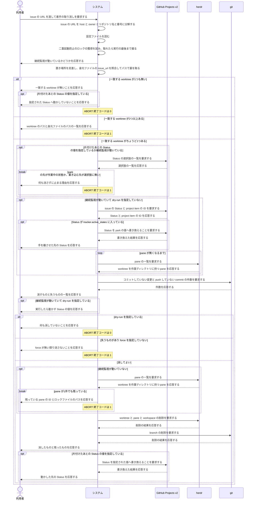

<!-- 目的: 間違えて着手した issue を `continuo abandon` で着手する前へ戻すまでを RUCM で定義する -->

# ユースケース: 着手を取り消す

## 根拠資料

- `docs/plans/continuo_design.md#3-37`（間違えて着手した issue は `continuo abandon` で戻す。段1〜段5 と、Status を既定で動かさない理由）
- `docs/plans/continuo_design.md#3-9`（後始末。worktree・pane・herdr の workspace・branch をまとめて消す）
- `docs/plans/continuo_design.md#3-17`（二重起動防止のロック）
- `docs/plans/continuo_design.md#3-18`（身元ファイル。`issue_url` と `branch` と `herdr_workspace_id`）
- `docs/plans/continuo_design.md#3-20`（worktree が置き場所の内側にあることを検査する）
- `internal/abandon/abandon.go` の `Run`、`run`、`isRunning`、`find`、`park`、`waitPaneGone`、`printPlan`、`remove`、`moveStatus`、`currentState`
- `internal/abandon/issueurl.go` の `ParseIssueURL`、`SameIssue`、`Identifier`
- `internal/abandon/deps.go` の `resolve`、`newTracker`
- `internal/workspace/inspect.go` の `Inspect`、`Leftover.HasLoss`
- `internal/cli/cli.go` の `runAbandon`

## RUCM

```rucm
USE CASE NAME: 着手を取り消す
BRIEF DESCRIPTION: 利用者が間違えて着手した issue の URL を渡す。システムは継続監視が動いているかを調べ、動いていれば Status を park の値へ動かして pane が消えるまで待つ。システムは身元ファイルの issue_url で worktree を1つに絞り、置き場所のパスで裏を取る。システムは失うものを見せてから worktree と pane と herdr の workspace と branch を消す。システムは片付けたあとの Status を、利用者が指定したときだけ動かす。
PRECONDITION: 利用者は間違えて着手した issue の URL を知っている。WORKFLOW.md がある。worktree の置き場所に身元ファイルを持つ worktree が1つ以上ある。
PRIMARY ACTOR: 利用者
SECONDARY ACTORS: GitHub Projects v2、herdr、git
DEPENDENCY: なし
GENERALIZATION: なし

BASIC FLOW:
1. 利用者はシステムに issue の URL を渡して着手の取り消しを要求する。
2. システムは VALIDATES THAT issue の URL を host と owner とリポジトリ名と issue の番号に分解できる。
3. システムは VALIDATES THAT 設定ファイルを読める。
4. システムは VALIDATES THAT 二重起動防止のロックファイルを開ける。
5. システムはロックの獲得の可否から継続監視が動いているかを判定する。
6. システムは獲得できたロックを実行が終わるまで握り続ける。
7. システムは利用者に継続監視が動いているかどうかを応答する。
8. システムは VALIDATES THAT worktree の置き場所を走査できる。
9. システムは worktree の中の身元ファイルを読む。
10. システムは身元ファイルの issue_url が渡された issue と一致する worktree のうち、置き場所のパスから取り出した owner とリポジトリ名が渡された issue と食い違うものを候補から外す。
11. システムは VALIDATES THAT 候補の worktree がちょうど1つある。
12. IF 継続監視が動いている THEN
13.   システムは VALIDATES THAT park の値が tracker.active_states に入っていない。
14. ENDIF
15. IF 利用者が片付けたあとの Status の値を指定しているか継続監視が動いている THEN
16.   システムは VALIDATES THAT 書き込みうる Status の値がすべてボードの選択肢にある。
17. ENDIF
18. IF 継続監視が動いていて利用者が dry-run を指定していない THEN
19.   システムは VALIDATES THAT ボードから issue の Status と project item の ID を引ける。
20.   IF Status が tracker.active_states に入っている THEN
21.     システムは VALIDATES THAT ボードの Status を park の値へ書き換えられる。
22.     システムは利用者に手を離させた先の Status を応答する。
23.   ENDIF
24.   システムは VALIDATES THAT worktree を作業ディレクトリに持つ pane が期限内に無くなる。
25. ENDIF
26. システムは VALIDATES THAT worktree の中の失うものを調べられる。
27. システムは利用者に消すものと失うものの一覧を応答する。
28. IF 継続監視が動いていて利用者が dry-run を指定している THEN
29.   システムは利用者に実行したときに手を離させるために動かす Status の値を応答する。
30. ENDIF
31. システムは VALIDATES THAT 利用者が dry-run を指定していない。
32. システムは VALIDATES THAT 失うものが無いか利用者が force を指定している。
33. IF 継続監視が動いていない THEN
34.   システムは VALIDATES THAT worktree を作業ディレクトリに持つ pane が1つも無い。
35. ENDIF
36. システムは herdr に worktree と pane と herdr の workspace の削除を要求する。
37. システムは VALIDATES THAT worktree が置き場所から消えている。
38. IF branch が消えている THEN
39.   システムは利用者に worktree と branch を消したことを応答する。
40. ELSE
41.   システムは利用者に branch を残したことを応答する。
42. ENDIF
43. IF 利用者が片付けたあとの Status の値を指定している THEN
44.   システムは VALIDATES THAT ボードから issue の project item の ID を引ける。
45.   システムは VALIDATES THAT ボードの Status を指定された値へ書き換えられる。
46.   システムは利用者に動かした先の Status を応答する。
47. ELSE
48.   システムは利用者に Status を動かしていないことを応答する。
49. ENDIF
POSTCONDITION: worktree は置き場所に無い。herdr の workspace は閉じている。worktree を作業ディレクトリに持つ pane は無い。issue の Status は利用者が指定したときだけ指定された値へ動いている。終了コードは 0 である。

SPECIFIC ALTERNATIVE FLOW issueURLの解釈不能:
RFS BASIC FLOW 2
1. システムは利用者に issue の URL を解釈できないことを応答する。
2. ABORT
POSTCONDITION: worktree は残っている。branch は残っている。issue の Status は変わっていない。終了コードは 1 である。

BOUNDED ALTERNATIVE FLOW 前提を読めない:
RFS BASIC FLOW 3,4,8,26
1. システムは利用者に読めなかった対象と理由を応答する。
2. ABORT
POSTCONDITION: worktree は残っている。branch は残っている。herdr の workspace は残っている。終了コードは 1 である。

SPECIFIC ALTERNATIVE FLOW worktreeが無い:
RFS BASIC FLOW 11
1. システムは利用者に一致する worktree が無いことを応答する。
2. IF 利用者が片付けたあとの Status の値を指定している THEN
3.   システムは利用者に指定された Status へ動かしていないことを応答する。
4. ENDIF
5. ABORT
POSTCONDITION: worktree は1つも消えていない。issue の Status は変わっていない。ボードへの問い合わせは1回も起きていない。終了コードは 0 である。

SPECIFIC ALTERNATIVE FLOW worktreeが2つ以上:
RFS BASIC FLOW 11
1. システムは利用者に一致した worktree のパスと身元ファイルのパスの一覧を応答する。
2. ABORT
POSTCONDITION: 一致した worktree はすべて残っている。branch はすべて残っている。issue の Status は変わっていない。終了コードは 1 である。

SPECIFIC ALTERNATIVE FLOW parkの先が作業中の状態:
RFS BASIC FLOW 13
1. システムは利用者に park の値が tracker.active_states に入っていることを応答する。
2. ABORT
POSTCONDITION: worktree は残っている。branch は残っている。issue の Status は変わっていない。ボードへの書き込みは1回も起きていない。終了コードは 1 である。

SPECIFIC ALTERNATIVE FLOW 書き込む先を確かめられない:
RFS BASIC FLOW 16
1. システムは利用者にボードへ繋げない理由か、ボードの選択肢に無い Status の値を応答する。
2. ABORT
POSTCONDITION: worktree は残っている。branch は残っている。issue の Status は変わっていない。ボードへの書き込みは1回も起きていない。終了コードは 1 である。

SPECIFIC ALTERNATIVE FLOW 手離し先のStatusを読めない:
RFS BASIC FLOW 19
1. システムは利用者にボードから Status を引けないことと理由を応答する。
2. ABORT
POSTCONDITION: worktree は残っている。branch は残っている。issue の Status は変わっていない。継続監視は issue を掴んだままである。終了コードは 1 である。

SPECIFIC ALTERNATIVE FLOW 手離しの書き込み失敗:
RFS BASIC FLOW 21
1. システムは利用者に park の値へ動かせないことと理由を応答する。
2. ABORT
POSTCONDITION: worktree は残っている。branch は残っている。issue の Status は tracker.active_states の値のままである。終了コードは 1 である。

SPECIFIC ALTERNATIVE FLOW paneが期限内に消えない:
RFS BASIC FLOW 24
1. システムは利用者に残っている pane の ID と待った上限を応答する。
2. システムは park の値へ動かした Status を元へ戻さない。
3. ABORT
POSTCONDITION: worktree は残っている。branch は残っている。issue の Status は park の値のままである。終了コードは 1 である。

SPECIFIC ALTERNATIVE FLOW 見せるだけで終わる:
RFS BASIC FLOW 31
1. システムは利用者に何も消していないことを応答する。
2. ABORT
POSTCONDITION: worktree は残っている。branch は残っている。消すものと失うものの一覧は表示されている。ボードへの書き込みは1回も起きていない。終了コードは 0 である。

SPECIFIC ALTERNATIVE FLOW 失うものがある:
RFS BASIC FLOW 32
1. システムは利用者に force が無い限り消さないことを応答する。
2. ABORT
POSTCONDITION: worktree は残っている。コミットしていない変更は残っている。push していない commit は残っている。終了コードは 1 である。

SPECIFIC ALTERNATIVE FLOW 動いていないのにpaneが生きている:
RFS BASIC FLOW 34
1. システムは利用者に残っている pane の ID とロックファイルのパスを応答する。
2. ABORT
POSTCONDITION: worktree は残っている。branch は残っている。pane は開いたままである。issue の Status は変わっていない。終了コードは 1 である。

SPECIFIC ALTERNATIVE FLOW 片付けの失敗:
RFS BASIC FLOW 37
1. システムは利用者に片付けを見送った理由の一覧を応答する。
2. ABORT
POSTCONDITION: worktree は残っている。branch は残っている。issue の Status は片付けの前の値のままである。終了コードは 1 である。

SPECIFIC ALTERNATIVE FLOW 片付け後のStatusを読めない:
RFS BASIC FLOW 44
1. システムは利用者にボードから project item の ID を引けないことと理由を応答する。
2. ABORT
POSTCONDITION: worktree は置き場所に無い。herdr の workspace は閉じている。issue の Status は利用者が指定した値ではない。終了コードは 1 である。

SPECIFIC ALTERNATIVE FLOW 片付け後の書き込み失敗:
RFS BASIC FLOW 45
1. システムは利用者に指定された値へ動かせないことと理由を応答する。
2. ABORT
POSTCONDITION: worktree は置き場所に無い。herdr の workspace は閉じている。issue の Status は利用者が指定した値ではない。終了コードは 1 である。

GLOBAL ALTERNATIVE FLOW 実行の中断:
BRANCH FROM BASIC FLOW 24
WHEN 利用者が SIGINT または SIGTERM で実行を中断した場合
1. システムは pane が消えるのを待つのをやめる。
2. システムは利用者に中断されたことと残っている pane の ID を応答する。
3. ABORT
POSTCONDITION: worktree は残っている。branch は残っている。issue の Status は park の値のままである。終了コードは 1 である。
```

## 段の順番と、その順番でなければならない理由

**実行の順は段2 が段1 の後半より先である**（`internal/abandon/abandon.go` の `run`）。

| 段 | 何をするか | なぜその位置か |
| --- | --- | --- |
| 1 の前半 | 継続監視が動いているかを調べる（ステップ4〜7） | ロックを取れたら動いていない。**取れたロックは最後まで握る** |
| 2 | 身元ファイルの issue_url で worktree を1つに絞る（ステップ8〜11） | 段1 の後半は「その worktree の pane が消えるまで待つ」ので、**待つ相手が決まっていなければ始められない** |
| 2 の後 | 書き込みうる Status の値を確かめる（ステップ12〜17） | **消す前に確かめる。**綴り違いが分かるのが段5 だと、worktree を失ったうえに Status も動かない |
| 1 の後半 | Status を park の値へ動かし、pane が消えるまで待つ（ステップ18〜25） | 消えるまで待たないと、消した worktree の中で Claude Code が動き続ける |
| 3 | 失うものを調べて見せる（ステップ26〜32） | 消す前に必ず全部出す。dry-run でも force でも同じものを出す |
| 4 | pane の生死を確かめてから消す（ステップ33〜42） | 片付けの判断は `internal/workspace` の `Cleanup` に書き直さずに委ねる |
| 5 | 片付けたあとの Status を動かす（ステップ43〜49） | **どこへ置くかは人間だけが知っている。**指定が無ければ動かさない |

## dry-run が段1 の後半を通らない理由

**`--dry-run` は「何を消すかを見せるだけ」の実行である。**通ると、継続監視が動いている
あいだは**ボードの Status を実際に書き換え、エージェントに手を離させる。**
README は「先に `--dry-run` を叩け」と勧めているので、勧めた手順が副作用を起こす。

| dry-run のとき | どうするか |
| --- | --- |
| 手を離させる書き込み（ステップ19〜22） | **しない** |
| pane が消えるのを待つ（ステップ24） | **しない**（手を離させていないので、待っても閉じない） |
| 実行したら動かす先の Status（ステップ29） | **1行で予告する。**書かれる値を人間がここで見られなければ、実行して初めて知ることになる |
| 書き込みうる Status の値の確認（ステップ12〜17） | **する**（読むだけで、ボードへは1文字も書かない） |

## ロックを最後まで握る理由

**判定のために取ったロックを、その場で手放してはならない。**手放すと直後に継続監視が
起動でき、**その足元から worktree を消す。**abandon は git と herdr の RPC を何度も叩くので、
窓は秒単位で開く。**握っているあいだに起動しようとした継続監視は「既に起動しています」で
止まる。**消されるより望ましい。

## 動いていないと判定したときこそ pane を確かめる理由

**ロックファイルの場所は環境変数で決まる**（`CONTINUO_RUNTIME_DIR` / `XDG_RUNTIME_DIR` /
`TMPDIR`）。launchd から起動した継続監視と端末から叩いた `continuo abandon` で食い違えば、
**動いている継続監視を「動いていない」と判定して、生きた pane ごと worktree を消す。**

**herdr の socket は設定（`herdr.socket`）で決まり、環境変数では動かない。**
だからロックより信用できる。ステップ34 で1件でも pane があれば、**待たずに止まる**
（手を離させていない以上、待っても閉じない）。

## 片付けたあとの Status を既定で動かさない理由

| 既定にしたら | 何が起きるか |
| --- | --- |
| `tracker.dispatch_state`（`Ready`） | 同じ issue にもう一度着手する。取り消したいのに、戻した先が着手待ちである |
| `tracker.failure_state`（`Blocked`） | 失敗していないものが失敗として残る。人間が着手する相手を間違えただけである |
| `tracker.terminal_states`（`Done`） | やっていないものが完了として残る。しかも後始末の経路がもう一度走る |

## worktree の探し方は身元ファイルの照合とパスの検算である

**パスを owner とリポジトリ名と issue の番号から組み立ててはならない**（`internal/abandon/issueurl.go` の `IssueRef`）。
`workspace.root` や `herdr.worktree.branch_template` を変えている環境で空振りするためである。

| 照合の対象 | 比べ方 |
| --- | --- |
| host と owner とリポジトリ名 | 大文字小文字を無視して比べる |
| issue の番号 | 10進の数字だけ・先頭が 0 でないものを数として比べる |
| 解釈できない URL | どれにも一致しない（文字列の一致で拾い直しもしない） |
| 身元ファイルを読めない worktree | 候補にしない。消しもしない |

**照合できた worktree は、置き場所のパスで裏を取る**（ステップ10）。
**身元ファイルは worktree の直下にあり、そこでエージェントが `--permission-mode dontAsk` で動く。**
`issue_url` は書き換えられる。検算しなければ、worktree A のエージェントが自分の `issue_url` を
issue B に書き換えるだけで、**人間が B を取り消したとき A が消える。**

| 検算に使うもの | なぜ書き換えられないか |
| --- | --- |
| 置き場所のパスの owner（2階層目）とリポジトリ名（3階層目） | 置き場所は `<root>/<host>/<owner>/<repo>/<スラグ>` の固定4階層で、パスは封じ込め検査（3-20）を通っている |

**食い違ったら候補から外すだけで、消しはしない。**原因が書き換えとは限らず、
人間が置き場所を移した跡かもしれない。何があったかは1行残す。

## pane の照合は「一致、または内側」である

**worktree のパスと完全に一致する作業ディレクトリだけを拾ってはならない。**
Claude Code が worktree の下の階層へ降りると、その pane を「もう無い」と判定して
**生きている pane ごと worktree を消す。**継続監視の hook の判定も「一致、または内側」である
（`internal/orchestrator/hookinput.go` の `acceptHookCwd`）。

**待つ側は広く取るほうが安全である。**多めに拾えば待つか止まるだけだが、
少なく拾うと消してしまう。

## フローチャート

```mermaid
flowchart TD
    B1["1. 利用者が issue の URL を渡して着手の取り消しを要求する"]
    B2{"2. VALIDATES THAT issue の URL を分解できる"}
    B3{"3. VALIDATES THAT 設定ファイルを読める"}
    B4{"4. VALIDATES THAT ロックファイルを開ける"}
    B5["5. ロックの獲得の可否から継続監視が動いているかを判定する"]
    B6["6. 獲得できたロックを実行が終わるまで握り続ける"]
    B7["7. 継続監視が動いているかどうかを応答する"]
    B8{"8. VALIDATES THAT 置き場所を走査できる"}
    B9["9. 身元ファイルを読む"]
    B10["10. 置き場所のパスと食い違う worktree を候補から外す"]
    B11{"11. VALIDATES THAT 候補の worktree がちょうど1つある"}
    B12{"12. IF 継続監視が動いている"}
    B13{"13. VALIDATES THAT park の値が tracker.active_states に入っていない"}
    B14["14. ENDIF"]
    B15{"15. IF Status の指定があるか継続監視が動いている"}
    B16{"16. VALIDATES THAT 書き込みうる Status の値がボードの選択肢にある"}
    B17["17. ENDIF"]
    B18{"18. IF 継続監視が動いていて dry-run を指定していない"}
    B19{"19. VALIDATES THAT Status と project item の ID を引ける"}
    B20{"20. IF Status が tracker.active_states に入っている"}
    B21{"21. VALIDATES THAT Status を park の値へ書き換えられる"}
    B22["22. 手を離させた先の Status を応答する"]
    B23["23. ENDIF"]
    B24{"24. VALIDATES THAT pane が期限内に無くなる"}
    B25["25. ENDIF"]
    B26{"26. VALIDATES THAT 失うものを調べられる"}
    B27["27. 消すものと失うものの一覧を応答する"]
    B28{"28. IF 継続監視が動いていて dry-run を指定している"}
    B29["29. 実行したら動かす Status の値を応答する"]
    B30["30. ENDIF"]
    B31{"31. VALIDATES THAT dry-run を指定していない"}
    B32{"32. VALIDATES THAT 失うものが無いか force を指定している"}
    B33{"33. IF 継続監視が動いていない"}
    B34{"34. VALIDATES THAT pane が1つも無い"}
    B35["35. ENDIF"]
    B36["36. worktree と pane と workspace の削除を要求する"]
    B37{"37. VALIDATES THAT worktree が消えている"}
    B38{"38. IF branch が消えている"}
    B39["39. worktree と branch を消したことを応答する"]
    B40["40. ELSE"]
    B41["41. branch を残したことを応答する"]
    B42["42. ENDIF"]
    B43{"43. IF 片付けたあとの Status の値を指定している"}
    B44{"44. VALIDATES THAT project item の ID を引ける"}
    B45{"45. VALIDATES THAT Status を指定された値へ書き換えられる"}
    B46["46. 動かした先の Status を応答する"]
    B47["47. ELSE"]
    B48["48. Status を動かしていないことを応答する"]
    B49["49. ENDIF"]
    BPOST(["POSTCONDITION worktree と branch が無い"])

    B1 --> B2
    B2 -- 偽 --> S1
    B2 -- 真 --> B3
    B3 -- 偽 --> BA1
    B3 -- 真 --> B4
    B4 -- 偽 --> BA1
    B4 -- 真 --> B5 --> B6 --> B7 --> B8
    B8 -- 偽 --> BA1
    B8 -- 真 --> B9 --> B10 --> B11
    B11 -- "0件" --> S2
    B11 -- "2件以上" --> S3
    B11 -- 真 --> B12
    B12 -- 偽 --> B14
    B12 -- 真 --> B13
    B13 -- 偽 --> S13
    B13 -- 真 --> B14
    B14 --> B15
    B15 -- 偽 --> B17
    B15 -- 真 --> B16
    B16 -- 偽 --> S14
    B16 -- 真 --> B17
    B17 --> B18
    B18 -- 偽 --> B25
    B18 -- 真 --> B19
    B19 -- 偽 --> S4
    B19 -- 真 --> B20
    B20 -- 偽 --> B23
    B20 -- 真 --> B21
    B21 -- 偽 --> S5
    B21 -- 真 --> B22 --> B23
    B23 --> B24
    B24 -- 偽 --> S6
    B24 -- 真 --> B25
    B24 -. "実行の中断: WHEN SIGINT または SIGTERM を受けた場合" .-> G1
    B25 --> B26
    B26 -- 偽 --> BA1
    B26 -- 真 --> B27 --> B28
    B28 -- 真 --> B29 --> B30
    B28 -- 偽 --> B30
    B30 --> B31
    B31 -- 偽 --> S7
    B31 -- 真 --> B32
    B32 -- 偽 --> S8
    B32 -- 真 --> B33
    B33 -- 真 --> B34
    B33 -- 偽 --> B35
    B34 -- 偽 --> S12
    B34 -- 真 --> B35
    B35 --> B36 --> B37
    B37 -- 偽 --> S9
    B37 -- 真 --> B38
    B38 -- 真 --> B39 --> B42
    B38 -- 偽 --> B40 --> B41 --> B42
    B42 --> B43
    B43 -- 真 --> B44
    B43 -- 偽 --> B47 --> B48 --> B49
    B44 -- 偽 --> S10
    B44 -- 真 --> B45
    B45 -- 偽 --> S11
    B45 -- 真 --> B46 --> B49
    B49 --> BPOST

    subgraph SAF1 ["SPECIFIC ALTERNATIVE FLOW issueURLの解釈不能 / RFS BASIC FLOW 2"]
        S1["1. URL を解釈できないことを応答する"] --> S1E["2. ABORT"]
    end

    subgraph BAF1 ["BOUNDED ALTERNATIVE FLOW 前提を読めない / RFS BASIC FLOW 3,4,8,26"]
        BA1["1. 読めなかった対象と理由を応答する"] --> BA1E["2. ABORT"]
    end

    subgraph SAF2 ["SPECIFIC ALTERNATIVE FLOW worktreeが無い / RFS BASIC FLOW 11"]
        S2["1. 一致する worktree が無いことを応答する"] --> S2B{"2. IF 片付けたあとの Status の値を指定している"}
        S2B -- 真 --> S2C["3. 指定された Status へ動かしていないことを応答する"] --> S2D["4. ENDIF"]
        S2B -- 偽 --> S2D
        S2D --> S2E["5. ABORT"]
    end

    subgraph SAF3 ["SPECIFIC ALTERNATIVE FLOW worktreeが2つ以上 / RFS BASIC FLOW 11"]
        S3["1. worktree のパスと身元ファイルのパスの一覧を応答する"] --> S3E["2. ABORT"]
    end

    subgraph SAF13 ["SPECIFIC ALTERNATIVE FLOW parkの先が作業中の状態 / RFS BASIC FLOW 13"]
        S13["1. park の値が tracker.active_states に入っていることを応答する"] --> S13E["2. ABORT"]
    end

    subgraph SAF14 ["SPECIFIC ALTERNATIVE FLOW 書き込む先を確かめられない / RFS BASIC FLOW 16"]
        S14["1. ボードへ繋げない理由か、選択肢に無い Status の値を応答する"] --> S14E["2. ABORT"]
    end

    subgraph SAF4 ["SPECIFIC ALTERNATIVE FLOW 手離し先のStatusを読めない / RFS BASIC FLOW 19"]
        S4["1. Status を引けないことと理由を応答する"] --> S4E["2. ABORT"]
    end

    subgraph SAF5 ["SPECIFIC ALTERNATIVE FLOW 手離しの書き込み失敗 / RFS BASIC FLOW 21"]
        S5["1. park の値へ動かせないことと理由を応答する"] --> S5E["2. ABORT"]
    end

    subgraph SAF6 ["SPECIFIC ALTERNATIVE FLOW paneが期限内に消えない / RFS BASIC FLOW 24"]
        S6["1. 残っている pane の ID と待った上限を応答する"] --> S6B["2. 動かした Status を元へ戻さない"] --> S6E["3. ABORT"]
    end

    subgraph SAF7 ["SPECIFIC ALTERNATIVE FLOW 見せるだけで終わる / RFS BASIC FLOW 31"]
        S7["1. 何も消していないことを応答する"] --> S7E["2. ABORT"]
    end

    subgraph SAF8 ["SPECIFIC ALTERNATIVE FLOW 失うものがある / RFS BASIC FLOW 32"]
        S8["1. force が無い限り消さないことを応答する"] --> S8E["2. ABORT"]
    end

    subgraph SAF12 ["SPECIFIC ALTERNATIVE FLOW 動いていないのにpaneが生きている / RFS BASIC FLOW 34"]
        S12["1. 残っている pane の ID とロックファイルのパスを応答する"] --> S12E["2. ABORT"]
    end

    subgraph SAF9 ["SPECIFIC ALTERNATIVE FLOW 片付けの失敗 / RFS BASIC FLOW 37"]
        S9["1. 片付けを見送った理由の一覧を応答する"] --> S9E["2. ABORT"]
    end

    subgraph SAF10 ["SPECIFIC ALTERNATIVE FLOW 片付け後のStatusを読めない / RFS BASIC FLOW 44"]
        S10["1. project item の ID を引けないことと理由を応答する"] --> S10E["2. ABORT"]
    end

    subgraph SAF11 ["SPECIFIC ALTERNATIVE FLOW 片付け後の書き込み失敗 / RFS BASIC FLOW 45"]
        S11["1. 指定された値へ動かせないことと理由を応答する"] --> S11E["2. ABORT"]
    end

    subgraph GAF1 ["GLOBAL ALTERNATIVE FLOW 実行の中断 / BRANCH FROM BASIC FLOW 24"]
        G1["1. pane が消えるのを待つのをやめる"] --> G1B["2. 中断されたことと残っている pane の ID を応答する"] --> G1E["3. ABORT"]
    end
```



## シーケンス図


