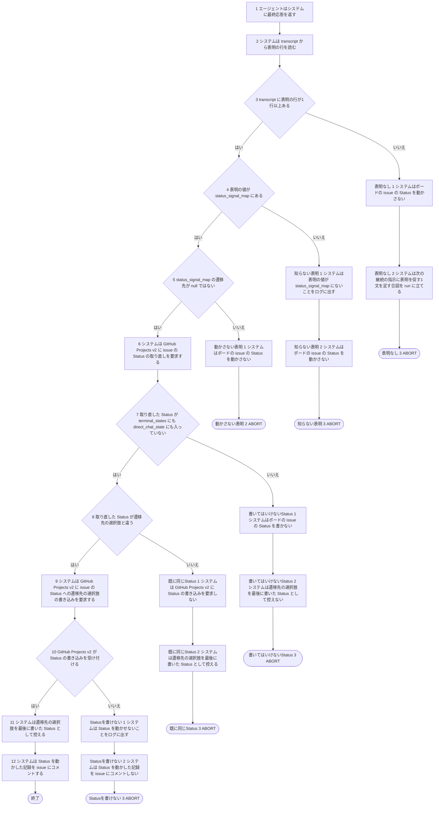
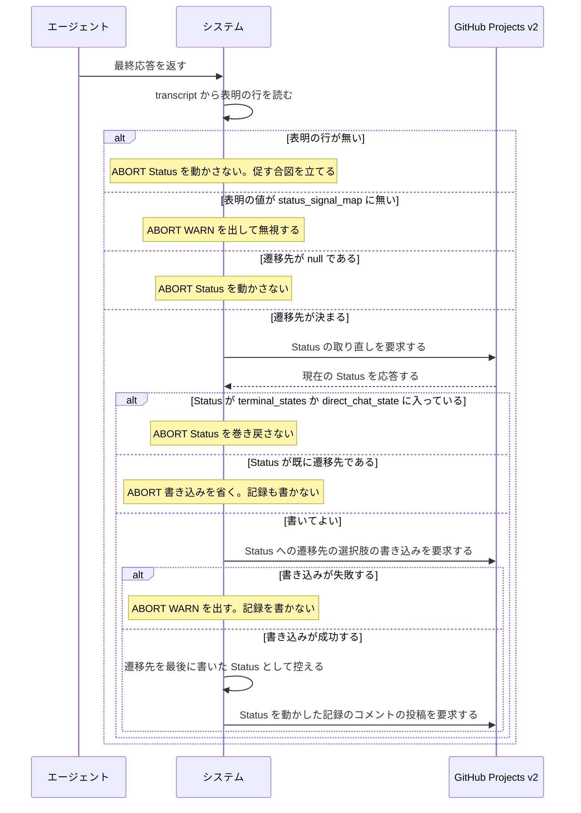

# ユースケース: 表明を読んでStatusを動かす

> **turn の終わりの処理のうち、前半（`readSignals` → `applySignals`）だけを書いた記述である。**
> 後半（取り直した Status で run の行き先を決める）は `人間に判断を渡す` に在り、この記述を `INCLUDE USE CASE` で引く。
> 2つは独立していて、表明の読み方と取り直した Status の組み合わせがすべて起きうる。1本に並べると経路が掛け算で増えるので、分けて書く（人間の決定。2026-10-02）。
>
> **この記述は Status を書くか書かないかまでである。**どの終わり方でも、呼び出し元は issue を取り直し、その Status で run の行き先を決める。

## 根拠資料

- `docs/plans/continuo_design.md#3-25`（表明を transcript から読む。表明せずに終わったら次の turn で促す）
- `docs/plans/continuo_design.md#3-26`（表明の書式の拡張。対象付きの行）
- `docs/plans/continuo_design.md#3-29`（Status を動かしたら、何から何へ動かしたかを残す）
- `docs/plans/continuo_design.md#3-83`（人間が direct chat へ引き取ったカードの上へ書かない）
- `docs/plans/continuo_design.md#4-1`（誰がどの遷移を起こすか）
- `internal/orchestrator/lifecycle.go` の `handleTurnEnd`、`readSignals`、`applySignals`、`lookupSignalTarget`、`signalMoveReason`、`protectedStates`
- `internal/orchestrator/signal.go` の `ParseSignals`（中身は `internal/statussignal` の `Parse`）
- `internal/statussignal` の `Lookup`、`FindInvalid`（取り得る値に在るかの判定。`continuo hook` も同じものを呼ぶ）
- `internal/orchestrator/comment.go` の `postStatusMove`
- `internal/orchestrator/prompt.go` の `BuildContinuationPrompt`（表明が1行も無かったときは促す1文と取り得る値の一覧を足し、表明の値が取り得る値に無かったときは「続けてください」をその値と一覧に差し替える）
- `internal/tracker/adapter.go` の `UpdateStatus`（取り直す → 書いてはいけない Status なら書かない → 既に同じ値なら書き込みを省く → 書く）
- `internal/config/default.go`（`status_signal_map` の既定。`working` は null）

## RUCM

```rucm
USE CASE NAME: 表明を読んでStatusを動かす
BRIEF DESCRIPTION: エージェントが最終応答に表明の1行を書く。システムは transcript から表明を読む。システムは status_signal_map から遷移先を引く。システムはボードの issue の Status を取り直してから、遷移先の選択肢を書く。システムは Status を動かした記録を issue にコメントする。
PRECONDITION: システムは常駐している。issue は印の集合に入っている。run は direct chat に入っていない。issue の担当者は自分のままである。エージェントの turn が終わっている。
PRIMARY ACTOR: エージェント
SECONDARY ACTORS: GitHub Projects v2
DEPENDENCY: なし
GENERALIZATION: なし

BASIC FLOW:
1. エージェントはシステムに最終応答を返す。
2. システムは transcript から表明の行を読む。
3. システムは VALIDATES THAT transcript に表明の行が1行以上ある。
4. システムは VALIDATES THAT 表明の値が status_signal_map にある。
5. システムは VALIDATES THAT status_signal_map の遷移先が null ではない。
6. システムは GitHub Projects v2 に issue の Status の取り直しを要求する。
7. システムは VALIDATES THAT 取り直した Status が terminal_states にも direct_chat_state にも入っていない。
8. システムは VALIDATES THAT 取り直した Status が遷移先の選択肢と違う。
9. システムは GitHub Projects v2 に issue の Status への遷移先の選択肢の書き込みを要求する。
10. システムは VALIDATES THAT GitHub Projects v2 が Status の書き込みを受け付ける。
11. システムは遷移先の選択肢を最後に書いた Status として控える。
12. システムは Status を動かした記録を issue にコメントする。
POSTCONDITION: issue の Status は status_signal_map の遷移先の選択肢である。issue に Status を動かした記録のコメントが1件増えている。herdr の pane は閉じていない。印は残っている。

SPECIFIC ALTERNATIVE FLOW 表明なし:
RFS BASIC FLOW 3
1. システムはボードの issue の Status を動かさない。
2. システムは次の継続の指示に表明を促す1文を足す合図を run に立てる。
3. ABORT
POSTCONDITION: システムは issue の Status を書いていない。run に表明を促す合図が立っている。issue に Status を動かした記録のコメントは増えていない。herdr の pane は閉じていない。

SPECIFIC ALTERNATIVE FLOW 知らない表明:
RFS BASIC FLOW 4
1. システムは表明の値が status_signal_map にないことをログに出す。
2. システムはボードの issue の Status を動かさない。
3. システムは次の継続の指示で取り得る値の一覧を返す合図を run に立てる。
4. ABORT
POSTCONDITION: システムは issue の Status を書いていない。run に表明を促す合図は立っていない。run に取り得る値の一覧を返す合図が立っている。issue に Status を動かした記録のコメントは増えていない。herdr の pane は閉じていない。

SPECIFIC ALTERNATIVE FLOW 動かさない表明:
RFS BASIC FLOW 5
1. システムはボードの issue の Status を動かさない。
2. ABORT
POSTCONDITION: システムは issue の Status を書いていない。issue に Status を動かした記録のコメントは増えていない。herdr の pane は閉じていない。

SPECIFIC ALTERNATIVE FLOW 書いてはいけないStatus:
RFS BASIC FLOW 7
1. システムはボードの issue の Status を書かない。
2. システムは遷移先の選択肢を最後に書いた Status として控えない。
3. ABORT
POSTCONDITION: issue の Status は取り直した選択肢のままである。システムは Status を巻き戻していない。issue に Status を動かした記録のコメントは増えていない。

SPECIFIC ALTERNATIVE FLOW 既に同じStatus:
RFS BASIC FLOW 8
1. システムは GitHub Projects v2 に Status の書き込みを要求しない。
2. システムは遷移先の選択肢を最後に書いた Status として控える。
3. ABORT
POSTCONDITION: issue の Status は status_signal_map の遷移先の選択肢である。issue に Status を動かした記録のコメントは増えていない。

SPECIFIC ALTERNATIVE FLOW Statusを書けない:
RFS BASIC FLOW 10
1. システムは Status を動かせないことをログに出す。
2. システムは Status を動かした記録を issue にコメントしない。
3. ABORT
POSTCONDITION: システムは issue の Status を動かしていない。issue に Status を動かした記録のコメントは増えていない。herdr の pane は閉じていない。
```

## この記述で使う言葉

| 語 | 何を指すか |
| --- | --- |
| **エージェント** | worker の中で動いている Claude Code のセッション。Status をどう動かすかの判断を持つのはエージェントで、ボードへ書くのはシステムである（設計 3-25） |
| **表明** | 最終応答の中の `CONTINUO-STATUS: <値>` の1行（接頭辞は `tracker.status_signal_prefix`） |
| **遷移先** | `tracker.status_signal_map` を表明の値で引いた Status 名。**`review` も `blocked` も、実装は値で分岐しない。**写像を引いて、出てきた Status を書くだけである。`blocked` の遷移先は `tracker.failure_state` ではない（既定ではどちらも `Blocked` だが、別のキーである） |
| **最後に書いた Status** | run が控える `lastWrittenState`。巡回が「その Status を書いたのは continuo 自身か」を見分けるのに使う（設計 3-74c） |

## 終わり方と、そのあと起きること

**この記述がどう終わっても、呼び出し元（`handleTurnEnd`）は issue を取り直し、その Status で run の行き先を決める**（`人間に判断を渡す` の段2 以降）。

| 終わり方 | Status | 記録のコメント | 促す1文 |
| --- | --- | --- | --- |
| 基本フロー | 遷移先へ動いた | 1件書く | 足さない |
| `表明なし` | 動かさない | 書かない | **足す**（次の継続の指示にだけ。取り得る値の一覧も載せる） |
| `知らない表明` | 動かさない | 書かない | 足さない（表明の行は在ったので）。WARN を1行出す。**代わりに、次の継続の指示の「続けてください」を、書かれていた値と取り得る値の一覧に差し替える**（issue #274） |
| `動かさない表明` | 動かさない | 書かない | 足さない。既定では `working` がこれに当たる |
| `書いてはいけないStatus` | 動かさない（`terminal_states` か `tracker.direct_chat_state`） | 書かない | 足さない |
| `既に同じStatus` | 既に遷移先である | **書かない**（書き込みが起きていないので） | 足さない |
| `Statusを書けない` | 動かない | 書かない | 足さない。WARN を1行出す |

## 段にしていない分岐

**終わり方も、そのあと通る段も変わらない分岐は、段にせずここへ置く。**

| どこで | 何が起きるか | どうなるか |
| --- | --- | --- |
| 段2 | transcript のパスが分からない、または読めない | 表明なしとして扱う（`表明なし` と同じ） |
| 段2 | turn の終わりの時点で、最後の応答がまだ transcript に書かれていない | 0.5 秒待って読み、見つからなければ 0.1 秒間隔で5回読み直す。それでも無ければ表明なしとして扱う |
| 段6 | GitHub Projects v2 が取り直しに誤りを返す、または選択肢の ID を引けない | `Statusを書けない` と同じ終わり方である（WARN を出し、何も書かない） |
| 段6 | item がもうボードから見えない | 誤りにはならない。書かず、記録も書かず、控えもしない（`Statusを書けない` と同じ状態で終わる。呼び出し元の取り直しが「見えない」を拾う） |
| 段12 | 記録のコメントの投稿が失敗する | WARN を出して終わる。Status は動いたままである |
| 段4 から段12 | 表明の行が2行以上ある（対象付きの行。設計 3-26） | 行ごとに同じ段を通す。別の issue を指す行の扱いは、この記述に書いていない |
| 段1 より前 | `continuo hook` が、`Stop` の最後のテキストに在る表明の値を調べ、取り得る値に無ければ turn を差し戻す（設計 3-25。issue #274） | この記述の外である。差し戻された turn は終わっていないので、段1 に来ない。書き直したあとの応答が段1 から通る |

## フローチャート



## シーケンス図


