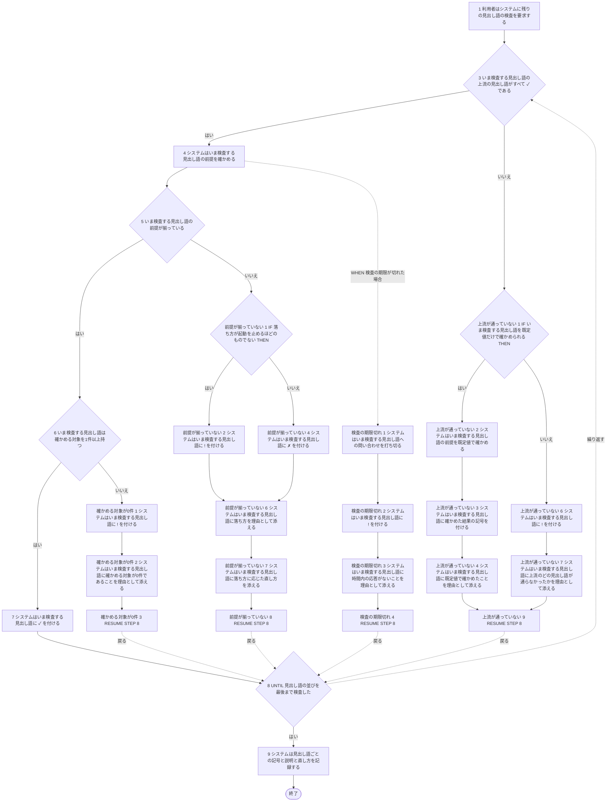
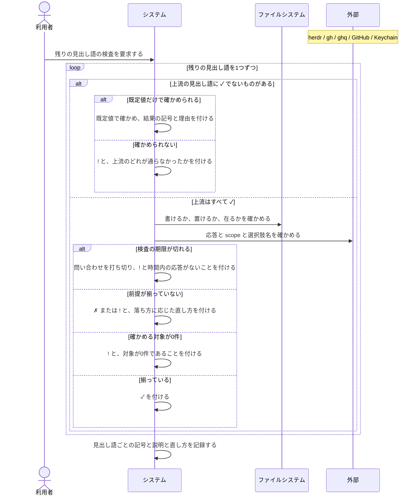

# ユースケース: 見出し語を1つずつ検査する

> **`continuo doctor` が、見出し語「設定ファイル」より後ろの見出し語を1つずつ検査する段だけを書いた記述である。**
> `前提が揃っているかを検査する` が `INCLUDE USE CASE` で引く。設定ファイルを読めた実行も、読めなかった実行も、同じこの段を通る。
>
> **分けた理由。**1件が落ちても止まらない繰り返しを、設定ファイルの検査と終了コードの判定と同じ記述に書くと、
> 実装が通れない経路が CFG に出る（設定ファイルが `✗` なのに「すべて `✓`・終了コード 0」で終わる経路など）。
> 繰り返しを別の記述にすると、呼び出し元の CFG ではこの段が1つの節点になり、通れない組み合わせが出ない。
>
> **見出し語ごとに何を確かめるかは、`前提が揃っているかを検査する.rucm.md` の「見出し語ごとに何を確かめるか」の表が正である。**
> 設計文書の 6-3 がその場所を名指ししているので、表は動かしていない。
> この記述は「いま検査する見出し語」がどれかを区別しない（設計 6-3 の「検査の並びは1周として書く」）。

## 根拠資料

- `docs/plans/continuo_design.md` の「3-32. 使い始めるまでの手順」（検査する見出し語・記号の3値・依存の図）
- `docs/plans/continuo_design.md` の「6-3. RUCM に無いものはテストにもならない」（見出し語の並びを1周として書く理由）
- `docs/plans/continuo_design.md` の「6-11. 書けない場所を、起動する前に捕まえる」（既定値で走らせる検査）
- `internal/doctor/doctor.go` の `Run` / `withCheckTimeout` / `timedOut` / `collectRepos`
- `internal/doctor/checks.go` の `checkCleanupStates` / `checkPromptVariables` / `checkClaude` / `checkRuntimeDir` / `checkClaudeHome` / `checkWorkspaceRoot` / `checkHerdr` / `checkGHAuth` / `checkBoard` / `boardFailure` / `checkClone` / `checkTrust` / `checkCredentials`
- `internal/doctor/missing_keys.go` の `checkMissingKeys`、`internal/doctor/agentteams.go` の `checkAgentTeams`、`internal/doctor/status_names.go` の `checkStatusNames`、`internal/doctor/rewrite_keys.go` の `checkRewriteKeys`、`internal/doctor/automations.go` の `checkAutomations`
- `docs/spec/usecases/particular_case/前提が揃っているかを検査する.rucm.md` の「見出し語ごとに何を確かめるか」と「確かめる対象が0件のとき」

## RUCM

```rucm
USE CASE NAME: 見出し語を1つずつ検査する
BRIEF DESCRIPTION: システムは見出し語「設定ファイル」より後ろの見出し語を1つずつ検査する。システムは見出し語ごとに ✓ と ✗ と ! のいずれかの記号を付ける。システムは1件が失敗しても残りの検査を続ける。
PRECONDITION: 利用者は continuo doctor を実行している。システムは見出し語「設定ファイル」に記号を付け終えている。
PRIMARY ACTOR: 利用者
SECONDARY ACTORS: ファイルシステム、herdr、gh、ghq、GitHub、Keychain
DEPENDENCY: なし
GENERALIZATION: なし

BASIC FLOW:
1. 利用者はシステムに残りの見出し語の検査を要求する。
2. DO
3.   システムは VALIDATES THAT いま検査する見出し語の上流の見出し語がすべて ✓ である。
4.   システムはいま検査する見出し語の前提を確かめる。
5.   システムは VALIDATES THAT いま検査する見出し語の前提が揃っている。
6.   システムは VALIDATES THAT いま検査する見出し語は確かめる対象を1件以上持つ。
7.   システムはいま検査する見出し語に ✓ を付ける。
8. UNTIL 見出し語の並びを最後まで検査した
9. システムは見出し語ごとの記号と説明と直し方を記録する。
POSTCONDITION: 見出し語「設定ファイル」より後ろのすべての見出し語に記号が付いている。システムは検査結果をまだ出力していない。

SPECIFIC ALTERNATIVE FLOW 上流が通っていない:
RFS BASIC FLOW 3
1. IF いま検査する見出し語を既定値だけで確かめられる THEN
2.   システムはいま検査する見出し語の前提を既定値で確かめる。
3.   システムはいま検査する見出し語に確かめた結果の記号を付ける。
4.   システムはいま検査する見出し語に既定値で確かめたことを理由として添える。
5. ELSE
6.   システムはいま検査する見出し語に ! を付ける。
7.   システムはいま検査する見出し語に上流のどの見出し語が通らなかったかを理由として添える。
8. ENDIF
9. RESUME STEP 8
POSTCONDITION: 既定値だけで確かめられる見出し語には ✓ または ✗ が付いている。それ以外の見出し語には ! が付いている。残りの検査は続いている。

SPECIFIC ALTERNATIVE FLOW 前提が揃っていない:
RFS BASIC FLOW 5
1. IF 落ち方が起動を止めるほどのものでない THEN
2.   システムはいま検査する見出し語に ! を付ける。
3. ELSE
4.   システムはいま検査する見出し語に ✗ を付ける。
5. ENDIF
6. システムはいま検査する見出し語に落ち方を理由として添える。
7. システムはいま検査する見出し語に落ち方に応じた直し方を添える。
8. RESUME STEP 8
POSTCONDITION: いま検査した見出し語に ✗ または ! が付いている。落ち方に応じた直し方が検査結果に載っている。残りの検査は続いている。

SPECIFIC ALTERNATIVE FLOW 確かめる対象が0件:
RFS BASIC FLOW 6
1. システムはいま検査する見出し語に ! を付ける。
2. システムはいま検査する見出し語に確かめる対象が0件であることを理由として添える。
3. RESUME STEP 8
POSTCONDITION: 確かめる対象が0件の見出し語に ! が付いている。対象が0件であることは終了コードに影響していない。残りの検査は続いている。

GLOBAL ALTERNATIVE FLOW 検査の期限切れ:
BRANCH FROM BASIC FLOW 4
WHEN 検査の期限が切れた場合
1. システムはいま検査する見出し語への問い合わせを打ち切る。
2. システムはいま検査する見出し語に ! を付ける。
3. システムはいま検査する見出し語に時間内の応答がないことを理由として添える。
4. RESUME STEP 8
POSTCONDITION: 期限が切れた見出し語に ! が付いている。問い合わせは打ち切られている。残りの検査は続いている。
```

## フローチャート



## シーケンス図


