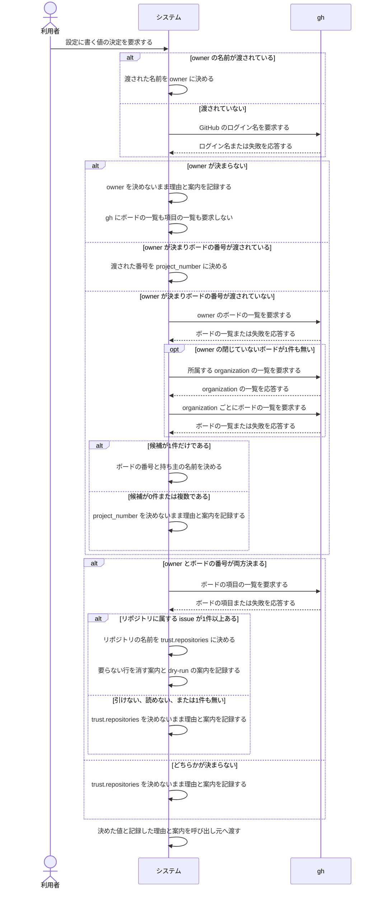

# ユースケース: 設定に書く値を gh から引く

> **`continuo init` と `continuo setup` の両方が通る、値を決める段だけを書いた記述である。**
> `設定ファイルを作る` が `INCLUDE USE CASE` で引く。値を決める段は失敗しても止まらないので、
> ファイルを書き出す段と1本の記述に書くと、値の決まり方と書き出しの結末の掛け算で経路が増える。分けて書く。
>
> **この記述は値を決めて呼び出し元へ渡すところまでである。**決まらなかった値をどう扱うかは呼び出し元が決める。
> `continuo init` はプレースホルダ（owner は `__FILL_ME__`、project_number は `0`）のまま雛形を書く。
> `continuo setup` は owner かボードの番号が決まらなければ、理由を応答して終了コード 1 で止まる。

## 根拠資料

- `docs/plans/continuo_design.md` の「3-32. 使い始めるまでの手順」（利用者に手で埋めさせない。対話で選ばせない）
- `docs/plans/continuo_design.md` の「3-33. 信頼の登録は、人間が列挙したものだけを対象にする」（`trust.repositories` はカンバンから拾うだけ）
- `internal/scaffold/detect.go` の `Detect` / `detectOwner` / `detectProject` / `detectRepositories` / `listProjects` / `listOrgs` / `parseProjectList` / `parseItemRepositories` / `validOwnerRepo`
- `internal/scaffold/fill.go` の `ValidOwner`
- `internal/cli/cli.go` の `runInit` / `runSetup` / `checkDetectionForSetup`（呼び出し元）

## RUCM

```rucm
USE CASE NAME: 設定に書く値を gh から引く
BRIEF DESCRIPTION: システムは tracker.provider.owner と tracker.provider.project_number と trust.repositories に書く値を決める。システムは渡された値があれば渡された値を使う。システムは渡されていない値を gh から引く。システムは引けなかった値を決めないまま残す。システムは決められなかった理由と直し方を記録する。システムは値を決められなくても打ち切らない。
PRECONDITION: 利用者は continuo init か continuo setup を実行している。
PRIMARY ACTOR: 利用者
SECONDARY ACTORS: gh
DEPENDENCY: なし
GENERALIZATION: なし

BASIC FLOW:
1. 利用者はシステムに設定に書く値の決定を要求する。
2. IF owner の名前が渡されている THEN
3.   システムは渡された名前を tracker.provider.owner の値に決める。
4. ELSE
5.   システムは gh に GitHub のログイン名を要求する。
6.   システムは VALIDATES THAT gh が user / organization 名として受け付けられるログイン名を応答する。
7.   システムは gh が応答したログイン名を tracker.provider.owner の値に決める。
8. ENDIF
9. IF ボードの番号が渡されている THEN
10.   システムは渡された番号を tracker.provider.project_number の値に決める。
11. ELSE
12.   システムは gh に tracker.provider.owner のボードの一覧を要求する。
13.   システムは VALIDATES THAT gh がボードの一覧を応答する。
14.   IF tracker.provider.owner の閉じていないボードが1件も無い THEN
15.     システムは gh に利用者が所属する organization の一覧を要求する。
16.     システムは organization ごとに、gh にボードの一覧を要求する。
17.     システムは一覧を引けなかった organization を候補に数えない。
18.   ENDIF
19.   システムは VALIDATES THAT 閉じていないボードの候補が1件以上ある。
20.   システムは VALIDATES THAT 閉じていないボードの候補が1件だけである。
21.   システムは1件だけのボードの番号を tracker.provider.project_number の値に決める。
22.   システムは1件だけのボードの持ち主の名前を tracker.provider.owner の値にする。
23. ENDIF
24. システムは gh にボードに載っている項目の一覧を要求する。
25. システムは VALIDATES THAT gh がボードの項目の一覧を応答する。
26. システムは VALIDATES THAT gh の応答をボードの項目の一覧として読める。
27. システムは VALIDATES THAT ボードの項目にリポジトリに属する issue が1件以上ある。
28. システムはボードの項目からリポジトリの名前を重複なく集める。
29. システムは集めた名前を trust.repositories の値に決める。
30. システムは trust.repositories から要らない行を消す案内を記録する。
31. システムは continuo trust の dry-run で登録の対象を確かめる案内を記録する。
32. IF 読んだ項目の数が1回に読む上限に達している THEN
33.   システムは項目を上限で打ち切って読んだことを記録する。
34. ENDIF
35. システムは決めた値と記録した理由と案内を呼び出し元へ渡す。
POSTCONDITION: tracker.provider.owner と tracker.provider.project_number と trust.repositories の値が3つとも決まっている。決め方がキーごとに記録されている。システムはファイルを1つも書いていない。

SPECIFIC ALTERNATIVE FLOW ログイン名取得失敗:
RFS BASIC FLOW 6
1. システムは tracker.provider.owner の値を決めないまま残す。
2. システムは tracker.provider.owner を決められなかった理由を記録する。
3. システムは gh のログインをやり直す案内を記録する。
4. システムは owner の名前を指定して実行し直す案内を記録する。
5. システムは URL のどの位置が owner の名前であるかを記録する。
6. IF ボードの番号が渡されている THEN
7.   システムは渡された番号を tracker.provider.project_number の値に決める。
8. ELSE
9.   システムは tracker.provider.project_number の値を決めないまま残す。
10.   システムは tracker.provider.owner が決まらないのでボードの候補を引けないことを記録する。
11.   システムは先に owner の名前を決める案内を記録する。
12.   システムはボードの番号を指定して実行し直す案内を記録する。
13. ENDIF
14. システムは trust.repositories の値を決めないまま残す。
15. システムは owner とボードの番号を決めてから実行し直す案内を記録する。
16. システムは trust.repositories を手で書いてもよいことを記録する。
17. RESUME STEP 35
POSTCONDITION: tracker.provider.owner の値は決まっていない。trust.repositories の値は決まっていない。システムは gh にボードの一覧を要求していない。システムは gh にボードの項目の一覧を要求していない。決められなかった理由と直し方が記録されている。

SPECIFIC ALTERNATIVE FLOW ボード一覧取得失敗:
RFS BASIC FLOW 13
1. システムは tracker.provider.project_number の値を決めないまま残す。
2. システムはボードの一覧を引けなかった理由を記録する。
3. システムは project の scope を付けて gh のログインをやり直す案内を記録する。
4. システムはボードの番号を指定して実行し直す案内を記録する。
5. システムは trust.repositories の値を決めないまま残す。
6. システムは owner とボードの番号を決めてから実行し直す案内を記録する。
7. システムは trust.repositories を手で書いてもよいことを記録する。
8. RESUME STEP 35
POSTCONDITION: tracker.provider.project_number の値は決まっていない。trust.repositories の値は決まっていない。システムは gh にボードの項目の一覧を要求していない。決められなかった理由と直し方が記録されている。

SPECIFIC ALTERNATIVE FLOW ボード候補なし:
RFS BASIC FLOW 19
1. システムは tracker.provider.project_number の値を決めないまま残す。
2. システムは探した owner のどこにもボードが1件も見つからないことを記録する。
3. システムは探した owner の名前を記録する。
4. システムはボードを1つ作る案内を記録する。
5. システムはボードが別の owner にある場合に owner の名前を指定する案内を記録する。
6. システムはボードを作ったあとにボードの番号を指定して実行し直す案内を記録する。
7. システムは trust.repositories の値を決めないまま残す。
8. システムは owner とボードの番号を決めてから実行し直す案内を記録する。
9. システムは trust.repositories を手で書いてもよいことを記録する。
10. RESUME STEP 35
POSTCONDITION: tracker.provider.project_number の値は決まっていない。trust.repositories の値は決まっていない。探した owner の名前が記録されている。ボードの作り方の案内が記録されている。システムは gh にボードの項目の一覧を要求していない。

SPECIFIC ALTERNATIVE FLOW ボード候補が複数:
RFS BASIC FLOW 20
1. システムは tracker.provider.project_number の値を決めないまま残す。
2. システムはボードの候補の owner と番号と名前と URL の一覧を記録する。
3. システムは候補からボードの番号を指定して実行し直す案内を記録する。
4. システムは候補が別の owner のボードである場合に owner の名前も指定する案内を記録する。
5. システムは trust.repositories の値を決めないまま残す。
6. システムは owner とボードの番号を決めてから実行し直す案内を記録する。
7. システムは trust.repositories を手で書いてもよいことを記録する。
8. RESUME STEP 35
POSTCONDITION: tracker.provider.project_number の値は決まっていない。trust.repositories の値は決まっていない。ボードの候補の一覧が記録されている。システムは利用者にボードを選ばせる問い合わせを出していない。システムは gh にボードの項目の一覧を要求していない。

SPECIFIC ALTERNATIVE FLOW ボードの項目を引けない:
RFS BASIC FLOW 25
1. システムは trust.repositories の値を決めないまま残す。
2. システムはボードの項目を引けなかった理由を記録する。
3. システムは project の scope を付けて gh のログインをやり直す案内を記録する。
4. システムは trust.repositories を手で書いてもよいことを記録する。
5. RESUME STEP 35
POSTCONDITION: trust.repositories の値は決まっていない。引けなかった理由と直し方が記録されている。

SPECIFIC ALTERNATIVE FLOW 項目の一覧を読めない:
RFS BASIC FLOW 26
1. システムは trust.repositories の値を決めないまま残す。
2. システムは gh の応答を読めなかった理由を記録する。
3. システムは trust.repositories を手で書く案内を記録する。
4. RESUME STEP 35
POSTCONDITION: trust.repositories の値は決まっていない。読めなかった理由と直し方が記録されている。

SPECIFIC ALTERNATIVE FLOW リポジトリが1件も無い:
RFS BASIC FLOW 27
1. システムは trust.repositories の値を決めないまま残す。
2. システムはボードにリポジトリの issue が1件も載っていないことを記録する。
3. システムは信頼させたいリポジトリを手で書く案内を記録する。
4. RESUME STEP 35
POSTCONDITION: trust.repositories の値は決まっていない。システムは draft issue をリポジトリに数えていない。システムは owner/repo の形でない名前をリポジトリに数えていない。
```

## フローチャート

```mermaid
flowchart TD
    BS1["1 利用者はシステムに設定に書く値の決定を要求する"]
    BS2{"2 IF owner の名前が渡されている THEN"}
    BS3["3 システムは渡された名前を tracker.provider.owner の値に決める"]
    BS5["5 システムは gh に GitHub のログイン名を要求する"]
    BS6{"6 gh が user / organization 名として受け付けられるログイン名を応答する"}
    BS7["7 システムは gh が応答したログイン名を tracker.provider.owner の値に決める"]
    BS9{"9 IF ボードの番号が渡されている THEN"}
    BS10["10 システムは渡された番号を tracker.provider.project_number の値に決める"]
    BS12["12 システムは gh に tracker.provider.owner のボードの一覧を要求する"]
    BS13{"13 gh がボードの一覧を応答する"}
    BS14{"14 IF tracker.provider.owner の閉じていないボードが1件も無い THEN"}
    BS15["15 システムは gh に利用者が所属する organization の一覧を要求する"]
    BS16["16 システムは organization ごとに、gh にボードの一覧を要求する"]
    BS17["17 システムは一覧を引けなかった organization を候補に数えない"]
    BS19{"19 閉じていないボードの候補が1件以上ある"}
    BS20{"20 閉じていないボードの候補が1件だけである"}
    BS21["21 システムは1件だけのボードの番号を tracker.provider.project_number の値に決める"]
    BS22["22 システムは1件だけのボードの持ち主の名前を tracker.provider.owner の値にする"]
    BS24["24 システムは gh にボードに載っている項目の一覧を要求する"]
    BS25{"25 gh がボードの項目の一覧を応答する"}
    BS26{"26 gh の応答をボードの項目の一覧として読める"}
    BS27{"27 ボードの項目にリポジトリに属する issue が1件以上ある"}
    BS28["28 システムはボードの項目からリポジトリの名前を重複なく集める"]
    BS29["29 システムは集めた名前を trust.repositories の値に決める"]
    BS30["30 システムは trust.repositories から要らない行を消す案内を記録する"]
    BS31["31 システムは continuo trust の dry-run で登録の対象を確かめる案内を記録する"]
    BS32{"32 IF 読んだ項目の数が1回に読む上限に達している THEN"}
    BS33["33 システムは項目を上限で打ち切って読んだことを記録する"]
    BS35["35 システムは決めた値と記録した理由と案内を呼び出し元へ渡す"]
    A1S1["ログイン名取得失敗 1 システムは tracker.provider.owner の値を決めないまま残す"]
    A1S2["ログイン名取得失敗 2 システムは tracker.provider.owner を決められなかった理由を記録する"]
    A1S3["ログイン名取得失敗 3 システムは gh のログインをやり直す案内を記録する"]
    A1S4["ログイン名取得失敗 4 システムは owner の名前を指定して実行し直す案内を記録する"]
    A1S5["ログイン名取得失敗 5 システムは URL のどの位置が owner の名前であるかを記録する"]
    A1S6{"ログイン名取得失敗 6 IF ボードの番号が渡されている THEN"}
    A1S7["ログイン名取得失敗 7 システムは渡された番号を tracker.provider.project_number の値に決める"]
    A1S9["ログイン名取得失敗 9 システムは tracker.provider.project_number の値を決めないまま残す"]
    A1S10["ログイン名取得失敗 10 システムは tracker.provider.owner が決まらないのでボードの候補を引けないことを記録する"]
    A1S11["ログイン名取得失敗 11 システムは先に owner の名前を決める案内を記録する"]
    A1S12["ログイン名取得失敗 12 システムはボードの番号を指定して実行し直す案内を記録する"]
    A1S14["ログイン名取得失敗 14 システムは trust.repositories の値を決めないまま残す"]
    A1S15["ログイン名取得失敗 15 システムは owner とボードの番号を決めてから実行し直す案内を記録する"]
    A1S16["ログイン名取得失敗 16 システムは trust.repositories を手で書いてもよいことを記録する"]
    A1S17["ログイン名取得失敗 17 RESUME STEP 35"]
    A2S1["ボード一覧取得失敗 1 システムは tracker.provider.project_number の値を決めないまま残す"]
    A2S2["ボード一覧取得失敗 2 システムはボードの一覧を引けなかった理由を記録する"]
    A2S3["ボード一覧取得失敗 3 システムは project の scope を付けて gh のログインをやり直す案内を記録する"]
    A2S4["ボード一覧取得失敗 4 システムはボードの番号を指定して実行し直す案内を記録する"]
    A2S5["ボード一覧取得失敗 5 システムは trust.repositories の値を決めないまま残す"]
    A2S6["ボード一覧取得失敗 6 システムは owner とボードの番号を決めてから実行し直す案内を記録する"]
    A2S7["ボード一覧取得失敗 7 システムは trust.repositories を手で書いてもよいことを記録する"]
    A2S8["ボード一覧取得失敗 8 RESUME STEP 35"]
    A3S1["ボード候補なし 1 システムは tracker.provider.project_number の値を決めないまま残す"]
    A3S2["ボード候補なし 2 システムは探した owner のどこにもボードが1件も見つからないことを記録する"]
    A3S3["ボード候補なし 3 システムは探した owner の名前を記録する"]
    A3S4["ボード候補なし 4 システムはボードを1つ作る案内を記録する"]
    A3S5["ボード候補なし 5 システムはボードが別の owner にある場合に owner の名前を指定する案内を記録する"]
    A3S6["ボード候補なし 6 システムはボードを作ったあとにボードの番号を指定して実行し直す案内を記録する"]
    A3S7["ボード候補なし 7 システムは trust.repositories の値を決めないまま残す"]
    A3S8["ボード候補なし 8 システムは owner とボードの番号を決めてから実行し直す案内を記録する"]
    A3S9["ボード候補なし 9 システムは trust.repositories を手で書いてもよいことを記録する"]
    A3S10["ボード候補なし 10 RESUME STEP 35"]
    A4S1["ボード候補が複数 1 システムは tracker.provider.project_number の値を決めないまま残す"]
    A4S2["ボード候補が複数 2 システムはボードの候補の owner と番号と名前と URL の一覧を記録する"]
    A4S3["ボード候補が複数 3 システムは候補からボードの番号を指定して実行し直す案内を記録する"]
    A4S4["ボード候補が複数 4 システムは候補が別の owner のボードである場合に owner の名前も指定する案内を記録する"]
    A4S5["ボード候補が複数 5 システムは trust.repositories の値を決めないまま残す"]
    A4S6["ボード候補が複数 6 システムは owner とボードの番号を決めてから実行し直す案内を記録する"]
    A4S7["ボード候補が複数 7 システムは trust.repositories を手で書いてもよいことを記録する"]
    A4S8["ボード候補が複数 8 RESUME STEP 35"]
    A5S1["ボードの項目を引けない 1 システムは trust.repositories の値を決めないまま残す"]
    A5S2["ボードの項目を引けない 2 システムはボードの項目を引けなかった理由を記録する"]
    A5S3["ボードの項目を引けない 3 システムは project の scope を付けて gh のログインをやり直す案内を記録する"]
    A5S4["ボードの項目を引けない 4 システムは trust.repositories を手で書いてもよいことを記録する"]
    A5S5["ボードの項目を引けない 5 RESUME STEP 35"]
    A6S1["項目の一覧を読めない 1 システムは trust.repositories の値を決めないまま残す"]
    A6S2["項目の一覧を読めない 2 システムは gh の応答を読めなかった理由を記録する"]
    A6S3["項目の一覧を読めない 3 システムは trust.repositories を手で書く案内を記録する"]
    A6S4["項目の一覧を読めない 4 RESUME STEP 35"]
    A7S1["リポジトリが1件も無い 1 システムは trust.repositories の値を決めないまま残す"]
    A7S2["リポジトリが1件も無い 2 システムはボードにリポジトリの issue が1件も載っていないことを記録する"]
    A7S3["リポジトリが1件も無い 3 システムは信頼させたいリポジトリを手で書く案内を記録する"]
    A7S4["リポジトリが1件も無い 4 RESUME STEP 35"]
    BS1 --> BS2
    BS2 -- はい --> BS3
    BS2 -- いいえ --> BS5
    BS3 --> BS9
    BS5 --> BS6
    BS6 -- はい --> BS7
    BS6 -- いいえ --> A1S1
    BS7 --> BS9
    BS9 -- はい --> BS10
    BS9 -- いいえ --> BS12
    BS10 --> BS24
    BS12 --> BS13
    BS13 -- はい --> BS14
    BS13 -- いいえ --> A2S1
    BS14 -- はい --> BS15
    BS14 -- いいえ --> BS19
    BS15 --> BS16
    BS16 --> BS17
    BS17 --> BS19
    BS19 -- はい --> BS20
    BS19 -- いいえ --> A3S1
    BS20 -- はい --> BS21
    BS20 -- いいえ --> A4S1
    BS21 --> BS22
    BS22 --> BS24
    BS24 --> BS25
    BS25 -- はい --> BS26
    BS25 -- いいえ --> A5S1
    BS26 -- はい --> BS27
    BS26 -- いいえ --> A6S1
    BS27 -- はい --> BS28
    BS27 -- いいえ --> A7S1
    BS28 --> BS29
    BS29 --> BS30
    BS30 --> BS31
    BS31 --> BS32
    BS32 -- はい --> BS33
    BS32 -- いいえ --> BS35
    BS33 --> BS35
    A1S1 --> A1S2
    A1S2 --> A1S3
    A1S3 --> A1S4
    A1S4 --> A1S5
    A1S5 --> A1S6
    A1S6 -- はい --> A1S7
    A1S6 -- いいえ --> A1S9
    A1S7 --> A1S14
    A1S9 --> A1S10
    A1S10 --> A1S11
    A1S11 --> A1S12
    A1S12 --> A1S14
    A1S14 --> A1S15
    A1S15 --> A1S16
    A1S16 --> A1S17
    A1S17 -. "戻る" .-> BS35
    A2S1 --> A2S2
    A2S2 --> A2S3
    A2S3 --> A2S4
    A2S4 --> A2S5
    A2S5 --> A2S6
    A2S6 --> A2S7
    A2S7 --> A2S8
    A2S8 -. "戻る" .-> BS35
    A3S1 --> A3S2
    A3S2 --> A3S3
    A3S3 --> A3S4
    A3S4 --> A3S5
    A3S5 --> A3S6
    A3S6 --> A3S7
    A3S7 --> A3S8
    A3S8 --> A3S9
    A3S9 --> A3S10
    A3S10 -. "戻る" .-> BS35
    A4S1 --> A4S2
    A4S2 --> A4S3
    A4S3 --> A4S4
    A4S4 --> A4S5
    A4S5 --> A4S6
    A4S6 --> A4S7
    A4S7 --> A4S8
    A4S8 -. "戻る" .-> BS35
    A5S1 --> A5S2
    A5S2 --> A5S3
    A5S3 --> A5S4
    A5S4 --> A5S5
    A5S5 -. "戻る" .-> BS35
    A6S1 --> A6S2
    A6S2 --> A6S3
    A6S3 --> A6S4
    A6S4 -. "戻る" .-> BS35
    A7S1 --> A7S2
    A7S2 --> A7S3
    A7S3 --> A7S4
    A7S4 -. "戻る" .-> BS35
    BS35 --> END(["終了"])
```



## シーケンス図


