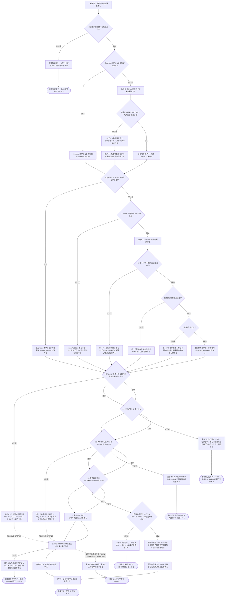
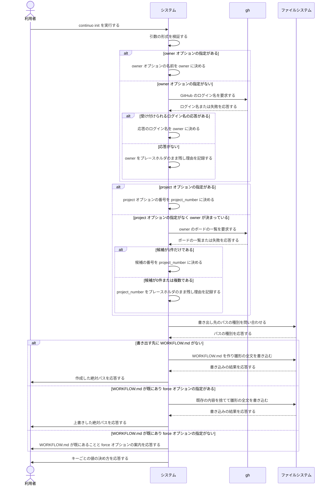

# ユースケース: 設定ファイルを作る

## 根拠資料

- `docs/plans/continuo_design.md` の「3-32. 使い始めるまでの手順」（`continuo init` は利用者に手で埋めさせない）
- `docs/plans/continuo_design.md` の「5-1. ファイルの名前と探し方」
- `docs/trying_it_out.md` の「設定ファイルを置く」以降（実際に叩いた出力）
- `internal/scaffold/detect.go` の `Detect` / `detectOwner` / `detectProject` / `parseProjectList`
- `internal/scaffold/scaffold.go` の `WriteTemplateWithValues` / `openError`
- `internal/scaffold/fill.go` の `TemplateWithValues` / `ValidOwner`
- `internal/scaffold/template.go` の `workflowTemplate`
- `cmd/continuo/main.go` の `runInit` / `printDetection`

## RUCM

```rucm
USE CASE NAME: 設定ファイルを作る
BRIEF DESCRIPTION: 利用者は continuo init を実行する。システムは WORKFLOW.md の雛形を書き出す。システムは tracker.provider.owner と tracker.provider.project_number を gh から引いた値で埋める。システムは引けなかった値をプレースホルダのまま残し、何を埋めればよいかを応答する。
PRECONDITION: 利用者は continuo の実行ファイルを実行できる。書き出す先のディレクトリのパスが決まっている。
PRIMARY ACTOR: 利用者
SECONDARY ACTORS: gh
DEPENDENCY: なし
GENERALIZATION: なし

BASIC FLOW:
1. 利用者はシステムに WORKFLOW.md の雛形の作成を要求する。
2. システムは VALIDATES THAT 利用者が指定した引数が受け付けられる形式である。
3. IF 利用者が owner オプションを指定している THEN
4.   システムは owner オプションに指定された名前を tracker.provider.owner の値に決める。
5. ELSE
6.   システムは gh に GitHub のログイン名を要求する。
7.   システムは VALIDATES THAT gh が user / organization 名として受け付けられるログイン名を応答する。
8.   システムは gh が応答したログイン名を tracker.provider.owner の値に決める。
9. ENDIF
10. IF 利用者が project オプションを指定している THEN
11.   システムは project オプションに指定された番号を tracker.provider.project_number の値に決める。
12. ELSE
13.   システムは VALIDATES THAT tracker.provider.owner の値が決まっている。
14.   システムは gh に tracker.provider.owner のボードの一覧を要求する。
15.   システムは VALIDATES THAT gh がボードの一覧を応答する。
16.   システムは VALIDATES THAT 閉じていないボードの候補が1件以上ある。
17.   システムは VALIDATES THAT 閉じていないボードの候補が1件だけである。
18.   システムは1件だけのボードの番号を tracker.provider.project_number の値に決める。
19. ENDIF
20. システムは VALIDATES THAT tracker.provider.owner と tracker.provider.project_number の両方が決まっている。
21. システムは gh にボードに載っている項目の一覧を要求する。
22. システムは VALIDATES THAT gh がボードの項目を応答する。
23. システムはボードの項目からリポジトリの名前を重複なく集める。
24. システムは集めた名前を trust.repositories の値に決める。
25. システムは VALIDATES THAT 書き出す先に指定されたパスがある。
26. システムは VALIDATES THAT 書き出す先に指定されたパスがディレクトリである。
27. システムは VALIDATES THAT 書き出す先の WORKFLOW.md が symlink ではない。
28. システムは VALIDATES THAT 書き出す先に WORKFLOW.md がない。
29. システムは書き出す先に WORKFLOW.md を作る。
30. システムは WORKFLOW.md に雛形の全文を書き込む。
31. システムは利用者に作成した WORKFLOW.md の絶対パスを応答する。
32. システムは利用者にキーごとの値の決め方を応答する。
33. システムは利用者に trust.repositories から要らない行を消すよう促す。
POSTCONDITION: 書き出す先のディレクトリに WORKFLOW.md がある。WORKFLOW.md の tracker.provider.owner と tracker.provider.project_number に決まった値がある。trust.repositories にボードのリポジトリが並んでいる。終了コード 0 が返っている。

SPECIFIC ALTERNATIVE FLOW リポジトリを引く前提が無い:
RFS BASIC FLOW 20
1. システムは trust.repositories をプレースホルダのまま残す。
2. システムは利用者に owner とボードの番号を決めてから実行し直すよう応答する。
3. システムは利用者に trust.repositories を手で書いてもよいことを応答する。
4. RESUME STEP 25
POSTCONDITION: trust.repositories はプレースホルダのままである。WORKFLOW.md は作られる。

SPECIFIC ALTERNATIVE FLOW ボードの項目を引けない:
RFS BASIC FLOW 22
1. システムは trust.repositories をプレースホルダのまま残す。
2. システムは利用者に引けなかった理由を応答する。
3. システムは利用者に gh の scope を確かめるよう応答する。
4. RESUME STEP 25
POSTCONDITION: trust.repositories はプレースホルダのままである。WORKFLOW.md は作られる。利用者は引けなかった理由を読める。

SPECIFIC ALTERNATIVE FLOW 引数指定エラー:
RFS BASIC FLOW 2
1. システムは利用者に引数のどこが受け付けられないかを応答する。
2. ABORT
POSTCONDITION: WORKFLOW.md は作られていない。終了コード 2 が返っている。

SPECIFIC ALTERNATIVE FLOW ログイン名取得失敗:
RFS BASIC FLOW 7
1. システムは tracker.provider.owner の値をプレースホルダ __FILL_ME__ のまま残す。
2. システムは tracker.provider.owner を埋められなかった理由を記録する。
3. システムは gh のログインをやり直す案内を記録する。
4. システムは owner オプションを指定して実行し直す案内を記録する。
5. RESUME STEP 10
POSTCONDITION: tracker.provider.owner の値はプレースホルダ __FILL_ME__ のままである。埋められなかった理由と直し方が記録されている。

SPECIFIC ALTERNATIVE FLOW owner未確定:
RFS BASIC FLOW 13
1. システムは tracker.provider.project_number の値をプレースホルダ 0 のまま残す。
2. システムは tracker.provider.owner が決まらないのでボードの候補を引けないことを記録する。
3. システムは project オプションを指定して実行し直す案内を記録する。
4. RESUME STEP 20
POSTCONDITION: tracker.provider.project_number の値はプレースホルダ 0 のままである。システムは gh にボードの一覧を要求していない。

SPECIFIC ALTERNATIVE FLOW ボード一覧取得失敗:
RFS BASIC FLOW 15
1. システムは tracker.provider.project_number の値をプレースホルダ 0 のまま残す。
2. システムはボードの一覧を引けなかった理由を記録する。
3. システムは project の scope を付けて gh のログインをやり直す案内を記録する。
4. システムは project オプションを指定して実行し直す案内を記録する。
5. RESUME STEP 20
POSTCONDITION: tracker.provider.project_number の値はプレースホルダ 0 のままである。埋められなかった理由と直し方が記録されている。

SPECIFIC ALTERNATIVE FLOW ボード候補なし:
RFS BASIC FLOW 16
1. システムは tracker.provider.project_number の値をプレースホルダ 0 のまま残す。
2. システムは tracker.provider.owner のボードが1件も見つからないことを記録する。
3. システムはボードを1つ作る案内を記録する。
4. RESUME STEP 20
POSTCONDITION: tracker.provider.project_number の値はプレースホルダ 0 のままである。ボードの作り方の案内が記録されている。

SPECIFIC ALTERNATIVE FLOW ボード候補が複数:
RFS BASIC FLOW 17
1. システムは tracker.provider.project_number の値をプレースホルダ 0 のまま残す。
2. システムはボードの候補の番号と名前と URL の一覧を記録する。
3. システムは project オプションでボードの番号を指定して実行し直す案内を記録する。
4. RESUME STEP 20
POSTCONDITION: tracker.provider.project_number の値はプレースホルダ 0 のままである。ボードの候補の一覧が記録されている。システムは利用者にボードを選ばせる問い合わせを出していない。

SPECIFIC ALTERNATIVE FLOW 書き出し先のパス不在:
RFS BASIC FLOW 25
1. システムは利用者に指定されたディレクトリがないことを応答する。
2. システムは利用者にディレクトリを先に作る案内を応答する。
3. ABORT
POSTCONDITION: WORKFLOW.md は作られていない。システムはディレクトリを作っていない。終了コード 1 が返っている。

SPECIFIC ALTERNATIVE FLOW 書き出し先がディレクトリではない:
RFS BASIC FLOW 26
1. システムは利用者に指定されたパスがディレクトリではないことを応答する。
2. システムは利用者に continuo init が受け取るのは WORKFLOW.md を置くディレクトリであることを応答する。
3. ABORT
POSTCONDITION: WORKFLOW.md は作られていない。終了コード 1 が返っている。

SPECIFIC ALTERNATIVE FLOW 書き出し先がsymlink:
RFS BASIC FLOW 27
1. システムは利用者に書き出す先の WORKFLOW.md が symlink であることを応答する。
2. システムは利用者に symlink を消すか別のディレクトリを指定する案内を応答する。
3. ABORT
POSTCONDITION: symlink のリンク先の内容は変わっていない。システムは symlink を辿っていない。終了コード 1 が返っている。

SPECIFIC ALTERNATIVE FLOW 既存の設定ファイル:
RFS BASIC FLOW 28
1. システムは VALIDATES THAT 利用者が force オプションを指定している。
2. システムは既存の WORKFLOW.md の内容を捨てる。
3. システムは WORKFLOW.md に雛形の全文を書き込む。
4. システムは利用者に上書きした WORKFLOW.md の絶対パスを応答する。
5. RESUME STEP 27
POSTCONDITION: WORKFLOW.md の内容が雛形の全文に置き換わっている。終了コード 0 が返っている。

SPECIFIC ALTERNATIVE FLOW 上書きの指定なし:
RFS 既存の設定ファイル 1
1. システムは利用者に WORKFLOW.md が既にあることを応答する。
2. システムは利用者に force オプションを付けて実行し直す案内を応答する。
3. ABORT
POSTCONDITION: 既存の WORKFLOW.md の内容は変わっていない。終了コード 1 が返っている。

GLOBAL ALTERNATIVE FLOW 書き込み中の中断:
BRANCH FROM BASIC FLOW 25
WHEN 利用者が continuo init の実行を中断する場合
1. システムは WORKFLOW.md への書き込みの途中で終了する。
2. ABORT
POSTCONDITION: WORKFLOW.md の内容は雛形の全文と一致しない。force オプションを伴う実行では、元の WORKFLOW.md の内容が失われる。
```

## フローチャート



## シーケンス図


