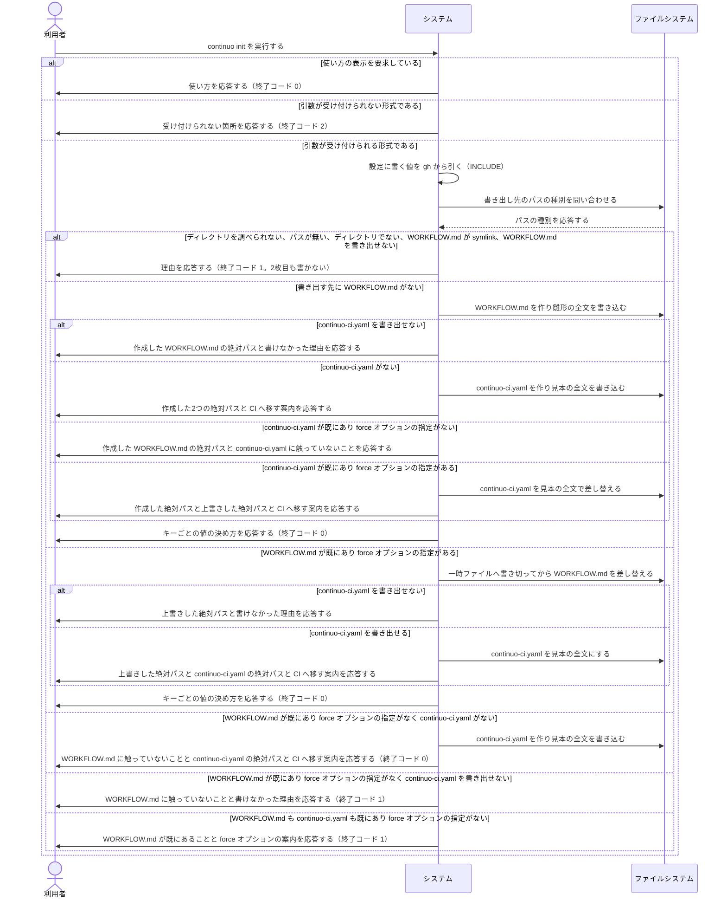

# ユースケース: 設定ファイルを作る

## 根拠資料

- `docs/plans/continuo_design.md` の「3-32. 使い始めるまでの手順」（`continuo init` は利用者に手で埋めさせない）
- `docs/plans/continuo_design.md` の「5-1. ファイルの名前と探し方」
- `docs/plans/continuo_design.md` の「5-3o. `continuo init` が置く2枚目（`continuo-ci.yaml`）」
- `docs/plans/continuo_design.md` の「3-59. ファイルの書き換えは一時ファイルへ書いてから差し替える」
- `docs/trying_it_out.md` の「段3. 設定を置く」（実際に叩いた出力）
- `internal/cli/cli.go` の `runInit` / `printInitCI` / `printDetection` / `parseErrorExitCode`
- `internal/scaffold/init.go` の `WriteAll` / `WriteCIWorkflowWithValues` / `InitResult` の `BothExisted` / `Wrote`
- `internal/scaffold/scaffold.go` の `WriteTemplateWithValues` / `writeOne` / `resolveTarget` / `resolveDir` / `openError`
- `internal/atomicfile/atomicfile.go` の `Write`
- `internal/scaffold/fill.go` の `TemplateWithValues`
- `internal/scaffold/template.go` の `workflowTemplate`

値を決める段（owner・ボードの番号・リポジトリ）は、`設定に書く値を gh から引く.rucm.md` に書いてある。

## RUCM

```rucm
USE CASE NAME: 設定ファイルを作る
BRIEF DESCRIPTION: 利用者は continuo init を実行する。システムは設定に書く値を決める。システムは WORKFLOW.md の雛形と continuo-ci.yaml の見本を書き出す。システムは何を埋めればよいかを応答する。
PRECONDITION: 利用者は continuo の実行ファイルを実行できる。書き出す先のディレクトリのパスが決まっている。
PRIMARY ACTOR: 利用者
SECONDARY ACTORS: なし
DEPENDENCY: INCLUDE USE CASE 設定に書く値を gh から引く
GENERALIZATION: なし

BASIC FLOW:
1. 利用者はシステムに WORKFLOW.md の雛形の作成を要求する。
2. システムは VALIDATES THAT 利用者が使い方の表示を要求していない。
3. システムは VALIDATES THAT 利用者が指定した引数が受け付けられる形式である。
4. INCLUDE USE CASE 設定に書く値を gh から引く
5. システムは VALIDATES THAT 書き出す先のディレクトリを調べられる。
6. システムは VALIDATES THAT 書き出す先に指定されたパスがある。
7. システムは VALIDATES THAT 書き出す先に指定されたパスがディレクトリである。
8. システムは VALIDATES THAT 書き出す先の WORKFLOW.md が symlink ではない。
9. システムは VALIDATES THAT 書き出す先に WORKFLOW.md がない。
10. システムは VALIDATES THAT 書き出す先に WORKFLOW.md を書き出せる。
11. システムは書き出す先に WORKFLOW.md を作る。
12. システムは WORKFLOW.md に雛形の全文を書き込む。
13. システムは VALIDATES THAT 書き出す先の continuo-ci.yaml を書き出せる。
14. システムは VALIDATES THAT 書き出す先に continuo-ci.yaml がない。
15. システムは書き出す先に continuo-ci.yaml を作る。
16. システムは continuo-ci.yaml に見本の全文を書き込む。
17. システムは利用者に作成した WORKFLOW.md の絶対パスを応答する。
18. システムは利用者に作成した continuo-ci.yaml の絶対パスを応答する。
19. システムは利用者に continuo-ci.yaml を CI へ移す案内を応答する。
20. システムは利用者にキーごとの値の決め方を応答する。
POSTCONDITION: 書き出す先のディレクトリに WORKFLOW.md と continuo-ci.yaml がある。WORKFLOW.md に、決まった値が書かれている。決まらなかった値は、プレースホルダのままである。応答は標準出力に出ている。終了コード 0 が返っている。

SPECIFIC ALTERNATIVE FLOW 使い方の表示:
RFS BASIC FLOW 2
1. システムは利用者に continuo init の使い方を応答する。
2. ABORT
POSTCONDITION: WORKFLOW.md は作られていない。continuo-ci.yaml は作られていない。システムは gh に何も要求していない。終了コード 0 が返っている。

SPECIFIC ALTERNATIVE FLOW 引数指定エラー:
RFS BASIC FLOW 3
1. システムは利用者に引数のどこが受け付けられないかを応答する。
2. ABORT
POSTCONDITION: WORKFLOW.md は作られていない。continuo-ci.yaml は作られていない。システムは gh に何も要求していない。理由は標準エラーに出ている。終了コード 2 が返っている。

SPECIFIC ALTERNATIVE FLOW 書き出し先のパス不在:
RFS BASIC FLOW 6
1. システムは利用者に指定されたディレクトリがないことを応答する。
2. システムは利用者にディレクトリを先に作る案内を応答する。
3. ABORT
POSTCONDITION: WORKFLOW.md は作られていない。continuo-ci.yaml は作られていない。システムはディレクトリを作っていない。理由は標準エラーに出ている。終了コード 1 が返っている。

SPECIFIC ALTERNATIVE FLOW 書き出し先がディレクトリではない:
RFS BASIC FLOW 7
1. システムは利用者に指定されたパスがディレクトリではないことを応答する。
2. システムは利用者に continuo init が受け取るのは WORKFLOW.md を置くディレクトリであることを応答する。
3. ABORT
POSTCONDITION: WORKFLOW.md は作られていない。continuo-ci.yaml は作られていない。理由は標準エラーに出ている。終了コード 1 が返っている。

SPECIFIC ALTERNATIVE FLOW 書き出し先がsymlink:
RFS BASIC FLOW 8
1. システムは利用者に書き出す先の WORKFLOW.md が symlink であることを応答する。
2. システムは利用者に symlink を消すか別のディレクトリを指定する案内を応答する。
3. ABORT
POSTCONDITION: symlink のリンク先の内容は変わっていない。システムは symlink を辿っていない。continuo-ci.yaml は作られていない。理由は標準エラーに出ている。終了コード 1 が返っている。

SPECIFIC ALTERNATIVE FLOW 既存の設定ファイル:
RFS BASIC FLOW 9
1. システムは VALIDATES THAT 利用者が force オプションを指定している。
2. システムは VALIDATES THAT 既存の WORKFLOW.md を差し替えられる。
3. システムは一時ファイルに雛形の全文を書き込む。
4. システムは既存の WORKFLOW.md を一時ファイルで差し替える。
5. システムは VALIDATES THAT 書き出す先の continuo-ci.yaml を書き出せる。
6. IF 書き出す先に continuo-ci.yaml がある THEN
7.   システムは既存の continuo-ci.yaml を見本の全文で差し替える。
8. ELSE
9.   システムは書き出す先に continuo-ci.yaml を作る。
10.   システムは continuo-ci.yaml に見本の全文を書き込む。
11. ENDIF
12. システムは利用者に上書きした WORKFLOW.md の絶対パスを応答する。
13. システムは利用者に continuo-ci.yaml の絶対パスを応答する。
14. システムは利用者に continuo-ci.yaml を CI へ移す案内を応答する。
15. RESUME STEP 20
POSTCONDITION: WORKFLOW.md の内容が雛形の全文に置き換わっている。continuo-ci.yaml の内容が見本の全文である。終了コード 0 が返っている。

SPECIFIC ALTERNATIVE FLOW 設定ファイルを差し替えられない:
RFS 既存の設定ファイル 2
1. システムは利用者に書き出せなかったファイルの名前と絶対パスと理由を応答する。
2. ABORT
POSTCONDITION: システムはファイルを1つも書いていない。continuo-ci.yaml は作られていない。理由は標準エラーに出ている。終了コード 1 が返っている。

SPECIFIC ALTERNATIVE FLOW 上書き時に見本を書けない:
RFS 既存の設定ファイル 5
1. システムは利用者に上書きした WORKFLOW.md の絶対パスを応答する。
2. システムは利用者に continuo-ci.yaml を書けなかった理由を応答する。
3. システムは利用者にキーごとの値の決め方を応答する。
4. ABORT
POSTCONDITION: WORKFLOW.md の内容が雛形の全文に置き換わっている。システムは continuo-ci.yaml を書き終えていない。既にある continuo-ci.yaml を差し替えられなかった場合は、既存の continuo-ci.yaml の内容は変わっていない。新しく作る continuo-ci.yaml への書き込みか閉じる操作が失敗した場合は、空か途中まで書かれた continuo-ci.yaml が残っている。continuo-ci.yaml を書けなかった理由は標準エラーに出ている。終了コード 0 が返っている。

SPECIFIC ALTERNATIVE FLOW 上書きの指定なし:
RFS 既存の設定ファイル 1
1. システムは既存の WORKFLOW.md の内容を変えない。
2. システムは VALIDATES THAT 書き出す先の continuo-ci.yaml を書き出せる。
3. システムは VALIDATES THAT 書き出す先に continuo-ci.yaml がない。
4. システムは書き出す先に continuo-ci.yaml を作る。
5. システムは continuo-ci.yaml に見本の全文を書き込む。
6. システムは利用者に WORKFLOW.md が既にあるので触っていないことを応答する。
7. システムは利用者に作成した continuo-ci.yaml の絶対パスを応答する。
8. システムは利用者に continuo-ci.yaml を CI へ移す案内を応答する。
9. ABORT
POSTCONDITION: 既存の WORKFLOW.md の内容は変わっていない。continuo-ci.yaml がある。システムは force オプションを勧めていない。システムはキーごとの値の決め方を応答していない。終了コード 0 が返っている。

SPECIFIC ALTERNATIVE FLOW 見本だけも書けない:
RFS 上書きの指定なし 2
1. システムは利用者に WORKFLOW.md が既にあるので触っていないことを応答する。
2. システムは利用者に continuo-ci.yaml を書けなかった理由を応答する。
3. ABORT
POSTCONDITION: 既存の WORKFLOW.md の内容は変わっていない。システムは continuo-ci.yaml を書き終えていない。continuo-ci.yaml への書き込みか閉じる操作が失敗した場合は、空か途中まで書かれた continuo-ci.yaml が残っている。触っていないことは標準出力に出ている。書けなかった理由は標準エラーに出ている。終了コード 1 が返っている。

SPECIFIC ALTERNATIVE FLOW 設定も見本も既にある:
RFS 上書きの指定なし 3
1. システムは利用者に WORKFLOW.md が既にあることを応答する。
2. システムは利用者に force オプションを付けて実行し直す案内を応答する。
3. ABORT
POSTCONDITION: 既存の WORKFLOW.md の内容は変わっていない。既存の continuo-ci.yaml の内容は変わっていない。理由は標準エラーに出ている。終了コード 1 が返っている。

BOUNDED ALTERNATIVE FLOW 設定ファイルを書けない:
RFS BASIC FLOW 5,10
1. システムは利用者に書き出せなかったファイルの名前と理由を応答する。
2. ABORT
POSTCONDITION: システムは WORKFLOW.md を書き終えていない。WORKFLOW.md への書き込みか閉じる操作が失敗した場合は、空か途中まで書かれた WORKFLOW.md が残っている。continuo-ci.yaml は作られていない。理由は標準エラーに出ている。終了コード 1 が返っている。

SPECIFIC ALTERNATIVE FLOW 見本を書けない:
RFS BASIC FLOW 13
1. システムは利用者に作成した WORKFLOW.md の絶対パスを応答する。
2. システムは利用者に continuo-ci.yaml を書けなかった理由を応答する。
3. システムは利用者にキーごとの値の決め方を応答する。
4. ABORT
POSTCONDITION: WORKFLOW.md がある。システムは continuo-ci.yaml を書き終えていない。continuo-ci.yaml への書き込みか閉じる操作が失敗した場合は、空か途中まで書かれた continuo-ci.yaml が残っている。continuo-ci.yaml が symlink である場合は、symlink のリンク先の内容は変わっていない。continuo-ci.yaml を書けなかった理由は標準エラーに出ている。終了コード 0 が返っている。

SPECIFIC ALTERNATIVE FLOW 既存の見本:
RFS BASIC FLOW 14
1. システムは VALIDATES THAT 利用者が force オプションを指定していない。
2. システムは既存の continuo-ci.yaml の内容を変えない。
3. システムは利用者に作成した WORKFLOW.md の絶対パスを応答する。
4. システムは利用者に continuo-ci.yaml が既にあるので触っていないことを応答する。
5. RESUME STEP 20
POSTCONDITION: WORKFLOW.md がある。既存の continuo-ci.yaml の内容は変わっていない。終了コード 0 が返っている。

SPECIFIC ALTERNATIVE FLOW 見本の上書き:
RFS 既存の見本 1
1. システムは既存の continuo-ci.yaml を見本の全文で差し替える。
2. システムは利用者に作成した WORKFLOW.md の絶対パスを応答する。
3. システムは利用者に上書きした continuo-ci.yaml の絶対パスを応答する。
4. システムは利用者に continuo-ci.yaml を CI へ移す案内を応答する。
5. システムは利用者にキーごとの値の決め方を応答する。
6. ABORT
POSTCONDITION: WORKFLOW.md がある。continuo-ci.yaml の内容が見本の全文に置き換わっている。終了コード 0 が返っている。

GLOBAL ALTERNATIVE FLOW 書き込み中の中断:
BRANCH FROM BASIC FLOW 12
WHEN 利用者が continuo init の実行を中断する場合
1. システムは雛形の全文の書き込みの途中で終了する。
2. ABORT
POSTCONDITION: 既にある WORKFLOW.md を force オプションで置き換える実行では、元の WORKFLOW.md の内容がそのまま残っている。システムは一時ファイルへ雛形の全文を書き切ってから WORKFLOW.md へ差し替えるので、上書きの途中で終わった WORKFLOW.md は残らない。システムが強制終了するか電源が落ちる場合は、書きかけの一時ファイルが同じディレクトリに残る。一時ファイルの名前は WORKFLOW.md の前に点を付けたもので始まるので、利用者のリポジトリでは未追跡のファイルとして見える。WORKFLOW.md をまだ持たないディレクトリで実行する場合は、force オプションを付けていても新しく作る経路を通る。この場合は WORKFLOW.md が無いか、途中まで書かれた WORKFLOW.md が残る。
```

## 段にしていない分岐

終わり方も、そのあと通る段も変わらない分岐は、段にせずにここへ書く。

### 書き出す先のディレクトリを調べられない場合（基本フロー 5）

`resolveDir` と `resolveTarget` は、WORKFLOW.md のパスを組み立てる前に次の4つで失敗しうる。どれも `runInit` の同じ分岐（そのほかの理由で書き出せない）へ落ち、標準エラーへ1行を出して終了コード 1 で終わる。ファイルは1つも作らない。

| 失敗する操作 | 実装が行う位置 | 応答に入るパス |
| --- | --- | --- |
| いまいるディレクトリの取得（`os.Getwd`。位置引数が無い実行だけ） | パスがあるかの検査（基本フロー 6）の前 | 入らない |
| 絶対パスへの変換（`filepath.Abs`。位置引数がある実行だけ） | パスがあるかの検査（基本フロー 6）の前 | 利用者が渡したままのパス |
| ディレクトリの有無の問い合わせ（`os.Stat` の「無い」以外の失敗。権限が無いなど） | パスがあるかの検査（基本フロー 6）と同じ呼び出し | ディレクトリの絶対パス |
| ディレクトリの symlink の解決（`filepath.EvalSymlinks`） | ディレクトリであるかの検査（基本フロー 7）のあと | ディレクトリの絶対パス |

応答はどれも「WORKFLOW.md を書き出せません」で始まる。WORKFLOW.md の絶対パスは、まだ組み立てていないので入らない。基本フロー 10 から入る場合（作成・書き込み・閉じる操作の失敗）は、WORKFLOW.md の絶対パスが入る。

continuo-ci.yaml のパスも同じ関数で組み立てる。continuo-ci.yaml の側で同じ4つが失敗した場合は、continuo-ci.yaml を書き出せない場合（基本フロー 13、`既存の設定ファイル` 5、`上書きの指定なし` 2）として扱う。

### 書きかけのファイルが残る場合

`writeOne` は、新しく作る経路でファイルを作ったあとに書き込みか閉じる操作が失敗しても、作ったファイルを消さない。空か途中まで書かれたファイルが残る。既にあるファイルを force オプションで差し替える経路は `atomicfile.Write` を通り、失敗すると一時ファイルを消すので、元のファイルがそのまま残る。

| 書く対象 | 経路 | 失敗のあとに残るもの |
| --- | --- | --- |
| WORKFLOW.md | 新しく作る（基本フロー 10） | 空か途中までの WORKFLOW.md。次の実行は「既にある」として扱う |
| WORKFLOW.md | 差し替える（`既存の設定ファイル` 2） | 元の WORKFLOW.md |
| continuo-ci.yaml | 新しく作る（基本フロー 13、`既存の設定ファイル` 5、`上書きの指定なし` 2） | 空か途中までの continuo-ci.yaml |
| continuo-ci.yaml | 差し替える（`既存の設定ファイル` 5） | 元の continuo-ci.yaml |

## フローチャート


```mermaid
flowchart TD
    BS1["1 利用者はシステムに WORKFLOW.md の雛形の作成を要求する"]
    BS2{"2 利用者が使い方の表示を要求していない"}
    BS3{"3 利用者が指定した引数が受け付けられる形式である"}
    BS4[["4 INCLUDE USE CASE 設定に書く値を gh から引く"]]
    BS5{"5 書き出す先のディレクトリを調べられる"}
    BS6{"6 書き出す先に指定されたパスがある"}
    BS7{"7 書き出す先に指定されたパスがディレクトリである"}
    BS8{"8 書き出す先の WORKFLOW.md が symlink ではない"}
    BS9{"9 書き出す先に WORKFLOW.md がない"}
    BS10{"10 書き出す先に WORKFLOW.md を書き出せる"}
    BS11["11 システムは書き出す先に WORKFLOW.md を作る"]
    BS12["12 システムは WORKFLOW.md に雛形の全文を書き込む"]
    BS13{"13 書き出す先の continuo-ci.yaml を書き出せる"}
    BS14{"14 書き出す先に continuo-ci.yaml がない"}
    BS15["15 システムは書き出す先に continuo-ci.yaml を作る"]
    BS16["16 システムは continuo-ci.yaml に見本の全文を書き込む"]
    BS17["17 システムは利用者に作成した WORKFLOW.md の絶対パスを応答する"]
    BS18["18 システムは利用者に作成した continuo-ci.yaml の絶対パスを応答する"]
    BS19["19 システムは利用者に continuo-ci.yaml を CI へ移す案内を応答する"]
    BS20["20 システムは利用者にキーごとの値の決め方を応答する"]
    A1S1["使い方の表示 1 システムは利用者に continuo init の使い方を応答する"]
    A1S2(["使い方の表示 2 ABORT"])
    A2S1["引数指定エラー 1 システムは利用者に引数のどこが受け付けられないかを応答する"]
    A2S2(["引数指定エラー 2 ABORT"])
    A3S1["書き出し先のパス不在 1 システムは利用者に指定されたディレクトリがないことを応答する"]
    A3S2["書き出し先のパス不在 2 システムは利用者にディレクトリを先に作る案内を応答する"]
    A3S3(["書き出し先のパス不在 3 ABORT"])
    A4S1["書き出し先がディレクトリではない 1 システムは利用者に指定されたパスがディレクトリではないことを応答する"]
    A4S2["書き出し先がディレクトリではない 2 システムは利用者に continuo init が受け取るのは WORKFLOW.md を置くディレクトリであることを応答する"]
    A4S3(["書き出し先がディレクトリではない 3 ABORT"])
    A5S1["書き出し先がsymlink 1 システムは利用者に書き出す先の WORKFLOW.md が symlink であることを応答する"]
    A5S2["書き出し先がsymlink 2 システムは利用者に symlink を消すか別のディレクトリを指定する案内を応答する"]
    A5S3(["書き出し先がsymlink 3 ABORT"])
    A6S1{"既存の設定ファイル 1 利用者が force オプションを指定している"}
    A6S2{"既存の設定ファイル 2 既存の WORKFLOW.md を差し替えられる"}
    A6S3["既存の設定ファイル 3 システムは一時ファイルに雛形の全文を書き込む"]
    A6S4["既存の設定ファイル 4 システムは既存の WORKFLOW.md を一時ファイルで差し替える"]
    A6S5{"既存の設定ファイル 5 書き出す先の continuo-ci.yaml を書き出せる"}
    A6S6{"既存の設定ファイル 6 IF 書き出す先に continuo-ci.yaml がある THEN"}
    A6S7["既存の設定ファイル 7 システムは既存の continuo-ci.yaml を見本の全文で差し替える"]
    A6S9["既存の設定ファイル 9 システムは書き出す先に continuo-ci.yaml を作る"]
    A6S10["既存の設定ファイル 10 システムは continuo-ci.yaml に見本の全文を書き込む"]
    A6S12["既存の設定ファイル 12 システムは利用者に上書きした WORKFLOW.md の絶対パスを応答する"]
    A6S13["既存の設定ファイル 13 システムは利用者に continuo-ci.yaml の絶対パスを応答する"]
    A6S14["既存の設定ファイル 14 システムは利用者に continuo-ci.yaml を CI へ移す案内を応答する"]
    A6S15["既存の設定ファイル 15 RESUME STEP 20"]
    A7S1["設定ファイルを差し替えられない 1 システムは利用者に書き出せなかったファイルの名前と絶対パスと理由を応答する"]
    A7S2(["設定ファイルを差し替えられない 2 ABORT"])
    A8S1["上書き時に見本を書けない 1 システムは利用者に上書きした WORKFLOW.md の絶対パスを応答する"]
    A8S2["上書き時に見本を書けない 2 システムは利用者に continuo-ci.yaml を書けなかった理由を応答する"]
    A8S3["上書き時に見本を書けない 3 システムは利用者にキーごとの値の決め方を応答する"]
    A8S4(["上書き時に見本を書けない 4 ABORT"])
    A9S1["上書きの指定なし 1 システムは既存の WORKFLOW.md の内容を変えない"]
    A9S2{"上書きの指定なし 2 書き出す先の continuo-ci.yaml を書き出せる"}
    A9S3{"上書きの指定なし 3 書き出す先に continuo-ci.yaml がない"}
    A9S4["上書きの指定なし 4 システムは書き出す先に continuo-ci.yaml を作る"]
    A9S5["上書きの指定なし 5 システムは continuo-ci.yaml に見本の全文を書き込む"]
    A9S6["上書きの指定なし 6 システムは利用者に WORKFLOW.md が既にあるので触っていないことを応答する"]
    A9S7["上書きの指定なし 7 システムは利用者に作成した continuo-ci.yaml の絶対パスを応答する"]
    A9S8["上書きの指定なし 8 システムは利用者に continuo-ci.yaml を CI へ移す案内を応答する"]
    A9S9(["上書きの指定なし 9 ABORT"])
    A10S1["見本だけも書けない 1 システムは利用者に WORKFLOW.md が既にあるので触っていないことを応答する"]
    A10S2["見本だけも書けない 2 システムは利用者に continuo-ci.yaml を書けなかった理由を応答する"]
    A10S3(["見本だけも書けない 3 ABORT"])
    A11S1["設定も見本も既にある 1 システムは利用者に WORKFLOW.md が既にあることを応答する"]
    A11S2["設定も見本も既にある 2 システムは利用者に force オプションを付けて実行し直す案内を応答する"]
    A11S3(["設定も見本も既にある 3 ABORT"])
    A12S1["設定ファイルを書けない 1 システムは利用者に書き出せなかったファイルの名前と理由を応答する"]
    A12S2(["設定ファイルを書けない 2 ABORT"])
    A13S1["見本を書けない 1 システムは利用者に作成した WORKFLOW.md の絶対パスを応答する"]
    A13S2["見本を書けない 2 システムは利用者に continuo-ci.yaml を書けなかった理由を応答する"]
    A13S3["見本を書けない 3 システムは利用者にキーごとの値の決め方を応答する"]
    A13S4(["見本を書けない 4 ABORT"])
    A14S1{"既存の見本 1 利用者が force オプションを指定していない"}
    A14S2["既存の見本 2 システムは既存の continuo-ci.yaml の内容を変えない"]
    A14S3["既存の見本 3 システムは利用者に作成した WORKFLOW.md の絶対パスを応答する"]
    A14S4["既存の見本 4 システムは利用者に continuo-ci.yaml が既にあるので触っていないことを応答する"]
    A14S5["既存の見本 5 RESUME STEP 20"]
    A15S1["見本の上書き 1 システムは既存の continuo-ci.yaml を見本の全文で差し替える"]
    A15S2["見本の上書き 2 システムは利用者に作成した WORKFLOW.md の絶対パスを応答する"]
    A15S3["見本の上書き 3 システムは利用者に上書きした continuo-ci.yaml の絶対パスを応答する"]
    A15S4["見本の上書き 4 システムは利用者に continuo-ci.yaml を CI へ移す案内を応答する"]
    A15S5["見本の上書き 5 システムは利用者にキーごとの値の決め方を応答する"]
    A15S6(["見本の上書き 6 ABORT"])
    A16S1["書き込み中の中断 1 システムは雛形の全文の書き込みの途中で終了する"]
    A16S2(["書き込み中の中断 2 ABORT"])
    BS1 --> BS2
    BS2 -- はい --> BS3
    BS2 -- いいえ --> A1S1
    BS3 -- はい --> BS4
    BS3 -- いいえ --> A2S1
    BS4 --> BS5
    BS5 -- はい --> BS6
    BS5 -- いいえ --> A12S1
    BS6 -- はい --> BS7
    BS6 -- いいえ --> A3S1
    BS7 -- はい --> BS8
    BS7 -- いいえ --> A4S1
    BS8 -- はい --> BS9
    BS8 -- いいえ --> A5S1
    BS9 -- はい --> BS10
    BS9 -- いいえ --> A6S1
    BS10 -- はい --> BS11
    BS10 -- いいえ --> A12S1
    BS11 --> BS12
    BS12 --> BS13
    BS12 -. "WHEN 利用者が continuo init の実行を中断する場合" .-> A16S1
    BS13 -- はい --> BS14
    BS13 -- いいえ --> A13S1
    BS14 -- はい --> BS15
    BS14 -- いいえ --> A14S1
    BS15 --> BS16
    BS16 --> BS17
    BS17 --> BS18
    BS18 --> BS19
    BS19 --> BS20
    A1S1 --> A1S2
    A2S1 --> A2S2
    A3S1 --> A3S2
    A3S2 --> A3S3
    A4S1 --> A4S2
    A4S2 --> A4S3
    A5S1 --> A5S2
    A5S2 --> A5S3
    A6S1 -- はい --> A6S2
    A6S1 -- いいえ --> A9S1
    A6S2 -- はい --> A6S3
    A6S2 -- いいえ --> A7S1
    A6S3 --> A6S4
    A6S4 --> A6S5
    A6S5 -- はい --> A6S6
    A6S5 -- いいえ --> A8S1
    A6S6 -- はい --> A6S7
    A6S6 -- いいえ --> A6S9
    A6S7 --> A6S12
    A6S9 --> A6S10
    A6S10 --> A6S12
    A6S12 --> A6S13
    A6S13 --> A6S14
    A6S14 --> A6S15
    A6S15 -. "戻る" .-> BS20
    A7S1 --> A7S2
    A8S1 --> A8S2
    A8S2 --> A8S3
    A8S3 --> A8S4
    A9S1 --> A9S2
    A9S2 -- はい --> A9S3
    A9S2 -- いいえ --> A10S1
    A9S3 -- はい --> A9S4
    A9S3 -- いいえ --> A11S1
    A9S4 --> A9S5
    A9S5 --> A9S6
    A9S6 --> A9S7
    A9S7 --> A9S8
    A9S8 --> A9S9
    A10S1 --> A10S2
    A10S2 --> A10S3
    A11S1 --> A11S2
    A11S2 --> A11S3
    A12S1 --> A12S2
    A13S1 --> A13S2
    A13S2 --> A13S3
    A13S3 --> A13S4
    A14S1 -- はい --> A14S2
    A14S1 -- いいえ --> A15S1
    A14S2 --> A14S3
    A14S3 --> A14S4
    A14S4 --> A14S5
    A14S5 -. "戻る" .-> BS20
    A15S1 --> A15S2
    A15S2 --> A15S3
    A15S3 --> A15S4
    A15S4 --> A15S5
    A15S5 --> A15S6
    A16S1 --> A16S2
    BS20 --> END(["終了"])
```

## シーケンス図


```mermaid
sequenceDiagram
    actor 利用者
    participant システム
    participant ファイルシステム

    利用者->>システム: continuo init を実行する
    alt 使い方の表示を要求している
        システム->>利用者: 使い方を応答する（終了コード 0）
    else 引数が受け付けられない形式である
        システム->>利用者: 受け付けられない箇所を応答する（終了コード 2）
    else 引数が受け付けられる形式である
        システム->>システム: 設定に書く値を gh から引く（INCLUDE）
        システム->>ファイルシステム: 書き出し先のパスの種別を問い合わせる
        ファイルシステム-->>システム: パスの種別を応答する
        alt ディレクトリを調べられない、パスが無い、ディレクトリでない、WORKFLOW.md が symlink、WORKFLOW.md を書き出せない
            システム->>利用者: 理由を応答する（終了コード 1。2枚目も書かない）
        else 書き出す先に WORKFLOW.md がない
            システム->>ファイルシステム: WORKFLOW.md を作り雛形の全文を書き込む
            alt continuo-ci.yaml を書き出せない
                システム->>利用者: 作成した WORKFLOW.md の絶対パスと書けなかった理由を応答する
            else continuo-ci.yaml がない
                システム->>ファイルシステム: continuo-ci.yaml を作り見本の全文を書き込む
                システム->>利用者: 作成した2つの絶対パスと CI へ移す案内を応答する
            else continuo-ci.yaml が既にあり force オプションの指定がない
                システム->>利用者: 作成した WORKFLOW.md の絶対パスと continuo-ci.yaml に触っていないことを応答する
            else continuo-ci.yaml が既にあり force オプションの指定がある
                システム->>ファイルシステム: continuo-ci.yaml を見本の全文で差し替える
                システム->>利用者: 作成した絶対パスと上書きした絶対パスと CI へ移す案内を応答する
            end
            システム->>利用者: キーごとの値の決め方を応答する（終了コード 0）
        else WORKFLOW.md が既にあり force オプションの指定がある
            システム->>ファイルシステム: 一時ファイルへ書き切ってから WORKFLOW.md を差し替える
            alt continuo-ci.yaml を書き出せない
                システム->>利用者: 上書きした絶対パスと書けなかった理由を応答する
            else continuo-ci.yaml を書き出せる
                システム->>ファイルシステム: continuo-ci.yaml を見本の全文にする
                システム->>利用者: 上書きした絶対パスと continuo-ci.yaml の絶対パスと CI へ移す案内を応答する
            end
            システム->>利用者: キーごとの値の決め方を応答する（終了コード 0）
        else WORKFLOW.md が既にあり force オプションの指定がなく continuo-ci.yaml がない
            システム->>ファイルシステム: continuo-ci.yaml を作り見本の全文を書き込む
            システム->>利用者: WORKFLOW.md に触っていないことと continuo-ci.yaml の絶対パスと CI へ移す案内を応答する（終了コード 0）
        else WORKFLOW.md が既にあり force オプションの指定がなく continuo-ci.yaml を書き出せない
            システム->>利用者: WORKFLOW.md に触っていないことと書けなかった理由を応答する（終了コード 1）
        else WORKFLOW.md も continuo-ci.yaml も既にあり force オプションの指定がない
            システム->>利用者: WORKFLOW.md が既にあることと force オプションの案内を応答する（終了コード 1）
        end
    end
```
