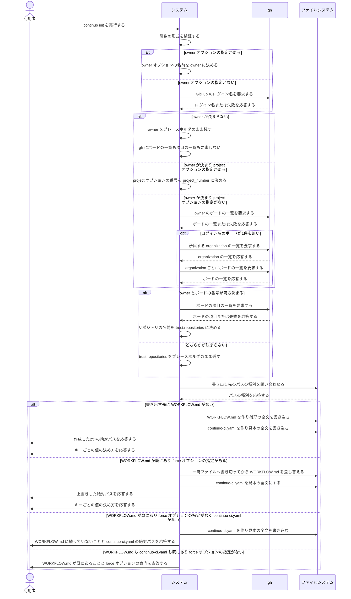

# ユースケース: 設定ファイルを作る

## 根拠資料

- `docs/plans/continuo_design.md` の「3-32. 使い始めるまでの手順」（`continuo init` は利用者に手で埋めさせない）
- `docs/plans/continuo_design.md` の「3-33. 信頼の登録は、人間が列挙したものだけを対象にする」（`trust.repositories` はカンバンから拾うだけ）
- `docs/plans/continuo_design.md` の「5-1. ファイルの名前と探し方」
- `docs/plans/continuo_design.md` の「5-3o. `continuo init` が置く2枚目（`continuo-ci.yaml`）」
- `docs/trying_it_out.md` の「設定ファイルを置く」以降（実際に叩いた出力）
- `internal/scaffold/detect.go` の `Detect` / `detectOwner` / `detectProject` / `detectRepositories` / `listProjects` / `listOrgs`
- `internal/scaffold/init.go` の `WriteAll` / `WriteCIWorkflowWithValues` / `InitResult` の `BothExisted` / `Wrote`
- `internal/scaffold/scaffold.go` の `WriteTemplateWithValues` / `writeOne` / `resolveTarget` / `openError`
- `internal/scaffold/fill.go` の `TemplateWithValues` / `ValidOwner`
- `internal/scaffold/template.go` の `workflowTemplate`
- `internal/cli/cli.go` の `runInit` / `printInitCI` / `printDetection`

## RUCM

```rucm
USE CASE NAME: 設定ファイルを作る
BRIEF DESCRIPTION: 利用者は continuo init を実行する。システムは WORKFLOW.md の雛形と continuo-ci.yaml の見本を書き出す。システムは tracker.provider.owner と tracker.provider.project_number と trust.repositories を gh から引いた値で埋める。システムは引けなかった値をプレースホルダのまま残す。システムは何を埋めればよいかを応答する。
PRECONDITION: 利用者は continuo の実行ファイルを実行できる。書き出す先のディレクトリのパスが決まっている。
PRIMARY ACTOR: 利用者
SECONDARY ACTORS: gh
DEPENDENCY: なし
GENERALIZATION: なし

BASIC FLOW:
1. 利用者はシステムに WORKFLOW.md の雛形の作成を要求する。
2. システムは VALIDATES THAT 利用者が指定した引数が受け付けられる形式である。
3. IF 利用者が owner オプションを指定している THEN
4.   システムは owner オプションに指定された名前を tracker.provider.owner の値に決める。
5. ELSE
6.   システムは gh に GitHub のログイン名を要求する。
7.   システムは VALIDATES THAT gh が user / organization 名として受け付けられるログイン名を応答する。
8.   システムは gh が応答したログイン名を tracker.provider.owner の値に決める。
9. ENDIF
10. IF 利用者が project オプションを指定している THEN
11.   システムは project オプションに指定された番号を tracker.provider.project_number の値に決める。
12. ELSE
13.   システムは gh に tracker.provider.owner のボードの一覧を要求する。
14.   システムは VALIDATES THAT gh がボードの一覧を応答する。
15.   IF ログイン名のボードが1件も無い THEN
16.     システムは gh に利用者が所属する organization の一覧を要求する。
17.     システムは organization ごとに、gh にボードの一覧を要求する。
18.   ENDIF
19.   システムは VALIDATES THAT 閉じていないボードの候補が1件以上ある。
20.   システムは VALIDATES THAT 閉じていないボードの候補が1件だけである。
21.   システムは1件だけのボードの番号を tracker.provider.project_number の値に決める。
22.   システムは1件だけのボードの owner を tracker.provider.owner の値に決め直す。
23. ENDIF
24. システムは gh にボードに載っている項目の一覧を要求する。
25. システムは VALIDATES THAT gh がボードの項目を応答する。
26. システムは VALIDATES THAT ボードの項目にリポジトリに属する issue が1件以上ある。
27. システムはボードの項目からリポジトリの名前を重複なく集める。
28. システムは集めた名前を trust.repositories の値に決める。
29. システムは trust.repositories から要らない行を消す案内を記録する。
30. システムは VALIDATES THAT 書き出す先に指定されたパスがある。
31. システムは VALIDATES THAT 書き出す先に指定されたパスがディレクトリである。
32. システムは VALIDATES THAT 書き出す先の WORKFLOW.md が symlink ではない。
33. システムは VALIDATES THAT 書き出す先に WORKFLOW.md がない。
34. システムは書き出す先に WORKFLOW.md を作る。
35. システムは WORKFLOW.md に雛形の全文を書き込む。
36. システムは VALIDATES THAT 書き出す先の continuo-ci.yaml が symlink ではない。
37. システムは VALIDATES THAT 書き出す先に continuo-ci.yaml がない。
38. システムは書き出す先に continuo-ci.yaml を作る。
39. システムは continuo-ci.yaml に見本の全文を書き込む。
40. システムは利用者に作成した WORKFLOW.md の絶対パスを応答する。
41. システムは利用者に作成した continuo-ci.yaml の絶対パスを応答する。
42. システムは利用者に continuo-ci.yaml を CI へ移す案内を応答する。
43. システムは利用者にキーごとの値の決め方を応答する。
POSTCONDITION: 書き出す先のディレクトリに WORKFLOW.md と continuo-ci.yaml がある。WORKFLOW.md の tracker.provider.owner と tracker.provider.project_number に決まった値がある。trust.repositories にボードのリポジトリが並んでいる。終了コード 0 が返っている。

SPECIFIC ALTERNATIVE FLOW 引数指定エラー:
RFS BASIC FLOW 2
1. システムは利用者に引数のどこが受け付けられないかを応答する。
2. ABORT
POSTCONDITION: WORKFLOW.md は作られていない。continuo-ci.yaml は作られていない。終了コード 2 が返っている。

SPECIFIC ALTERNATIVE FLOW ログイン名取得失敗:
RFS BASIC FLOW 7
1. システムは tracker.provider.owner の値をプレースホルダ __FILL_ME__ のまま残す。
2. システムは tracker.provider.owner を埋められなかった理由を記録する。
3. システムは gh のログインをやり直す案内を記録する。
4. システムは owner オプションを指定して実行し直す案内を記録する。
5. IF 利用者が project オプションを指定している THEN
6.   システムは project オプションに指定された番号を tracker.provider.project_number の値に決める。
7. ELSE
8.   システムは tracker.provider.project_number の値をプレースホルダ 0 のまま残す。
9.   システムは tracker.provider.owner が決まらないのでボードの候補を引けないことを記録する。
10.   システムは project オプションを指定して実行し直す案内を記録する。
11. ENDIF
12. システムは trust.repositories をプレースホルダのまま残す。
13. システムは owner とボードの番号を決めてから実行し直す案内を記録する。
14. RESUME STEP 30
POSTCONDITION: tracker.provider.owner の値はプレースホルダ __FILL_ME__ のままである。trust.repositories はプレースホルダのままである。システムは gh にボードの一覧を要求していない。システムは gh にボードの項目の一覧を要求していない。埋められなかった理由と直し方が記録されている。

SPECIFIC ALTERNATIVE FLOW ボード一覧取得失敗:
RFS BASIC FLOW 14
1. システムは tracker.provider.project_number の値をプレースホルダ 0 のまま残す。
2. システムはボードの一覧を引けなかった理由を記録する。
3. システムは project の scope を付けて gh のログインをやり直す案内を記録する。
4. システムは project オプションを指定して実行し直す案内を記録する。
5. システムは trust.repositories をプレースホルダのまま残す。
6. システムは owner とボードの番号を決めてから実行し直す案内を記録する。
7. RESUME STEP 30
POSTCONDITION: tracker.provider.project_number の値はプレースホルダ 0 のままである。trust.repositories はプレースホルダのままである。システムは gh にボードの項目の一覧を要求していない。埋められなかった理由と直し方が記録されている。

SPECIFIC ALTERNATIVE FLOW ボード候補なし:
RFS BASIC FLOW 19
1. システムは tracker.provider.project_number の値をプレースホルダ 0 のまま残す。
2. システムはログイン名でも organization でもボードが1件も見つからないことを記録する。
3. システムは探した owner の名前を記録する。
4. システムはボードを1つ作る案内を記録する。
5. システムは owner オプションを指定して実行し直す案内を記録する。
6. システムは trust.repositories をプレースホルダのまま残す。
7. システムは owner とボードの番号を決めてから実行し直す案内を記録する。
8. RESUME STEP 30
POSTCONDITION: tracker.provider.project_number の値はプレースホルダ 0 のままである。trust.repositories はプレースホルダのままである。探した owner の名前が記録されている。ボードの作り方と owner オプションの案内が記録されている。システムは gh にボードの項目の一覧を要求していない。

SPECIFIC ALTERNATIVE FLOW ボード候補が複数:
RFS BASIC FLOW 20
1. システムは tracker.provider.project_number の値をプレースホルダ 0 のまま残す。
2. システムはボードの候補の owner と番号と名前と URL の一覧を記録する。
3. システムは project オプションでボードの番号を指定して実行し直す案内を記録する。
4. システムは trust.repositories をプレースホルダのまま残す。
5. システムは owner とボードの番号を決めてから実行し直す案内を記録する。
6. RESUME STEP 30
POSTCONDITION: tracker.provider.project_number の値はプレースホルダ 0 のままである。trust.repositories はプレースホルダのままである。ボードの候補の一覧が記録されている。システムは利用者にボードを選ばせる問い合わせを出していない。システムは gh にボードの項目の一覧を要求していない。

SPECIFIC ALTERNATIVE FLOW ボードの項目を引けない:
RFS BASIC FLOW 25
1. システムは trust.repositories をプレースホルダのまま残す。
2. システムはボードの項目を引けなかった理由を記録する。
3. システムは gh の scope を確かめる案内を記録する。
4. RESUME STEP 30
POSTCONDITION: trust.repositories はプレースホルダのままである。引けなかった理由と直し方が記録されている。

SPECIFIC ALTERNATIVE FLOW リポジトリが1件も無い:
RFS BASIC FLOW 26
1. システムは trust.repositories をプレースホルダのまま残す。
2. システムはボードにリポジトリの issue が1件も載っていないことを記録する。
3. システムは信頼させたいリポジトリを手で書く案内を記録する。
4. RESUME STEP 30
POSTCONDITION: trust.repositories はプレースホルダのままである。draft issue はリポジトリに数えられていない。

SPECIFIC ALTERNATIVE FLOW 書き出し先のパス不在:
RFS BASIC FLOW 30
1. システムは利用者に指定されたディレクトリがないことを応答する。
2. システムは利用者にディレクトリを先に作る案内を応答する。
3. ABORT
POSTCONDITION: WORKFLOW.md は作られていない。continuo-ci.yaml は作られていない。システムはディレクトリを作っていない。終了コード 1 が返っている。

SPECIFIC ALTERNATIVE FLOW 書き出し先がディレクトリではない:
RFS BASIC FLOW 31
1. システムは利用者に指定されたパスがディレクトリではないことを応答する。
2. システムは利用者に continuo init が受け取るのは WORKFLOW.md を置くディレクトリであることを応答する。
3. ABORT
POSTCONDITION: WORKFLOW.md は作られていない。continuo-ci.yaml は作られていない。終了コード 1 が返っている。

SPECIFIC ALTERNATIVE FLOW 書き出し先がsymlink:
RFS BASIC FLOW 32
1. システムは利用者に書き出す先の WORKFLOW.md が symlink であることを応答する。
2. システムは利用者に symlink を消すか別のディレクトリを指定する案内を応答する。
3. ABORT
POSTCONDITION: symlink のリンク先の内容は変わっていない。システムは symlink を辿っていない。continuo-ci.yaml は作られていない。終了コード 1 が返っている。

SPECIFIC ALTERNATIVE FLOW 既存の設定ファイル:
RFS BASIC FLOW 33
1. システムは VALIDATES THAT 利用者が force オプションを指定している。
2. システムは一時ファイルに雛形の全文を書き込む。
3. システムは既存の WORKFLOW.md を一時ファイルで差し替える。
4. システムは VALIDATES THAT 書き出す先の continuo-ci.yaml が symlink ではない。
5. IF 書き出す先に continuo-ci.yaml がある THEN
6.   システムは既存の continuo-ci.yaml を見本の全文で差し替える。
7. ELSE
8.   システムは書き出す先に continuo-ci.yaml を作る。
9.   システムは continuo-ci.yaml に見本の全文を書き込む。
10. ENDIF
11. システムは利用者に上書きした WORKFLOW.md の絶対パスを応答する。
12. システムは利用者に continuo-ci.yaml の絶対パスを応答する。
13. システムは利用者に continuo-ci.yaml を CI へ移す案内を応答する。
14. RESUME STEP 43
POSTCONDITION: WORKFLOW.md の内容が雛形の全文に置き換わっている。continuo-ci.yaml の内容が見本の全文である。終了コード 0 が返っている。

SPECIFIC ALTERNATIVE FLOW 上書き時に見本を書けない:
RFS 既存の設定ファイル 4
1. システムは利用者に上書きした WORKFLOW.md の絶対パスを応答する。
2. システムは利用者に continuo-ci.yaml を書けなかった理由を応答する。
3. システムは利用者にキーごとの値の決め方を応答する。
4. ABORT
POSTCONDITION: WORKFLOW.md の内容が雛形の全文に置き換わっている。symlink のリンク先の内容は変わっていない。終了コード 0 が返っている。

SPECIFIC ALTERNATIVE FLOW 上書きの指定なし:
RFS 既存の設定ファイル 1
1. システムは既存の WORKFLOW.md の内容を変えない。
2. システムは VALIDATES THAT 書き出す先の continuo-ci.yaml が symlink ではない。
3. システムは VALIDATES THAT 書き出す先に continuo-ci.yaml がない。
4. システムは書き出す先に continuo-ci.yaml を作る。
5. システムは continuo-ci.yaml に見本の全文を書き込む。
6. システムは利用者に WORKFLOW.md が既にあるので触っていないことを応答する。
7. システムは利用者に作成した continuo-ci.yaml の絶対パスを応答する。
8. システムは利用者に continuo-ci.yaml を CI へ移す案内を応答する。
9. ABORT
POSTCONDITION: 既存の WORKFLOW.md の内容は変わっていない。continuo-ci.yaml がある。システムは force オプションを勧めていない。システムはキーごとの値の決め方を応答していない。終了コード 0 が返っている。

SPECIFIC ALTERNATIVE FLOW 見本だけも書けない:
RFS 上書きの指定なし 2
1. システムは利用者に WORKFLOW.md が既にあるので触っていないことを応答する。
2. システムは利用者に continuo-ci.yaml を書けなかった理由を応答する。
3. ABORT
POSTCONDITION: 既存の WORKFLOW.md の内容は変わっていない。symlink のリンク先の内容は変わっていない。システムはファイルを1つも書いていない。終了コード 1 が返っている。

SPECIFIC ALTERNATIVE FLOW 設定も見本も既にある:
RFS 上書きの指定なし 3
1. システムは利用者に WORKFLOW.md が既にあることを応答する。
2. システムは利用者に force オプションを付けて実行し直す案内を応答する。
3. ABORT
POSTCONDITION: 既存の WORKFLOW.md の内容は変わっていない。既存の continuo-ci.yaml の内容は変わっていない。終了コード 1 が返っている。

SPECIFIC ALTERNATIVE FLOW 見本がsymlink:
RFS BASIC FLOW 36
1. システムは利用者に作成した WORKFLOW.md の絶対パスを応答する。
2. システムは利用者に continuo-ci.yaml を書けなかった理由を応答する。
3. RESUME STEP 43
POSTCONDITION: WORKFLOW.md がある。symlink のリンク先の内容は変わっていない。システムは symlink を辿っていない。終了コード 0 が返っている。

SPECIFIC ALTERNATIVE FLOW 既存の見本:
RFS BASIC FLOW 37
1. システムは VALIDATES THAT 利用者が force オプションを指定していない。
2. システムは既存の continuo-ci.yaml の内容を変えない。
3. システムは利用者に作成した WORKFLOW.md の絶対パスを応答する。
4. システムは利用者に continuo-ci.yaml が既にあるので触っていないことを応答する。
5. RESUME STEP 43
POSTCONDITION: WORKFLOW.md がある。既存の continuo-ci.yaml の内容は変わっていない。終了コード 0 が返っている。

SPECIFIC ALTERNATIVE FLOW 見本の上書き:
RFS 既存の見本 1
1. システムは既存の continuo-ci.yaml を見本の全文で差し替える。
2. システムは利用者に作成した WORKFLOW.md の絶対パスを応答する。
3. システムは利用者に上書きした continuo-ci.yaml の絶対パスを応答する。
4. システムは利用者に continuo-ci.yaml を CI へ移す案内を応答する。
5. システムは利用者にキーごとの値の決め方を応答する。
6. ABORT
POSTCONDITION: WORKFLOW.md がある。continuo-ci.yaml の内容が見本の全文に置き換わっている。終了コード 0 が返っている。

GLOBAL ALTERNATIVE FLOW 書き込み中の中断:
BRANCH FROM BASIC FLOW 35
WHEN 利用者が continuo init の実行を中断する場合
1. システムは雛形の全文の書き込みの途中で終了する。
2. ABORT
POSTCONDITION: 既にある WORKFLOW.md を force オプションで置き換える実行では、元の WORKFLOW.md の内容がそのまま残っている。システムは一時ファイルへ雛形の全文を書き切ってから WORKFLOW.md へ差し替えるので、上書きの途中で終わった WORKFLOW.md は残らない。システムが強制終了するか電源が落ちる場合は、書きかけの一時ファイルが同じディレクトリに残る。一時ファイルの名前は WORKFLOW.md の前に点を付けたもので始まるので、利用者のリポジトリでは未追跡のファイルとして見える。WORKFLOW.md をまだ持たないディレクトリで実行する場合は、force オプションを付けていても新しく作る経路を通る。この場合は WORKFLOW.md が無いか、途中まで書かれた WORKFLOW.md が残る。
```

## フローチャート


```mermaid
flowchart TD
    B1["1 利用者は雛形の作成を要求する"] --> B2{"2 引数が受け付けられる形式か"}
    B2 -- いいえ --> ARG1["引数指定エラー 1 受け付けられない箇所を応答する"]
    ARG1 --> ARGEND(["引数指定エラー 2 ABORT 終了コード 2"])
    B2 -- はい --> B3{"3 owner オプションの指定があるか"}
    B3 -- はい --> B4["4 owner オプションの名前を owner に決める"]
    B3 -- いいえ --> B6["6 gh に GitHub のログイン名を要求する"]
    B6 --> B7{"7 受け付けられるログイン名の応答があるか"}
    B7 -- いいえ --> LG1["ログイン名取得失敗 1 から 4 owner をプレースホルダのまま残し理由と案内を記録する"]
    LG1 --> LG5{"ログイン名取得失敗 5 project オプションの指定があるか"}
    LG5 -- はい --> LG6["ログイン名取得失敗 6 project オプションの番号を project_number に決める"]
    LG5 -- いいえ --> LG8["ログイン名取得失敗 8 から 10 project_number をプレースホルダのまま残し理由と案内を記録する"]
    LG6 --> LG12["ログイン名取得失敗 12 から 13 trust.repositories をプレースホルダのまま残し案内を記録する"]
    LG8 --> LG12
    LG12 -. "RESUME STEP 30" .-> B30
    B7 -- はい --> B8["8 応答のログイン名を owner に決める"]
    B4 --> B10{"10 project オプションの指定があるか"}
    B8 --> B10
    B10 -- はい --> B11["11 project オプションの番号を project_number に決める"]
    B10 -- いいえ --> B13["13 gh に owner のボードの一覧を要求する"]
    B13 --> B14{"14 ボードの一覧の応答があるか"}
    B14 -- いいえ --> LS1["ボード一覧取得失敗 1 から 6 project_number と trust.repositories をプレースホルダのまま残し理由と案内を記録する"]
    LS1 -. "RESUME STEP 30" .-> B30
    B14 -- はい --> B15{"15 ログイン名のボードが1件も無いか"}
    B15 -- はい --> B16["16 gh に所属する organization の一覧を要求する"]
    B16 --> B17["17 organization ごとにボードの一覧を要求する"]
    B17 --> B19
    B15 -- いいえ --> B19{"19 候補が1件以上あるか"}
    B19 -- いいえ --> NC1["ボード候補なし 1 から 7 探した owner と作り方を記録し trust.repositories をプレースホルダのまま残す"]
    NC1 -. "RESUME STEP 30" .-> B30
    B19 -- はい --> B20{"20 候補が1件だけか"}
    B20 -- いいえ --> MC1["ボード候補が複数 1 から 5 候補の一覧を記録し trust.repositories をプレースホルダのまま残す"]
    MC1 -. "RESUME STEP 30" .-> B30
    B20 -- はい --> B21["21 1件だけのボードの番号を project_number に決める"]
    B21 --> B22["22 1件だけのボードの owner を owner に決め直す"]
    B22 --> B24
    B11 --> B24["24 gh にボードの項目の一覧を要求する"]
    B24 --> B25{"25 ボードの項目の応答があるか"}
    B25 -- いいえ --> RE1["ボードの項目を引けない 1 から 3 trust.repositories をプレースホルダのまま残し理由と案内を記録する"]
    RE1 -. "RESUME STEP 30" .-> B30
    B25 -- はい --> B26{"26 リポジトリに属する issue が1件以上あるか"}
    B26 -- いいえ --> RZ1["リポジトリが1件も無い 1 から 3 trust.repositories をプレースホルダのまま残し手で書く案内を記録する"]
    RZ1 -. "RESUME STEP 30" .-> B30
    B26 -- はい --> B27["27 ボードの項目からリポジトリの名前を重複なく集める"]
    B27 --> B28["28 集めた名前を trust.repositories に決める"]
    B28 --> B29["29 trust.repositories から要らない行を消す案内を記録する"]
    B29 --> B30{"30 書き出し先のパスがあるか"}
    B30 -- いいえ --> ND1["書き出し先のパス不在 1 から 2 ディレクトリを先に作る案内を応答する"]
    ND1 --> NDEND(["書き出し先のパス不在 3 ABORT 終了コード 1"])
    B30 -- はい --> B31{"31 パスがディレクトリか"}
    B31 -- いいえ --> NF1["書き出し先がディレクトリではない 1 から 2 受け取るのはディレクトリだと応答する"]
    NF1 --> NFEND(["書き出し先がディレクトリではない 3 ABORT 終了コード 1"])
    B31 -- はい --> B32{"32 WORKFLOW.md が symlink ではないか"}
    B32 -- いいえ --> SL1["書き出し先がsymlink 1 から 2 symlink を消す案内を応答する"]
    SL1 --> SLEND(["書き出し先がsymlink 3 ABORT 終了コード 1"])
    B32 -- はい --> B33{"33 書き出し先に WORKFLOW.md がないか"}
    B33 -- いいえ --> EX1{"既存の設定ファイル 1 force オプションの指定があるか"}
    EX1 -- いいえ --> OV1["上書きの指定なし 1 既存の WORKFLOW.md の内容を変えない"]
    OV1 --> OV2{"上書きの指定なし 2 continuo-ci.yaml が symlink ではないか"}
    OV2 -- いいえ --> ON1["見本だけも書けない 1 から 2 触っていないことと書けなかった理由を応答する"]
    ON1 --> ONEND(["見本だけも書けない 3 ABORT 終了コード 1"])
    OV2 -- はい --> OV3{"上書きの指定なし 3 continuo-ci.yaml がないか"}
    OV3 -- いいえ --> BE1["設定も見本も既にある 1 から 2 既にあることと force を応答する"]
    BE1 --> BEEND(["設定も見本も既にある 3 ABORT 終了コード 1"])
    OV3 -- はい --> OV4["上書きの指定なし 4 から 5 continuo-ci.yaml を作り見本の全文を書き込む"]
    OV4 --> OV6["上書きの指定なし 6 から 8 触っていないことと見本の場所と案内を応答する"]
    OV6 --> OVEND(["上書きの指定なし 9 ABORT 終了コード 0"])
    EX1 -- はい --> EX2["既存の設定ファイル 2 から 3 一時ファイルへ書き切ってから WORKFLOW.md を差し替える"]
    EX2 --> EX4{"既存の設定ファイル 4 continuo-ci.yaml が symlink ではないか"}
    EX4 -- いいえ --> FN1["上書き時に見本を書けない 1 から 3 上書きした場所と書けなかった理由と値の決め方を応答する"]
    FN1 --> FNEND(["上書き時に見本を書けない 4 ABORT 終了コード 0"])
    EX4 -- はい --> EX5{"既存の設定ファイル 5 continuo-ci.yaml があるか"}
    EX5 -- はい --> EX6["既存の設定ファイル 6 既存の continuo-ci.yaml を見本の全文で差し替える"]
    EX5 -- いいえ --> EX8["既存の設定ファイル 8 から 9 continuo-ci.yaml を作り見本の全文を書き込む"]
    EX6 --> EX11["既存の設定ファイル 11 から 13 上書きした場所と見本の場所と案内を応答する"]
    EX8 --> EX11
    EX11 -. "RESUME STEP 43" .-> B43
    B33 -- はい --> B34["34 書き出し先に WORKFLOW.md を作る"]
    B34 --> B35["35 WORKFLOW.md に雛形の全文を書き込む"]
    B35 -. "WHEN 書き込み中に中断された場合" .-> IN1["書き込み中の中断 1 雛形の全文の書き込みの途中で終了する"]
    IN1 --> INEND(["書き込み中の中断 2 ABORT 置き換えの実行では元の WORKFLOW.md が残る"])
    B35 --> B36{"36 continuo-ci.yaml が symlink ではないか"}
    B36 -- いいえ --> CS1["見本がsymlink 1 から 2 作成した場所と書けなかった理由を応答する"]
    CS1 -. "RESUME STEP 43" .-> B43
    B36 -- はい --> B37{"37 書き出し先に continuo-ci.yaml がないか"}
    B37 -- いいえ --> CK1{"既存の見本 1 force オプションの指定がないか"}
    CK1 -- いいえ --> CO1["見本の上書き 1 から 5 見本を差し替え 場所と案内と値の決め方を応答する"]
    CO1 --> COEND(["見本の上書き 6 ABORT 終了コード 0"])
    CK1 -- はい --> CK2["既存の見本 2 から 4 見本に触らず 作成した場所と触っていないことを応答する"]
    CK2 -. "RESUME STEP 43" .-> B43
    B37 -- はい --> B38["38 書き出し先に continuo-ci.yaml を作る"]
    B38 --> B39["39 continuo-ci.yaml に見本の全文を書き込む"]
    B39 --> B40["40 作成した WORKFLOW.md の絶対パスを応答する"]
    B40 --> B41["41 作成した continuo-ci.yaml の絶対パスを応答する"]
    B41 --> B42["42 continuo-ci.yaml を CI へ移す案内を応答する"]
    B42 --> B43["43 キーごとの値の決め方を応答する"]
    B43 --> END(["終了 終了コード 0"])
```

## シーケンス図


```mermaid
sequenceDiagram
    actor 利用者
    participant システム
    participant gh
    participant ファイルシステム

    利用者->>システム: continuo init を実行する
    システム->>システム: 引数の形式を検証する

    alt owner オプションの指定がある
        システム->>システム: owner オプションの名前を owner に決める
    else owner オプションの指定がない
        システム->>gh: GitHub のログイン名を要求する
        gh-->>システム: ログイン名または失敗を応答する
    end

    alt owner が決まらない
        システム->>システム: owner をプレースホルダのまま残す
        システム->>システム: gh にボードの一覧も項目の一覧も要求しない
    else owner が決まり project オプションの指定がある
        システム->>システム: project オプションの番号を project_number に決める
    else owner が決まり project オプションの指定がない
        システム->>gh: owner のボードの一覧を要求する
        gh-->>システム: ボードの一覧または失敗を応答する
        opt ログイン名のボードが1件も無い
            システム->>gh: 所属する organization の一覧を要求する
            gh-->>システム: organization の一覧を応答する
            システム->>gh: organization ごとにボードの一覧を要求する
            gh-->>システム: ボードの一覧を応答する
        end
    end

    alt owner とボードの番号が両方決まる
        システム->>gh: ボードの項目の一覧を要求する
        gh-->>システム: ボードの項目または失敗を応答する
        システム->>システム: リポジトリの名前を trust.repositories に決める
    else どちらかが決まらない
        システム->>システム: trust.repositories をプレースホルダのまま残す
    end

    システム->>ファイルシステム: 書き出し先のパスの種別を問い合わせる
    ファイルシステム-->>システム: パスの種別を応答する

    alt 書き出す先に WORKFLOW.md がない
        システム->>ファイルシステム: WORKFLOW.md を作り雛形の全文を書き込む
        システム->>ファイルシステム: continuo-ci.yaml を作り見本の全文を書き込む
        システム->>利用者: 作成した2つの絶対パスを応答する
        システム->>利用者: キーごとの値の決め方を応答する
    else WORKFLOW.md が既にあり force オプションの指定がある
        システム->>ファイルシステム: 一時ファイルへ書き切ってから WORKFLOW.md を差し替える
        システム->>ファイルシステム: continuo-ci.yaml を見本の全文にする
        システム->>利用者: 上書きした絶対パスを応答する
        システム->>利用者: キーごとの値の決め方を応答する
    else WORKFLOW.md が既にあり force オプションの指定がなく continuo-ci.yaml がない
        システム->>ファイルシステム: continuo-ci.yaml を作り見本の全文を書き込む
        システム->>利用者: WORKFLOW.md に触っていないことと continuo-ci.yaml の絶対パスを応答する
    else WORKFLOW.md も continuo-ci.yaml も既にあり force オプションの指定がない
        システム->>利用者: WORKFLOW.md が既にあることと force オプションの案内を応答する
    end
```
