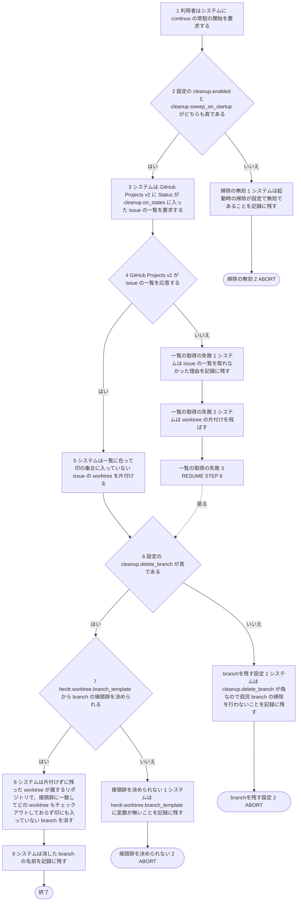
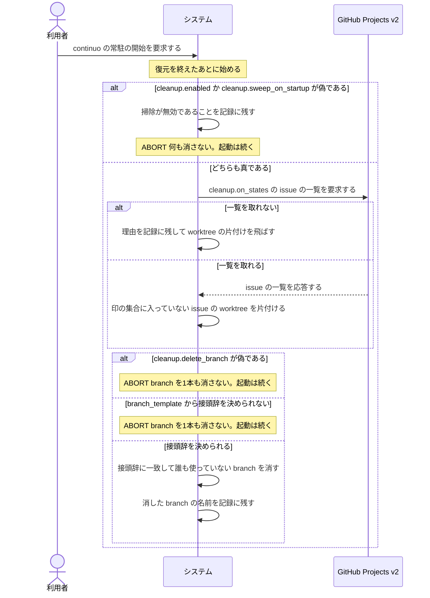

# ユースケース: 起動時に終わったworktreeと孤児branchを掃除する

> **continuo が起動するたびに、復元のあと・巡回を始める前に1回だけ走る掃除を書いた記述である。**
> `再起動して実行中のissueを引き継ぐ` が `INCLUDE USE CASE` で引く。
> 掃除は設定の値で3通りに分かれ、どの結果でも起動は続く。引き継ぎの判断と1本の記述に書くと、
> 引き継ぎの結末の数と掃除の3通りの掛け算で経路が増える。分けて書く。
>
> **この記述の代替フローが `ABORT` で終わるのは、掃除がそこで終わるという意味である。**
> 起動は止まらない。呼び出し元は、どの終わり方でも次の段（ダッシュボードを開く）へ進む。

## 根拠資料

- `docs/plans/continuo_design.md#3-9`（worktree と branch の片付け。手順6 と 6b が起動時の掃除）
- `docs/plans/continuo_design.md#3-4`（起動から復元までの順序。掃除は復元のあとに走らせる）
- `internal/daemon/daemon.go` の `Run`（段4b。復元のあとに呼ぶ）
- `internal/orchestrator/sweep.go` の `SweepOnStartup`、`sweepFinishedWorktrees`
- `internal/orchestrator/lifecycle.go` の `cleanupPath`
- `internal/orchestrator/restore.go` の `Restore`（`RestoreResult` の `Worktrees` と `AdoptedBranches` を組み立てる）
- `internal/workspace/sweep.go` の `SweepOrphanBranches`、`repoDirsOf`、`sweepRepoBranches`

## RUCM

```rucm
USE CASE NAME: 起動時に終わったworktreeと孤児branchを掃除する
BRIEF DESCRIPTION: システムは起動時の復元を終えたあとに、Status が cleanup.on_states に入った issue の worktree を片付ける。システムは接頭辞に一致して誰も使っていない branch を消す。システムは設定が掃除を止めていれば何も消さない。システムはどの結果でも起動を続ける。
PRECONDITION: 利用者は continuo を起動している。システムは起動時の復元を終えている。
PRIMARY ACTOR: 利用者
SECONDARY ACTORS: GitHub Projects v2
DEPENDENCY: なし
GENERALIZATION: なし

BASIC FLOW:
1. 利用者はシステムに continuo の常駐の開始を要求する。
2. システムは VALIDATES THAT 設定の cleanup.enabled と cleanup.sweep_on_startup がどちらも真である。
3. システムは GitHub Projects v2 に Status が cleanup.on_states に入った issue の一覧を要求する。
4. システムは VALIDATES THAT GitHub Projects v2 が issue の一覧を応答する。
5. システムは一覧に在って印の集合に入っていない issue の worktree を片付ける。
6. システムは VALIDATES THAT 設定の cleanup.delete_branch が真である。
7. システムは VALIDATES THAT herdr.worktree.branch_template から branch の接頭辞を決められる。
8. システムは片付けずに残った worktree が属するリポジトリで、接頭辞に一致してどの worktree もチェックアウトしておらず印にも入っていない branch を消す。
9. システムは消した branch の名前を記録に残す。
POSTCONDITION: Status が cleanup.on_states に入った issue の worktree のうち、片付けの条件を満たす worktree は消えている。印の集合に入っている issue の worktree は残っている。片付けずに残った worktree が属するリポジトリの孤児 branch は消えている。片付けずに残った worktree が1件も無ければ、branch は1本も消えていない。引き継いだ run の branch は残っている。接頭辞に一致しない branch は残っている。

SPECIFIC ALTERNATIVE FLOW 掃除の無効:
RFS BASIC FLOW 2
1. システムは起動時の掃除が設定で無効であることを記録に残す。
2. ABORT
POSTCONDITION: システムは worktree を1つも片付けていない。システムは branch を1本も消していない。システムは GitHub Projects v2 に何も要求していない。

SPECIFIC ALTERNATIVE FLOW 一覧の取得の失敗:
RFS BASIC FLOW 4
1. システムは issue の一覧を取れなかった理由を記録に残す。
2. システムは worktree の片付けを飛ばす。
3. RESUME STEP 6
POSTCONDITION: システムは worktree を1つも片付けていない。

SPECIFIC ALTERNATIVE FLOW branchを残す設定:
RFS BASIC FLOW 6
1. システムは cleanup.delete_branch が偽なので孤児 branch の掃除を行わないことを記録に残す。
2. ABORT
POSTCONDITION: システムは branch を1本も消していない。壊れた ref も残っている。

SPECIFIC ALTERNATIVE FLOW 接頭辞を決められない:
RFS BASIC FLOW 7
1. システムは herdr.worktree.branch_template に変数が無いことを記録に残す。
2. ABORT
POSTCONDITION: システムは branch を1本も消していない。
```

## 掃除は、引き継ぎが終わってから走らせる

**言いたいこと。**先に走らせると、**これから引き継ぐ run の branch を孤児と判定して消す。**
だから `Run` は復元（`Restore`）のあとにしか `SweepOnStartup` を呼ばない。

| 掃除が見るもの | どこから来るか |
| --- | --- |
| 片付けの対象の worktree | 復元の走査で候補に採った worktree のうち復元が片付けなかったものと、重複で採らなかった worktree。名乗りの食い違いや壊れた worktree は入らない |
| 消してはならない branch | 復元が引き継いだ run の branch |
| 孤児 branch を探すリポジトリ | ステップ5 で片付けずに残った worktree が属するリポジトリだけ。残った worktree が1件も無い起動では、どのリポジトリも見ないので1本も消さない |

**対象の worktree が1件も無ければ、ステップ3 の要求は出さない**（`sweepFinishedWorktrees` が先に返る）。経路は基本フローと同じである。

**ステップ5 で片付けるのは、3つを満たす worktree だけである。**身元ファイルを読める。印の集合に入っていない。
身元ファイルの project item が、取った一覧に在る。片付けの条件（push 済みか、など）を満たさなければ `cleanupPath` が見送り、
その worktree は残って孤児 branch の掃除の対象のリポジトリに数えられる。

## 消してよい branch は3条件を全部満たすものだけである

| 条件 | 落とすと何が起きるか |
| --- | --- |
| `herdr.worktree.branch_template` の接頭辞（既定 `continuo/`）で始まる | 人間が切った branch を消す |
| どの worktree もチェックアウトしていない | 作業中の worktree の branch を消す |
| 復元後の印の集合に入っていない | いま引き継いだ run の branch を消す |

**`cleanup.delete_branch` が偽なら1本も消さない**（`branchを残す設定`）。
**壊れた ref だけは消す、という例外も作らない。**壊れているかどうかは利用者から見えず、
**「消すなと言ったのに消えた」という結果だけが同じである。**
片付けが `cleanup.delete_branch` を見て残した branch は、上の3条件を全部満たすので、
**設定を見ない掃除は次の起動だけでその branch を強制削除で消す。**
`continuo abandon --force` で片付けた worktree の branch には未 push の commit が
載っていることがあり、消えれば reflog を掘る以外に戻す手立ては無い。

**テンプレートに変数が1つも無ければ接頭辞を決められない**（`接頭辞を決められない`）。全部の branch が対象になってしまうので、1本も消さない。

**リポジトリごとの失敗（branch の一覧を引けない、など）は WARN を出して次のリポジトリへ進む。**経路には出していない。
消した branch が1本も無ければ、ステップ9 は何も残さない。

## フローチャート



## シーケンス図


