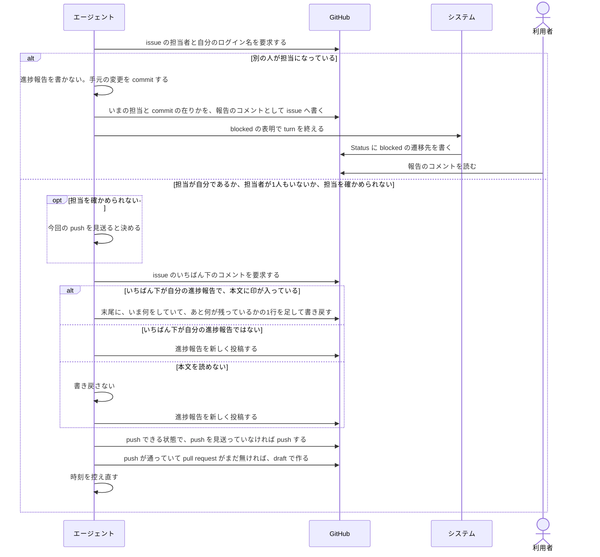
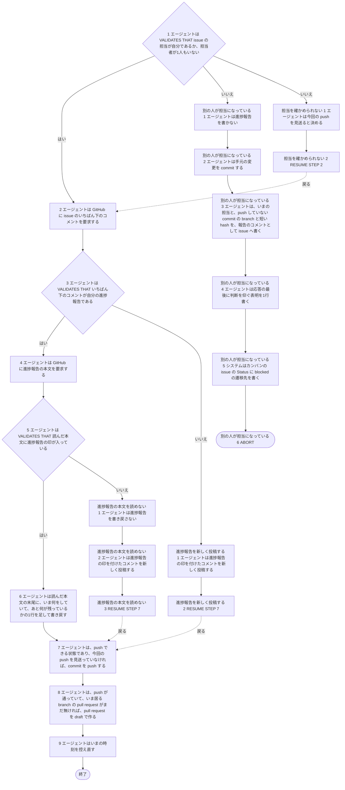

# ユースケース: 進捗報告を書く

> **この記述からテストコードは作らない。**
> 段を行うのはエージェント（Claude Code）で、指示書の文面を読んで動く。エージェントを起動して段を通す自動テストは、レートリミットを使い、結果も毎回同じにならない。
> 文面に何が書いてあるかは `test/internal/prompt/` の `TestTemplate_…` が確かめている。
> `check_update_tests.py` が出す `[W1]`（テスト未生成パス）は、ここでは想定どおりである。

## 根拠資料

- `internal/prompt/builtin.md` の 5-3（進捗報告の間隔。担当の確認、段1・段2a・段2b と、push、途中で作る pull request）、3-1（担当の確かめ方と、止まり方）、3-5（途中で作る pull request）
- `internal/prompt/prompt.go` の `RenderData`（間隔を分に直して文面へ渡す）
- `docs/plans/continuo_design.md#5-3h`（長い作業の途中でも、状況を書かせる）
- `docs/plans/continuo_design.md#5-3j`（進捗コメントは、いちばん下の1件へ書き足す）
- `docs/plans/continuo_design.md#5-3l`（死活の判定は、進捗報告の印が付いたコメントだけで見る）
- `docs/plans/continuo_design.md#5-3n`（進捗報告を書かせる間隔を、設定から変えられるようにする）
- `docs/plans/continuo_design.md#5-3w`（エージェント自身に担当を確かめさせ、最初の push で draft の pull request を作らせる）
- `docs/plans/continuo_design.md#5-3y`（終わりの報告の前に指示を分けさせ、時刻は機械のタイムゾーンで書かせる）

## この記述は何のためにあるか

**エージェントが `builtin.md` の 5-3 をどう使うかを、記録として残すためである。テストは持たない。**
主体はエージェントであり、Claude Code の中で起きることをテストから観測する手立てが無い（`claude -p` は使用禁止のため）。

`指示書に沿ってissueを1件仕上げる` の任意時点の代替フロー `進捗報告の間隔を超える` と、`レビューを回す` の検査の待ちに入る前の段が、この記述を取り込む。
**`別の人が担当になっている` は、取り込んだ側の run もそこで終わる出口である。**取り込む側は、取り込んだ段の直後の検証の段で受けている。

## RUCM

```rucm
USE CASE NAME: 進捗報告を書く
BRIEF DESCRIPTION: エージェントは issue の担当を確かめる。エージェントは issue のいちばん下のコメントを調べる。エージェントはいちばん下のコメントが自分の進捗報告であれば1行書き足す。エージェントはそうでなければ進捗報告を新しく投稿する。エージェントは push できる commit を push する。エージェントは pull request がまだ無ければ draft で作る。
PRECONDITION: エージェントは作業の途中である。エージェントが控えた時刻から進捗報告の間隔を超えているか、エージェントが検査の待ちに入るところである。
PRIMARY ACTOR: エージェント
SECONDARY ACTORS: システム、GitHub、利用者
DEPENDENCY: なし
GENERALIZATION: なし

BASIC FLOW:
1. エージェントは VALIDATES THAT issue の担当が自分であるか、担当者が1人もいない。
2. エージェントは GitHub に issue のいちばん下のコメントを要求する。
3. エージェントは VALIDATES THAT いちばん下のコメントが自分の進捗報告である。
4. エージェントは GitHub に進捗報告の本文を要求する。
5. エージェントは VALIDATES THAT 読んだ本文に進捗報告の印が入っている。
6. エージェントは読んだ本文の末尾に、いま何をしていて、あと何が残っているかの1行を足して書き戻す。
7. エージェントは、push できる状態であり、今回の push を見送っていなければ、commit を push する。
8. エージェントは、push が通っていて、いま居る branch の pull request がまだ無ければ、pull request を draft で作る。
9. エージェントはいまの時刻を控え直す。
POSTCONDITION: この回では進捗報告のコメントは増えていない。進捗報告のコメントの最終更新日時が新しくなっている。push できる commit は remote に載っている。push が通っていれば、いま居る branch の pull request がある。

SPECIFIC ALTERNATIVE FLOW 別の人が担当になっている:
RFS BASIC FLOW 1
1. エージェントは進捗報告を書かない。
2. エージェントは手元の変更を commit する。
3. エージェントは、いまの担当と、push していない commit の branch と短い hash を、報告のコメントとして issue へ書く。
4. エージェントは応答の最後に判断を仰ぐ表明を1行書く。
5. システムはカンバンの issue の Status に blocked の遷移先を書く。
6. ABORT
POSTCONDITION: 進捗報告のコメントは増えていない。エージェントは push していない。push していない commit は worktree の branch に在る。issue に、いまの担当と commit の在りかの報告のコメントがある。issue の Status は blocked の遷移先である。利用者は報告のコメントで、いまの担当と commit の在りかを読む。

SPECIFIC ALTERNATIVE FLOW 担当を確かめられない:
RFS BASIC FLOW 1
1. エージェントは今回の push を見送ると決める。
2. RESUME STEP 2
POSTCONDITION: エージェントは今回の push を見送っている。エージェントは作業を続けている。エージェントは次の push の前に担当を確かめ直す。

SPECIFIC ALTERNATIVE FLOW 進捗報告を新しく投稿する:
RFS BASIC FLOW 3
1. エージェントは進捗報告の印を付けたコメントを新しく投稿する。
2. RESUME STEP 7
POSTCONDITION: 進捗報告のコメントが増えている。新しいコメントの1行目はエージェントの印である。新しいコメントの2行目は進捗報告の印である。

SPECIFIC ALTERNATIVE FLOW 進捗報告の本文を読めない:
RFS BASIC FLOW 5
1. エージェントは進捗報告を書き戻さない。
2. エージェントは進捗報告の印を付けたコメントを新しく投稿する。
3. RESUME STEP 7
POSTCONDITION: 進捗報告のコメントが増えている。前の進捗報告の本文は壊れていない。
```

## 印と間隔

| 何 | 値 |
| --- | --- |
| 進捗報告の先頭の印 | 1行目 `<!-- continuo:agent -->`、2行目 `<!-- continuo:progress -->`。字下げしない |
| 間隔 | `{{.progress_interval_minutes}}` 分。設定の `progress_interval_ms`（既定 3600000）を分に直した値 |
| 「自分の進捗報告」の判定 | 自分が書いたコメントで、本文が `<!-- continuo:agent -->` で始まり、`<!-- continuo:progress -->` を含む |
| 足す1行 | `- <時刻> いま <いま何をしていて、あと何が残っているか>` |
| 時刻の書式 | `date '+%Y-%m-%d %H:%M (%Z)'`。その機械のタイムゾーンで書く |

## 段の中で決まっていること

どれも、終わり方も通る段も変えない。

| 段 | 決まり |
| --- | --- |
| 段1 | `builtin.md` の 3-1 の見本で確かめる。書く前に確かめる |
| 段1 | 「確かめられませんでした」と出たら、もう1回だけ叩く。それでも同じ場合が `担当を確かめられない` である |
| 段1 | 担当者が1人もいない場合は、進捗報告を書いて push する |
| 段7 | `git push -u origin HEAD`。`担当を確かめられない` を通った回は push しない |
| 段8 | pull request の作り方は `builtin.md` の 3-5 である。本文の1行目に `<!-- continuo:pull-request-in-progress -->` を置く。題名は issue の題名である |
| 段8 | `WORKFLOW.md` の本文に「draft で作らない」と書いてあっても draft で作る。draft を作れないリポジトリだと断られたときだけ、`--draft` を外す |
| 段8 | 差分が無いなどの理由で作れなかったときは、止まらずに作業を続け、次に push したときにもう一度試す |

**`担当を確かめられない` を通った回も、進捗報告のコメントは書く。**見送るのは push だけである（`builtin.md` の 5-3「途中経過のコメントは書き、今回の push だけを見送って作業を続けます」）。

**`別の人が担当になっている` で書かないのは、進捗報告のコメントである。**3-7 の報告は書く（5-3「途中経過のコメントも push もせずに、3-1 のとおりに止まります（3-7 の報告は書きます）」）。

## 相互作用



## フローチャート


