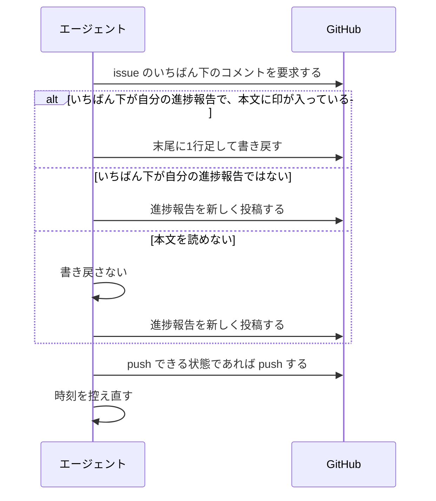
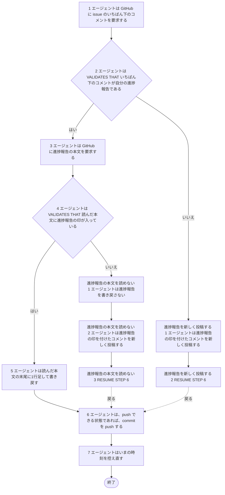

# ユースケース: 進捗報告を書く

> **この記述からテストコードは作らない。**
> 段を行うのはエージェント（Claude Code）で、指示書の文面を読んで動く。エージェントを起動して段を通す自動テストは、レートリミットを使い、結果も毎回同じにならない。
> 文面に何が書いてあるかは `test/internal/prompt/` の `TestTemplate_…` が確かめている。
> `check_update_tests.py` が出す `[W1]`（テスト未生成パス）は、ここでは想定どおりである。

## 根拠資料

- `internal/prompt/builtin.md` の 5-3（進捗報告の間隔。段1・段2a・段2b と、push）
- `internal/prompt/prompt.go` の `RenderData`（間隔を分に直して文面へ渡す）
- `docs/plans/continuo_design.md#5-3h`（長い作業の途中でも、状況を書かせる）
- `docs/plans/continuo_design.md#5-3j`（進捗コメントは、いちばん下の1件へ書き足す）
- `docs/plans/continuo_design.md#5-3l`（死活の判定は、進捗報告の印が付いたコメントだけで見る）
- `docs/plans/continuo_design.md#5-3n`（進捗報告を書かせる間隔を、設定から変えられるようにする）

## この記述は何のためにあるか

**エージェントが `builtin.md` の 5-3 をどう使うかを、記録として残すためである。テストは持たない。**
主体はエージェントであり、Claude Code の中で起きることをテストから観測する手立てが無い（`claude -p` は使用禁止のため）。

`指示書に沿ってissueを1件仕上げる` の任意時点の代替フロー `進捗報告の間隔を超える` と、`レビューを回す` の検査の待ちに入る前の段が、この記述を取り込む。

## RUCM

```rucm
USE CASE NAME: 進捗報告を書く
BRIEF DESCRIPTION: エージェントは issue のいちばん下のコメントを調べる。エージェントはいちばん下のコメントが自分の進捗報告であれば1行書き足す。エージェントはそうでなければ進捗報告を新しく投稿する。エージェントは push できる commit を push する。
PRECONDITION: エージェントは作業の途中である。エージェントが控えた時刻から進捗報告の間隔を超えているか、エージェントが検査の待ちに入るところである。
PRIMARY ACTOR: エージェント
SECONDARY ACTORS: GitHub
DEPENDENCY: なし
GENERALIZATION: なし

BASIC FLOW:
1. エージェントは GitHub に issue のいちばん下のコメントを要求する。
2. エージェントは VALIDATES THAT いちばん下のコメントが自分の進捗報告である。
3. エージェントは GitHub に進捗報告の本文を要求する。
4. エージェントは VALIDATES THAT 読んだ本文に進捗報告の印が入っている。
5. エージェントは読んだ本文の末尾に1行足して書き戻す。
6. エージェントは、push できる状態であれば、commit を push する。
7. エージェントはいまの時刻を控え直す。
POSTCONDITION: この回では進捗報告のコメントは増えていない。進捗報告のコメントの最終更新日時が新しくなっている。push できる commit は remote に載っている。

SPECIFIC ALTERNATIVE FLOW 進捗報告を新しく投稿する:
RFS BASIC FLOW 2
1. エージェントは進捗報告の印を付けたコメントを新しく投稿する。
2. RESUME STEP 6
POSTCONDITION: 進捗報告のコメントが増えている。新しいコメントの1行目はエージェントの印である。新しいコメントの2行目は進捗報告の印である。

SPECIFIC ALTERNATIVE FLOW 進捗報告の本文を読めない:
RFS BASIC FLOW 4
1. エージェントは進捗報告を書き戻さない。
2. エージェントは進捗報告の印を付けたコメントを新しく投稿する。
3. RESUME STEP 6
POSTCONDITION: 進捗報告のコメントが増えている。前の進捗報告の本文は壊れていない。
```

## 印と間隔

| 何 | 値 |
| --- | --- |
| 進捗報告の先頭の印 | 1行目 `<!-- continuo:agent -->`、2行目 `<!-- continuo:progress -->`。字下げしない |
| 間隔 | `{{.progress_interval_minutes}}` 分。設定の `progress_interval_ms`（既定 3600000）を分に直した値 |
| 「自分の進捗報告」の判定 | 自分が書いたコメントで、本文が `<!-- continuo:agent -->` で始まり、`<!-- continuo:progress -->` を含む |

## 相互作用



## フローチャート


