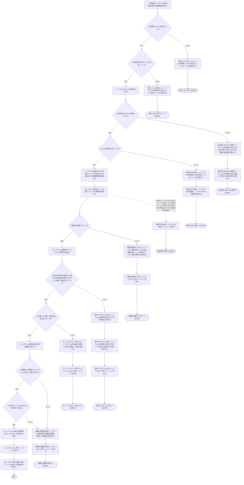
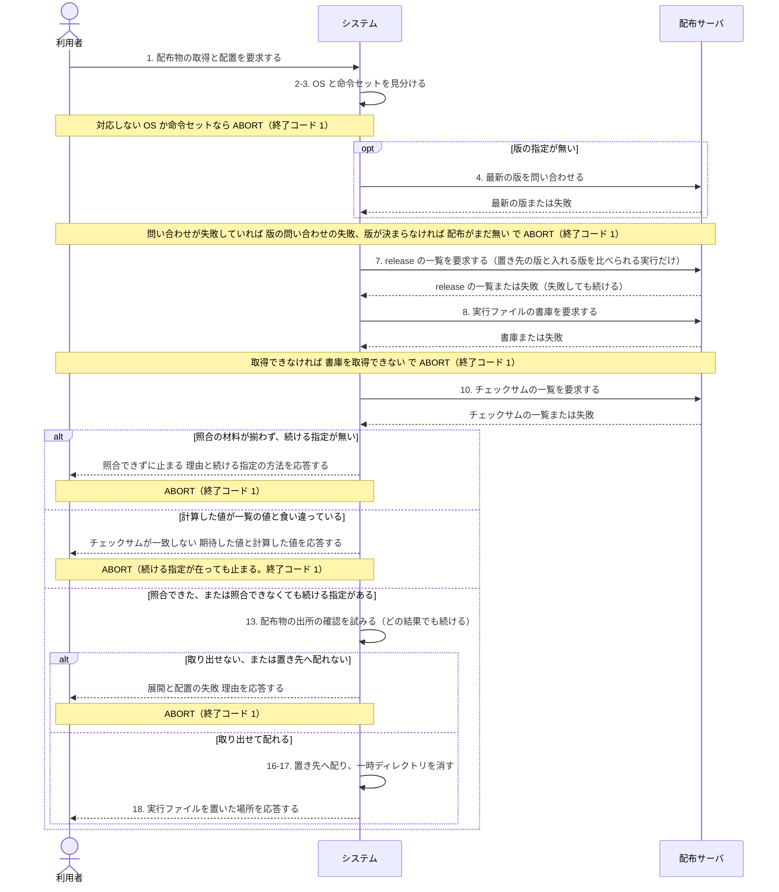

# ユースケース: 配布物を取って置く

> **ネットワークインストーラーのうち、実行ファイルを配布サーバから取って置き先へ置く段だけを書いた記述である。**
> `continuo を入れる` が `INCLUDE USE CASE` で引く。足りない道具を扱う段（`前提の道具を調べて入れる`）とは互いに影響しないので、分けて書く。
>
> **この記述の代替フローは、どれもインストーラーをその場で終える。**呼び出し元は、置き終えたかどうかを検証して、置き終えていなければ残りの段を行わない。

## 根拠資料

- `docs/plans/continuo_design.md` の「3-36. 入れ方は、ネットワークインストーラーの1行にする」（破壊的変更のある版へ上げるときの警告を含む）
- `docs/plans/continuo_design.md` の「3-32b. Windows ネイティブは対応しない」
- `install.sh` の `main`（呼び出し元。`detect_platform` から `install_binary` までの並び）
- `install.sh` の `detect_platform` / `resolve_version` / `fetch` / `download`
- `install.sh` の `install_binary` / `verify_checksum` / `checksum_failed` / `verify_provenance`
- `install.sh` の `detect_installed_version` / `collect_breaking` / `breaking_lines`

## 入れる版の決め方

`install.sh` の `resolve_version` が決める。**どちらの行でも、決まったあとに通る段は同じである。**だから rucm ブロックでは段4 の1つにしてある。

| 状況 | どう決めるか |
| --- | --- |
| `--version` を指定している | 指定した版を使う。配布サーバへ問い合わせない。代替フロー `版の問い合わせの失敗` と `配布がまだ無い` は起きない |
| 指定していない | 配布サーバへ最新の版を問い合わせる |

問い合わせた実行では、応答の状態が 200 でも 404 でもなければ `版の問い合わせの失敗`、版を読み取れなければ `配布がまだ無い` で止まる。
wget しか無い実行では状態を取れないので、応答が空なら `配布がまだ無い` として扱う。

## 破壊的変更を調べる段は、どの結果でも止めない

段7 は、`detect_installed_version` と `collect_breaking` である。**何も見つからない場合が6つ在る**
（新規の導入・いま入っているものが版を名乗らない・入れる版が `vN.N.N` の形でない・release の一覧を引けない・印を読み出せない・`-rc1` などの付いた版から同じ数字の正式版へ上げる）。
どれも次の段は同じで、違いは `continuo を入れる` の最後の案内に行が出るかどうかだけである。

## チェックサムを照合できないとき

**`--insecure-no-checksum` は、照合を省く指定ではない。**照合は、指定が在っても行う。
指定が効くのは、照合できなかったときだけである（`install.sh` の `checksum_failed`）。

| 状況 | 指定が無い | 指定が在る |
| --- | --- | --- |
| `shasum` も `sha256sum` も無い | 止まる（`照合できずに止まる`） | 警告を標準エラーへ出して続ける |
| `checksums.txt` を取得できない | 止まる（`照合できずに止まる`） | 警告を標準エラーへ出して続ける |
| `checksums.txt` に書庫の行が無い | 止まる（`照合できずに止まる`） | 警告を標準エラーへ出して続ける |
| 計算した値が一覧の値と合わない | 止まる（`チェックサムが一致しない`） | **止まる**（`チェックサムが一致しない`） |

**警告して続ける実行は、照合したことを応答しない。**そのあと通る段は、照合できた実行と同じである。

## 配布物の出所の確認は、どの結果でも止めない

段13 は `install.sh` の `verify_provenance` である。結果を伝えるだけで、導入を止めない。

| 状況 | 何が出るか |
| --- | --- |
| 取得先が既定でない | 何も出さない。確かめない |
| `gh` が無い | 確かめなかったことと、あとで確かめるコマンド |
| `gh attestation verify` が成功する | 確かめたこと |
| `gh attestation verify` が失敗する | 確かめられなかったことと、考えられる理由と、自分で確かめるコマンド |

## RUCM

```rucm
USE CASE NAME: 配布物を取って置く
BRIEF DESCRIPTION: システムは利用環境に合う実行ファイルの書庫を配布サーバから取る。システムはチェックサムを照合する。システムは実行ファイルを置き先へ配る。システムは取れない場合と照合できない場合に、実行ファイルを置かずに止まる。
PRECONDITION: 利用者はネットワークインストーラーを実行している。システムは引数の解釈と取得先の確認を済ませている。利用者の手元に curl または wget がある。
PRIMARY ACTOR: 利用者
SECONDARY ACTORS: 配布サーバ
DEPENDENCY: なし
GENERALIZATION: なし

BASIC FLOW:
1. 利用者はシステムに配布物の取得と配置を要求する。
2. システムは VALIDATES THAT 利用者の OS が対応している。
3. システムは VALIDATES THAT 利用者の命令セットが対応している。
4. システムは入れる版を決める。
5. システムは VALIDATES THAT 版の問い合わせが失敗していない。
6. システムは VALIDATES THAT 入れる版が決まっている。
7. システムは置き先にある実行ファイルの版から入れる版までの破壊的変更を調べる。
8. システムは配布サーバに実行ファイルの書庫を要求する。
9. システムは VALIDATES THAT 書庫を取得できている。
10. システムは書庫のチェックサムの照合を試みる。
11. システムは VALIDATES THAT 照合の材料が揃わない実行では利用者が照合できなくても続ける指定をしている。
12. システムは VALIDATES THAT 計算した値が一覧の値と食い違っていない。
13. システムは配布物の出所の確認を試みる。
14. システムは VALIDATES THAT 書庫から通常のファイルの continuo を取り出せる。
15. システムは VALIDATES THAT 取り出した continuo を置き先へ配れる。
16. システムは実行の権限を付けた continuo を置き先へ配る。
17. システムは一時ディレクトリを消す。
18. システムは利用者に実行ファイルを置いた場所を応答する。
POSTCONDITION: 置き先に入れる版の continuo の実行ファイルがある。実行ファイルに実行の権限が付いている。一時ディレクトリは残っていない。照合の材料が揃った実行では、照合したことが標準出力に出ている。照合の材料が揃わない実行では、照合できない理由が標準エラーに出ている。置いた場所は標準出力に出ている。システムは終了していない。

SPECIFIC ALTERNATIVE FLOW 対応しないOS:
RFS BASIC FLOW 2
1. システムは利用者に OS が対応していないことを応答する。
2. ABORT
POSTCONDITION: システムは置き先に実行ファイルを置いていない。システムは配布サーバに何も要求していない。OS が Windows 系である実行では、利用者は WSL2 の中で実行する案内を読める。残りの OS の実行では、利用者は対応している OS の名前を読める。理由は標準エラーに出ている。終了コード 1 が返っている。

SPECIFIC ALTERNATIVE FLOW 対応しない命令セット:
RFS BASIC FLOW 3
1. システムは利用者に対応している命令セットを応答する。
2. ABORT
POSTCONDITION: システムは置き先に実行ファイルを置いていない。システムは配布サーバに何も要求していない。理由は標準エラーに出ている。終了コード 1 が返っている。

SPECIFIC ALTERNATIVE FLOW 版の問い合わせの失敗:
RFS BASIC FLOW 5
1. システムは利用者に問い合わせ先と問い合わせられない理由の候補を応答する。
2. システムは利用者に版を指定して実行し直す案内を応答する。
3. ABORT
POSTCONDITION: システムは置き先に実行ファイルを置いていない。システムはまだ配布していないことを応答していない。案内は標準出力に出ている。配布サーバの応答の状態は標準エラーに出ている。終了コード 1 が返っている。

SPECIFIC ALTERNATIVE FLOW 配布がまだ無い:
RFS BASIC FLOW 6
1. システムは利用者にまだ配布していないことを応答する。
2. システムは利用者にソースから作る手順を応答する。
3. ABORT
POSTCONDITION: システムは置き先に実行ファイルを置いていない。利用者はソースから作る手順を読める。応答は全部が標準出力に出ている。標準エラーには何も出ていない。終了コード 1 が返っている。

SPECIFIC ALTERNATIVE FLOW 書庫を取得できない:
RFS BASIC FLOW 9
1. システムは利用者に入れる版に書庫が無いことと配布している一覧の場所を応答する。
2. システムは一時ディレクトリを消す。
3. ABORT
POSTCONDITION: システムは置き先に実行ファイルを置いていない。一時ディレクトリは残っていない。案内は標準出力に出ている。取得に失敗した場所は標準エラーに出ている。終了コード 1 が返っている。

SPECIFIC ALTERNATIVE FLOW 照合できずに止まる:
RFS BASIC FLOW 11
1. システムは利用者に照合できない理由を応答する。
2. システムは利用者に照合できなくても続ける指定の方法を応答する。
3. システムは一時ディレクトリを消す。
4. ABORT
POSTCONDITION: システムは書庫を展開していない。システムは置き先に実行ファイルを置いていない。一時ディレクトリは残っていない。案内は標準出力に出ている。止まった理由は標準エラーに出ている。終了コード 1 が返っている。

SPECIFIC ALTERNATIVE FLOW チェックサムが一致しない:
RFS BASIC FLOW 12
1. システムは利用者に期待した値と計算した値を応答する。
2. システムは一時ディレクトリを消す。
3. ABORT
POSTCONDITION: システムは書庫を展開していない。システムは置き先に実行ファイルを置いていない。一時ディレクトリは残っていない。照合できなくても続ける指定がある実行でも、システムは止まっている。利用者は取得をやり直す案内を読める。理由は標準エラーに出ている。終了コード 1 が返っている。

BOUNDED ALTERNATIVE FLOW 展開と配置の失敗:
RFS BASIC FLOW 14,15
1. システムは利用者に展開か配置に失敗した理由を応答する。
2. システムは一時ディレクトリを消す。
3. ABORT
POSTCONDITION: システムは置き先に入れる版の実行ファイルを置いていない。置き先に前の版の実行ファイルがある実行では、前の版の実行ファイルがそのまま残っている。一時ディレクトリは残っていない。理由は標準エラーに出ている。終了コード 1 が返っている。

GLOBAL ALTERNATIVE FLOW 取得中の中断:
BRANCH FROM BASIC FLOW 8
WHEN システムが一時ディレクトリを作ってから実行ファイルを置くまでのあいだに中断のシグナルを受け取る場合
1. システムは一時ディレクトリを消す。
2. ABORT
POSTCONDITION: 一時ディレクトリは残っていない。受け取ったシグナルが SIGINT である実行では、終了コード 130 が返っている。受け取ったシグナルが SIGTERM か SIGHUP である実行では、終了コード 143 が返っている。システムは中断について何も応答していない。
```

## フローチャート



## シーケンス図


