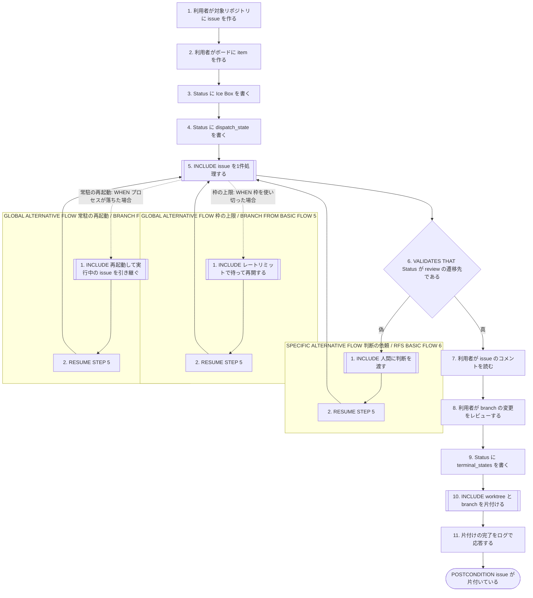
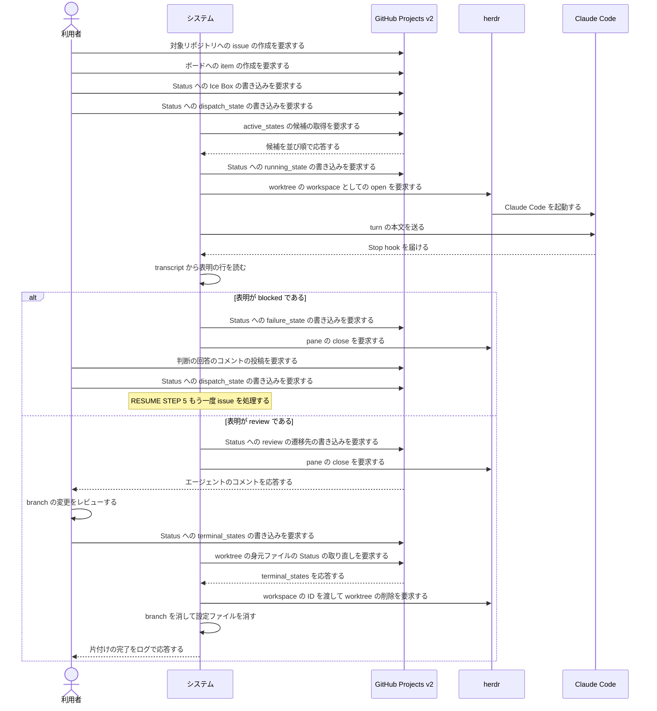

<!-- 目的: 1件の issue がボードに載ってから worktree と branch が片付くまでの時系列を、既存の particular_case を繋いで RUCM で定義する -->

# ユースケース: issue を着手から片付けまで見届ける

## 根拠資料

- `docs/plans/continuo_design.md#3-5`（完了検知の3層。1つの turn で何が起きるか）
- `docs/plans/continuo_design.md#3-8`（turn ループと巡回のループの分担）
- `docs/plans/continuo_design.md#3-9`（worktree と branch の後始末。手順7 が完了の見張りである）
- `docs/plans/continuo_design.md#3-16`（着手の手順の順番）
- `docs/plans/continuo_design.md#3-25`（表明を読んで Status を動かす）
- `docs/plans/continuo_design.md#3-27`（レートリミットで待って再開する）
- `docs/plans/continuo_design.md#4-1`（Status の状態遷移と、誰がどの遷移を起こすか）
- `docs/spec/usecases/particular_case/issue を1件処理する.rucm.md`
- `docs/spec/usecases/particular_case/人間に判断を渡す.rucm.md`
- `docs/spec/usecases/particular_case/worktree と branch を片付ける.rucm.md`
- `docs/spec/usecases/particular_case/レートリミットで待って再開する.rucm.md`
- `docs/spec/usecases/particular_case/再起動して実行中の issue を引き継ぐ.rucm.md`
- `internal/orchestrator/orchestrator.go` の `Tick`

## RUCM

```rucm
USE CASE NAME: issue を着手から片付けまで見届ける
BRIEF DESCRIPTION: 利用者は issue をボードに載せ、着手を決めて Status を dispatch_state へ動かす。システムは issue を1件処理し、エージェントの表明どおりに Status を動かす。利用者は成果をレビューして Status を terminal_states へ動かす。システムは worktree と branch を片付ける。
PRECONDITION: 利用者は continuo を使い始める用意を終えている。システムは常駐している。ボードの Status の選択肢名は設定と一致する。対象リポジトリの clone は Claude Code に信頼登録されている。herdr は待ち受けている。
PRIMARY ACTOR: 利用者
SECONDARY ACTORS: GitHub Projects v2、herdr、Claude Code、Claude の usage API、git
DEPENDENCY: INCLUDE USE CASE issue を1件処理する、INCLUDE USE CASE 人間に判断を渡す、INCLUDE USE CASE worktree と branch を片付ける、INCLUDE USE CASE レートリミットで待って再開する、INCLUDE USE CASE 再起動して実行中の issue を引き継ぐ
GENERALIZATION: なし

BASIC FLOW:
1. 利用者は対象リポジトリに issue を作る。
2. 利用者はボードに issue の item を作る。
3. 利用者はボードの issue の Status に Ice Box の選択肢を書く。
4. 利用者はボードの issue の Status に dispatch_state の選択肢を書く。
5. INCLUDE USE CASE issue を1件処理する
6. システムは VALIDATES THAT issue の Status が review の遷移先の選択肢である。
7. 利用者はボードの issue のコメントで作業の内容を読む。
8. 利用者は branch の変更をレビューする。
9. 利用者はボードの issue の Status に terminal_states の選択肢を書く。
10. INCLUDE USE CASE worktree と branch を片付ける
11. システムは利用者に片付けの完了をログで応答する。
POSTCONDITION: issue の Status は terminal_states の選択肢である。issue にエージェントが書いたコメントが1件以上ある。worktree は置き場所に無い。branch は無い。印は外れている。herdr の pane は閉じている。

SPECIFIC ALTERNATIVE FLOW 判断の依頼:
RFS BASIC FLOW 6
1. INCLUDE USE CASE 人間に判断を渡す
2. RESUME STEP 5
POSTCONDITION: issue の Status は dispatch_state の選択肢である。issue に利用者の回答のコメントがある。worktree と branch は残っている。前の run の herdr の pane は閉じている。

GLOBAL ALTERNATIVE FLOW 枠の上限:
BRANCH FROM BASIC FLOW 5
WHEN 走行中の run が枠を使い切った場合
1. INCLUDE USE CASE レートリミットで待って再開する
2. RESUME STEP 5
POSTCONDITION: run は続いている。issue の Status は running_state の選択肢のままである。worktree は残っている。turn 数は1つ増えている。

GLOBAL ALTERNATIVE FLOW 常駐の再起動:
BRANCH FROM BASIC FLOW 5
WHEN continuo のプロセスが落ちて利用者が continuo を起動し直す場合
1. INCLUDE USE CASE 再起動して実行中の issue を引き継ぐ
2. RESUME STEP 5
POSTCONDITION: 引き継いだ issue は印の集合に入っている。issue の Status は running_state の選択肢のままである。worktree は残っている。身元ファイルの引き継いだ回数は1つ増えている。
```

## この時系列で Status がどう動くか

| 時点 | Status | 動かすのは誰か |
| --- | --- | --- |
| ボードに載せた直後 | Ice Box | 利用者 |
| 着手を決めたとき | Ready | 利用者 |
| dispatch したとき | In Progress | システム |
| 表明が review のとき | In Review | システム |
| 表明が blocked のとき | Blocked | システム |
| 回答して戻すとき | Ready | 利用者 |
| レビューを終えたとき | Done | 利用者 |

## この scenario に凝集させた particular_case

| 取り込んだ場所 | particular_case | なぜここか |
| --- | --- | --- |
| 基本フローのステップ5 | issue を1件処理する | 中核の価値経路である。着手から表明までを1本で通す |
| 基本フローのステップ10 | worktree と branch を片付ける | 完了の見張りは巡回の照合が担う。人間が Done へ動かしたあとに続く |
| 代替フロー 判断の依頼 | 人間に判断を渡す | 表明が review にならなかったときの分岐である |
| 代替フロー 枠の上限 | レートリミットで待って再開する | 処理の途中のどの時点でも起こりうる |
| 代替フロー 常駐の再起動 | 再起動して実行中の issue を引き継ぐ | 処理の途中のどの時点でも起こりうる |

## フローチャート



## シーケンス図


