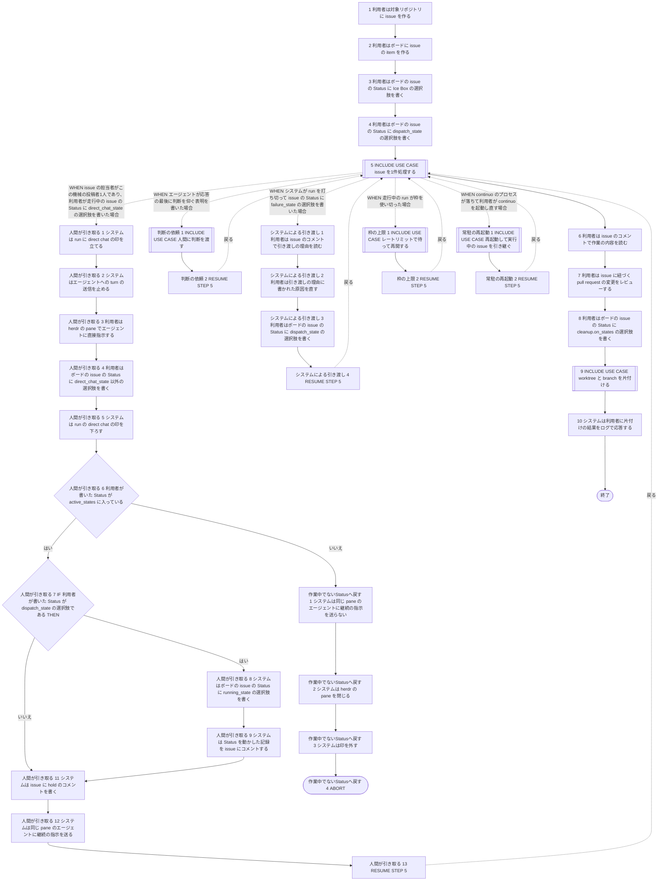
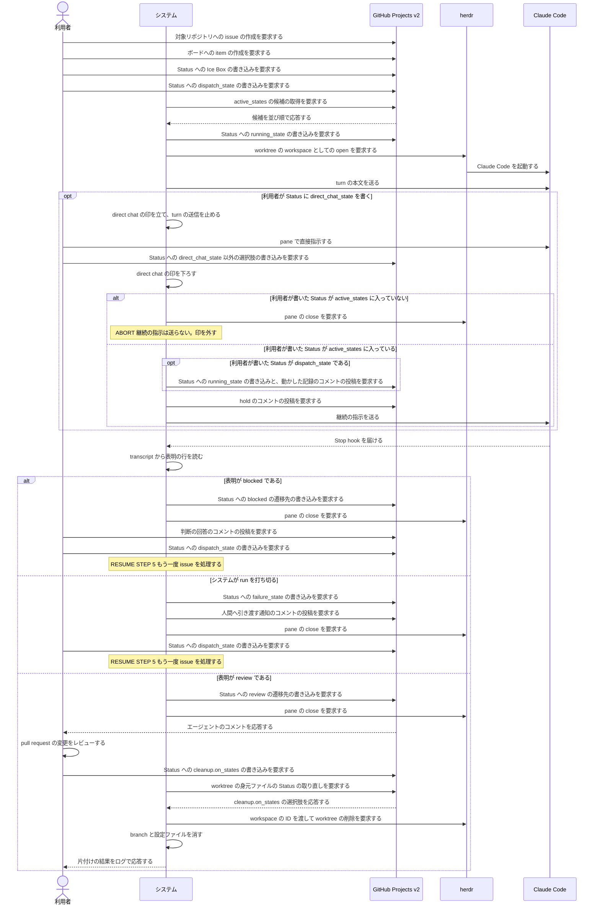

# ユースケース: issue を着手から片付けまで見届ける

> **この記述からテストコードは作らない。**
> シナリオは、ほかの記述を `INCLUDE USE CASE` で引いて順に並べたもので、段の中身を確かめるテストは、引いた先の記述に付いている。
> 2つのシナリオの段を1本で通すテストは `test/e2e/walkthrough_test.go` の `TestE2E_手順書の段1から段9までをmockだけで通す` で、
> 1つのテストが2つの記述をまたぐので、どちらの記述の印も付けていない（テストのファイルは `SOURCE` を1つしか持てない）。
> `check_update_tests.py` が出す `[W1]`（テスト未生成パス）は、ここでは想定どおりである。

## 根拠資料

- `docs/plans/continuo_design.md#3-5`（完了検知の3層。1つの turn で何が起きるか）
- `docs/plans/continuo_design.md#3-8`（turn ループと巡回のループの分担）
- `docs/plans/continuo_design.md#3-9`（worktree と branch の後始末。手順7 が完了の見張りである）
- `docs/plans/continuo_design.md#3-16`（着手の手順の順番）
- `docs/plans/continuo_design.md#3-25`（表明を読んで Status を動かす）
- `docs/plans/continuo_design.md#3-27`（レートリミットで待って再開する）
- `docs/plans/continuo_design.md#3-83`（人間が pane で直接続ける。direct chat）
- `docs/plans/continuo_design.md#4-1`（Status の状態遷移と、誰がどの遷移を起こすか）
- `docs/spec/usecases/particular_case/issue を1件処理する.rucm.md`
- `docs/spec/usecases/particular_case/人間に判断を渡す.rucm.md`
- `docs/spec/usecases/particular_case/worktree と branch を片付ける.rucm.md`
- `docs/spec/usecases/particular_case/レートリミットで待って再開する.rucm.md`
- `docs/spec/usecases/particular_case/再起動して実行中の issue を引き継ぐ.rucm.md`
- `internal/orchestrator/lifecycle.go` の `handleTurnEnd` / `decideAfterTurn` / `finishRunClaimed` / `failRun` / `stopAndReleaseAsync` / `cleanupPath`
- `internal/orchestrator/turn.go` の `turnLoop`
- `internal/orchestrator/reconcile.go` の `updateDirectChatMode` / `reconcileRunning` / `reconcileWorktrees`
- `internal/orchestrator/directchat.go` の `returnFromDirectChatAsync` / `postDirectChatHold` / `writeRunningStateOnReturn` / `directChatReturnState`
- `internal/orchestrator/prompt.go` の `buildHandoffComment`
- `internal/workspace/cleanup.go` の `ShouldCleanup`
- `internal/prompt/builtin.md` の 3-5（pull request はエージェントが出す）

## この記述の読み方

**取り込んだ記述は、名前だけで引いている。**取り込んだ先の段の番号と代替フローの名前には依存しない。

**基本フローは、エージェントが review を表明した場合の時系列である。**
表明が review かどうかを、この時系列の中で検査するコードは無い。
turn の終わりの処理（`handleTurnEnd`）は、表明を読み、Status を書き、取り直した Status で分岐する。
検査はその1回だけで、`issue を1件処理する` の中に在る。
だから、基本フローには検査の段を置いていない。

**`人間に判断を渡す` は、`issue を1件処理する` の後ろに続くものではない。**
エージェントが判断を仰ぐ表明を書いたところから先を、`issue を1件処理する` の残りの代わりに受け持つ。
表明を読む処理も、Status を書く処理も、pane を閉じる処理も、1つの run につき1回しか起きない。

## RUCM

```rucm
USE CASE NAME: issue を着手から片付けまで見届ける
BRIEF DESCRIPTION: 利用者は issue をボードに載せる。利用者は issue の Status を dispatch_state の選択肢へ動かす。システムは issue を1件処理する。利用者は成果をレビューする。利用者は issue の Status を cleanup.on_states の選択肢へ動かす。システムは worktree と branch を片付ける。
PRECONDITION: 利用者は continuo を使い始める用意を終えている。システムは常駐している。ボードの Status の選択肢名は設定と一致する。対象リポジトリの clone は Claude Code に信頼登録されている。herdr は待ち受けている。設定の cleanup.enabled は true である。
PRIMARY ACTOR: 利用者
SECONDARY ACTORS: GitHub Projects v2、herdr、Claude Code、git
DEPENDENCY: INCLUDE USE CASE issue を1件処理する、INCLUDE USE CASE 人間に判断を渡す、INCLUDE USE CASE worktree と branch を片付ける、INCLUDE USE CASE レートリミットで待って再開する、INCLUDE USE CASE 再起動して実行中の issue を引き継ぐ
GENERALIZATION: なし

BASIC FLOW:
1. 利用者は対象リポジトリに issue を作る。
2. 利用者はボードに issue の item を作る。
3. 利用者はボードの issue の Status に Ice Box の選択肢を書く。
4. 利用者はボードの issue の Status に dispatch_state の選択肢を書く。
5. INCLUDE USE CASE issue を1件処理する
6. 利用者は issue のコメントで作業の内容を読む。
7. 利用者は issue に紐づく pull request の変更をレビューする。
8. 利用者はボードの issue の Status に cleanup.on_states の選択肢を書く。
9. INCLUDE USE CASE worktree と branch を片付ける
10. システムは利用者に片付けの結果をログで応答する。
POSTCONDITION: issue の Status は cleanup.on_states の選択肢である。issue にエージェントが書いたコメントが1件以上ある。worktree は置き場所に無い。branch は、設定の cleanup.delete_branch が真であれば無い。印は外れている。herdr の pane は閉じている。

GLOBAL ALTERNATIVE FLOW 判断の依頼:
BRANCH FROM BASIC FLOW 5
WHEN エージェントが応答の最後に判断を仰ぐ表明を書いた場合
1. INCLUDE USE CASE 人間に判断を渡す
2. RESUME STEP 5
POSTCONDITION: issue の Status は dispatch_state の選択肢である。issue に利用者の回答のコメントがある。worktree と branch は残っている。前の run の herdr の pane は閉じている。

GLOBAL ALTERNATIVE FLOW システムによる引き渡し:
BRANCH FROM BASIC FLOW 5
WHEN システムが run を打ち切って issue の Status に failure_state の選択肢を書いた場合
1. 利用者は issue のコメントで引き渡しの理由を読む。
2. 利用者は引き渡しの理由に書かれた原因を直す。
3. 利用者はボードの issue の Status に dispatch_state の選択肢を書く。
4. RESUME STEP 5
POSTCONDITION: issue の Status は dispatch_state の選択肢である。issue に人間へ引き渡す通知のコメントが1件ある。worktree と branch は残っている。前の run の herdr の pane は閉じている。

GLOBAL ALTERNATIVE FLOW 人間が引き取る:
BRANCH FROM BASIC FLOW 5
WHEN issue の担当者がこの機械の投稿者1人であり、利用者が走行中の issue の Status に direct_chat_state の選択肢を書いた場合
1. システムは run に direct chat の印を立てる。
2. システムはエージェントへの turn の送信を止める。
3. 利用者は herdr の pane でエージェントに直接指示する。
4. 利用者はボードの issue の Status に direct_chat_state 以外の選択肢を書く。
5. システムは run の direct chat の印を下ろす。
6. システムは VALIDATES THAT 利用者が書いた Status が active_states に入っている。
7. IF 利用者が書いた Status が dispatch_state の選択肢である THEN
8.   システムはボードの issue の Status に running_state の選択肢を書く。
9.   システムは Status を動かした記録を issue にコメントする。
10. ENDIF
11. システムは issue に hold のコメントを書く。
12. システムは同じ pane のエージェントに継続の指示を送る。
13. RESUME STEP 5
POSTCONDITION: issue の Status は、利用者が dispatch_state の選択肢を書いた場合は running_state の選択肢であり、そのほかの場合は利用者が書いた選択肢である。herdr の pane は閉じていない。印は残っている。worktree は残っている。run の turn 数は数え直されていない。

SPECIFIC ALTERNATIVE FLOW 作業中でないStatusへ戻す:
RFS 人間が引き取る 6
1. システムは同じ pane のエージェントに継続の指示を送らない。
2. システムは herdr の pane を閉じる。
3. システムは印を外す。
4. ABORT
POSTCONDITION: issue の Status は利用者が書いた選択肢である。run の direct chat の印は下りている。システムは hold のコメントを書いていない。herdr の pane は閉じている。印は外れている。worktree は、利用者が書いた Status が cleanup.on_states に入っていなければ残っている。

GLOBAL ALTERNATIVE FLOW 枠の上限:
BRANCH FROM BASIC FLOW 5
WHEN 走行中の run が枠を使い切った場合
1. INCLUDE USE CASE レートリミットで待って再開する
2. RESUME STEP 5
POSTCONDITION: run は続いている。issue の Status は running_state の選択肢のままである。worktree は残っている。

GLOBAL ALTERNATIVE FLOW 常駐の再起動:
BRANCH FROM BASIC FLOW 5
WHEN continuo のプロセスが落ちて利用者が continuo を起動し直す場合
1. INCLUDE USE CASE 再起動して実行中の issue を引き継ぐ
2. RESUME STEP 5
POSTCONDITION: 引き継いだ issue は印の集合に入っている。issue の Status は running_state の選択肢のままである。worktree は残っている。herdr の pane は閉じていない。
```

## この時系列で Status がどう動くか

Status の名前は既定の値で書いている。

| 時点 | Status | 動かすのは誰か |
| --- | --- | --- |
| ボードに載せた直後 | Ice Box | 利用者 |
| 着手を決めたとき | Ready（`dispatch_state`） | 利用者 |
| dispatch したとき | In Progress（`running_state`） | システム |
| 表明が review のとき | In Review | システム |
| 表明が blocked のとき | Blocked | システム |
| システムが run を打ち切ったとき | Blocked（`failure_state`） | システム |
| 回答して、または原因を直して戻すとき | Ready | 利用者 |
| pane で直接続けるとき | Direct Chat（`direct_chat_state`） | 利用者 |
| 直接続けるのをやめて、作業中の Status（In Progress）へ戻すとき | In Progress | 利用者 |
| 直接続けるのをやめて、Ready（`dispatch_state`）へ戻すとき | Ready → In Progress | 利用者が Ready を書き、システムが In Progress を書く |
| 直接続けるのをやめて、作業中でない Status へ動かすとき | 利用者が書いた Status | 利用者（システムは続きの指示を送らず、pane を閉じて印を外す） |
| レビューを終えたとき | Done（`cleanup.on_states`） | 利用者 |

## この scenario に凝集させた particular_case

| 取り込んだ場所 | particular_case | なぜここか |
| --- | --- | --- |
| 基本フローのステップ5 | issue を1件処理する | 中核の価値経路である。着手から表明までを1本で通す |
| 基本フローのステップ9 | worktree と branch を片付ける | 完了の見張りは巡回の照合が担う。利用者が Status を動かしたあとに続く |
| 代替フロー 判断の依頼 | 人間に判断を渡す | エージェントが判断を仰ぐ表明を書いたところから先を、ステップ5 の残りの代わりに受け持つ |
| 代替フロー 枠の上限 | レートリミットで待って再開する | 処理の途中のどの時点でも起こりうる |
| 代替フロー 常駐の再起動 | 再起動して実行中の issue を引き継ぐ | 処理の途中のどの時点でも起こりうる |

`システムによる引き渡し` と `人間が引き取る` は、取り込む先の particular_case が無いので、直接の段で書いている。

## フローチャート


```mermaid
flowchart TD
    BS1["1 利用者は対象リポジトリに issue を作る"]
    BS2["2 利用者はボードに issue の item を作る"]
    BS3["3 利用者はボードの issue の Status に Ice Box の選択肢を書く"]
    BS4["4 利用者はボードの issue の Status に dispatch_state の選択肢を書く"]
    BS5[["5 INCLUDE USE CASE issue を1件処理する"]]
    BS6["6 利用者は issue のコメントで作業の内容を読む"]
    BS7["7 利用者は issue に紐づく pull request の変更をレビューする"]
    BS8["8 利用者はボードの issue の Status に cleanup.on_states の選択肢を書く"]
    BS9[["9 INCLUDE USE CASE worktree と branch を片付ける"]]
    BS10["10 システムは利用者に片付けの結果をログで応答する"]
    A1S1[["判断の依頼 1 INCLUDE USE CASE 人間に判断を渡す"]]
    A1S2["判断の依頼 2 RESUME STEP 5"]
    A2S1["システムによる引き渡し 1 利用者は issue のコメントで引き渡しの理由を読む"]
    A2S2["システムによる引き渡し 2 利用者は引き渡しの理由に書かれた原因を直す"]
    A2S3["システムによる引き渡し 3 利用者はボードの issue の Status に dispatch_state の選択肢を書く"]
    A2S4["システムによる引き渡し 4 RESUME STEP 5"]
    A3S1["人間が引き取る 1 システムは run に direct chat の印を立てる"]
    A3S2["人間が引き取る 2 システムはエージェントへの turn の送信を止める"]
    A3S3["人間が引き取る 3 利用者は herdr の pane でエージェントに直接指示する"]
    A3S4["人間が引き取る 4 利用者はボードの issue の Status に direct_chat_state 以外の選択肢を書く"]
    A3S5["人間が引き取る 5 システムは run の direct chat の印を下ろす"]
    A3S6{"人間が引き取る 6 利用者が書いた Status が active_states に入っている"}
    A3S7{"人間が引き取る 7 IF 利用者が書いた Status が dispatch_state の選択肢である THEN"}
    A3S8["人間が引き取る 8 システムはボードの issue の Status に running_state の選択肢を書く"]
    A3S9["人間が引き取る 9 システムは Status を動かした記録を issue にコメントする"]
    A3S11["人間が引き取る 11 システムは issue に hold のコメントを書く"]
    A3S12["人間が引き取る 12 システムは同じ pane のエージェントに継続の指示を送る"]
    A3S13["人間が引き取る 13 RESUME STEP 5"]
    A4S1["作業中でないStatusへ戻す 1 システムは同じ pane のエージェントに継続の指示を送らない"]
    A4S2["作業中でないStatusへ戻す 2 システムは herdr の pane を閉じる"]
    A4S3["作業中でないStatusへ戻す 3 システムは印を外す"]
    A4S4(["作業中でないStatusへ戻す 4 ABORT"])
    A5S1[["枠の上限 1 INCLUDE USE CASE レートリミットで待って再開する"]]
    A5S2["枠の上限 2 RESUME STEP 5"]
    A6S1[["常駐の再起動 1 INCLUDE USE CASE 再起動して実行中の issue を引き継ぐ"]]
    A6S2["常駐の再起動 2 RESUME STEP 5"]
    BS1 --> BS2
    BS2 --> BS3
    BS3 --> BS4
    BS4 --> BS5
    BS5 --> BS6
    BS5 -. "WHEN エージェントが応答の最後に判断を仰ぐ表明を書いた場合" .-> A1S1
    BS5 -. "WHEN システムが run を打ち切って issue の Status に failure_state の選択肢を書いた場合" .-> A2S1
    BS5 -. "WHEN issue の担当者がこの機械の投稿者1人であり、利用者が走行中の issue の Status に direct_chat_state の選択肢を書いた場合" .-> A3S1
    BS5 -. "WHEN 走行中の run が枠を使い切った場合" .-> A5S1
    BS5 -. "WHEN continuo のプロセスが落ちて利用者が continuo を起動し直す場合" .-> A6S1
    BS6 --> BS7
    BS7 --> BS8
    BS8 --> BS9
    BS9 --> BS10
    A1S1 --> A1S2
    A1S2 -. "戻る" .-> BS5
    A2S1 --> A2S2
    A2S2 --> A2S3
    A2S3 --> A2S4
    A2S4 -. "戻る" .-> BS5
    A3S1 --> A3S2
    A3S2 --> A3S3
    A3S3 --> A3S4
    A3S4 --> A3S5
    A3S5 --> A3S6
    A3S6 -- はい --> A3S7
    A3S6 -- いいえ --> A4S1
    A3S7 -- はい --> A3S8
    A3S7 -- いいえ --> A3S11
    A3S8 --> A3S9
    A3S9 --> A3S11
    A3S11 --> A3S12
    A3S12 --> A3S13
    A3S13 -. "戻る" .-> BS5
    A4S1 --> A4S2
    A4S2 --> A4S3
    A4S3 --> A4S4
    A5S1 --> A5S2
    A5S2 -. "戻る" .-> BS5
    A6S1 --> A6S2
    A6S2 -. "戻る" .-> BS5
    BS10 --> END(["終了"])
```

## シーケンス図


```mermaid
sequenceDiagram
    actor U as 利用者
    participant S as システム
    participant GH as GitHub Projects v2
    participant H as herdr
    participant CC as Claude Code

    U->>GH: 対象リポジトリへの issue の作成を要求する
    U->>GH: ボードへの item の作成を要求する
    U->>GH: Status への Ice Box の書き込みを要求する
    U->>GH: Status への dispatch_state の書き込みを要求する

    S->>GH: active_states の候補の取得を要求する
    GH-->>S: 候補を並び順で応答する
    S->>GH: Status への running_state の書き込みを要求する
    S->>H: worktree の workspace としての open を要求する
    H->>CC: Claude Code を起動する
    S->>CC: turn の本文を送る

    opt 利用者が Status に direct_chat_state を書く
        S->>S: direct chat の印を立て、turn の送信を止める
        U->>CC: pane で直接指示する
        U->>GH: Status への direct_chat_state 以外の選択肢の書き込みを要求する
        S->>S: direct chat の印を下ろす
        alt 利用者が書いた Status が active_states に入っていない
            S->>H: pane の close を要求する
            Note over S: ABORT 継続の指示は送らない。印を外す
        else 利用者が書いた Status が active_states に入っている
            opt 利用者が書いた Status が dispatch_state である
                S->>GH: Status への running_state の書き込みと、動かした記録のコメントの投稿を要求する
            end
            S->>GH: hold のコメントの投稿を要求する
            S->>CC: 継続の指示を送る
        end
    end

    CC-->>S: Stop hook を届ける
    S->>S: transcript から表明の行を読む

    alt 表明が blocked である
        S->>GH: Status への blocked の遷移先の書き込みを要求する
        S->>H: pane の close を要求する
        U->>GH: 判断の回答のコメントの投稿を要求する
        U->>GH: Status への dispatch_state の書き込みを要求する
        Note over S: RESUME STEP 5 もう一度 issue を処理する
    else システムが run を打ち切る
        S->>GH: Status への failure_state の書き込みを要求する
        S->>GH: 人間へ引き渡す通知のコメントの投稿を要求する
        S->>H: pane の close を要求する
        U->>GH: Status への dispatch_state の書き込みを要求する
        Note over S: RESUME STEP 5 もう一度 issue を処理する
    else 表明が review である
        S->>GH: Status への review の遷移先の書き込みを要求する
        S->>H: pane の close を要求する
        GH-->>U: エージェントのコメントを応答する
        U->>U: pull request の変更をレビューする
        U->>GH: Status への cleanup.on_states の書き込みを要求する
        S->>GH: worktree の身元ファイルの Status の取り直しを要求する
        GH-->>S: cleanup.on_states の選択肢を応答する
        S->>H: workspace の ID を渡して worktree の削除を要求する
        S->>S: branch と設定ファイルを消す
        S-->>U: 片付けの結果をログで応答する
    end
```
