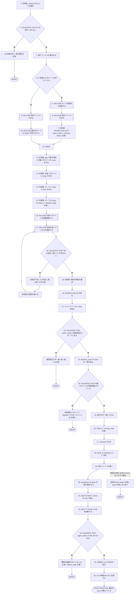
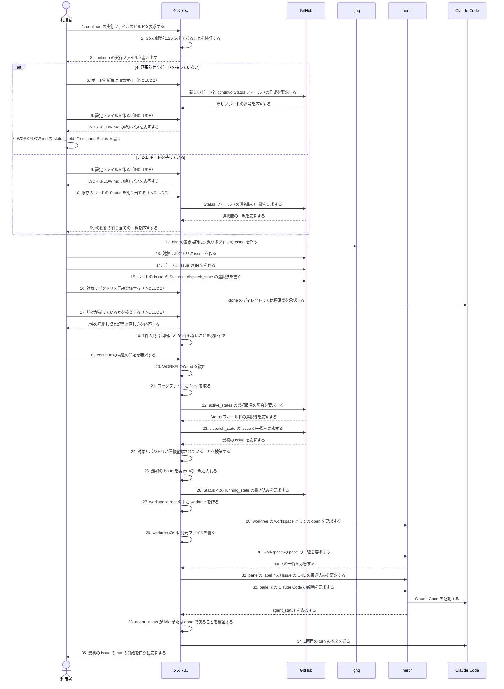

# ユースケース: はじめて continuo を動かせるようにする

## 根拠資料

- docs/plans/continuo_design.md#3-6
- docs/plans/continuo_design.md#3-16
- docs/plans/continuo_design.md#3-17
- docs/plans/continuo_design.md#3-18
- docs/plans/continuo_design.md#3-22
- docs/plans/continuo_design.md#3-32
- docs/plans/continuo_design.md#3-32b
- docs/plans/continuo_design.md#3-33
- docs/plans/continuo_design.md#3-34
- docs/plans/continuo_design.md#5-1
- docs/plans/continuo_design.md#5-2
- docs/trying_it_out.md
- docs/spec/usecases/particular_case/ボードを新規に用意する.rucm.md
- docs/spec/usecases/particular_case/既存のボードの Status を割り当てる.rucm.md
- docs/spec/usecases/particular_case/設定ファイルを作る.rucm.md
- docs/spec/usecases/particular_case/前提が揃っているかを検査する.rucm.md
- docs/spec/usecases/particular_case/対象リポジトリを信頼登録する.rucm.md
- internal/scaffold/
- internal/doctor/
- CLAUDE.md

## RUCM

```rucm
USE CASE NAME: はじめて continuo を動かせるようにする
BRIEF DESCRIPTION: 利用者は continuo をはじめて使えるようにする。システムは利用者の手元のコマンド環境と continuo の実行ファイルである。利用者はボードを用意し、設定ファイルを置き、対象リポジトリの clone を信頼登録し、前提の検査を通す。利用者は issue を1件だけ着手待ちの Status へ置く。システムは常駐を始めて issue を1件取り、worktree を作り、herdr の pane で Claude Code を起動して1回目の turn を送る。
PRECONDITION: 利用者は GitHub のアカウントを持っている。利用者のマシンの OS は macOS または Linux である。利用者のマシンで herdr が待ち受けている。利用者は gh と ghq と git と Go を導入済みである。利用者は Claude Code を導入済みである。
PRIMARY ACTOR: 利用者
SECONDARY ACTORS: GitHub、herdr、Claude Code、gh、ghq
DEPENDENCY: INCLUDE USE CASE ボードを新規に用意する、INCLUDE USE CASE 設定ファイルを作る、INCLUDE USE CASE 既存のボードの Status を割り当てる、INCLUDE USE CASE 対象リポジトリを信頼登録する、INCLUDE USE CASE 前提が揃っているかを検査する
GENERALIZATION: なし

BASIC FLOW:
1. 利用者はシステムに continuo の実行ファイルのビルドを要求する。
2. システムは VALIDATES THAT Go の版が 1.26 以上である。
3. システムは continuo の実行ファイルを利用者が指定した書き出し先に書き出す。
4. IF 利用者が continuo に見張らせるボードを持っていない THEN
5.   INCLUDE USE CASE ボードを新規に用意する
6.   INCLUDE USE CASE 設定ファイルを作る
7.   利用者は WORKFLOW.md の status_field に continuo Status を書く。
8. ELSE
9.   INCLUDE USE CASE 設定ファイルを作る
10.   INCLUDE USE CASE 既存のボードの Status を割り当てる
11. ENDIF
12. 利用者は ghq の置き場所に対象リポジトリの clone を作る。
13. 利用者は対象リポジトリに issue を作る。
14. 利用者はボードに issue の item を作る。
15. 利用者はボードの issue の Status に dispatch_state の選択肢を書く。
16. INCLUDE USE CASE 対象リポジトリを信頼登録する
17. INCLUDE USE CASE 前提が揃っているかを検査する
18. システムは VALIDATES THAT 検査結果の7件の見出し語に ✗ が1件もない。
19. 利用者はシステムに continuo の常駐の開始を要求する。
20. システムは WORKFLOW.md を読む。
21. システムは実行時ディレクトリのロックファイルに flock を取る。
22. システムは VALIDATES THAT 設定の active_states の選択肢名がボードにすべてある。
23. システムはボードから dispatch_state の issue の一覧を取る。
24. システムは VALIDATES THAT 最初の issue の対象リポジトリが Claude Code に信頼登録されている。
25. システムは最初の issue を実行中の一覧に入れる。
26. システムはボードの最初の issue の Status に running_state の選択肢を書く。
27. システムは workspace.root の下に最初の issue の worktree を作る。
28. システムは worktree を herdr の workspace として開く。
29. システムは worktree の中に身元ファイルを書く。
30. システムは herdr に workspace の pane の一覧を要求する。
31. システムは pane の label に最初の issue の URL を書く。
32. システムは pane で Claude Code を起動する。
33. システムは VALIDATES THAT Claude Code の agent_status が idle または done である。
34. システムは Claude Code に1回目の turn の本文を送る。
35. システムは利用者に最初の issue の run の開始をログに応答する。
POSTCONDITION: continuo が常駐している。最初の issue の Status は running_state の選択肢である。最初の issue の worktree が workspace.root の下にある。worktree の中に身元ファイルがある。herdr の pane で Claude Code が動いている。1回目の turn の本文が Claude Code に届いている。

SPECIFIC ALTERNATIVE FLOW Goの版が古い:
RFS BASIC FLOW 2
1. システムは利用者に Go の版が 1.26 に満たないことを応答する。
2. システムは利用者に Go 1.26 以上の導入を直し方として応答する。
3. ABORT
POSTCONDITION: continuo の実行ファイルは書き出されていない。Go の版の要件が利用者に表示されている。

SPECIFIC ALTERNATIVE FLOW 前提の不足:
RFS BASIC FLOW 18
1. システムは利用者に ✗ が付いた見出し語と直し方を応答する。
2. 利用者は ✗ が付いた見出し語の直し方に従って前提を揃える。
3. RESUME STEP 17
POSTCONDITION: continuo は常駐していない。✗ が付いた見出し語と直し方が利用者に表示されている。最初の issue の Status は dispatch_state の選択肢のままである。

SPECIFIC ALTERNATIVE FLOW 選択肢名の不一致:
RFS BASIC FLOW 22
1. システムは利用者に設定の選択肢名とボードの選択肢名の食い違いを応答する。
2. システムは常駐を始めずに終了する。
3. ABORT
POSTCONDITION: continuo は常駐していない。最初の issue の Status は dispatch_state の選択肢のままである。worktree は作られていない。

SPECIFIC ALTERNATIVE FLOW 未信頼のリポジトリ:
RFS BASIC FLOW 24
1. システムは最初の issue を dispatch の対象から外す。
2. システムは最初の issue に信頼登録の承認を促すコメントを1件書く。
3. システムは最初の issue の対象リポジトリを通知済みとして記録する。
4. ABORT
POSTCONDITION: 最初の issue の Status は dispatch_state の選択肢のままである。worktree は作られていない。最初の issue に信頼登録の承認を促すコメントが1件ある。

SPECIFIC ALTERNATIVE FLOW 確認の画面が出ている:
RFS BASIC FLOW 33
1. システムは pane に esc のキー入力を送る。
2. システムはボードの最初の issue の Status に failure_state の選択肢を書く。
3. ABORT
POSTCONDITION: 最初の issue の Status は failure_state の選択肢である。1回目の turn の本文は Claude Code に届いていない。worktree は workspace.root の下に残っている。

GLOBAL ALTERNATIVE FLOW 常駐の中断:
BRANCH FROM BASIC FLOW 29
WHEN 利用者が continuo を動かしている端末で Ctrl+C を入力する場合
1. システムはボードの巡回を止める。
2. システムは hook を受ける socket を閉じる。
3. システムは herdr の pane を閉じずに終了する。
4. ABORT
POSTCONDITION: continuo は常駐していない。最初の issue の Status は running_state の選択肢である。worktree は workspace.root の下に残っている。worktree の中に身元ファイルがない。herdr の workspace が残っている。
```

## フローチャート



## シーケンス図


