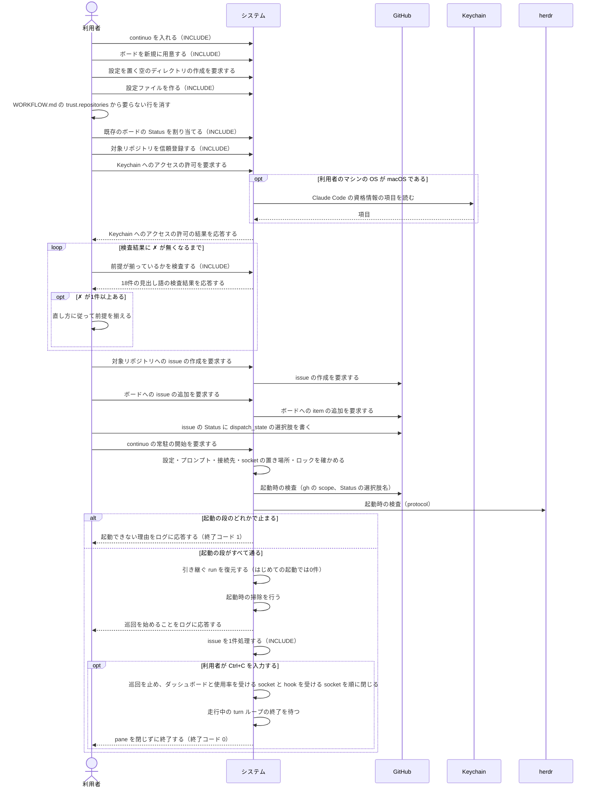

# ユースケース: はじめて continuo を動かせるようにする

> **この記述からテストコードは作らない。**
> シナリオは、ほかの記述を `INCLUDE USE CASE` で引いて順に並べたもので、段の中身を確かめるテストは、引いた先の記述に付いている。
> 2つのシナリオの段を1本で通すテストは `test/e2e/walkthrough_test.go` の `TestE2E_手順書の段1から段9までをmockだけで通す` で、
> 1つのテストが2つの記述をまたぐので、どちらの記述の印も付けていない（テストのファイルは `SOURCE` を1つしか持てない）。
> `check_update_tests.py` が出す `[W1]`（テスト未生成パス）は、ここでは想定どおりである。

## 根拠資料

- `README.ja.md` の「必要なもの」「インストール」「使い方」（コマンドを叩く順番）
- `docs/trying_it_out.md` の 段2（使うカンバンを確かめる）/ 段3（設定を置く）/ 段4（Status の割り当てを合わせる）/ 段5（対象リポジトリを信頼に登録する）/ 段5b（Keychain へのアクセスを1回許可する）/ 段6（前提が揃っているかを検査する）/ 段7（issue を1件用意する）/ 段8（動かす）/ 段9（止める・片付ける）
- `docs/plans/continuo_design.md` の「3-6」（起動時の検査）、「3-17」（二重起動防止のロック）、「3-32. 使い始めるまでの手順」
- `internal/cli/cli.go` の `runMain`（常駐の入口と終了コード）/ `runAllowKeychainAccess`
- `internal/daemon/daemon.go` の `Run` / `buildPrompt` / `build` / `ValidateGraphQLEndpoint` と、`deps` の `close`
- `internal/daemon/checks.go` の `runStartupChecks`
- `internal/doctor/doctor.go` の `Run`、`internal/i18n/messages/ja.json` の `doctor.label.*`（見出し語は18個）
- 取り込んだ記述: `continuo を入れる` / `ボードを新規に用意する` / `設定ファイルを作る` / `既存のボードの Status を割り当てる` / `対象リポジトリを信頼登録する` / `前提が揃っているかを検査する` / `issue を1件処理する`

## この記述の読み方

**取り込んだ記述は、名前だけで引いている。**取り込んだ先の段の番号と代替フローの名前には依存しない。
取り込んだコマンドが途中で止まった場合の扱いは、取り込んだ先の記述に在る。

**段の順番は `README.ja.md` の「使い方」と `docs/trying_it_out.md` の段の順番である。**
設定を置く → Status の割り当て → 信頼の登録 → Keychain（macOS だけ）→ 前提の検査 → issue を用意する → 動かす。

**人間が行う段は文書を、continuo が行う段は実装を根拠にしている。**
基本フロー 1〜18 は人間がコマンドを叩く段である。基本フロー 19〜30 は `continuo` を引数なしで起動したあとに実装が行う段である。

**着手してから先（空きスロット・入札・worktree・pane・1回目の turn・表明）は、`issue を1件処理する` が持つ。**
このシナリオには、着手の段を1つも書いていない。

**実装と文書は「カンバン」と呼ぶ。この記述は「ボード」と呼ぶ。**同じものである（GitHub Projects v2 の1枚）。

## RUCM

```rucm
USE CASE NAME: はじめて continuo を動かせるようにする
BRIEF DESCRIPTION: 利用者は continuo をはじめて使えるようにする。システムは利用者の手元のコマンド環境と continuo の実行ファイルである。利用者は continuo を入れる。利用者は使うボードを確かめる。利用者は設定ファイルを置く。利用者は Status を割り当てる。利用者は対象リポジトリを信頼登録する。利用者は前提の検査を通す。利用者は issue を1件だけ着手待ちの Status へ置く。システムは常駐を始める。システムは最初の issue を1件処理する。
PRECONDITION: 利用者は GitHub のアカウントを持っている。利用者のマシンの OS は macOS または Linux である。利用者は herdr と Claude Code を導入済みである。利用者は GitHub Projects v2 のボードを1枚以上持っている。利用者は gh auth login -s project を実行済みである。
PRIMARY ACTOR: 利用者
SECONDARY ACTORS: GitHub、herdr、Claude Code、gh、Keychain
DEPENDENCY: INCLUDE USE CASE continuo を入れる、INCLUDE USE CASE ボードを新規に用意する、INCLUDE USE CASE 設定ファイルを作る、INCLUDE USE CASE 既存のボードの Status を割り当てる、INCLUDE USE CASE 対象リポジトリを信頼登録する、INCLUDE USE CASE 前提が揃っているかを検査する、INCLUDE USE CASE issue を1件処理する
GENERALIZATION: なし

BASIC FLOW:
1. INCLUDE USE CASE continuo を入れる
2. INCLUDE USE CASE ボードを新規に用意する
3. 利用者はシステムに設定を置く空のディレクトリの作成を要求する。
4. システムは設定を置くディレクトリを作る。
5. INCLUDE USE CASE 設定ファイルを作る
6. 利用者は WORKFLOW.md の trust.repositories から要らないリポジトリの行を消す。
7. INCLUDE USE CASE 既存のボードの Status を割り当てる
8. INCLUDE USE CASE 対象リポジトリを信頼登録する
9. 利用者はシステムに Keychain へのアクセスの許可を要求する。
10. システムは利用者に Keychain へのアクセスの許可の結果を応答する。
11. INCLUDE USE CASE 前提が揃っているかを検査する
12. システムは VALIDATES THAT 検査結果の18件の見出し語に ✗ が1件もない。
13. 利用者はシステムに対象リポジトリへの issue の作成を要求する。
14. システムは GitHub に issue の作成を要求する。
15. 利用者はシステムにボードへの issue の追加を要求する。
16. システムは GitHub にボードへの item の追加を要求する。
17. 利用者はボードの issue の Status に dispatch_state の選択肢を書く。
18. 利用者はシステムに continuo の常駐の開始を要求する。
19. システムは VALIDATES THAT 設定ファイルを読めて front matter が検証を通る。
20. システムは VALIDATES THAT 送るプロンプトの変数の名前が検証を通る。
21. システムは VALIDATES THAT 接続先を差し替える環境変数の値が検証を通る。
22. システムは VALIDATES THAT hook を受ける socket の置き場所を用意できる。
23. システムは VALIDATES THAT 二重起動防止のロックを取れる。
24. システムは VALIDATES THAT 外部へ繋ぐ部品を組み立てられる。
25. システムは VALIDATES THAT 起動時の検査がすべて通る。
26. システムは VALIDATES THAT 使用率を受ける socket を開けるか、rate_limit.source が oauth_usage_api である。
27. システムは VALIDATES THAT 引き継ぐ run の復元が完了する。
28. システムは起動時の掃除を行う。
29. システムは利用者に巡回を始めることをログに応答する。
30. INCLUDE USE CASE issue を1件処理する
POSTCONDITION: continuo が常駐している。ボードの巡回は続いている。WORKFLOW.md と continuo-ci.yaml が設定を置くディレクトリにある。対象リポジトリは Claude Code に信頼登録されている。最初の issue は1回処理されている。

SPECIFIC ALTERNATIVE FLOW 前提の不足:
RFS BASIC FLOW 12
1. 利用者は ✗ が付いた見出し語の直し方に従って前提を揃える。
2. RESUME STEP 11
POSTCONDITION: continuo は常駐していない。✗ が付いた見出し語と直し方が利用者に表示されている。利用者は前提の検査をもう一度要求する。

BOUNDED ALTERNATIVE FLOW 起動できない:
RFS BASIC FLOW 19,20,21,22,23,24,25,26,27
1. システムは利用者に continuo を起動できない理由をログに応答する。
2. システムは常駐を始めずに終了する。
3. ABORT
POSTCONDITION: continuo は常駐していない。システムはボードの巡回を始めていない。システムは生きている pane を閉じていない。最初の issue の Status は dispatch_state の選択肢のままである。worktree は作られていない。理由は標準エラーのログに出ている。終了コード 1 が返っている。

GLOBAL ALTERNATIVE FLOW 常駐の中断:
BRANCH FROM BASIC FLOW 30
WHEN 利用者が continuo を動かしている端末で Ctrl+C を入力する場合
1. システムはボードの巡回を止める。
2. システムはダッシュボードを閉じる。
3. システムは使用率を受ける socket を閉じる。
4. システムは hook を受ける socket を閉じる。
5. システムは走行中の turn ループの終了を待つ。
6. システムは herdr の pane を閉じずに終了する。
7. ABORT
POSTCONDITION: continuo は常駐していない。herdr の pane は残っている。Claude Code は pane で動き続けている。worktree は残っている。次の起動は残った pane を引き継ぐ。終了コード 0 が返っている。
```

## 段ごとの根拠

| 基本フロー | 誰が行うか | 根拠 |
| --- | --- | --- |
| 1 | 利用者（`install.sh`） | `README.ja.md` の「インストール」。記述は `continuo を入れる` |
| 2 | 利用者（gh と GitHub の画面） | `docs/trying_it_out.md` の段2。記述は `ボードを新規に用意する` |
| 3〜4 | 利用者（`mkdir`） | `README.ja.md` の「使い方」の `mkdir -p ~/continuo-work && cd ~/continuo-work`、`docs/trying_it_out.md` の段3 |
| 5 | 利用者（`continuo init`） | 記述は `設定ファイルを作る` |
| 6 | 利用者（エディタ） | `README.ja.md` の「使い方」（要らない行を消さないと、無関係なリポジトリまで信頼登録される） |
| 7 | 利用者（`continuo setup`） | 記述は `既存のボードの Status を割り当てる` |
| 8 | 利用者（`continuo trust`） | 記述は `対象リポジトリを信頼登録する`。clone が無ければ `continuo trust` が取る。利用者が clone を作る段は無い |
| 9〜10 | 利用者（`continuo allow-keychain-access`） | `docs/trying_it_out.md` の段5b、`internal/cli/cli.go` の `runAllowKeychainAccess`。macOS でだけ Keychain を読む。ほかの OS では何もせずに終わる |
| 11〜12 | 利用者（`continuo doctor`） | 記述は `前提が揃っているかを検査する`。見出し語は18個。`✗` が1つでもあれば終了コード 1 |
| 13〜17 | 利用者（`gh issue create`、`gh project item-add`、GitHub の画面） | `docs/trying_it_out.md` の段7 |
| 18 | 利用者（`continuo`） | `docs/trying_it_out.md` の段8、`internal/cli/cli.go` の `runMain` |
| 19〜29 | continuo | `internal/daemon/daemon.go` の `Run`（下の表） |
| 30 | continuo | 記述は `issue を1件処理する` |

## 起動の段（基本フロー 19〜29）と実装

`internal/daemon/daemon.go` の `Run` が上から順に行う。どの検証で止まっても、`runMain` は「continuo を起動できません」を標準エラーのログへ出して終了コード 1 を返す（`起動できない`）。

| 基本フロー | `Run` の中の処理 | 止まる場合 |
| --- | --- | --- |
| 19 | `config.Load` | 設定ファイルを読めない。front matter が検証を通らない |
| 20 | `buildPrompt` | 送るプロンプトの変数の名前が検証を通らない |
| 21 | `ValidateGraphQLEndpoint` | 接続先を差し替える環境変数の値が受け付けられない |
| 22 | `socketpath.Prepare` | hook を受ける socket の置き場所を用意できない |
| 23 | `lock.Acquire` | 別の continuo が動いている。ロックファイルを開けない |
| 24 | `build` | herdr の socket の場所を決められない、GitHub のトークンを取れない、など |
| 25 | `runStartupChecks` | 書けなければならない場所に書けない。gh が使えない。gh の scope に project が無い。herdr に届かない。ボードの Status の選択肢名が設定と一致しない |
| 26 | `Statusline.Start` | 使用率を受ける socket を開けず、かつ `rate_limit.source` が `oauth_usage_api` でない |
| 27 | `Orchestrator.Restore` | 引き継ぐ run の復元が失敗する（はじめての起動では、引き継ぐ run は0件である） |
| 28 | `Orchestrator.SweepOnStartup` | 止まらない |
| 29 | `logger.Info("巡回を始めます")` | 止まらない |

## rucm ブロックに段として書いていないこと

- **ソースからビルドする道。**`README.ja.md` の「インストール」と `docs/trying_it_out.md` の段1 は、`go build` で実行ファイルを作る道も書いている（Go 1.26 以上が要る）。基本フロー 1 は `install.sh` の道だけを引いている。
- **`continuo trust --dry-run`。**`README.ja.md` は、登録の前に `--dry-run` で対象を見る段を書いている。`対象リポジトリを信頼登録する` の記述が持つ。
- **`continuo allow-keychain-access` の中の分岐。**macOS では Keychain から Claude Code の資格情報の項目を読み、読めた項目の名前を標準出力へ出して終了コード 0 を返す。macOS 以外では、何も読まずに終了コード 0 を返す（`docs/trying_it_out.md` は「飛ばしてよい」と書いている）。期限内に返らない・読めない・`accessToken` が無い場合は、直し方を標準出力へ出して終了コード 1 を返す。対応する記述が無いので、このシナリオでは OS の違いも失敗も分岐にしていない。OS の違いを分岐にすると、起動の段と掛け合わさって経路が2倍になる。
- **issue を用意したあとの2回目の `continuo doctor`。**`docs/trying_it_out.md` の段7 は、issue をボードに載せたあとでもう一度叩くと `clone` と `信頼登録` の判定が出ると書いている。基本フローには1回だけ書いた。
- **常駐の引数の誤り。**知らないフラグ・範囲外の `--port`・使えない `--id`・2個以上の位置引数は、起動の前に終了コード 2 で止まる（`internal/cli/cli.go` の `runMain`）。
  いまいるディレクトリを引けない場合と、設定ファイルの場所を決められない場合は、理由をログへ出して終了コード 1 で止まる。
- **起動を止めない警告。**片付けを始める Status の食い違い（`WarnCleanupStates`）、ダッシュボードを開けないこと、`rate_limit.source` が `oauth_usage_api` のときに使用率を受ける socket を開けないことは、警告を出して先へ進む。
- **2回目の Ctrl+C。**1回目は後始末を待つ。2回目は待たずに終わらせる（`internal/daemon/daemon.go` の `WatchInterrupt`）。

## フローチャート


```mermaid
flowchart TD
    BS1[["1 INCLUDE USE CASE continuo を入れる"]]
    BS2[["2 INCLUDE USE CASE ボードを新規に用意する"]]
    BS3["3 利用者はシステムに設定を置く空のディレクトリの作成を要求する"]
    BS4["4 システムは設定を置くディレクトリを作る"]
    BS5[["5 INCLUDE USE CASE 設定ファイルを作る"]]
    BS6["6 利用者は WORKFLOW.md の trust.repositories から要らないリポジトリの行を消す"]
    BS7[["7 INCLUDE USE CASE 既存のボードの Status を割り当てる"]]
    BS8[["8 INCLUDE USE CASE 対象リポジトリを信頼登録する"]]
    BS9["9 利用者はシステムに Keychain へのアクセスの許可を要求する"]
    BS10["10 システムは利用者に Keychain へのアクセスの許可の結果を応答する"]
    BS11[["11 INCLUDE USE CASE 前提が揃っているかを検査する"]]
    BS12{"12 検査結果の18件の見出し語に ✗ が1件もない"}
    BS13["13 利用者はシステムに対象リポジトリへの issue の作成を要求する"]
    BS14["14 システムは GitHub に issue の作成を要求する"]
    BS15["15 利用者はシステムにボードへの issue の追加を要求する"]
    BS16["16 システムは GitHub にボードへの item の追加を要求する"]
    BS17["17 利用者はボードの issue の Status に dispatch_state の選択肢を書く"]
    BS18["18 利用者はシステムに continuo の常駐の開始を要求する"]
    BS19{"19 設定ファイルを読めて front matter が検証を通る"}
    BS20{"20 送るプロンプトの変数の名前が検証を通る"}
    BS21{"21 接続先を差し替える環境変数の値が検証を通る"}
    BS22{"22 hook を受ける socket の置き場所を用意できる"}
    BS23{"23 二重起動防止のロックを取れる"}
    BS24{"24 外部へ繋ぐ部品を組み立てられる"}
    BS25{"25 起動時の検査がすべて通る"}
    BS26{"26 使用率を受ける socket を開けるか、rate_limit.source が oauth_usage_api である"}
    BS27{"27 引き継ぐ run の復元が完了する"}
    BS28["28 システムは起動時の掃除を行う"]
    BS29["29 システムは利用者に巡回を始めることをログに応答する"]
    BS30[["30 INCLUDE USE CASE issue を1件処理する"]]
    A1S1["前提の不足 1 利用者は ✗ が付いた見出し語の直し方に従って前提を揃える"]
    A1S2["前提の不足 2 RESUME STEP 11"]
    A2S1["起動できない 1 システムは利用者に continuo を起動できない理由をログに応答する"]
    A2S2["起動できない 2 システムは常駐を始めずに終了する"]
    A2S3(["起動できない 3 ABORT"])
    A3S1["常駐の中断 1 システムはボードの巡回を止める"]
    A3S2["常駐の中断 2 システムはダッシュボードを閉じる"]
    A3S3["常駐の中断 3 システムは使用率を受ける socket を閉じる"]
    A3S4["常駐の中断 4 システムは hook を受ける socket を閉じる"]
    A3S5["常駐の中断 5 システムは走行中の turn ループの終了を待つ"]
    A3S6["常駐の中断 6 システムは herdr の pane を閉じずに終了する"]
    A3S7(["常駐の中断 7 ABORT"])
    BS1 --> BS2
    BS2 --> BS3
    BS3 --> BS4
    BS4 --> BS5
    BS5 --> BS6
    BS6 --> BS7
    BS7 --> BS8
    BS8 --> BS9
    BS9 --> BS10
    BS10 --> BS11
    BS11 --> BS12
    BS12 -- はい --> BS13
    BS12 -- いいえ --> A1S1
    BS13 --> BS14
    BS14 --> BS15
    BS15 --> BS16
    BS16 --> BS17
    BS17 --> BS18
    BS18 --> BS19
    BS19 -- はい --> BS20
    BS19 -- いいえ --> A2S1
    BS20 -- はい --> BS21
    BS20 -- いいえ --> A2S1
    BS21 -- はい --> BS22
    BS21 -- いいえ --> A2S1
    BS22 -- はい --> BS23
    BS22 -- いいえ --> A2S1
    BS23 -- はい --> BS24
    BS23 -- いいえ --> A2S1
    BS24 -- はい --> BS25
    BS24 -- いいえ --> A2S1
    BS25 -- はい --> BS26
    BS25 -- いいえ --> A2S1
    BS26 -- はい --> BS27
    BS26 -- いいえ --> A2S1
    BS27 -- はい --> BS28
    BS27 -- いいえ --> A2S1
    BS28 --> BS29
    BS29 --> BS30
    BS30 -. "WHEN 利用者が continuo を動かしている端末で Ctrl+C を入力する場合" .-> A3S1
    A1S1 --> A1S2
    A1S2 -. "戻る" .-> BS11
    A2S1 --> A2S2
    A2S2 --> A2S3
    A3S1 --> A3S2
    A3S2 --> A3S3
    A3S3 --> A3S4
    A3S4 --> A3S5
    A3S5 --> A3S6
    A3S6 --> A3S7
    BS30 --> END(["終了"])
```

## シーケンス図


```mermaid
sequenceDiagram
    actor User as 利用者
    participant Sys as システム
    participant GH as GitHub
    participant KC as Keychain
    participant Herdr as herdr

    User->>Sys: continuo を入れる（INCLUDE）
    User->>Sys: ボードを新規に用意する（INCLUDE）
    User->>Sys: 設定を置く空のディレクトリの作成を要求する
    User->>Sys: 設定ファイルを作る（INCLUDE）
    User->>User: WORKFLOW.md の trust.repositories から要らない行を消す
    User->>Sys: 既存のボードの Status を割り当てる（INCLUDE）
    User->>Sys: 対象リポジトリを信頼登録する（INCLUDE）
    User->>Sys: Keychain へのアクセスの許可を要求する
    opt 利用者のマシンの OS が macOS である
        Sys->>KC: Claude Code の資格情報の項目を読む
        KC-->>Sys: 項目
    end
    Sys-->>User: Keychain へのアクセスの許可の結果を応答する
    loop 検査結果に ✗ が無くなるまで
        User->>Sys: 前提が揃っているかを検査する（INCLUDE）
        Sys-->>User: 18件の見出し語の検査結果を応答する
        opt ✗ が1件以上ある
            User->>User: 直し方に従って前提を揃える
        end
    end
    User->>Sys: 対象リポジトリへの issue の作成を要求する
    Sys->>GH: issue の作成を要求する
    User->>Sys: ボードへの issue の追加を要求する
    Sys->>GH: ボードへの item の追加を要求する
    User->>GH: issue の Status に dispatch_state の選択肢を書く
    User->>Sys: continuo の常駐の開始を要求する
    Sys->>Sys: 設定・プロンプト・接続先・socket の置き場所・ロックを確かめる
    Sys->>GH: 起動時の検査（gh の scope、Status の選択肢名）
    Sys->>Herdr: 起動時の検査（protocol）
    alt 起動の段のどれかで止まる
        Sys-->>User: 起動できない理由をログに応答する（終了コード 1）
    else 起動の段がすべて通る
        Sys->>Sys: 引き継ぐ run を復元する（はじめての起動では0件）
        Sys->>Sys: 起動時の掃除を行う
        Sys-->>User: 巡回を始めることをログに応答する
        Sys->>Sys: issue を1件処理する（INCLUDE）
        opt 利用者が Ctrl+C を入力する
            Sys->>Sys: 巡回を止め、ダッシュボードと使用率を受ける socket と hook を受ける socket を順に閉じる
            Sys->>Sys: 走行中の turn ループの終了を待つ
            Sys-->>User: pane を閉じずに終了する（終了コード 0）
        end
    end
```
