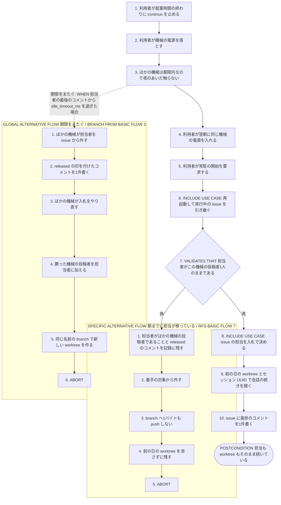
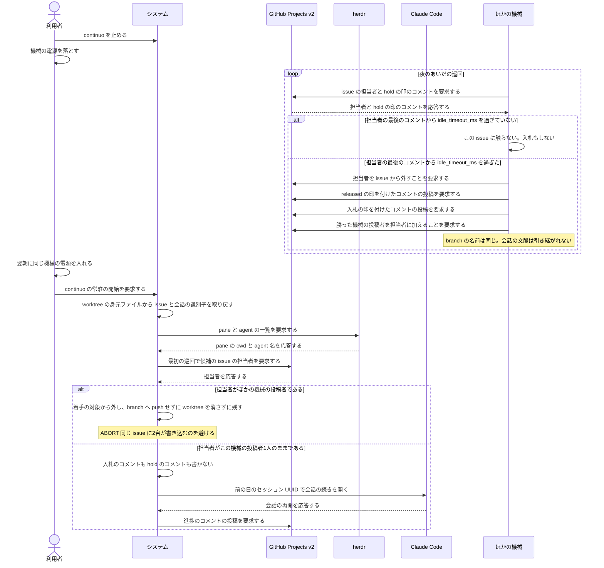

# ユースケース: 夜に機械を落として翌朝に担当を続ける

## 根拠資料

- `docs/plans/continuo_design.md#3-77c`（就業時間を過ぎて PC を落としたとき。夜・朝・最初の巡回・着手の4段と、18時間を超えたときに起きること）
- `docs/plans/continuo_design.md#3-77b`（期限は担当者の最後のコメントから数える。`idle_timeout_ms` の既定は18時間）
- `docs/plans/continuo_design.md#3-77`（余裕値と入札。担当者がいる issue では入札が起きない）
- `docs/plans/continuo_design.md#3-4`（状態は in-memory。再起動時の復元手順）
- `docs/plans/continuo_design.md#3-18`（身元ファイル。`issue_url` と `branch` と前回のセッション UUID）
- `internal/orchestrator/restore.go` の `Restore`、`scanIdentities`、`refetchByIdentities`、`matchPanes`、`decideOne`
- `internal/workspace/identity.go`（身元ファイルの読み書き）
- `internal/tracker/query.go` の `rawUserConn`（`assignees` を運んでいる）

## RUCM

```rucm
USE CASE NAME: 夜に機械を落として翌朝に担当を続ける
BRIEF DESCRIPTION: 利用者は就業時間の終わりに continuo を止めて機械の電源を落とす。ほかの機械は夜のあいだ、担当者の期限が切れていないのでこの issue に触らない。利用者は翌朝に同じ機械の電源を入れて continuo を起動し直す。システムは worktree の身元ファイルから issue と会話の識別子を取り戻し、担当者が自分なので入札せずに、既存の worktree で会話の続きから進める。
PRECONDITION: 前の日にこの機械が入札で勝ち、issue の担当者になっている。issue に hold の印が先頭に付いたコメントが1件ある。worktree の置き場所にこの issue の身元ファイルを持つ worktree がある。issue の Status は running_state の選択肢である。同じボードを見張っているほかの機械が1台以上ある。
PRIMARY ACTOR: 利用者
SECONDARY ACTORS: GitHub Projects v2、herdr、Claude Code、ほかの機械
DEPENDENCY: INCLUDE USE CASE 再起動して実行中の issue を引き継ぐ、INCLUDE USE CASE issue の担当を入札で決める
GENERALIZATION: なし

BASIC FLOW:
1. 利用者は就業時間の終わりに continuo を止める。
2. 利用者は機械の電源を落とす。
3. ほかの機械は夜のあいだ、担当者がほかの機械の投稿者ではなく hold の印のコメントが1件以上あり担当者の最後のコメントから idle_timeout_ms を過ぎていないので、この issue に触らない。
4. 利用者は翌朝に同じ機械の電源を入れる。
5. 利用者はシステムに continuo の常駐の開始を要求する。
6. INCLUDE USE CASE 再起動して実行中の issue を引き継ぐ
7. システムは VALIDATES THAT 最初の巡回で候補に出た issue の担当者がこの機械の投稿者1人のままである。
8. INCLUDE USE CASE issue の担当を入札で決める
9. システムは前の日の worktree と身元ファイルのセッション UUID で会話の続きを開く。
10. システムは issue に進捗のコメントを1件書く。
POSTCONDITION: 担当者は夜の前と同じこの機械の投稿者1人である。issue に入札の印のコメントは1件も増えていない。hold の印のコメントは1件も増えていない。released の印のコメントは1件も増えていない。worktree は夜の前と同じ場所に残っている。branch の名前は夜の前と同じである。issue の Status は running_state の選択肢のままである。

SPECIFIC ALTERNATIVE FLOW 朝までに担当が移っている:
RFS BASIC FLOW 7
1. システムは担当者がほかの機械の投稿者であることと、released の印が先頭に付いたコメントの中身を記録に残す。
2. システムはこの issue を着手の対象から外す。
3. システムは branch へ1バイトも push しない。
4. システムは前の日の worktree を消さずに残す。
5. ABORT
POSTCONDITION: 担当者はほかの機械の投稿者である。この機械は branch へ1バイトも push していない。この機械の worktree は残っている。push していない commit は残っている。この機械は issue にコメントを1件も書いていない。

GLOBAL ALTERNATIVE FLOW 期限をまたぐ:
BRANCH FROM BASIC FLOW 3
WHEN 電源が落ちているあいだに担当者の最後のコメントから idle_timeout_ms を過ぎた場合
1. ほかの機械は担当者を issue から外す。
2. ほかの機械は released の印を先頭に置いたコメントを issue に1件書く。
3. ほかの機械は入札をやり直す。
4. ほかの機械は勝った機械の投稿者を担当者に加える。
5. ほかの機械は同じ名前の branch で新しい worktree を作る。
6. ABORT
POSTCONDITION: 担当者はほかの機械の投稿者である。issue に released の印が先頭に付いたコメントが1件ある。branch の名前は夜の前と同じである。push した commit は残っている。push していない commit は失われている。会話の文脈は引き継がれていない。
```

## 夜のあいだ、担当は動かない

**言いたいこと。**電源が落ちているあいだ、GitHub 側では何も動かない。
**Status も担当者も hold のコメントもそのままである。**

| 段 | 何が起きるか |
| --- | --- |
| 夜、電源が落ちる | GitHub 側は何も動かない |
| 夜のあいだ | ほかの機械は、担当者が自分でなく期限内なので**触らない。入札もしない** |
| 朝、同じ機械が起動する | 復元が worktree の身元ファイルを読み、issue と会話の識別子を取り戻す |
| 最初の巡回（30秒以内） | 担当者は自分なので**入札は起きない。**hold のコメントも書き直さない |
| 着手 | **前の日の worktree をそのまま使う。**会話の続きから進む |

**コメントは1件も増えない。**これが「担当も worktree もそのまま続く」の中身である。

## 期限を18時間にした理由

**言いたいこと。**期限は、**1日の業務が終わって翌朝に戻るまでを跨げる長さにする。**

| 期限の長さ | 何が起きるか |
| --- | --- |
| 8時間 | **終業して帰るだけで担当を奪われる。**翌朝に別の機械が最初からやり直している |
| **18時間（既定）** | 翌朝に戻れば続きから進む。**週末や休暇で止まったら、別の機械が拾い直す** |
| 1週間 | 落ちたまま戻らない機械の担当が、丸1週間ほかの機械を止める |

**期限が切れて担当が移るのは、`期限をまたぐ` である。**そのとき何が残り、何が失われるかは
下の表が正である。**担当を外した側は `<!-- continuo:released -->` の印を付けたコメントを1件書く**
ので、朝に戻った機械は issue を読むだけで「自分はもう担当ではない」と分かる（設計 3-77c）。

## 担当が移ったときに残るものと失われるもの

| 何が | どうなるか | なぜか |
| --- | --- | --- |
| branch の名前 | **変わらない** | issue から一意に決まる（`herdr.worktree.branch_template`） |
| push した commit | **残る** | 新しい機械は同じ名前の branch を fetch して続きから始める |
| push していない commit | **失われる** | 前の機械のディスクの中にあり、新しい機械からは見えない |
| worktree | **前の機械の中に残る** | 新しい機械は自分の置き場所に worktree を作り直す |
| 会話の文脈 | **引き継げない** | セッション UUID は身元ファイルにあり、前の機械のディスクの中にある |

**だから、生きている機械は進捗のコメントと一緒に push する。**
**push していない変更は、担当が移った時点で失われる。**
**進捗のコメントは期限も延ばす**ので、書き続けている機械は担当を外されない。

## 朝の巡回で担当を読み直す理由

**言いたいこと。**復元（`internal/orchestrator/restore.go` の `Restore`）は worktree と pane と
ボードの Status しか見ない。**担当者を見るのは巡回である。**
だから「担当がまだ自分か」はステップ7 で確かめる。

**確かめずに着手すると何が起きるか。**18時間を超えていた issue はほかの機械が拾っている。
そこへ前の機械が worktree を持ったまま turn を送ると、**同じ issue に2台が同時に書き込む。**
`朝までに担当が移っている` は、そうなる前にこの機械を降ろす。

**降ろすときも worktree は1バイトも消さない。**push していない commit が残っていることがあり、
**利用者はそれを取り出せる唯一の場所にいる。**片付けるかどうかは
`continuo abandon` で人間が決める。

## フローチャート



## シーケンス図


