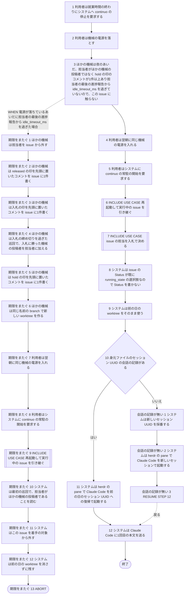
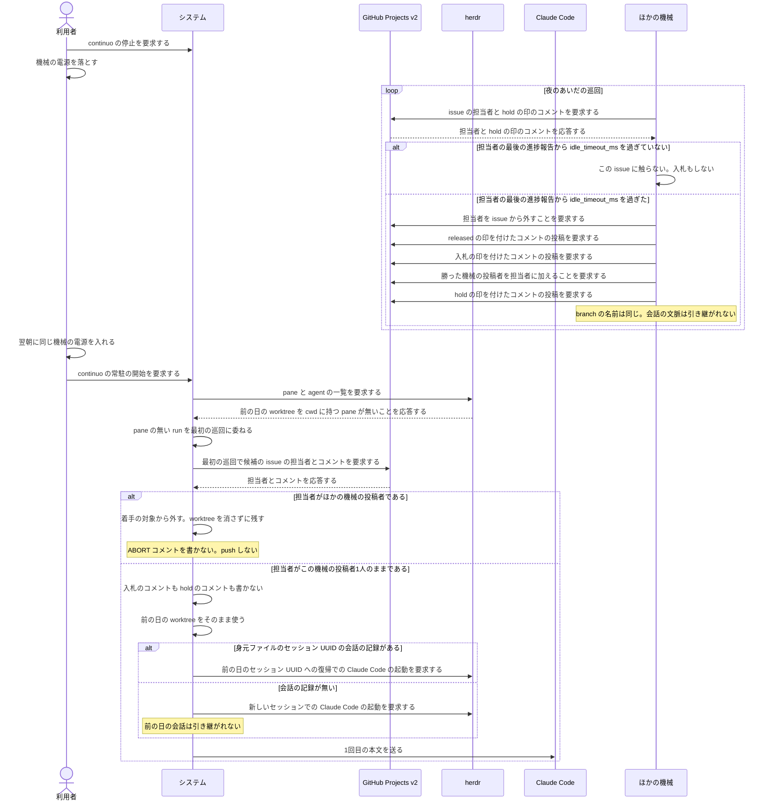

# ユースケース: 夜に機械を落として翌朝に担当を続ける

## 根拠資料

- `docs/plans/continuo_design.md#3-77c`（就業時間を過ぎて PC を落としたとき。夜・朝・最初の巡回・着手の4段と、18時間を超えたときに起きること）
- `docs/plans/continuo_design.md#3-77b`（期限は担当者の最後の進捗報告から数える。`idle_timeout_ms` の既定は18時間）
- `docs/plans/continuo_design.md#3-77`（余裕値と入札。担当者がいる issue では入札が起きない）
- `docs/plans/continuo_design.md#3-4`（状態は in-memory。再起動時の復元手順。pane の無い run は `restart.orphan_running_action` で分岐する）
- `docs/plans/continuo_design.md#3-3b`（既存の worktree を再利用するときは、身元ファイルのセッション UUID へ `--resume` で復帰する）
- `docs/plans/continuo_design.md#3-18`（身元ファイル。`issue_url` と `branch` と前回のセッション UUID）
- `internal/orchestrator/restore.go` の `Restore`、`restoreWithoutPane`、`applyOrphanRunningAction`
- `internal/orchestrator/orchestrator.go` の `Tick`、`candidateStates`
- `internal/orchestrator/dispatch.go` の `dispatchCandidates`、`startRun`、`startRunFromWorktree`
- `internal/orchestrator/handoff.go` の `handoffGate`、`releaseExpiredAssignee`、`bidForIssue`
- `internal/orchestrator/transcript.go` の `mayResumeSession`
- `internal/orchestrator/settings.go` の `claudeStartArgs`
- `internal/orchestrator/comment.go` の `postStatusMove`
- `internal/handoff/assess.go` の `Assess`
- `internal/workspace/identity.go`（身元ファイルの読み書き）
- `internal/daemon/daemon.go` の `Run`、`close`（continuo を止めても pane を閉じない）

## RUCM

```rucm
USE CASE NAME: 夜に機械を落として翌朝に担当を続ける
BRIEF DESCRIPTION: 利用者は就業時間の終わりに continuo を止めて機械の電源を落とす。ほかの機械は夜のあいだ、担当者の期限が切れていないのでこの issue に触らない。利用者は翌朝に同じ機械の電源を入れて continuo を起動し直す。システムは pane が残っていない前の日の run を最初の巡回に委ねる。システムは担当者が自分なので入札せずに、前の日の worktree で前の日の会話へ復帰して着手し直す。
PRECONDITION: 前の日にこの機械が入札で勝ち、issue の担当者になっている。issue に hold の印が先頭に付いたコメントが1件ある。worktree の置き場所にこの issue の身元ファイルを持つ worktree がある。issue の Status は running_state の選択肢である。設定の restart.orphan_running_action は redispatch である。同じボードを見張っているほかの機械が1台以上ある。
PRIMARY ACTOR: 利用者
SECONDARY ACTORS: GitHub Projects v2、herdr、Claude Code、ほかの機械
DEPENDENCY: INCLUDE USE CASE 再起動して実行中の issue を引き継ぐ、INCLUDE USE CASE issue の担当を入札で決める
GENERALIZATION: なし

BASIC FLOW:
1. 利用者は就業時間の終わりにシステムへ continuo の停止を要求する。
2. 利用者は機械の電源を落とす。
3. ほかの機械は夜のあいだ、担当者がほかの機械の投稿者ではなく hold の印のコメントが1件以上あり担当者の最後の進捗報告から idle_timeout_ms を過ぎていないので、この issue に触らない。
4. 利用者は翌朝に同じ機械の電源を入れる。
5. 利用者はシステムに continuo の常駐の開始を要求する。
6. INCLUDE USE CASE 再起動して実行中の issue を引き継ぐ
7. INCLUDE USE CASE issue の担当を入札で決める
8. システムは issue の Status が既に running_state の選択肢なので Status を書かない。
9. システムは前の日の worktree をそのまま使う。
10. システムは VALIDATES THAT 身元ファイルのセッション UUID の会話の記録がある。
11. システムは herdr の pane で Claude Code を前の日のセッション UUID への復帰で起動する。
12. システムは Claude Code に1回目の本文を送る。
POSTCONDITION: 担当者は夜の前と同じこの機械の投稿者1人である。issue に入札の印のコメントは1件も増えていない。hold の印のコメントは1件も増えていない。released の印のコメントは1件も増えていない。システムは Status を動かした記録のコメントを書いていない。worktree は夜の前と同じ場所に残っている。branch の名前は夜の前と同じである。issue の Status は running_state の選択肢のままである。Claude Code は、身元ファイルのセッション UUID の会話の記録が在れば、前の日の会話の続きで動いている。

SPECIFIC ALTERNATIVE FLOW 会話の記録が無い:
RFS BASIC FLOW 10
1. システムは新しいセッション UUID を採番する。
2. システムは herdr の pane で Claude Code を新しいセッションで起動する。
3. RESUME STEP 12
POSTCONDITION: 担当者は夜の前と同じこの機械の投稿者1人である。issue に入札の印のコメントは1件も増えていない。worktree は夜の前と同じ場所に残っている。branch の名前は夜の前と同じである。issue の Status は running_state の選択肢のままである。Claude Code は前の日の会話を引き継いでいない。

GLOBAL ALTERNATIVE FLOW 期限をまたぐ:
BRANCH FROM BASIC FLOW 3
WHEN 電源が落ちているあいだに担当者の最後の進捗報告から idle_timeout_ms を過ぎた場合
1. ほかの機械は担当者を issue から外す。
2. ほかの機械は released の印を先頭に置いたコメントを issue に1件書く。
3. ほかの機械は入札の印を先頭に置いたコメントを issue に1件書く。
4. ほかの機械は入札の締め切りを過ぎた巡回で、入札に勝った機械の投稿者を担当者に加える。
5. ほかの機械は hold の印を先頭に置いたコメントを issue に1件書く。
6. ほかの機械は同じ名前の branch で新しい worktree を作る。
7. 利用者は翌朝に同じ機械の電源を入れる。
8. 利用者はシステムに continuo の常駐の開始を要求する。
9. INCLUDE USE CASE 再起動して実行中の issue を引き継ぐ
10. システムは最初の巡回で、担当者がほかの機械の投稿者であることを読む。
11. システムはこの issue を着手の対象から外す。
12. システムは前の日の worktree を消さずに残す。
13. ABORT
POSTCONDITION: 担当者はほかの機械の投稿者である。issue に released の印が先頭に付いたコメントが1件ある。branch の名前は夜の前と同じである。push した commit は残っている。push していない commit はこの機械の worktree に残っている。ほかの機械は push していない commit を読めない。この機械は branch へ1バイトも push していない。この機械は issue にコメントを1件も書いていない。会話の文脈は引き継がれていない。
```

## この記述が追うのは、朝に pane が残っていない場合である

**言いたいこと。**continuo は止まるときに pane を閉じないが、**電源を落とせば herdr のプロセスごと終わる。**
朝に起動し直した continuo から見ると、身元ファイルを持つ worktree は在るのに、その worktree を cwd に持つ pane が無い。
この記述はその場合を追う（朝に pane が残っている機械では、`再起動して実行中の issue を引き継ぐ` の基本フローが pane ごと引き継ぐ）。

| 順 | 誰が | 何をするか | 記述のどこか |
| --- | --- | --- | --- |
| 1 | 復元 | pane が無く Status が active_states なので、`restart.orphan_running_action` を読む。既定の `redispatch` では何もせず、印にも入れずに次の巡回へ委ねる | ステップ6（取り込んだ記述の `paneの不在`） |
| 2 | 最初の巡回 | active_states の候補を取る。この issue は Status が running_state のままなので候補に出る | ステップ7 |
| 3 | 最初の巡回 | 担当者を読む。この機械の投稿者1人なので、入札せずに着手へ進む。hold も書き直さない | ステップ7 |
| 4 | 着手 | Status は既に running_state なので書かない。Status を動かした記録も書かない | ステップ8 |
| 5 | 着手 | 置き場所に在る前の日の worktree を作り直さずに使う | ステップ9 |
| 6 | 着手 | 身元ファイルのセッション UUID に会話の記録が在れば、`--resume` で復帰する | ステップ10 と11 |
| 7 | 着手 | 1回目の本文を送る。継続の指示ではない | ステップ12 |

**送るのが1回目の本文である理由。**継続の指示には「issue を読むこと」「紐づく PR も読むこと」が入っていない。
それだけを送ると、差し戻された issue で新しく付いたレビューを読まないまま進む（`internal/orchestrator/dispatch.go` の `startRunFromWorktree`）。
**会話は残っているので、エージェントは前の日にどこまで進めたかを分かったうえで読み直す。**

**着手の段で起きる次の2つは、この記述の経路に出していない。**どちらも `issue を1件処理する` の代替フローが受ける。

| 何が起きるか | どう進むか | 受ける代替フロー |
| --- | --- | --- |
| 会話の記録は在るのに、復帰つきの起動が完了しない | 新しいセッション UUID を採番し、新しいセッションで起動し直す。前の日の会話は引き継がれない | `issue を1件処理する` の `復帰の失敗` |
| herdr が agent を登録していないまま、作業中の hook が届いている | 1回目の本文をその場では送らず、走っている turn の終わりを待つ | `issue を1件処理する` の `未登録のまま作業中` |

**`restart.orphan_running_action` が既定でないとき、この記述のとおりにはならない。**
`to_dispatch_state` なら Status が着手待ちへ戻り、Status を動かした記録が1件増える。
`to_failure_state` なら Status が failure_state へ落ち、人間が戻すまで着手されない。だから事前条件に `redispatch` を書いた。

## 夜のあいだ、担当は動かない

**言いたいこと。**電源が落ちているあいだ、GitHub 側では何も動かない。
**Status も担当者も hold のコメントもそのままである。**

| 段 | 何が起きるか |
| --- | --- |
| 夜、電源が落ちる | GitHub 側は何も動かない |
| 夜のあいだ | ほかの機械は、担当者が自分でなく期限内なので**触らない。入札もしない** |
| 朝、同じ機械が起動する | 復元は pane の無い run を次の巡回へ委ねる |
| 最初の巡回 | 担当者は自分なので**入札は起きない。**hold のコメントも書き直さない |
| 着手 | **前の日の worktree をそのまま使う。**前の日の会話へ復帰する |

**continuo が書くコメントは1件も増えない。**これが「担当も worktree もそのまま続く」の中身である。
進捗のコメントを書くのは、1回目の本文を受け取った Claude Code である（`指示書に沿って issue を1件仕上げる` の範囲）。

## 期限を18時間にした理由

**言いたいこと。**期限は、**1日の業務が終わって翌朝に戻るまでを跨げる長さにする。**

| 期限の長さ | 何が起きるか |
| --- | --- |
| 8時間 | **終業して帰るだけで担当を奪われる。**翌朝に別の機械が最初からやり直している |
| **18時間（既定）** | 翌朝に戻れば続きから進む。**週末や休暇で止まったら、別の機械が拾い直す** |
| 1週間 | 落ちたまま戻らない機械の担当が、丸1週間ほかの機械を止める |

**期限が切れて担当が移るのは、`期限をまたぐ` である。**そのとき何が残り、何が失われるかは
下の表が正である。**担当を外した側は `<!-- continuo:released -->` の印を付けたコメントを1件書く**
（設計 3-77c）。

## 担当が移ったときに残るものと失われるもの

| 何が | どうなるか | なぜか |
| --- | --- | --- |
| branch の名前 | **変わらない** | issue から一意に決まる（`herdr.worktree.branch_template`） |
| push した commit | **残る** | 新しい機械は同じ名前の branch を fetch して続きから始める |
| push していない commit | **新しい機械からは見えない** | 前の機械のディスクの中にあり、前の機械の worktree に残っている |
| worktree | **前の機械の中に残る** | 新しい機械は自分の置き場所に worktree を作り直す |
| 会話の文脈 | **引き継げない** | セッション UUID は身元ファイルにあり、前の機械のディスクの中にある |

**だから、生きている機械は進捗のコメントと一緒に push する。**
**進捗のコメントは期限も延ばす**ので、書き続けている機械は担当を外されない。

## 担当が移っていた朝に、前の機械が何をするか

**言いたいこと。**担当者を見るのは復元ではなく、巡回の着手の手前（`handoffGate`）である。
復元は worktree と pane とボードの Status しか見ない。

| 順 | 何が起きるか |
| --- | --- |
| 1 | 復元は pane の無い run を次の巡回へ委ねる。新しい担当の機械が Status を running_state にしているので、この issue は候補に出る |
| 2 | 巡回は担当者を読む。ほかの機械の投稿者1人で、その担当者を名指しする hold が在り、期限内である |
| 3 | 巡回はこの issue を着手の対象から外す。入札もしない。issue にコメントも書かない。ログは DEBUG の1行だけである |
| 4 | worktree は消さない。Claude Code を起動しないので、branch へ push するものも居ない |

**released のコメントを読んでログへ残すのは、印を持つ run の担当を確かめ直す経路（`verifyHandoff`）だけである。**
pane が無い朝の経路は印を持たないので、released のコメントをログへ残さない。直す前の記述はここを「記録に残す」と書いていた。

**降ろすときも worktree は1バイトも消さない。**push していない commit が残っていることがあり、
**利用者はそれを取り出せる唯一の場所にいる。**片付けるかどうかは `continuo abandon` で人間が決める。

**朝までに新しい担当の機械も止まって期限が切れていたとき**は、この機械がその担当を外して入札をやり直す
（取り込んだ記述 `issue の担当を入札で決める` の `他人の担当`）。この記述の経路には出していない。

## フローチャート


```mermaid
flowchart TD
    BS1["1 利用者は就業時間の終わりにシステムへ continuo の停止を要求する"]
    BS2["2 利用者は機械の電源を落とす"]
    BS3["3 ほかの機械は夜のあいだ、担当者がほかの機械の投稿者ではなく hold の印のコメントが1件以上あり担当者の最後の進捗報告から idle_timeout_ms を過ぎていないので、この issue に触らない"]
    BS4["4 利用者は翌朝に同じ機械の電源を入れる"]
    BS5["5 利用者はシステムに continuo の常駐の開始を要求する"]
    BS6[["6 INCLUDE USE CASE 再起動して実行中の issue を引き継ぐ"]]
    BS7[["7 INCLUDE USE CASE issue の担当を入札で決める"]]
    BS8["8 システムは issue の Status が既に running_state の選択肢なので Status を書かない"]
    BS9["9 システムは前の日の worktree をそのまま使う"]
    BS10{"10 身元ファイルのセッション UUID の会話の記録がある"}
    BS11["11 システムは herdr の pane で Claude Code を前の日のセッション UUID への復帰で起動する"]
    BS12["12 システムは Claude Code に1回目の本文を送る"]
    A1S1["会話の記録が無い 1 システムは新しいセッション UUID を採番する"]
    A1S2["会話の記録が無い 2 システムは herdr の pane で Claude Code を新しいセッションで起動する"]
    A1S3["会話の記録が無い 3 RESUME STEP 12"]
    A2S1["期限をまたぐ 1 ほかの機械は担当者を issue から外す"]
    A2S2["期限をまたぐ 2 ほかの機械は released の印を先頭に置いたコメントを issue に1件書く"]
    A2S3["期限をまたぐ 3 ほかの機械は入札の印を先頭に置いたコメントを issue に1件書く"]
    A2S4["期限をまたぐ 4 ほかの機械は入札の締め切りを過ぎた巡回で、入札に勝った機械の投稿者を担当者に加える"]
    A2S5["期限をまたぐ 5 ほかの機械は hold の印を先頭に置いたコメントを issue に1件書く"]
    A2S6["期限をまたぐ 6 ほかの機械は同じ名前の branch で新しい worktree を作る"]
    A2S7["期限をまたぐ 7 利用者は翌朝に同じ機械の電源を入れる"]
    A2S8["期限をまたぐ 8 利用者はシステムに continuo の常駐の開始を要求する"]
    A2S9[["期限をまたぐ 9 INCLUDE USE CASE 再起動して実行中の issue を引き継ぐ"]]
    A2S10["期限をまたぐ 10 システムは最初の巡回で、担当者がほかの機械の投稿者であることを読む"]
    A2S11["期限をまたぐ 11 システムはこの issue を着手の対象から外す"]
    A2S12["期限をまたぐ 12 システムは前の日の worktree を消さずに残す"]
    A2S13(["期限をまたぐ 13 ABORT"])
    BS1 --> BS2
    BS2 --> BS3
    BS3 --> BS4
    BS3 -. "WHEN 電源が落ちているあいだに担当者の最後の進捗報告から idle_timeout_ms を過ぎた場合" .-> A2S1
    BS4 --> BS5
    BS5 --> BS6
    BS6 --> BS7
    BS7 --> BS8
    BS8 --> BS9
    BS9 --> BS10
    BS10 -- はい --> BS11
    BS10 -- いいえ --> A1S1
    BS11 --> BS12
    A1S1 --> A1S2
    A1S2 --> A1S3
    A1S3 -. "戻る" .-> BS12
    A2S1 --> A2S2
    A2S2 --> A2S3
    A2S3 --> A2S4
    A2S4 --> A2S5
    A2S5 --> A2S6
    A2S6 --> A2S7
    A2S7 --> A2S8
    A2S8 --> A2S9
    A2S9 --> A2S10
    A2S10 --> A2S11
    A2S11 --> A2S12
    A2S12 --> A2S13
    BS12 --> END(["終了"])
```

## シーケンス図


```mermaid
sequenceDiagram
    actor U as 利用者
    participant S as システム
    participant GH as GitHub Projects v2
    participant H as herdr
    participant CC as Claude Code
    participant M as ほかの機械

    U->>S: continuo の停止を要求する
    U->>U: 機械の電源を落とす
    loop 夜のあいだの巡回
        M->>GH: issue の担当者と hold の印のコメントを要求する
        GH-->>M: 担当者と hold の印のコメントを応答する
        alt 担当者の最後の進捗報告から idle_timeout_ms を過ぎていない
            M->>M: この issue に触らない。入札もしない
        else 担当者の最後の進捗報告から idle_timeout_ms を過ぎた
            M->>GH: 担当者を issue から外すことを要求する
            M->>GH: released の印を付けたコメントの投稿を要求する
            M->>GH: 入札の印を付けたコメントの投稿を要求する
            M->>GH: 勝った機械の投稿者を担当者に加えることを要求する
            M->>GH: hold の印を付けたコメントの投稿を要求する
            Note over M: branch の名前は同じ。会話の文脈は引き継がれない
        end
    end
    U->>U: 翌朝に同じ機械の電源を入れる
    U->>S: continuo の常駐の開始を要求する
    S->>H: pane と agent の一覧を要求する
    H-->>S: 前の日の worktree を cwd に持つ pane が無いことを応答する
    S->>S: pane の無い run を最初の巡回に委ねる
    S->>GH: 最初の巡回で候補の issue の担当者とコメントを要求する
    GH-->>S: 担当者とコメントを応答する
    alt 担当者がほかの機械の投稿者である
        S->>S: 着手の対象から外す。worktree を消さずに残す
        Note over S: ABORT コメントを書かない。push しない
    else 担当者がこの機械の投稿者1人のままである
        S->>S: 入札のコメントも hold のコメントも書かない
        S->>S: 前の日の worktree をそのまま使う
        alt 身元ファイルのセッション UUID の会話の記録がある
            S->>H: 前の日のセッション UUID への復帰での Claude Code の起動を要求する
        else 会話の記録が無い
            S->>H: 新しいセッションでの Claude Code の起動を要求する
            Note over S: 前の日の会話は引き継がれない
        end
        S->>CC: 1回目の本文を送る
    end
```
